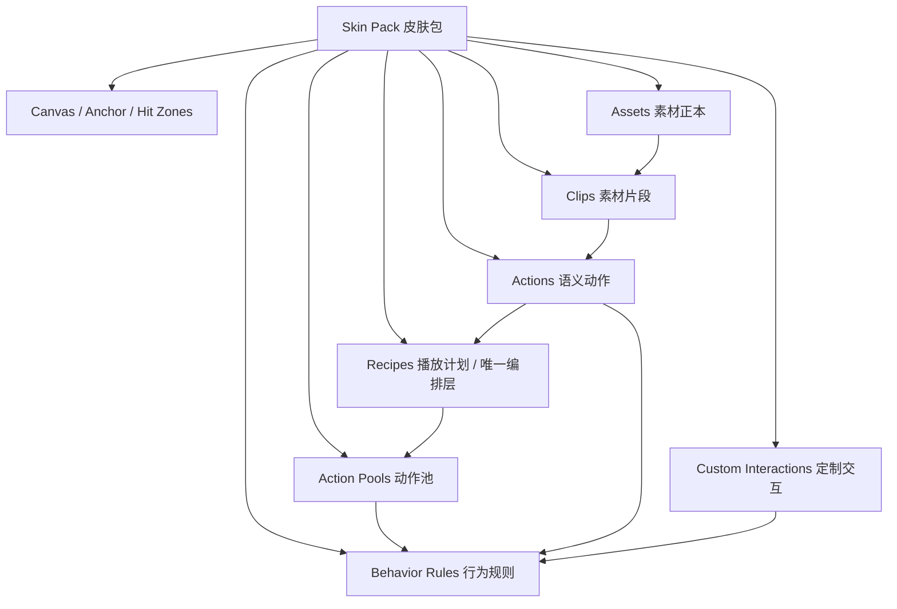
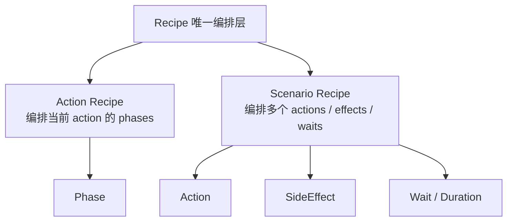
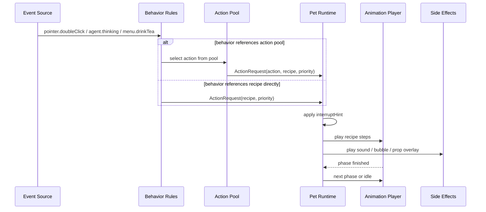
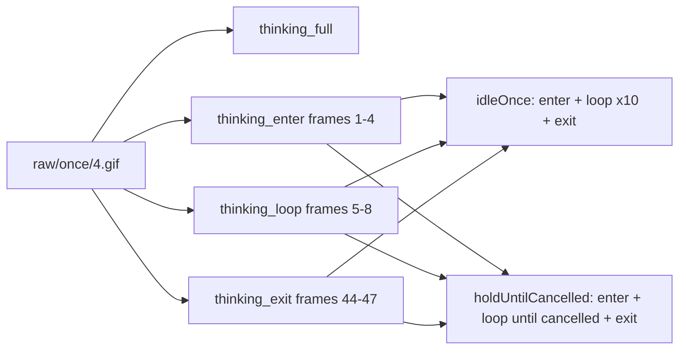
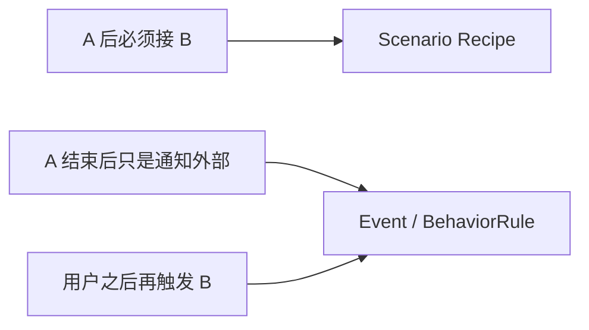
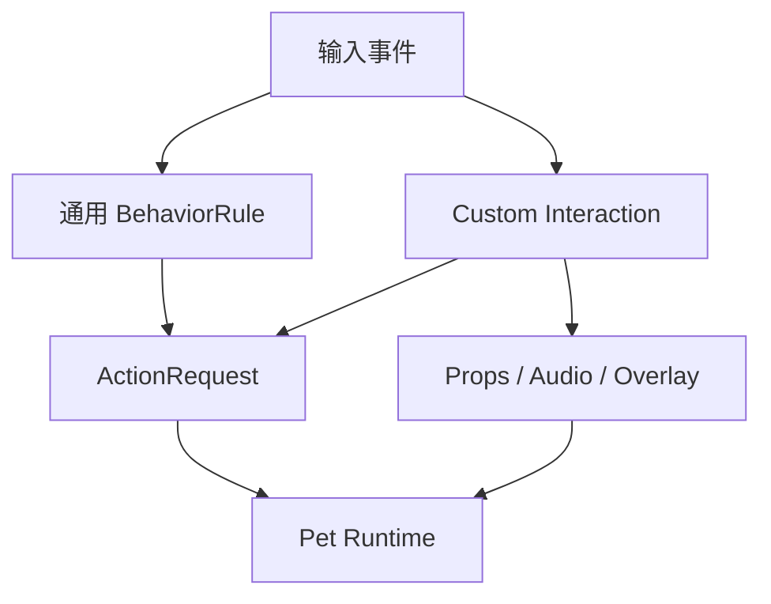

# Skin Pack / Playback / Behavior 通用化设计

## 背景

MilesEdgeworth v2 的目标不是只复刻一个定制化御剑怜侍桌宠，而是把旧版里比较有可玩性的桌宠能力抽象成通用框架：用户可以只提供少量素材做一个简单桌宠，也可以通过配置和扩展脚本做出复杂交互。

旧版 `main` 分支的动画逻辑已经证明，桌宠动画并不只是“播放一个 GIF”。它同时包含随机调度、行走/奔跑时的窗口移动、分区域点击、双击随机语音和动作、拖拽晃动、菜单动作、睡眠状态、徽章飞出窗口等行为。v2 需要保留这些手感，但不能继续把它们写死在 Miles 专属代码里。

## 设计目标

- 支持普通用户通过素材和简易配置完成换肤。
- 支持高级用户通过 manifest 定义 action、phase、recipe、hit zone、action pool 和 behavior rule。
- 支持开发者通过 custom interaction 编写高级交互，例如丢检察官徽章、眼睛追随鼠标、抛物线坠落物。
- 基本还原旧版 MilesEdgeworth 的交互效果。
- 不把素材目录和触发来源强绑定，避免同一动作在多个场景中被复制成多份正本。
- 明确桌宠主体窗口的 canvas、anchor、点击命中和特殊效果 overlay 规则。

## 旧版播放模式归纳

| 旧版模式 | 旧版例子 | v2 抽象 |
| --- | --- | --- |
| 启动序列 | `briefcaseIn0.gif -> briefcaseStop0.gif -> stand/0.gif` | scripted sequence |
| 循环待机 | `stand/0.gif`、`stand/1.gif` | loop action |
| 随机 idle | stand 播完后随机 once、walk、run、turn | scheduler + action pool |
| 一次性动作 | `once/*`、`bow`、`object` | onceThenIdle / onceThenNext |
| 阶段动作 | `sleep -> sleeping -> wake` | enter / loop / exit |
| 停在最后一帧 | `crouch` 播到最后停住，松手后站起 | enter / hold / exit |
| 移动驱动 | walk/run 每帧移动窗口 | movement-driven action |
| 菜单触发 | 喂茶、睡觉、唤醒 | menu behavior rule |
| 单击分区 | 点脸、头、手臂、胸、腿触发不同动作 | hit zone behavior |
| 双击随机 | holdit / takethat / objection / eureka | weighted interaction |
| 复合副作用 | 异议音效、徽章飞出、徽章点击后鞠躬 | side effect / custom interaction |
| 晃动触发 | 1 秒内方向反转 5 次触发 crouch，释放后分支 standup | gesture recognizer |

这些模式说明：v2 的核心应该是“事件请求动作”，不是“事件直接请求 GIF 文件”。

## 核心分层



### Clip

Clip 是最小播放片段。它可以是完整 GIF，也可以是某个 GIF 的帧区间。

示例：

```json
{
  "clips": {
    "thinking_full_right": {
      "source": "assets/body/raw/once/4.gif"
    },
    "thinking_enter_right": {
      "source": "assets/body/raw/once/4.gif",
      "frameRange": [1, 4]
    },
    "thinking_loop_right": {
      "source": "assets/body/raw/once/4.gif",
      "frameRange": [5, 8]
    },
    "thinking_exit_right": {
      "source": "assets/body/raw/once/4.gif",
      "frameRange": [44, 47]
    }
  }
}
```

如果 Qt/QML 运行时暂时无法直接播放 GIF 局部帧，`frameRange` 仍然作为源数据记录。后续 asset compiler 可以把这些 clip 自动导出成派生 GIF/WebP/APNG。派生文件属于生成物，不应作为人工维护的正本。

### Action

Action 是语义动作，例如 `thinking`、`objecting`、`sleep`、`walk`。外部模块可以请求 Action，但不应该请求 Clip。

Action 可以是单段，也可以由 phase 组成：

```json
{
  "actions": {
    "thinking": {
      "label": "抱胸思考",
      "phases": {
        "enter": { "clip": "thinking_enter" },
        "loop": { "clip": "thinking_loop" },
        "exit": { "clip": "thinking_exit" }
      }
    }
  }
}
```

### Recipe

Recipe 是动画系统里唯一的时间线编排层。它既可以描述一个 Action 内部的 phase 怎么播放，也可以描述某个场景下多个 Action、等待、条件和副作用如何串联。

Recipe 有两种 scope：

| Scope | 用途 | 典型例子 |
| --- | --- | --- |
| `action` | 编排一个 Action 内部的 phase | `thinking.enter -> thinking.loop -> thinking.exit` |
| `scenario` | 编排多个 Action / SideEffect / Wait / Condition | `drink_tea -> bow -> idle_stand` |



#### Action Recipe

Action Recipe 只编排当前 Action 内部的 phases。比如同一个 `thinking` 动作在不同场景可以有不同 recipe：

```json
{
  "recipes": {
    "thinking.idleOnce": {
      "scope": "action",
      "action": "thinking",
      "pattern": "enterLoopExit",
      "steps": [
        { "phase": "enter", "repeat": 1 },
        { "phase": "loop", "repeat": 10 },
        { "phase": "exit", "repeat": 1 }
      ]
    },
    "thinking.holdUntilCancelled": {
      "scope": "action",
      "action": "thinking",
      "pattern": "enterLoopExit",
      "steps": [
        { "phase": "enter", "repeat": 1 },
        { "phase": "loop", "repeat": "untilCancelled" },
        { "phase": "exit", "repeat": 1 }
      ]
    }
  }
}
```

因此，随机 idle 不需要维护一份完整 thinking GIF，agent thinking 也不需要维护另一份 phase GIF。它们共用同一组 Clip 和 Action，只是 Recipe 不同。

#### Scenario Recipe

Scenario Recipe 用来表达“多个动作必须按顺序发生”。例如“喝红茶循环一段时间后鞠躬”：

```json
{
  "recipes": {
    "tea.loopForAWhile": {
      "scope": "action",
      "action": "drink_tea",
      "pattern": "enterLoopExit",
      "steps": [
        { "phase": "enter", "repeat": 1 },
        { "phase": "loop", "durationMs": 5000 },
        { "phase": "exit", "repeat": 1 }
      ]
    },
    "tea.drinkThenBow": {
      "scope": "scenario",
      "pattern": "sequence",
      "steps": [
        {
          "action": "drink_tea",
          "recipe": "tea.loopForAWhile"
        },
        {
          "action": "bow",
          "recipe": "once"
        },
        {
          "action": "idle_stand",
          "recipe": "loop"
        }
      ]
    }
  }
}
```

这里不需要再定义一个 “Action 之上的动画编排层”。Scenario Recipe 本身就是编排层。

#### 运行时参数

Recipe 可以写默认 repeat / duration，也可以把某些值留给运行时请求决定。
适合 agent thinking、speaking、临时表演和后续工具调用状态。

```json
{
  "recipes": {
    "thinking.hold": {
      "scope": "action",
      "action": "thinking",
      "pattern": "enterLoopExit",
      "steps": [
        { "phase": "enter", "repeat": 1 },
        { "phase": "loop", "repeat": { "param": "loopRepeat", "default": "untilCancelled" } },
        { "phase": "exit", "repeat": 1 }
      ]
    },
    "tea.loopForDuration": {
      "scope": "action",
      "action": "drink_tea",
      "pattern": "enterLoopExit",
      "steps": [
        { "phase": "enter", "repeat": 1 },
        { "phase": "loop", "durationMs": { "param": "durationMs", "default": 5000 } },
        { "phase": "exit", "repeat": 1 }
      ]
    }
  }
}
```

运行时请求可以覆盖参数：

```json
{
  "action": "drink_tea",
  "recipe": "tea.loopForDuration",
  "recipeParams": {
    "durationMs": 12000
  },
  "interruptHint": "afterCurrent"
}
```

MVP 可以先只支持 manifest 里的固定 `repeat` / `durationMs` 和
`repeat: "untilCancelled"`。`recipeParams` 是为后续保留的接口形状，避免未来再推翻 recipe 结构。

#### Recipe 引用规则

- Action Recipe 可以直接引用当前 Action 的 phase。
- Scenario Recipe 推荐引用 Action 和它的 Recipe，而不是直接引用别的 Action 的内部 phase。
- 如果某个 phase 需要被外部反复复用，优先把它提升成独立 Action 或共享 Clip。
- 高级皮肤可以支持 `phaseRef: "thinking.loop"` 这类跨 Action phase 引用，但这会增加耦合，不作为推荐写法。
- 强顺序关系用 Recipe 表达；弱关系、用户再次触发、状态通知用 BehaviorRule / Event 表达。

### ActionPool

ActionPool 是动作候选集合，用于随机 idle、单击区域、双击、LLM 表达标签等场景。

```json
{
  "actionPools": {
    "idle.random": [
      { "action": "check_watch", "recipe": "once", "weight": 20 },
      { "action": "shrug", "recipe": "once", "weight": 20 },
      { "action": "thinking", "recipe": "thinking.idleOnce", "weight": 10 }
    ],
    "ai.thinking": [
      { "action": "thinking", "recipe": "thinking.holdUntilCancelled", "weight": 100 }
    ]
  }
}
```

### BehaviorRule

BehaviorRule 把事件映射为 ActionRequest。事件来源包括鼠标、菜单、agent 状态、LLM 输出和内部调度器。

```json
{
  "behaviors": {
    "pointer.singleClick": [
      {
        "when": { "hitZone": "head", "state": "idle" },
        "pool": "click.head",
        "priority": 50
      }
    ],
    "agent.thinking.started": [
      {
        "pool": "ai.thinking",
        "priority": 70,
        "interruptHint": "afterCurrent"
      }
    ],
    "menu.drinkTea": [
      {
        "recipe": "tea.drinkThenBow",
        "priority": 60
      }
    ]
  }
}
```

## 事件到动画的数据流



## 运行时切换策略

皮肤 manifest 不配置复杂 interrupt policy。它只描述素材、action、phase、recipe 和
behavior 怎么映射；“新请求来了要不要立刻打断”由事件请求携带一个很小的提示：

```json
{
  "action": "thinking",
  "recipe": "thinking.holdUntilCancelled",
  "priority": 70,
  "interruptHint": "afterCurrent"
}
```

`interruptHint` 只保留两个值：

| 值 | 含义 | 典型场景 |
| --- | --- | --- |
| `replace` | 立刻切换，清空 pending request。默认值。 | 用户拖拽、错误提示、明确点击反馈 |
| `afterCurrent` | 等当前 recipe 到达自然边界后切换，只保留一个 pending request。 | thinking 收尾后 speaking、喝茶结束后鞠躬 |

运行时只维护一个 `pendingRequest`，不维护全局动画队列。新的 `afterCurrent` 请求会覆盖旧的
pending；新的 `replace` 请求会清空 pending 并立即播放。

自然边界包括 clip 播完、loop cycle 播完、phase 播完或 recipe 播完。对于
`repeat: "untilCancelled"` 这类无限循环 recipe，loop 的每个周期都是可退出边界；
如果有 exit phase，就先进入 exit，再播放 pending。

空闲随机动作是否丢弃，由 IdleScheduler 在发请求前判断。权限拒绝、状态不合法等情况，
由 Behavior / Permission / Runtime fallback 处理，不把 `discard`、`reject` 暴露给普通皮肤配置。

## 素材目录策略

### 正本目录按资源语义组织

推荐：

```text
skins/miles-edgeworth/
  manifest.json
  assets/
    body/
      idle/
      locomotion/
        walk/
        run/
      gestures/
      reactions/
      rest/
      startup/
      raw/
    props/
      prosecutor_badge/
    audio/
  behaviors/
    default.json
  scripts/
    throw_badge/
```

不推荐把正本素材按触发来源组织：

```text
idle-random/
single-click/
double-click/
agent-thinking/
```

原因是同一个动作会被多个触发来源复用。例如 `objecting` 可以来自双击、AI 说话强调、agent 报错、菜单测试。按触发来源保存正本会制造重复文件和语义分叉。

### 可以支持快捷导入目录

为了降低普通换肤门槛，可以支持可选的 `quick/` 目录：

```text
quick/
  idle-random/
  click/
  double-click/
  shake/
  thinking/
  speaking/
```

导入器可以把这些文件自动生成 manifest 草稿。`quick/` 是导入便利，不是核心架构。高级皮肤仍应使用 manifest 精确声明 Clip、Action、Recipe 和 BehaviorRule。

## 完整 GIF 与 phase GIF 的决策

规则如下：

- 原始完整 GIF 保留为 source/raw。
- 如果一个 GIF 天然就是完整动作，可以直接作为完整 Clip 使用。
- 如果同一个 GIF 的不同段落有不同运行语义，应在 manifest 中拆成多个 Clip。
- 不因为不同触发方式而人工复制素材正本。
- 如果重复素材能显著降低普通用户入门门槛，允许在 `quick/` 导入阶段存在重复，但导入后应归并为 Action/Recipe。

以抱胸思考为例：



## Recipe Pattern 分类

Recipe Pattern 不是独立架构层，而是 Recipe 的常见模板和执行语义。运行时最终执行的是 Recipe 的 `steps`；`pattern` 只帮助人和工具理解这个 Recipe 属于哪类播放计划。

### loop

持续循环，直到被调度器或外部事件切走。适合站立、睡眠循环、agent thinking loop。

### onceThenIdle

播放一次，然后回到当前朝向的 idle。适合鞠躬、看表、抬头看、异议等短动作。

### onceThenNext

播放一次，然后接指定 action 或 phase。适合启动序列、入睡后接睡眠循环。

### enterLoopExit

进入段播放一次，中间循环段按 recipe 决定次数或直到取消，退出段播放一次。适合 thinking、speaking、sleep、tea 这类动作。

### holdUntilReleased

进入段播放到某个稳定姿态并停住，直到某个事件释放后播放退出段。适合旧版 crouch 晃动逻辑。

### movementDriven

动画播放和窗口位移绑定。旧版是每帧移动窗口；v2 推荐改成路线驱动移动，再由移动方向选择 walk/run 动画。

### scriptedSequence

多个 action、side effect、延迟、条件分支组合在一起。适合启动公文包、丢检察官徽章。

### 事件与 Recipe 的边界

强顺序关系不要依赖“播放结束后发事件再触发下一个动作”。如果 A 播完必须立刻接 B，应写成 Scenario Recipe。事件更适合表达松散关系，例如用户再次点击、agent 状态变化、某个动作完成后通知日志系统。



## 普通交互与定制交互



通用交互应该覆盖：

- 闲时随机动画
- 行走 / 奔跑
- 单击和双击
- 拖拽
- 晃动
- 右键菜单
- agent 状态动画
- LLM 输出表达标签动画

定制交互应该覆盖：

- 丢检察官徽章
- 眼睛追随鼠标
- 抛物线坠落物
- 粒子或复杂道具
- 多窗口 / 多对象协作动画

定制交互不能绕过 Pet Runtime 直接抢夺主动画状态。它应该通过 ActionRequest 请求身体动作，通过 SideEffect 或 Overlay 管理额外对象。

## Canvas、Anchor 和窗口要求

每个皮肤必须声明逻辑画布：

```json
{
  "canvas": {
    "width": 240,
    "height": 240,
    "anchor": {
      "type": "feetCenter",
      "x": 120,
      "y": 220
    },
    "defaultScale": 1,
    "hitTest": "alpha"
  }
}
```

规则：

- 桌宠在屏幕上的位置以 anchor 为准，不以窗口左上角为准。
- 每个 action/phase 可以覆盖默认 offset 或 anchor，用于睡觉、鞠躬、坐下等尺寸变化大的动作。
- 主体窗口默认只负责身体动画和基础气泡，不应该为了某个道具效果无限放大。
- 道具、粒子、抛掷物优先使用 effect overlay 或独立透明窗口。
- 点击区域默认用 alpha 命中；高级皮肤可以声明 polygon 或 mask。

## Hit Zones

HitZone 描述点击区域，不绑定具体动作。

```json
{
  "hitZones": {
    "head": {
      "type": "polygon",
      "points": [[80, 20], [150, 20], [145, 70], [85, 70]]
    },
    "body": {
      "type": "alpha",
      "source": "masks/body.png"
    }
  }
}
```

单击行为再引用 hitZone：

```json
{
  "behaviors": {
    "pointer.singleClick": [
      { "when": { "hitZone": "head" }, "pool": "click.head" },
      { "when": { "hitZone": "body" }, "pool": "click.body" }
    ]
  }
}
```

这样 Miles 可以保留点头、点胸、点腿的复杂反应；其他角色可以只定义一个 `body` 区域。

## LLM 表达标签

LLM 不应该直接选择 GIF，也不应该强制使用项目写死的情绪枚举。它应该从当前皮肤暴露的 expression tags 中选择。

```json
{
  "expressions": {
    "annoyed": {
      "label": "有点不耐烦",
      "pool": "expression.annoyed"
    },
    "confident": {
      "label": "自信",
      "pool": "expression.confident"
    }
  }
}
```

`expression.annoyed` 可以映射到多个 action，例如抱胸、看表、转身、指指点点。换肤时只要重配 expression 到 action pool 的关系，不需要重写模型逻辑。

## 旧版 Miles 迁移建议

| 旧版行为 | v2 迁移目标 |
| --- | --- |
| `stand` 播完概率触发随机动作 | `idle.random` pool + idle scheduler |
| `once/*` 随机动作 | `idle.random` pool 中的 once action |
| `walk/run` 播放时每帧移动 | `movementDriven` action + route controller |
| 点不同区域触发不同动作 | `hitZones` + `pointer.singleClick` rules |
| 双击随机语音和动作 | `pointer.doubleClick` weighted pool + audio sideEffect |
| 看招丢徽章 | `throw_badge` custom interaction |
| 睡觉/唤醒 | `sleep.enter -> sleep.loop -> sleep.exit` |
| 晃动触发蹲下 | `shake` gesture recognizer + `holdUntilReleased` recipe |
| 喂红茶 | `tea.drinkThenBow` scenario recipe |
| 启动公文包 | `briefcase_arrival` action 的 phase / recipe |

## 阶段性落地建议

Phase 0.8 不应该一次实现全部系统。推荐只做文档到代码的第一条细线：

1. manifest 增加 `recipes` 和 `actionPools`。
2. 把当前已接入的 `idle_stand`、`thinking`、`objecting`、`bow`、`tea`、`sleep` 映射到 action recipe。
3. 添加一个最小 scenario recipe，例如 `tea.drinkThenBow`，用来验证跨 action 编排。
4. 添加 `idle.random` pool，但先只放少量动作。
5. 添加静态测试，确保 manifest 中 actions、recipes、pools 的引用关系不悬空。
6. 运行时只实现 `once`、`loop`、`enterLoopExit` 和最小 `sequence`。

鼠标 hitZone、晃动识别、custom interaction 可以作为后续阶段，避免一次引入过多复杂度。

## 明确决策

- 素材正本按资源语义组织，不按触发来源组织。
- Recipe 是唯一动画编排层；不额外引入 Action 之上的第二套编排概念。
- Recipe 分为 action scope 和 scenario scope：前者编排当前 action 的 phases，后者编排多个 actions / waits / side effects。
- 触发来源通过 BehaviorRule、ActionPool 和 Recipe 表达。
- 完整 GIF 保留为 source/raw；phase clip 可以从完整 GIF 的帧区间派生。
- 手工重复素材不是推荐路径；`quick/` 目录可以作为普通用户导入便利。
- Miles 专属玩法作为官方高级示例，不写死进框架核心。
- 主体窗口尺寸由 canvas 控制，桌宠位置由 anchor 控制，复杂道具走 overlay/custom interaction。
