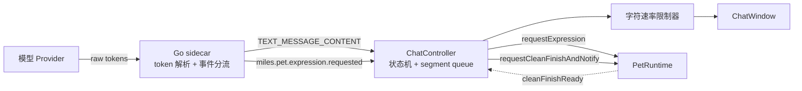
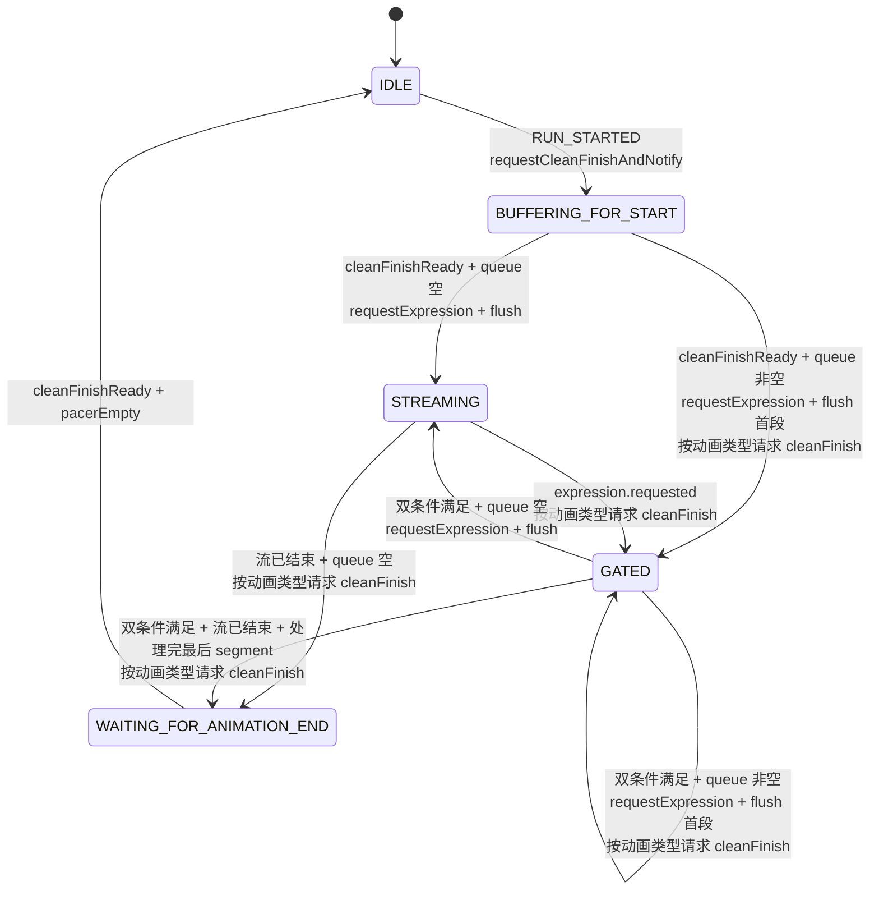
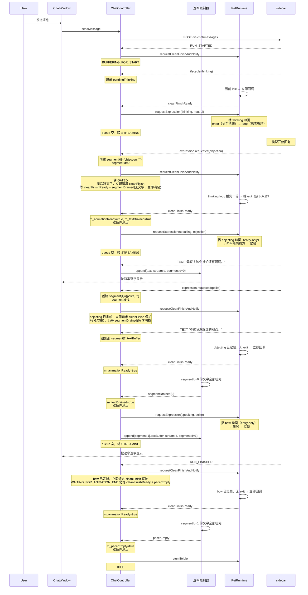
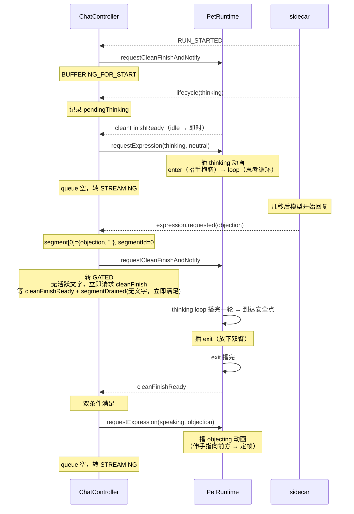

# AI 聊天动画编排设计

本文档定义 MilesEdgeworth v2 中模型流式回复与桌宠动画的同步编排机制。它是长期维护文档，指导 sidecar 流式事件设计、ChatController 状态机、PetRuntime 边界接口和文字速率限制器的实现。

相关文档分工：

- `总体架构设计.md`：模块边界和通信协议总览。
- `桌宠运行时与动画调度设计.md`：PetRuntime 调度模型、PetState、ExpressionMapping 解析。
- `皮肤包播放行为设计.md`：phased 动画、Recipe、AnimationPool、expressionMappings 层级模型。

## 1. 设计目标

让模型的流式回复和桌宠动画看起来像同一个动作——桌宠"边做动作边说话"，文字内容和动画语义对应。

具体要求：

- 文字和动画**分段同步**：expression A 的动画在播放时，才流出 expression A 对应的文字。
- 动画过渡**自然平滑**：有 exit 段的动画先播 exit 再切下一个；定帧动画可以直接切。
- 文字以**拟人语速**流出，不快得像 dump，也不慢得让人等。
- **响应迅速**：用户发消息后 ~200ms 内桌宠开始反应。
- **取消 / 错误可中止**：取消和错误是立即中止路径，尽量保留已到达本地的文字，失效旧回调，并让 PetRuntime 立即回 idle。
- 同一回复中可以**多次切换表达**，每段 expression 的文字和动画一一对应。
- 模型回复结束后，动画**自然收尾**再回 idle。

非目标：

- 不做 TTS 同步，那是更晚阶段的事。
- 不做唇形 / 表情逐帧对齐，粒度到 expression 段即可。
- 不要求模型输出严格 JSON schema，使用文本内嵌标记更适合流式输出，对各 provider 都友好。

## 2. 目标效果

以下场景描述用户在聊天时看到的动画效果，作为所有技术实现的验收基准。

### 2.1 场景 1：正常对话

你发了一条消息"你怎么看这个推论？"

1. **Miles 正在站着待机**（idle_stand 循环播放）。
2. 消息发出后，**Miles 很快反应**——约 200ms 内，他开始抬手抱胸（thinking 动画的 enter 阶段）。
3. **抱胸保持**，手指轻敲——thinking 的 loop 阶段。模型在想的时候他一直保持这个姿势。
4. 模型开始回复，第一段是 `[EXPR:objection]`（异议！）。
5. Miles **先放下双臂**（thinking 的 exit），然后**伸手指向前方**（objecting 播一次然后定住）。
6. **文字开始出现**："异议！这个推论还有漏洞。"——一个字一个字按节奏流出，约每秒 12 字。
7. Miles **保持定在最后一帧**（手指向前方），和文字同步。
8. 模型切换到 `[EXPR:polite]`（礼貌）。
9. **文字暂停**——因为 objecting 没有 exit，不用等退出动画，直接切到 bow（鞠躬）。
10. **文字继续**："不过我理解您的观点。"——继续按节奏流出。
11. 模型回复结束（RUN_FINISHED）。
12. 文字继续吐完，Miles 完成鞠躬，回到站立待机。
13. 一切结束，Miles 安静地站着等你的下一条消息。

### 2.2 场景 2：短回复

1. 你问了个简单问题。
2. Miles 开始抱胸思考（enter → loop）。
3. 模型很快回了，只有几个字：`[EXPR:neutral]好的。`
4. Miles 放下双臂（thinking exit），切到普通说话姿势。
5. "好的。" 三个字流出。
6. Miles 自然回到待机。

### 2.3 场景 3：连续多段 expression

模型输出：`[EXPR:objection]异议！[EXPR:polite]但是…[EXPR:objection]不对，我再想想。`

1. Miles **指向前方**（objecting），"异议！" 流出。
2. 直接切到**鞠躬**（bow）——objecting 无 exit，不用等。"但是…" 流出。
3. 直接切到**再次指向前方**（objecting）——bow 也无 exit，不用等。"不对，我再想想。" 流出。
4. 每个动画至少播放一个完整周期，不会在中间硬切。

### 2.4 场景 4：用户取消

1. 模型正在回复，文字在流出，Miles 在做动作。
2. 用户点了取消。
3. ChatController **立即中止当前 reply session**：标记取消、失效旧回调、清理队列状态，并尽量保留已到达本地的文字。
4. PetRuntime **立即收到 `returnToIdle()`**。它按运行时自己的 return-to-idle 规则回到待机，但不等待 `pacerEmpty`，也不走正常回复结束的 cleanFinish 双条件门控。
5. 旧 stream 的后续回调或事件不会再影响当前聊天状态。

### 2.5 各类动画在聊天中的表现

| 类型 | 例子 | 行为 | 切换时 |
|------|------|------|--------|
| **entry-only** | objecting（伸手指）、bow（鞠躬） | 播完后停在最后一帧 | 直接切到下一个动画 |
| **enter-hold-exit** | back_away（后撤警惕） | enter → 定帧保持 → exit 收尾 | 播 exit 再切 |
| **enter-loop-exit** | thinking（抱胸思考） | enter → loop 循环 → exit 收尾 | 等 loop 播完一轮 → 播 exit → 切 |
| **loop-only** | idle_stand（站立待机） | 一直循环 | 等循环播完一轮 → 切 |

关键区分：**entry-only 和 enter-hold-exit 都会定帧**，但 entry-only 定住后就"完成了"，随时可被替换；enter-hold-exit 定住后是"等待状态"，结束时需要播 exit 做恢复动作。

### 2.6 核心原则

| 原则 | 含义 |
|------|------|
| 文字跟动画同步 | expression A 的动画在播放时，才流出 expression A 对应的文字 |
| 动画过渡平滑 | 有 exit 的动画先播 exit 再切下一个；没有 exit 的直接切 |
| 文字节奏拟人 | 不一下全显，也不太慢，约每秒 12 字 |
| 响应迅速 | 发消息后 ~200ms 内看到 Miles 开始反应 |
| 取消 / 错误中止 | 尽量保留已到达本地的文字，失效旧回调，并立即请求回 idle；不等待正常 cleanFinish 双条件 |

## 3. 总体架构



四个职责面：

| 层 | 职责 |
| --- | --- |
| Go sidecar | 接 provider 流，解析 `[EXPR:x]` 标记，分发为 expression 事件和纯文本事件 |
| ChatController 状态机 | 按 expression 分段门控文字流，维护 segment queue |
| PetRuntime | 提供"干净收尾"异步接口（等安全点 + 播 exit），按 ExpressionMapping 决定具体动画 |
| 字符速率限制器 | 用拟人节奏从队列中抽字符送到 UI，并在积压时追平 |

## 4. 聊天相关的动画类型

皮肤中的动画用于聊天编排时，按 phase 结构分为四类。分类决定了动画何时到达"安全点"以及切换时是否有 exit 需要播。

| 类型 | phase 结构 | 示例 | 安全点 | 切换行为 |
| --- | --- | --- | --- | --- |
| **entry-only** | 单段 onceThenHold* | objecting、bow | 定帧后 | 直接切（无 exit） |
| **enter-hold-exit** | enter + hold + exit | back_away（后撤警惕） | 定帧后 | 播 exit → 切 |
| **enter-loop-exit** | enter + loop + exit | thinking、pointing、crossed | loop 播完一轮 | 播 exit → 切 |
| **loop-only** | 单段 loop | idle_stand | 循环播完一轮 | 直接切（无 exit） |

*\* `onceThenHold` 表示播放一次后停在最后一帧，不自动回 idle；entry-only 聊天动作使用该模式保持画面，直到 ChatController 发出下一次 expression 或 `returnToIdle`。*

**干净收尾（clean finish）** 是统一的过渡机制：等动画到达安全点 → 播 exit（如果有）→ 回调。无论是 expression 切换、回复开始还是回复结束，都走同一条路径。这确保所有过渡都平滑自然。

各类型调用 `requestCleanFinishAndNotify` 的详细行为：

| 类型与当前状态 | 行为 |
| --- | --- |
| entry-only，已定帧 | 立即回调（无 exit） |
| entry-only，播放中 | 等播完定帧 → 回调（无 exit） |
| enter-hold-exit，在 hold | 播 exit → exit 完成后回调 |
| enter-hold-exit，在 enter | 等 enter 播完 → 播 exit → 回调 |
| enter-loop-exit，在 loop | 等 loop 播完一轮 → 播 exit → 回调 |
| enter-loop-exit，在 enter | 等 enter 播完 → 播 exit → 回调 |
| loop-only | 等循环播完一轮 → 回调（无 exit） |
| idle / 无活跃动画 | 立即回调 |

## 5. 模型输出约定

### 5.1 标记格式

模型在每段文字开头输出 `[EXPR:tag]`：

```
[EXPR:objection]异议！这个推论还有漏洞。[EXPR:polite]不过我理解您的观点。
```

规则：

- 每段文字必须以 `[EXPR:tag]` 开头，包括回复的第一段。
- 表达延续时不重复标注（同一 tag 不连续标）。
- `tag` 名只能取自当前皮肤声明的 `expressions` 列表（见 `皮肤包播放行为设计.md` §Expression 与 ExpressionMapping）。

### 5.2 System prompt 注入

sidecar 在请求开始时把当前皮肤的 expression 清单注入 system prompt：

```
## 动画表达规则
回复时，在每段文字开头用 [EXPR:标签名] 标记当前表达。情绪延续时不重复标记。
回复的第一段文字必须有标记。

当前可用表达标签：
- objection：强烈反驳、指出漏洞、语气锐利时使用
- polite：礼貌回应、致谢、道歉时使用
- neutral：默认，没有更合适表达时使用
（实际清单由当前皮肤 manifest.expressions 动态生成）
```

清单由 sidecar 读取 Qt 上报的当前皮肤 manifest，每次会话开始或换皮肤时刷新。

### 5.3 sidecar 兜底

模型不按格式输出时，sidecar 一处兜底，不上送 Qt：

- 首段无标记 → 默认插入 `neutral`。
- 未知 tag → 降级为 `neutral` 并日志告警。
- 标记出现在文字中间 → 也算新段开始（提示要求段首，但解析时宽容）。

## 6. SSE 事件流设计

### 6.1 事件类型

sidecar 向 ChatController 发送两类 CUSTOM 事件：

| 事件名 | 含义 | 后面是否跟 TEXT |
| --- | --- | --- |
| `miles.pet.expression.requested` | 一段新的文字开始，伴随 expression 切换 | **是**，后面紧跟 `TEXT_MESSAGE_CONTENT` |
| `miles.pet.lifecycle` | 非文字性状态变化（模型推理中等） | **否** |

**`miles.pet.expression.requested`**（文字段事件）：由 sidecar 在解析到 `[EXPR:tag]` 标记时发出。ChatController 为它创建 segment 入队。

```json
{ "expression": "objection" }
```

**`miles.pet.lifecycle`**（生命周期事件）：不对应文字输出，ChatController **不为它创建 segment**，而是直接请求 PetRuntime 切换动画。

```json
{ "state": "thinking" }
```

当前定义的 lifecycle 状态：

| state | 时机 | ChatController 行为 |
| --- | --- | --- |
| `thinking` | `RUN_STARTED` 后、首个 `[EXPR:tag]` 前 | 请求 thinking expression，不影响 segment queue |

> 注：Go provider 不应在流结束时额外发送 `state: "idle"` expression 事件。回 idle 由 ChatController 在 `RUN_FINISHED` 后通过 `WAITING_FOR_ANIMATION_END` 统一处理，避免 idle 被 segment queue 误入队。

### 6.2 事件序列

完整流式回复示意（带 thinking 阶段）：

```
RUN_STARTED
CUSTOM miles.pet.lifecycle { state: "thinking" }
CUSTOM miles.pet.expression.requested { expression: "objection" }
TEXT_MESSAGE_CONTENT "异议！"
TEXT_MESSAGE_CONTENT "这个推论"
TEXT_MESSAGE_CONTENT "还有漏洞。"
CUSTOM miles.pet.expression.requested { expression: "polite" }
TEXT_MESSAGE_CONTENT "不过我理解"
TEXT_MESSAGE_CONTENT "您的观点。"
RUN_FINISHED
```

约束：

- `expression.requested` 事件**永远**出现在它对应段的文字之前。
- `[EXPR:x]` 标记本身不进入 `TEXT_MESSAGE_CONTENT`，Qt 侧看不到它。
- `TEXT_MESSAGE_CONTENT` 是面向 UI 的展示文本事件，不定义会话持久化格式；持久化层保存包含 `[EXPR:x]` 的原始 assistant 回复供后续模型上下文使用。
- `lifecycle` 事件不参与 segment queue，ChatController 直接处理。
- 一次 RUN 中允许任意数量的 expression 切换。

### 6.2 sidecar 的 token 解析

sidecar 维护小型 lookahead buffer 处理 `[EXPR:x]` 跨 token 边界的情况：

```
state NORMAL:
  遇到 '['        → 进 PARSING_TAG，buffer = "["
  否则           → emit TEXT_MESSAGE_CONTENT

state PARSING_TAG:
  追加 token 到 buffer
  buffer 匹配 [EXPR:...] → 提取 tag，emit expression 事件，回 NORMAL
  buffer 超过最大标记长度 → 不是标记，emit buffer 作为 text，回 NORMAL
  buffer 中检测到非法字符 → 同上
```

最大标记长度 = `[EXPR:` + 最长 tag 名 + `]`，由 manifest expression 清单算出。

## 7. ChatController 状态机

### 7.1 状态定义

| 状态 | 含义 |
| --- | --- |
| `IDLE` | 没有活跃回复 |
| `BUFFERING_FOR_START` | RUN_STARTED 已收到，等待 PetRuntime 干净收尾当前动画 |
| `STREAMING` | 当前 expression 动画进行中，文字正常流出 |
| `GATED` | 收到新 expression 事件或 segment queue 有待处理段，等待双条件满足（动画可切换 + 当前段文字吐完） |
| `WAITING_FOR_ANIMATION_END` | RUN_FINISHED 已到且所有 segment 已处理完，等待动画可结束且文字吐完后回 idle |

### 7.2 Segment Queue

ChatController 维护一个 segment queue 来实现 expression 和文字的分段同步。每个 segment 代表一段 expression 对应的文字：

```cpp
struct ExpressionSegment {
    int segmentId;
    QString expression;
    QString textBuffer;
};

// 当前正在播放动画 + 吐字的段
int m_activeSegmentId = -1;         // -1 表示没有活跃段
QString m_activeExpression;

// 等待激活的段
QList<ExpressionSegment> m_segmentQueue;
int m_nextSegmentId = 0;  // 全局单调递增，跨 reply session 不重置
```

active segment 和 segment queue 的关系：**active segment 是正在播放的段，queue 是等待激活的段**。当一段被"激活"时，它从 queue 头部取出，其 segmentId 和 expression 存入 `m_activeSegmentId` / `m_activeExpression`，其 textBuffer 喂给速率限制器。

segment queue 的工作方式：

- 新 `expression.requested` 到来 → 创建新 segment（分配递增 `segmentId`），追加到 queue 尾部。
- 后续 `TEXT_MESSAGE_CONTENT` → 如果 queue 非空，追加到 queue **最后一个** segment 的 textBuffer；如果 queue 空（STREAMING 状态），直接喂速率限制器（使用 `m_activeSegmentId`）。
- **双条件门控**：GATED 状态下，切换到下一段需要两个条件**同时满足**：
  1. `cleanFinishReady`：当前动画已干净收尾（exit 已播完）。
  2. `segmentDrained(segmentId)`：速率限制器已吐完当前段的所有文字。
- **cleanFinish 请求时机**：双条件不变，但请求 cleanFinish 的时间取决于当前动画。若当前动画可以安全持续循环（`currentLoopMode == loop` 且不会自动回 idle），ChatController 等 `segmentDrained` 后才请求 cleanFinish，避免 talking loop 在文字仍被 paced 时提前退出。若当前动画是有限动画或会自然回 idle，ChatController 立即请求 cleanFinish 作为保护，但仍要等 `segmentDrained` 才能切到下一段。
- 双条件都满足 → **激活下一段**：取 queue 头部 segment，设 `m_activeSegmentId = segment.segmentId`、`m_activeExpression = segment.expression`，请求 expression，把 textBuffer 喂给速率限制器（带 segmentId）。
- 如果激活后 queue 还有剩余 segment → 按当前动画类型决定立即请求或延迟请求新一轮 cleanFinish，留在 GATED。
- queue 空了 → 转 STREAMING。

**为什么需要双条件**：如果只等动画收尾就切换，上一段长文本还在速率限制器里按节奏吐字时，动画已经切到新 expression——违背"expression A 的动画播放时才流出 expression A 的文字"的核心原则。双条件确保文字和动画严格分段同步。

> 注：`lifecycle` 事件（如 thinking）**不创建 segment**，不经过 segment queue，直接由 ChatController 调用 PetRuntime。

### 7.3 状态转移



### 7.4 各状态的事件处理

**`BUFFERING_FOR_START`**

| 事件 | 处理 |
| --- | --- |
| `TEXT_MESSAGE_CONTENT` | 追加到 segment queue 末尾 segment 的 textBuffer。如果 queue 为空（还没收到 expression），暂存到独立的 hold buffer。 |
| `expression.requested` | 创建新 segment 入队。如果 hold buffer 有内容，移入该 segment 的 textBuffer。 |
| `lifecycle.thinking` | 记录 `pendingThinkingExpression`，等 cleanFinish 后请求。 |
| `RUN_FINISHED` | 标记 `streamFinished = true`，不清空 segment queue，继续等 cleanFinishReady。 |
| `cleanFinishReady` | **先判断 queue 是否为空**：如果 queue 为空且有 `pendingThinkingExpression`，请求 thinking expression，转 STREAMING（等后续 expression.requested 到来再入 GATED）。如果 queue 非空，**跳过 pendingThinking**（首个文字段已排队，thinking 已无意义），直接激活 queue 头部 segment：设 active segment，请求 expression，喂 textBuffer 给速率限制器（带 segmentId）。如果 queue 还有剩余，转 GATED，并按新激活动画的类型决定立即请求或延迟请求 cleanFinish；否则转 STREAMING。如果 streamFinished 且 queue 已空，直接转 WAITING_FOR_ANIMATION_END。 |

**`STREAMING`**

| 事件 | 处理 |
| --- | --- |
| `TEXT_MESSAGE_CONTENT` | 直接喂速率限制器（使用 `m_activeSegmentId`）。 |
| `expression.requested` | 创建新 segment 入队，转 GATED。进入 GATED 时初始化双条件标志：`m_animationReady = false`；`m_textDrained` 根据当前 pacer 状态初始化——如果 `m_activeSegmentId == -1`（无活跃段，如 thinking 阶段）或 pacer 中该 segmentId 的文字已全部吐出，则 `m_textDrained = true`，否则 `false`。随后按当前动画类型决定 cleanFinish 请求时机：可安全循环的动画等 `m_textDrained` 后再请求；有限动画或会自动回 idle 的动画立即请求。 |
| `lifecycle.thinking` | 仅在 `m_activeSegmentId == -1` 时处理（尚无文字段）。直接请求 thinking expression。 |
| `RUN_FINISHED` | 标记 `streamFinished`。queue 应已空（STREAMING 时 queue 是空的），转 WAITING_FOR_ANIMATION_END。进入后按当前动画类型决定 cleanFinish 请求时机：可安全循环的动画等 `pacerEmpty` 后再请求；有限动画或会自动回 idle 的动画立即请求。最终回 idle 仍必须同时满足 `cleanFinishReady` 和 `pacerEmpty`。 |

**`GATED`**

GATED 状态下维护两个标志：`m_animationReady`（cleanFinishReady 已到达）和 `m_textDrained`（当前段文字已吐完）。两者都 true 时才执行切换。

cleanFinish 请求时机由当前动画决定：

- 当前动画可以安全持续循环（`currentLoopMode == loop` 且不会自动回 idle）：等 `m_textDrained` 为 true 后再请求 cleanFinish，避免当前 talking loop 提前进入 exit。
- 当前动画是有限动画或会自动回 idle：进入 GATED 后立即请求 cleanFinish，防止动画自然结束后停在不受控状态；但切换仍必须等 `m_textDrained`。

| 事件 | 处理 |
| --- | --- |
| `TEXT_MESSAGE_CONTENT` | 追加到 segment queue 末尾 segment 的 textBuffer。 |
| `expression.requested` | 创建新 segment 入队。 |
| `RUN_FINISHED` | 标记 `streamFinished = true`。不清空 segment queue，继续等双条件。 |
| `cleanFinishReady` | 设 `m_animationReady = true`。如果 `m_textDrained` 也为 true，执行切换（见下）。 |
| `segmentDrained` | 设 `m_textDrained = true`。如果 cleanFinish 尚未请求且当前动画可安全循环，此时请求 cleanFinish；如果 `m_animationReady` 也为 true，执行切换（见下）。 |
| 安全超时（2000ms） | 强制 `m_animationReady = true`，记录 warning，然后检查能否切换。 |

**GATED 切换逻辑**（双条件满足时）：**激活下一段**——取 queue 头部 segment，设 `m_activeSegmentId = segment.segmentId`、`m_activeExpression = segment.expression`，请求 expression，喂其 textBuffer 给速率限制器（带 segmentId）。重置 `m_animationReady = false, m_textDrained = false`。如果 queue 还有剩余，按新激活动画的类型决定立即请求或延迟请求 cleanFinish，留在 GATED。如果 queue 已空且 streamFinished，转 WAITING_FOR_ANIMATION_END，并按当前动画类型决定立即请求或延迟请求 cleanFinish。如果 queue 已空且流未结束，转 STREAMING。

**`WAITING_FOR_ANIMATION_END`**

此状态等待两个条件：`cleanFinishReady`（动画收尾完成）和 `pacerEmpty`（速率限制器已吐完所有文字，包括 active segment 的剩余文字）。用 `m_animationReady` 和 `m_pacerEmpty` 两个标志追踪。进入此状态时初始化：`m_animationReady = false`；`m_pacerEmpty = (pacer.pendingCount() == 0)`。

cleanFinish 请求时机同样由当前动画决定：可安全循环的动画等 `m_pacerEmpty` 后再请求 cleanFinish，让最后一段文字吐完前 talking loop 持续播放；有限动画或会自动回 idle 的动画进入 WAITING 后立即请求 cleanFinish 作为保护。无论哪种情况，最终 `returnToIdle` 都必须等 `cleanFinishReady` 和 `pacerEmpty` 同时满足。

| 事件 | 处理 |
| --- | --- |
| `TEXT_MESSAGE_CONTENT` | 理论上不应到达，安全起见追加到速率限制器。 |
| `cleanFinishReady` | 设 `m_animationReady = true`。如果 `m_pacerEmpty` 也为 true，`returnToIdle` 并转 IDLE。 |
| `pacerEmpty` | 设 `m_pacerEmpty = true`。如果 cleanFinish 尚未请求且当前动画可安全循环，此时请求 cleanFinish；如果 `m_animationReady` 也为 true，`returnToIdle` 并转 IDLE。 |

### 7.5 Reply Session

ChatController 内部用 reply session 概念管理一次回复的生命周期。它不是独立类，而是一组关联状态的逻辑分组：

```
reply session 包含：
  streamId          — 唯一标识本次流
  assistantMessageIndex — 当前正在写入的 assistant 消息位置
  segmentQueue      — expression 分段队列
  streamFinished    — provider stream 是否已结束
  cancelled         — 是否被用户取消
```

正常 reply session 开始于 `RUN_STARTED`，结束于以下条件**全部满足**：

1. provider stream 结束（收到 `RUN_FINISHED`）。
2. segment queue 为空。
3. 速率限制器队列为空。
4. 当前 expression 动画已 clean finish。

`assistantMessageIndex` 在 reply session 结束后重置为 -1。在此之前保持有效，因为速率限制器可能仍在吐字。

用户取消、provider 出错、网络断开不走上述正常结束条件，而是走 §7.6 的立即中止路径。

### 7.6 取消与错误

用户取消、provider 出错、网络断开时：

- 任何状态都标记 `cancelled = true`，递增 `asyncGeneration` 使所有待执行回调失效。
- segment queue 中已到达本地的剩余 textBuffer drain 到速率限制器，尽量保留已经收到的内容。
- 清理 reply session 状态，转 `IDLE`，恢复 PetRuntime 自动 idle 兜底。
- 立即调用 `returnToIdle()`，不等待 `pacerEmpty` 或 cleanFinish。取消 / 错误是中止路径，不是正常回复的优雅收尾路径。
- 如果已有 assistant 消息，立即取消 pending 标记；后续旧 stream 回调由 `asyncGeneration` / `cancelled` 防护丢弃。

### 7.7 安全超时

| 超时 | 默认值 | 所在层 | 用途 |
| --- | --- | --- | --- |
| start timeout | 3000ms | ChatController | `BUFFERING_FOR_START` 状态下，如果 cleanFinishReady 迟迟不到，按 cleanFinishReady 的同一套逻辑处理（判断 queue 是否为空、是否有 pendingThinking、激活首段等），记录 warning |
| gate timeout | 2000ms | ChatController | `GATED` 状态下，如果 cleanFinishReady 迟迟不到，强制设 `m_animationReady = true` 并记录 warning |
| cleanFinish safety timeout | 2000ms | PetRuntime | 内部 cleanFinish 的兜底超时，防止动画长度异常或调度 bug |

gate timeout 覆盖最坏情况：等安全点（~200-400ms）+ 播 exit 段（~200-400ms）。2000ms 留有充裕余量。start timeout 更长是因为回复开始时的旧动画可能包含完整的 loop + exit。三层超时独立运作，互为兜底。

## 8. PetRuntime 接口

### 8.1 方法定义

```cpp
class PetRuntime {
public:
    // 等当前动画到安全点，播 exit（如果有），然后回调。
    // 用于所有动画过渡：expression 切换、回复开始收尾、回复结束收尾。
    void requestCleanFinishAndNotify(std::function<void()> callback);

    // 聊天过程中抑制 3000ms 自动 returnToIdle。
    // reply session 开始时 true，结束时 false。
    void setSuppressAutoIdle(bool suppress);
};
```

ChatController 在所有需要过渡的场景都调用同一个接口。回调后 ChatController 根据上下文决定做什么：请求新的 expression（切换），或调用 `returnToIdle()`（回复结束）。

各动画类型的行为表见 §4。

**Postcondition（回调时 PetRuntime 的状态）**：回调触发时，之前的动画已完成（exit 已播完或无 exit 的动画已停在最后一帧）。PetRuntime **不会**自动回到 idle——它停在 "action 结束、等待指令" 状态。调用方必须在回调中做以下之一：

- `requestExpression()`：开始下一个 expression 动画。
- `returnToIdle()`：回到 idle 待机。

如果调用方在回调后 3000ms 内既不请求新 expression 也不 returnToIdle，PetRuntime 自动 `returnToIdle` 作为安全兜底。**此安全兜底仅在没有活跃 reply session 时启用**——聊天过程中 ChatController 自己管理所有过渡（通过 GATED 双条件门控和 WAITING_FOR_ANIMATION_END 状态），不需要也不应触发自动 idle。实现上 ChatController 在 reply session 开始时调用 `setSuppressAutoIdle(true)`，结束时调用 `setSuppressAutoIdle(false)`。

### 8.2 实现机制

`requestCleanFinishAndNotify` 使用 `m_cleanFinishCallback` 单 slot。行为：

- 如果当前已在安全点且无 exit phase → 立即回调。
- 如果当前已在安全点且有 exit phase → 播 exit，exit 播完后回调。
- 如果未在安全点 → 等到安全点后，如有 exit phase 则播 exit 再回调；如无 exit 则直接回调。
- 安全超时（2000ms）兜底。

phase 之间的自动转移（enter → loop，由 `nextPhase` 字段驱动）**不算**到达安全点。安全点是"当前动画到达了可以开始收尾的位置"，而不是"动画内部切换了 phase"。

**callback slot 规则**：如果调用时已有一个 pending 的 cleanFinish callback，这是 ChatController 逻辑错误——状态机应该保证同一时间只有一个 pending cleanFinish。实现中用 `Q_ASSERT(!m_cleanFinishCallback)` 做 debug 断言，release 中记录 warning 并替换旧回调。

### 8.3 playbackSerial 防护

PetRuntime 维护 `m_playbackSerial`，每次 `setCurrentPhase()` 递增。`handleAnimationFinished()` 在执行 cleanFinish 回调前记录当前 serial；如果 callback 触发了新的播放（serial 变了），则跳过旧动画的后续收尾逻辑（recipe step、pending request、autoReturnToIdle）。

ChatController 的 callback 还有自己的 `streamId + asyncGeneration` 校验。过时的 callback 被静默丢弃。

### 8.4 phase 自动转移与 cleanFinish 的关系

phased action 中 phase 之间的自动转移（由 `nextPhase` 驱动）是 action 内部行为，对 ChatController 不可见：

- enter → loop：enter 播完后自动开始 loop。不触发 cleanFinish 回调。
- loop 播完一轮：到达安全点。如果有 pending cleanFinish 请求，开始播 exit（如有）。
- exit 播完：action 真正结束。触发 cleanFinish 回调。

## 9. 字符速率限制器

### 9.1 工作模型

ChatController 内部维护一个待显示字符队列 + `QTimer`，并通过 `streamId` 和 `segmentId` 追踪当前正在吐的是哪个回复的哪个 segment 的文字：

```
喂入文字：
  ChatController 调用 pacer.append(text, streamId, segmentId)
  STREAMING 时 → 直接喂速率限制器（使用当前 streamId + segmentId）
  非 STREAMING 时 → 进 segment queue 暂存，双条件满足后取首段喂速率限制器

QTimer 每 msPerChar 触发：
  从队列头取一个字符（CJK / Latin 都按字符）追加到 UI
  某个 segmentId 的最后一个字符吐出 → emit segmentDrained(segmentId)
  整个队列空 → emit pacerEmpty()
```

现有 `streamId` 机制保持不变：`discardBeforeStream(streamId)` 丢弃旧回复残留字符，`chunkReady(chunk, streamId)` 让 ChatController 校验回复归属。`segmentId` 是新增的正交维度，追踪段内文字进度。

**`segmentDrained(int segmentId)` 信号**：当速率限制器吐完某个 segmentId 的最后一个字符后发出。ChatController 在 GATED 状态下监听此信号，作为双条件门控的第二个条件。这确保上一段文字完全显示后才切换到下一段的动画。

**`pacerEmpty()` 信号**：当速率限制器的整个队列为空时发出（不限定 segmentId）。ChatController 在 WAITING_FOR_ANIMATION_END 状态下监听此信号，确保最后一段文字全部吐完后才回到 idle。`pacerEmpty` 和 `segmentDrained` 是独立信号：`segmentDrained` 标记某一段文字结束，`pacerEmpty` 标记所有文字结束。

**跨 session 安全性**：`segmentDrained` 和 `pacerEmpty` 不携带 `streamId`，因为两层机制已防止旧 session 信号干扰：(1) `m_nextSegmentId` 全局单调递增、跨 reply session 不重置，旧 session 的 segmentId 不会与新 session 碰撞；(2) reply session 开始时调用 `discardBeforeStream(streamId)` 清空旧队列，旧文字不会自然 drain 出信号。

### 9.2 默认参数

| 参数 | 默认值 | 含义 |
| --- | --- | --- |
| `msPerChar` | 80 | 每字符间隔，约 12.5 字 / 秒 |
| 设置范围 | 40–200 ms | 用户在设置面板可调 |
| `maxBacklog` | 30 字符 | 队列积压上限 |
| `backlogSpeedupFactor` | 0.5 | 积压时 `msPerChar` 临时乘以此系数 |

`msPerChar` 在设置面板的"其他设置"tab 暴露给用户。

### 9.3 积压追平

如果待显示队列长度超过 `maxBacklog`，临时把 `msPerChar` 乘以 `backlogSpeedupFactor`，直到积压回落。避免用户在 gate 打开后还要等几秒才看到全部文字。

## 10. 完整时序示例

### 10.1 带 phased 动画的多段 expression

场景：用户问"你怎么看这个推论？" → Miles 先思考，然后回复两段不同表达。



### 10.2 带 thinking 的长回复

场景：模型先思考较长时间，thinking 动画使用 enter-loop-exit。



说明：thinking 通过 `lifecycle` 事件触发，不进入 segment queue。当第一个 `expression.requested` 到达时，进入 GATED 等待 thinking 动画 cleanFinish（loop 播完一轮 → 播 exit → 回调）。此时因 thinking 不是文字段，segmentDrained 条件立即满足。

## 11. 四种动画-文字长度组合

| 组合 | 行为 |
| --- | --- |
| **A. 可循环动画 + 文字长** | 动画 enter → loop 持续循环。下一 expression 到来时，若当前段文字仍在 paced，则先保持 loop；`segmentDrained` 后请求 clean finish，等当前循环安全点 → 播 exit（如有）→ 切到新动画。RUN_FINISHED 时同理：等 `pacerEmpty` 后请求 clean finish，再回 idle |
| **B. entry-only 动画 + 文字长** | 动画播一次定格末帧（onceThenHold），文字继续流出。下一 expression 到来后，entry-only 的 cleanFinish 可以立即 ready（已定帧 + 无 exit），但实际 expression 切换仍必须等待当前 segment 文字 `segmentDrained` |
| **C. 动画 + 文字短** | 文字提前流完，RUN_FINISHED 后 segment queue 已空，转 WAITING_FOR_ANIMATION_END。动画 clean finish 后回 idle |
| **D. 文字快速涌入** | segment queue / 速率限制器积压触发追平机制，临时提速消化积压 |

## 12. expression 到 action 的映射与验收

expression 通过 `ExpressionMappingResolver` 映射到具体 action。一个 expression 可能映射到多个 action（例如 `objection` 映射到 `objecting` 或 `doubleClick.holdIt`，按权重随机选择）。

验收分层：

- **expression 层**：确认模型输出的 expression tag 被正确解析并请求。验证方式：查看日志中的 `chat expression requested` 条目。
- **action 层**：确认所有候选 action 都能正常播放。验证方式：在单元测试中传入固定 `randomValue` 做确定性验证（`ExpressionMappingResolver::resolve` 已接受 `randomValue` 参数）。
- **体验层**：随机选择有利于自然感。如果某个场景需要确定性动作（例如强剧情"异议！"必须播 `objecting`），皮肤可以配置 `selection: first_available` 或直接在 recipe 里指定 action。

## 13. 文档维护规则

- 修改 SSE 事件类型（expression.requested / lifecycle）时同步更新 §6。
- 修改 ChatController 状态机、segment queue 或双条件门控逻辑时同步更新 §7。
- PetRuntime 新增 / 修改 cleanFinish 接口或 postcondition 时同步更新 §4 和 §8。
- 速率限制器参数、segmentId 机制或追平算法调整时同步更新 §9。
- 新增动画类型或改变 phase 自动转移规则时同步更新 §4。
- 修改 loopMode schema（如 onceThenHold）时同步更新 §4 和 `皮肤包播放行为设计.md`。
- 与桌宠运行时调度模型有交叉（如 `interruptHint` 含义变化）时，同步更新 `桌宠运行时与动画调度设计.md`。
