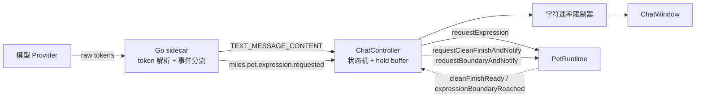
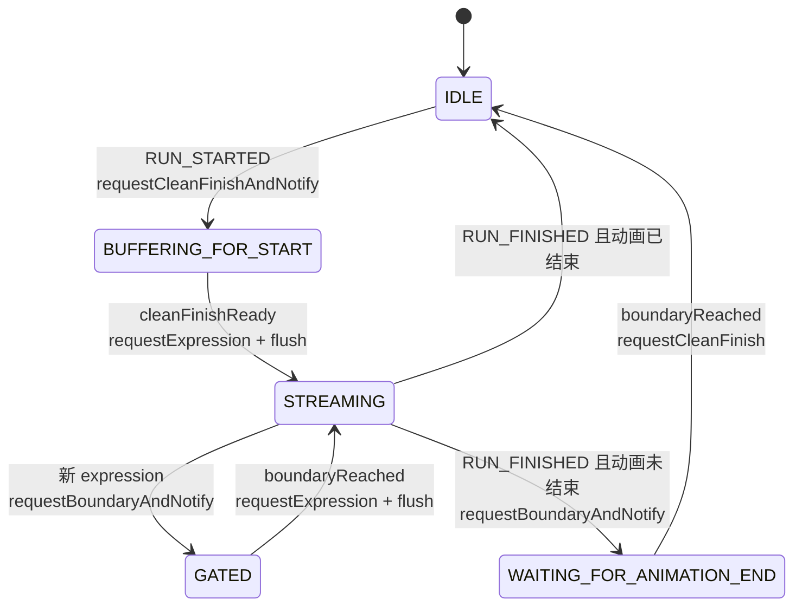
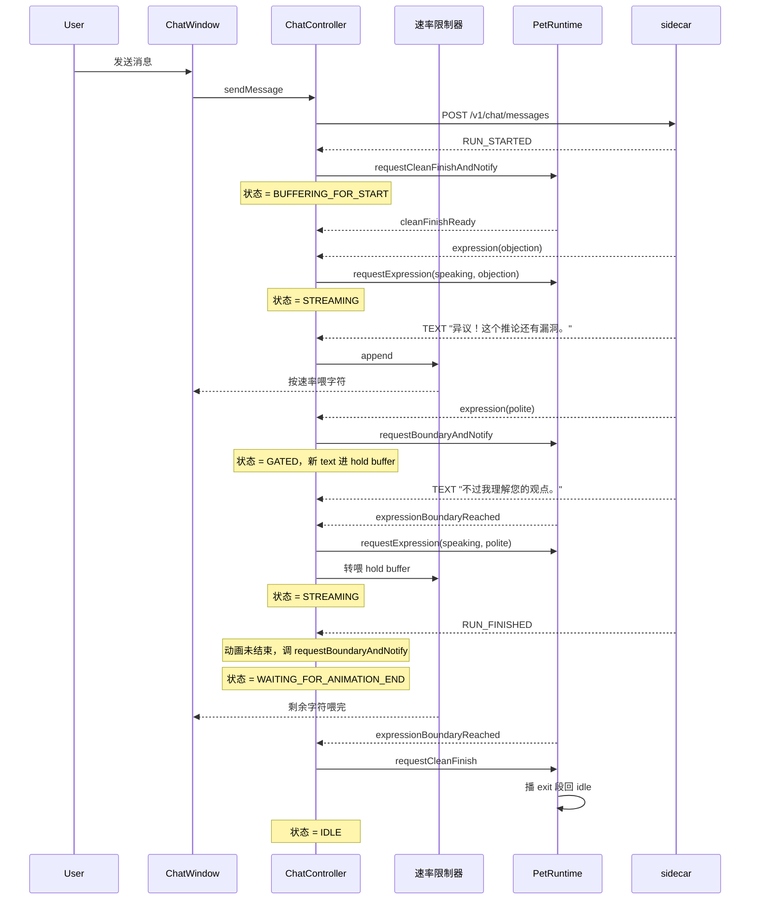

# AI 聊天动画编排设计

本文档定义 MilesEdgeworth v2 中模型流式回复与桌宠动画的同步编排机制。它是长期维护文档，指导 sidecar 流式事件设计、ChatController 状态机、PetRuntime "干净收尾"接口和文字速率限制器的实现。

相关文档分工：

- `总体架构设计.md`：模块边界和通信协议总览。
- `桌宠运行时与动画调度设计.md`：PetRuntime 调度模型、PetState、ExpressionMapping 解析。
- `皮肤包播放行为设计.md`：phased 动画、Recipe、ActionPool、expressionMappings 层级模型。

> **当前代码状态（Phase 2.0 合入后）**：sidecar 已支持 mock 流式输出和 `miles.pet.expression.requested` 事件，ChatController 已能将 expression 事件转为 `PetRuntime::requestExpression(...)` 调用。但 `TEXT_MESSAGE_CONTENT` 直接 append 到 UI，与 expression 事件松散并行，没有同步机制。本设计要解决的就是这个缺口，按 Phase 2.x 子阶段分批落地：协议骨架在 2.1 引入，完整状态机和速率限制器在 2.3 完成，phased 动画体验在 2.4 自然变好。

## 1. 设计目标

让模型的流式回复和桌宠动画看起来像同一个动作——桌宠"边做动作边说话"，文字内容和动画语义对应。具体要求：

- 桌宠不强行硬切动画，始终通过当前循环边界 + exit 段自然收尾再切。
- 文字内容和动画在视觉上同步出现，不会出现"文字早于动作"或"动作早于文字"的不协调。
- 同一回复中可以多次切换表达，文字流随动画过渡而暂停 / 放行。
- 模型回复结束后，动画自然收尾再回 idle，不会硬切。
- 文字以拟人语速流出，不快得像 dump，也不慢得让人等。

非目标：

- 不做 TTS 同步，那是更晚阶段的事。
- 不做唇形 / 表情逐帧对齐，粒度到 expression 段即可。
- 不要求模型输出严格 JSON schema，使用文本内嵌标记更适合流式输出，对各 provider 都友好。

## 2. 总体架构



四个职责面：

| 层 | 职责 |
| --- | --- |
| Go sidecar | 接 provider 流，解析 `[EXPR:x]` 标记，分发为 expression 事件和纯文本事件 |
| ChatController 状态机 | 根据动画状态门控文字流，维护 hold buffer |
| PetRuntime | 提供"干净收尾"和"边界通知"两个异步接口，按 ExpressionMapping 决定具体动画 |
| 字符速率限制器 | 用拟人节奏从 hold buffer 抽字符送到 UI，并在积压时追平 |

## 3. 模型输出约定

### 3.1 标记格式

模型在每段文字开头输出 `[EXPR:tag]`：

```
[EXPR:objection]异议！这个推论还有漏洞。[EXPR:polite]不过我理解您的观点。
```

规则：

- 每段文字必须以 `[EXPR:tag]` 开头，包括回复的第一段。
- 表达延续时不重复标注（同一 tag 不连续标）。
- `tag` 名只能取自当前皮肤声明的 `expressions` 列表（见 `皮肤包播放行为设计.md` §Expression 与 ExpressionMapping）。

### 3.2 System prompt 注入

sidecar 在请求开始时把当前皮肤的 expression 清单注入 system prompt：

```
## 动画表达规则
回复时，在每段文字开头用 [EXPR:标签名] 标记当前表达。情绪延续时不重复标记。
回复的第一段文字必须有标记。

当前可用表达标签：
- objection：强烈反驳、指出漏洞、语气锐利时使用
- polite：礼貌回应、致谢、道歉时使用
- neutral：默认，没有更合适表达时使用
（实际清单由当前皮肤 manifest.expressions 动态生成）
```

清单由 sidecar 读取 Qt 上报的当前皮肤 manifest，每次会话开始或换皮肤时刷新。

### 3.3 sidecar 兜底

模型不按格式输出时，sidecar 一处兜底，不上送 Qt：

- 首段无标记 → 默认插入 `neutral`。
- 未知 tag → 降级为 `neutral` 并日志告警。
- 标记出现在文字中间 → 也算新段开始（提示要求段首，但解析时宽容）。

## 4. SSE 事件流设计

### 4.1 事件序列

完整流式回复示意：

```
RUN_STARTED
CUSTOM miles.pet.expression.requested { state: "speaking", expression: "objection" }
TEXT_MESSAGE_CONTENT "异议！"
TEXT_MESSAGE_CONTENT "这个推论"
TEXT_MESSAGE_CONTENT "还有漏洞。"
CUSTOM miles.pet.expression.requested { state: "speaking", expression: "polite" }
TEXT_MESSAGE_CONTENT "不过我理解"
TEXT_MESSAGE_CONTENT "您的观点。"
RUN_FINISHED
```

约束：

- expression 事件**永远**出现在它对应段的文字之前。
- `[EXPR:x]` 标记本身不进入 `TEXT_MESSAGE_CONTENT`，Qt 侧看不到它。
- 一次 RUN 中允许任意数量的 expression 切换。

### 4.2 sidecar 的 token 解析

sidecar 维护小型 lookahead buffer 处理 `[EXPR:x]` 跨 token 边界的情况：

```
state NORMAL:
  遇到 '['        → 进 PARSING_TAG，buffer = "["
  否则           → emit TEXT_MESSAGE_CONTENT

state PARSING_TAG:
  追加 token 到 buffer
  buffer 匹配 [EXPR:...] → 提取 tag，emit expression 事件，回 NORMAL
  buffer 超过最大标记长度 → 不是标记，emit buffer 作为 text，回 NORMAL
  buffer 中检测到非法字符 → 同上
```

最大标记长度 = `[EXPR:` + 最长 tag 名 + `]`，由 manifest expression 清单算出。

## 5. ChatController 状态机

### 5.1 状态定义

| 状态 | 含义 |
| --- | --- |
| `IDLE` | 没有活跃回复 |
| `BUFFERING_FOR_START` | RUN_STARTED 已收到，等待 PetRuntime 干净收尾当前动画 |
| `STREAMING` | 当前 expression 动画进行中，文字正常流出 |
| `GATED` | 收到新 expression 事件，等待当前动画到达边界 |
| `WAITING_FOR_ANIMATION_END` | RUN_FINISHED 已到、动画未结束，等待动画自然收尾后回 idle |

### 5.2 状态转移



### 5.3 各状态的事件处理

**`BUFFERING_FOR_START`**

- `TEXT_MESSAGE_CONTENT` → 进 hold buffer，不喂给速率限制器。
- expression 事件 → 更新"待请求 expression"，仍 buffer 文字。
- `cleanFinishReady` → 转 STREAMING，调 `requestExpression`，hold buffer 转喂速率限制器。

**`STREAMING`**

- `TEXT_MESSAGE_CONTENT` → 直接喂速率限制器。
- expression 事件 → 调 `requestBoundaryAndNotify`，转 GATED。
- `RUN_FINISHED` → 看动画状态：未结束转 WAITING_FOR_ANIMATION_END 并调 `requestBoundaryAndNotify`；已结束直接转 IDLE。

**`GATED`**

- `TEXT_MESSAGE_CONTENT` → 进 hold buffer。
- expression 事件 → 覆盖待请求 expression（中间又变了以最新为准）。
- `boundaryReached` → 调 `requestExpression`，hold buffer 转喂速率限制器，转 STREAMING。
- 安全超时 → 强制 flush，转 STREAMING。

**`WAITING_FOR_ANIMATION_END`**

- `TEXT_MESSAGE_CONTENT` → 理论上不应到达，但安全起见 append 速率限制器（防数据丢失）。
- `boundaryReached` → 调 `requestCleanFinish` 回 idle，转 IDLE。

### 5.4 取消与错误

用户取消、provider 出错、网络断开时：

- 任何状态都立即转 IDLE。
- hold buffer 内容直接喂速率限制器（不丢用户已经"看到一半"的回复）。
- 调 `requestCleanFinish` 让动画干净收尾，不硬切。

## 6. PetRuntime 接口扩展

### 6.1 新增方法

```cpp
class PetRuntime {
public:
    // 在当前 recipe 最近的自然边界播完 exit 后回调
    void requestCleanFinishAndNotify(std::function<void()> callback);

    // 在当前 recipe 最近的自然边界回调（不一定播 exit）
    void requestBoundaryAndNotify(std::function<void()> callback);
};
```

差异：

- `requestCleanFinishAndNotify` 用于"准备切到下一个完全无关的动画"——需要播 exit 段，让整个 recipe 完整收尾。
- `requestBoundaryAndNotify` 用于"我想切下一个 expression"——只等到自然循环边界，由后续切换逻辑决定下一个动画是否需要 enter / exit 衔接。

实现要求：

- 当前已是 idle 或没有活跃 recipe → 立即同步回调。
- 当前动画 `loop` 模式（无 phase） → 当前一轮循环结束后回调。
- 当前动画 `phased` loop 段 → 当前 loop 一轮结束后回调（boundary），或 loop 结束 → 播 exit → 回调（cleanFinish）。
- 当前动画 `oneshot` 已结束、定格在最后一帧 → 立即回调。
- 当前动画 `oneshot` 未结束 → 等播完后回调。

### 6.2 边界的定义

"自然边界"由当前 action 类型决定：

| Action 类型 | cleanFinish 边界 | boundary 边界 |
| --- | --- | --- |
| `loop`（单段） | 当前一轮循环结束 | 当前一轮循环结束 |
| `phased` loop 段 | 当前一轮 loop 结束 → 播 exit 段 | 当前一轮 loop 结束 |
| `oneshot` 进行中 | 自然播完 | 自然播完 |
| `oneshot` + `onceThenHold` 已定格 | 立即 | 立即 |
| `idle` / 无活跃 recipe | 立即 | 立即 |

Phase 2.0–2.3 阶段还没有 phased 动画，所有 action 都是单段 loop 或 oneshot。本接口在 Phase 2.4 phased 动画落地后体验自然变好，**不需要改协议**。

### 6.3 安全超时

接口内部维护超时 timer，默认 1500ms。如果到时仍未到达边界（例如动画长度异常或调度 bug），强制触发 callback 并切换。这是兜底，正常情况不会触发。

ChatController 一侧也有自己的 800ms 超时用于 GATED，作为更保守的二次兜底，确保聊天 UI 不卡死。

## 7. 字符速率限制器

### 7.1 工作模型

ChatController 内部维护一个待显示字符队列 + `QTimer`：

```
text 进 hold buffer
  STREAMING 时 → 队列直接转喂速率限制器
  非 STREAMING 时 → buffer 暂存，状态切到 STREAMING 时再喂

QTimer 每 msPerChar 触发：
  从队列头取一个字符（CJK / Latin 都按字符）追加到 UI
  队列空时不做事
```

### 7.2 默认参数

| 参数 | 默认值 | 含义 |
| --- | --- | --- |
| `msPerChar` | 80 | 每字符间隔，约 12.5 字 / 秒 |
| 设置范围 | 40–200 ms | 用户在设置面板可调 |
| `maxBacklog` | 30 字符 | 队列积压上限 |
| `backlogSpeedupFactor` | 0.5 | 积压时 `msPerChar` 临时乘以此系数 |

`msPerChar` 在 Phase 2.2 设置面板暴露给用户。

### 7.3 积压追平

如果待显示队列长度超过 `maxBacklog`，临时把 `msPerChar` 乘以 `backlogSpeedupFactor`，直到积压回落。避免用户在 gate 打开后还要等几秒才看到全部文字。

机制让"长动画 + 短文字"和"短动画 + 长文字"两个极端情况下文字都不显拖沓。

## 8. 完整时序示例

以"用户问'你怎么看这个推论？' → 模型回复两段不同表达"为例：



## 9. 四种动画-文字长度组合

| 组合 | 行为 |
| --- | --- |
| **A. 可 loop 动画 + 文字长** | 动画 enter → loop 持续循环。下一 expression 或 RUN_FINISHED → boundary 等当前循环结束 → 播 exit → 切换 / 回 idle |
| **B. oneshot 动画 + 文字长** | 动画播一次定格末帧（`onceThenHold`），文字继续流出。下一 expression 到来 → 立即切换 |
| **C. 动画 + 文字短** | 文字提前流完，RUN_FINISHED 后转 WAITING_FOR_ANIMATION_END，动画自然收尾后回 idle |
| **D. 文字快速涌入** | hold buffer 积压触发追平机制，速率限制器临时提速消化积压，避免用户长时间等待 |

## 10. 与 Phase 2.4 phased 动画的关系

本设计**不依赖** phased 动画。Phase 2.0–2.3 的 oneshot 和单段 loop 动画都能跑通本协议。但用户感知会有差距：

- 没有 phased：动画切换时只能"loop 转一轮就切"，缺少 exit 动作的自然过渡，仍有点跳。
- 有 phased（Phase 2.4 后）：每次切换都能播 exit 段，过渡平滑得多。

协议层面**不需要改动**。`requestCleanFinishAndNotify` / `requestBoundaryAndNotify` 接口在两阶段都成立，行为自然升级。

## 11. 实施分摊

| 子阶段 | 本设计对应工作 |
| --- | --- |
| **Phase 2.1** | sidecar 端 token 解析、`[EXPR:x]` 处理、expression 事件改为段首先发；Qt 端拆出 hold buffer 雏形（暂不实现完整状态机）。 |
| **Phase 2.2** | 设置面板暴露 `msPerChar` 等速率参数。 |
| **Phase 2.3** | persona prompt 接入完整 expression 清单注入；ChatController 状态机完整落地；速率限制器和积压追平机制实现。 |
| **Phase 2.4** | phased 动画落地，PetRuntime 端的 `requestCleanFinishAndNotify` 行为升级（播 exit 段），不改协议。 |

## 12. 文档维护规则

- 修改 SSE 事件流时同步更新 §4。
- 修改 ChatController 状态机时同步更新 §5。
- PetRuntime 新增 / 修改 cleanFinish / boundary 接口时同步更新 §6。
- 速率限制器参数和追平算法调整时同步更新 §7。
- 与桌宠运行时调度模型有交叉（如 `interruptHint` 含义变化）时，同步更新 `桌宠运行时与动画调度设计.md`。
