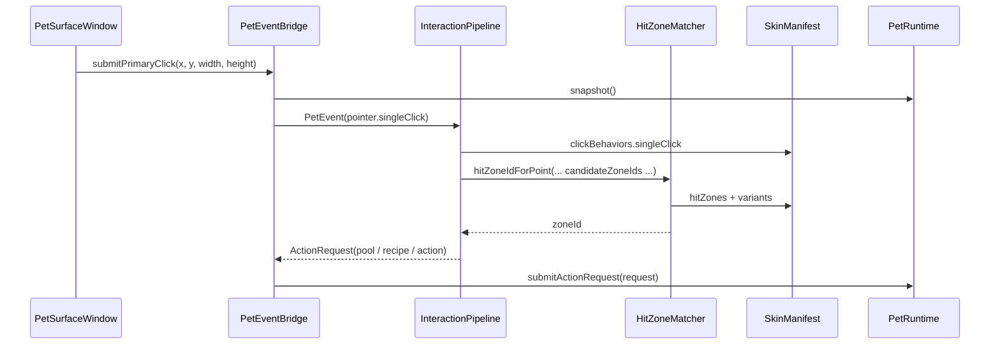
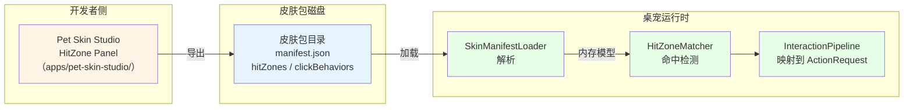
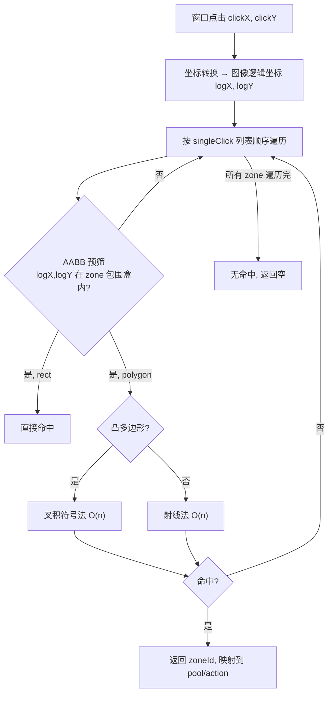
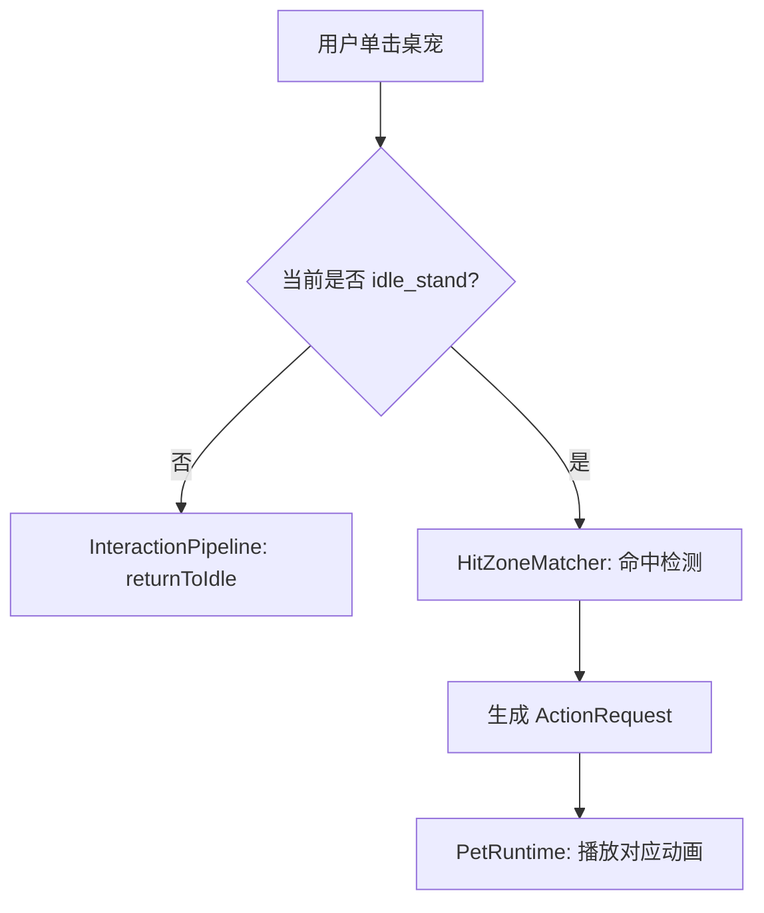
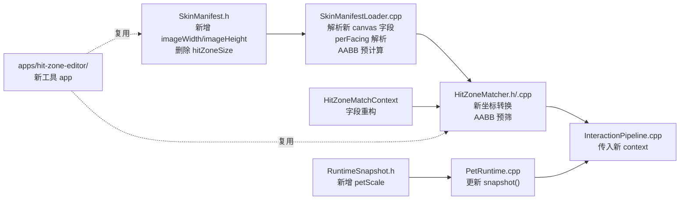

# HitZone 交互区域系统设计

本文定义桌宠皮肤的点击命中区域（HitZone）系统的坐标体系、数据模型、命中检测算法、Zone 优先级规则，以及配套可视化编辑器的设计。

---

## 1. 背景与问题

### 1.1 当前系统

Phase 0.66 将 HitZone 从 `PetRuntime` 中抽出，由 manifest 声明、`HitZoneMatcher` 执行命中判断。当前系统：

- `canvas.hitZoneSize`：单个标量，同时用作逻辑画布的宽度和高度（隐式假设正方形窗口）
- Zone 坐标在 `[0, hitZoneSize] × [0, hitZoneSize]` 空间定义（当前 Miles 为 240×240）
- `HitZoneMatcher` 将窗口点击坐标映射到逻辑坐标：`logicalX = x * hitZoneSize / windowWidth`
- 支持 `variants`（per-facing rect/polygon）

命中链路：



### 1.2 存在的问题

**历史问题 A：Zone 边界系统性错位（Miles 皮肤 bug，已用旧坐标系修正）**

对比 v1 实现（`macos-build-support` 分支，直接 if-else 判断），当前 manifest 中各 zone 的 y 边界整体下移 30–40px，导致点击腰部触发胸部动画、腿部区域点击无响应等问题。

根因：manifest 中的坐标是在 240×240 空间下目视标注的，但没有系统地从 v1 的条件表达式推算，导致各 zone 边界与 v1 不一致。最新 manifest 已把 Miles 仍用 240 坐标系的分区值改为修正版，后续若迁新坐标系应以本文件 §9.2 的 100 空间值为起点。

**历史问题 B：Zone 覆盖有空洞（Miles 已通过 fallback zone 收口）**

v1 是级联 if-else，每个点一定会落入某个分支（穷尽覆盖）。v2 用独立 rect/polygon，若区域定义不覆盖某个点，则该点击不生成 ActionRequest，桌宠无响应。

**问题 C：坐标系不支持非正方形图像**

`hitZoneSize` 是单个标量，当图像宽高比不为 1:1 时，x 和 y 方向的缩放比例不同，会导致圆变椭圆、斜线角度错误等问题。

**问题 D：Zone 坐标与实际皮肤图像之间没有清晰对应关系**

当前坐标系是"窗口坐标系"，包含窗口内边距（Miles 的 windowSize=120, imageSize=100，scale=2 时图像在窗口内各边有 20px 透明边距）。皮肤作者需要心算偏移量，不直观，也不利于开发可视化编辑器。

### 1.3 系统边界与编辑职责

HitZone 是**皮肤包内容**（不是用户偏好），其完整生命周期跨越三个进程角色：



边界划分：

| 角色 | 职责 | 不做什么 |
| --- | --- | --- |
| **Pet Skin Studio**（独立工具，`apps/pet-skin-studio/`） | 可视化编辑、导出 manifest 片段；HitZone 是其首发 panel | 不参与桌宠运行；不直接修改桌宠运行时状态 |
| **manifest.json** | hit zone 数据真源 | 不做命中算法；不做坐标变换 |
| **桌宠运行时** | 加载 manifest、做命中检测、转 ActionRequest | 不编辑 manifest；不暴露 hit zone 调试 UI 给最终用户 |

这一边界遵循《总体架构设计》§9.x"设置与定制的归属"——HitZone 属于"皮肤包内容"，所以编辑器是独立开发者工具，不进入桌宠应用右键菜单。Pet Skin Studio 是统一的开发者环境，HitZone 编辑只是它的第一个功能 panel；后续按需加 Action 编辑、Recipe 编辑、Asset 浏览、Manifest 校验等其它 panel。

> 桌宠应用菜单可以提供一个**"重载当前皮肤"**入口（属于用户偏好/调试入口），让开发者在 Studio 中保存 manifest 后立刻在主应用看到效果，无需重启桌宠进程。
>
> Pet Skin Studio 编辑的是**文件系统**上的皮肤目录，参见《皮肤包分发与加载机制设计》。这意味着皮肤本身已经从 qrc 编入二进制改成磁盘加载，最终用户只调整素材和配置（无需 C++/Qt 编译环境）即可换皮肤。

---

## 2. 设计目标

1. **per-facing 分别定义**：不同朝向各自声明 zone 形状，不强制镜像对称。
2. **坐标系与 scale 解耦**：zone 坐标只与图像内容有关，不随 scale 变化。
3. **非正方形图像支持**：宽高独立声明，不假设正方形。
4. **穷尽覆盖**：提供 fallback zone，确保点击总有响应。
5. **可视化编辑器友好**：zone 坐标直接对应皮肤图像像素（scale=1），编辑器所见即所得。
6. **Zone 优先级可配置**：列表顺序决定优先级，通过拖排序控制重叠关系。

---

## 3. 坐标系设计

### 3.1 三层空间

```
┌──────────────────────── 窗口空间 (windowWidth × windowHeight) ───────────────────────┐
│                                                                                      │
│  (0, 0)                                                    (windowWidth, 0)          │
│                                                                                      │
│       ┌──────────────── 图像空间 (imageWidth × imageHeight) ──────────────────┐      │
│       │                                                                       │      │
│       │  (0, 0)                                       (imageWidth, 0)         │      │
│       │                                                                       │      │
│       │         ┌ ─ ─ ─ ─ ─ ─ HitZone 定义在这里 ─ ─ ─ ─ ─ ─ ┐              │      │
│       │                                                                       │      │
│       │         │   坐标系 = 图像空间（scale=1 像素）            │              │      │
│       │             zone 值范围: [0, imageWidth] × [0, imageHeight]            │      │
│       │         └ ─ ─ ─ ─ ─ ─ ─ ─ ─ ─ ─ ─ ─ ─ ─ ─ ─ ─ ─ ─ ─ ┘              │      │
│       │                                                                       │      │
│       └───────────────────────────────────────────────────────────────────────┘      │
│                                                                                      │
└──────────────────────────────────────────────────────────────────────────────────────┘
```

- **窗口空间**：`petWindowSize × petWindowSize`（当前 = `canvas.windowWidth * petScale`）
- **图像空间**：`petImageSize × petImageSize`（= `canvas.imageWidth * petScale`），居中于窗口内
- **HitZone 定义空间**：图像空间 at scale=1，即 `[0, imageWidth] × [0, imageHeight]`

### 3.2 坐标转换公式

```
// 窗口点击 (clickX, clickY) → HitZone 逻辑坐标 (logX, logY)

imageOffsetX = (windowPixelWidth  - imageWidth  * petScale) / 2
imageOffsetY = (windowPixelHeight - imageHeight * petScale) / 2

logX = (clickX - imageOffsetX) / petScale
logY = (clickY - imageOffsetY) / petScale
```

其中 `imageWidth`、`imageHeight` 是 manifest 声明的 scale=1 图像尺寸。

**对于 Miles（windowWidth=120, imageWidth=100, petScale=2）**：

```
imageOffsetX = (240 - 100 * 2) / 2 = 20
logX = (clickX - 20) / 2
```

点击窗口 (60, 80) → 逻辑坐标 (20, 30)。Zone 在 100×100 空间定义。

### 3.3 与旧系统的对应关系

| | 旧系统（hitZoneSize=240） | 新系统（imageWidth=100） |
| --- | --- | --- |
| 坐标范围 | 0–240 × 0–240 | 0–100 × 0–100 |
| 窗口偏移处理 | 无（zone 含 padding） | 框架自动扣除 |
| 非正方形支持 | ❌ | ✅ |
| 与 scale 的关系 | 含 scale 因子（240=120×2） | 独立，scale=1 基准 |
| 皮肤作者心智模型 | "在放大后的窗口上标坐标" | "在原始图像上标坐标" |

坐标换算：旧 240 空间 → 新 100 空间 = `(oldValue - 20) / 2`（减去 20px padding 再除以 scale）。

---

## 4. 数据模型

### 4.1 Canvas Schema 变更

```json
{
  "canvas": {
    "windowWidth":  120,
    "windowHeight": 120,
    "imageWidth":   100,
    "imageHeight":  100,
    "idleLoopAction": "idle_stand"
  }
}
```

移除 `windowSize`（改为 `windowWidth` / `windowHeight`）、`imageSize`（改为 `imageWidth` / `imageHeight`）、`hitZoneSize`（不再需要）。单个 `Size` 字段作为 backward-compatible 别名保留到过渡期结束。

### 4.2 HitZone Schema

旧 `variants` 改名为 `perFacing`，语义更清晰：

```json
{
  "hitZones": {
    "<zoneId>": {
      "perFacing": {
        "<facingId>": {
          "type": "rect" | "polygon",
          "x": <number>, "y": <number>,
          "width": <number>, "height": <number>,
          "points": [[x,y], [x,y], ...]
        },
        ...
      }
    },
    ...
  }
}
```

**命名规则（重要）**：

- **`<zoneId>` 是自由字符串**，由皮肤作者决定，框架不假设语义。Miles 这种人形角色可以用 `face` / `head` / `chest` / `upper_arm`；猫娘皮肤可以用 `ears` / `tail` / `paw_left`；机器人皮肤可以用 `antenna` / `chest_panel` / `wheel`；抽象造型可以只有 `body` / `accent` / `corner`。框架只用 zoneId 作为字符串 key 关联到 `clickBehaviors.singleClick` 的 `zone` 字段。
- **`<facingId>` 必须出现在 manifest `facings` 数组里**。常见配置是 `["right", "left"]`，但也可以是 `["front", "back", "side"]`、`["north", "south", "east", "west"]`、甚至单朝向 `["default"]`。框架按当前 `currentFacing` 查表，不假设镜像对称关系。
- 类型字段：`type: "rect"` 使用 `x` / `y` / `width` / `height`；`type: "polygon"` 使用 `points` 顶点数组（至少 3 个点）。

**示例（Miles 人形 + 两朝向）**：

```json
"hitZones": {
  "face": {
    "perFacing": {
      "right": { "type": "polygon", "points": [[61,0],[100,0],[100,23],[43,23]] },
      "left":  { "type": "polygon", "points": [[0,0],[39,0],[57,23],[0,23]] }
    }
  },
  "upper_arm": {
    "perFacing": {
      "right": { "type": "rect", "x": 0,  "y": 23, "width": 43, "height": 17 },
      "left":  { "type": "rect", "x": 57, "y": 23, "width": 43, "height": 17 }
    }
  }
}
```

**示例（猫娘 / 四朝向）**：

```json
"facings": ["north", "south", "east", "west"],
"hitZones": {
  "tail": {
    "perFacing": {
      "north": { "type": "rect", "x": 40, "y": 70, "width": 20, "height": 30 },
      "south": { "type": "rect", "x": 40, "y": 70, "width": 20, "height": 30 },
      "east":  { "type": "rect", "x": 0,  "y": 50, "width": 30, "height": 20 },
      "west":  { "type": "rect", "x": 70, "y": 50, "width": 30, "height": 20 }
    }
  }
}
```

**示例（单朝向抽象造型）**：

```json
"facings": ["default"],
"defaultFacing": "default",
"hitZones": {
  "body":     { "perFacing": { "default": { "type": "rect", "x": 25, "y": 25, "width": 50, "height": 50 } } },
  "corner":   { "perFacing": { "default": { "type": "rect", "x": 0,  "y": 0,  "width": 25, "height": 25 } } },
  "fallback": { "perFacing": { "default": { "type": "rect", "x": 0,  "y": 0,  "width": 100, "height": 100 } } }
}
```

**查表规则**：

1. 命中检测时，按当前 `snapshot.currentFacing` 在 `perFacing` 里查
2. 若该 facing 未声明，回退到 `manifest.defaultFacing`
3. 若还未声明，该 zone 视为未定义，跳过（不参与命中检测）
4. 不再支持顶层 `rect` / `polygon` 作为隐式 fallback——必须显式 `perFacing`

> 框架不做朝向镜像。如果作者希望两个朝向对称，需要自己手动填两份（或在编辑器里用"复制并镜像"操作生成）。这避免了"什么是对称轴"的歧义。

### 4.3 singleClick 列表的语义

```json
{
  "clickBehaviors": {
    "singleClick": [
      { "zone": "face",           "pool": "click.face" },
      { "zone": "head",           "pool": "click.head" },
      { "zone": "upper_arm",      "pool": "click.upperArm" },
      { "zone": "forearm",        "pool": "click.forearm" },
      { "zone": "chest",          "pool": "click.chest" },
      { "zone": "belly_bow",      "pool": "click.bellyBow" },
      { "zone": "belly_pointing", "pool": "click.bellyPointingArea" },
      { "zone": "legs_back",      "pool": "click.legsBackArea" },
      { "zone": "legs_look_down", "pool": "click.legsLookDownArea" },
      { "zone": "fallback",       "pool": "click.body" }
    ]
  }
}
```

**列表顺序 = 优先级**：`HitZoneMatcher` 按此顺序依次检测，第一个命中的 zone 即为结果。`face` 在 `head` 之前，确保脸部区域优先于通用头部。`fallback` 置于末尾，兜底所有空洞。

---

## 5. 命中检测算法

### 5.1 算法选择



**rect**：O(1) 直接判断四边。

**polygon（凸）**：叉积符号法——对每条有向边 (A→B)，计算 (B-A) × (P-A) 的 z 分量符号，所有符号相同则在内部。典型 zone 多边形 4–6 个顶点，极快。

**polygon（凹/任意）**：射线法（当前实现）——从 P 向右发射水平射线，统计与 polygon 边的交叉次数，奇数为内部。

**AABB 预筛**：每个 polygon 存储 bounding box，快速排除明显不命中的 zone，减少完整多边形测试次数。

**性能**：10–20 个 zone、每 zone ≤ 8 个顶点，整体 < 1µs，无需 quadtree 等空间索引。

### 5.2 凸性判断（构建时预计算）

`SkinManifestLoader` 在解析每个 polygon 时执行以下检查：

```cpp
enum class PolygonClass { Convex, SimpleConcave, Malformed };

PolygonClass classifyPolygon(const QList<QPointF> &pts) {
    if (pts.size() < 3) return PolygonClass::Malformed;

    // 1. 凸性：所有相邻三点的叉积符号相同
    int prevSign = 0;
    for (int i = 0; i < pts.size(); ++i) {
        const auto &A = pts[i];
        const auto &B = pts[(i + 1) % pts.size()];
        const auto &C = pts[(i + 2) % pts.size()];
        const double cross = (B.x() - A.x()) * (C.y() - B.y())
                           - (B.y() - A.y()) * (C.x() - B.x());
        const int sign = (cross > 1e-9) ? 1 : (cross < -1e-9 ? -1 : 0);
        if (sign != 0) {
            if (prevSign != 0 && sign != prevSign) {
                // 凹多边形 — 但仍需要检查是否简单
                return isSimplePolygon(pts) ? PolygonClass::SimpleConcave
                                            : PolygonClass::Malformed;
            }
            prevSign = sign;
        }
    }
    return PolygonClass::Convex;
}
```

预计算结果存入 `HitZoneDefinition.shape.polygonClass`。命中检测时：

- `Convex` → 叉积符号法（同样的循环可以早返回）
- `SimpleConcave` → 射线法
- `Malformed`（< 3 顶点 / 自相交） → loader 阶段**直接拒绝该 zone**，并把错误写入加载日志；该 zone 不进入 `manifest.hitZones`。

> 设计取舍：自相交多边形的"内部"取决于绕组规则（even-odd 还是 non-zero），不同算法结果不同。HitZone 是声明式配置，作者意图模糊时应当报错而不是猜测，避免运行时出现"明明这样画的却命不中"的诡异手感。编辑器在构建多边形时也应实时检测自相交并禁止保存。

### 5.3 越界点击

`HitZoneMatcher` 转换到逻辑坐标后会检查 `(logX, logY)` 是否落在 `[0, imageWidth] × [0, imageHeight]` 之内：

- **越界**（点击在窗口的透明 padding 里）：直接返回空 zone id。`InteractionPipeline` 会因为没有匹配的 `singleClick` 条目而不产生 `ActionRequest`，桌宠不响应。这与窗口输入 mask 的行为一致——透明区域不应当触发动作。
- **在界内但所有 zone 都不命中**：取决于是否声明了 `fallback` zone。声明了就走 fallback，没声明则同越界处理。

---

## 6. 为什么只需要 idle 帧的 HitZone



由于非 idle 状态下单击只触发 `returnToIdle`，命中检测**只在 idle_stand 状态下执行**。因此：

- HitZone 的参考帧 = `idleLoopAction`（`idle_stand`）的第一帧
- 每个朝向对应该朝向的 idle_stand 第一帧
- 皮肤作者只需要在这一帧上划分 zone，不需要为每个动作单独配置
- 可视化编辑器只展示这一帧

这是整个 HitZone 系统的核心约束，大幅简化了配置复杂度。

---

## 7. 可视化编辑器设计（Pet Skin Studio: HitZone Panel）

HitZone 编辑器作为 **Pet Skin Studio** 的第一个 panel 落地。Studio 是一个统一的开发者工具应用，长期会容纳 HitZone、Action / Recipe、AnimationPool、BehaviorRule、Asset 浏览、Manifest 校验等所有皮肤创作工作。

本节只描述 HitZone Panel 的设计；Studio 整体框架（main window、皮肤选择、panel 切换、状态栏等）由独立设计文档 `Pet Skin Studio 工具设计.md` 描述（待补）。

### 7.1 布局

```
┌─────────────────────────────────────────────────────────────────────────┐
│  [皮肤: miles-edgeworth]  [朝向: right ▾]                [导出 JSON] [保存] │
├───────────────────────────────────────┬─────────────────────────────────┤
│                                       │  Zone 列表（优先级从上到下）      │
│                                       │  ─────────────────────────────  │
│   角色图像（idle_stand 第一帧）         │  ☰ ● face          [polygon] ✏  │
│   以 4× zoom 显示                      │  ☰ ● head          [rect]    ✏  │
│                                       │  ☰ ● upper_arm     [rect]    ✏  │
│   半透明彩色 zone 覆盖                  │  ☰ ● forearm       [rect]    ✏  │
│   当前选中 zone 高亮                    │  ☰ ● chest         [rect]    ✏  │
│   顶点/边拖手柄                         │  ☰ ● belly_bow     [rect]    ✏  │
│                                       │  ☰ ● belly_pointing[rect]    ✏  │
│                                       │  ☰ ● legs_back     [rect]    ✏  │
│   [矩形工具]  [多边形工具]  [选择工具]    │  ☰ ● legs_look_down[rect]    ✏  │
│                                       │  ☰ ◌ fallback      [rect]    ✏  │
│   坐标: (32, 18)                        │  ─────────────────────────────  │
│                                       │  [+ 新建 zone]                  │
└───────────────────────────────────────┴─────────────────────────────────┘
```

`☰` 是拖动手柄，拖动行即调整优先级。

### 7.2 编辑工具

**矩形工具**（默认）：
- 拖拽画框，松手生成 rect zone
- 四角和四边中点各有拖手柄，可独立调整

**多边形工具**（节点式，类似 PS 钢笔）：
- 单击添加顶点，逐点构建多边形
- 回到第一个顶点单击，或按 Enter，封闭多边形
- 封闭后切换为编辑模式：拖动顶点调形状
- 单击边中点插入新顶点
- 选中顶点后 Delete 删除（< 3 个顶点时自动转为 rect）
- 无贝塞尔曲线（hit zone 用直线段足够，曲线只增加复杂度）

**选择工具**：
- 单击选中 zone
- 拖动整体移动
- 支持 Ctrl+Z / Ctrl+Y 撤销重做

### 7.3 Zone 重叠的可视化

优先级高的 zone 在画布上渲染时叠在上层（z-order 和列表顺序一致），半透明填充。重叠区域颜色叠加，让作者直观看到哪些区域被多个 zone 覆盖、最终哪个会命中。

### 7.4 参考帧加载逻辑

```
editor 加载时:
  读取 manifest.canvas.idleLoopAction
  读取对应 action 的 variants[currentFacing].url
  提取 GIF 第一帧作为背景图
  以 4× zoom 显示（可配置缩放比）
切换朝向:
  重新加载该朝向的 idle_stand 第一帧
  per-facing zones 切换到对应定义
```

### 7.5 工具实现方案

作为 Pet Skin Studio 的一个 panel，位于 `apps/pet-skin-studio/src/panels/hit_zone/`。Studio 本身是独立 Qt 应用，不内嵌到主桌宠进程。

- 复用 `SkinManifest` / `SkinManifestLoader`（只读 manifest）
- HitZone Panel 内部模型：`HitZoneEditorModel`（维护当前 panel 的编辑状态、撤销栈、脏标记）
- 保存时只更新 manifest 的 `hitZones` 和 `clickBehaviors.singleClick` 字段，其他字段透传（避免覆盖其它 panel 正在编辑的字段）
- 通过《皮肤包分发与加载机制设计》§5 的约束：Studio 只编辑用户目录下的皮肤；编辑内置 Miles 时提示"克隆到用户目录后再编辑"

---

## 8. Schema 与代码变更计划

### 8.1 Schema 变更

| 字段 | 变更 |
| --- | --- |
| `canvas.windowSize` | 改为 `canvas.windowWidth` + `canvas.windowHeight` |
| `canvas.imageSize` | 改为 `canvas.imageWidth` + `canvas.imageHeight` |
| `canvas.hitZoneSize` | 删除 |
| `hitZones[*].rect` | 保留（top-level fallback，过渡期） |
| `hitZones[*].polygon` | 保留（top-level fallback，过渡期） |
| `hitZones[*].variants` | 改名为 `perFacing` |
| `hitZones[*].perFacing[facing].isConvex` | 新增，构建时预计算 |

### 8.2 HitZoneMatchContext 变更

```cpp
struct HitZoneMatchContext
{
    QString facing;
    QString defaultFacing;
    double imageWidth  = 0.0;    // 图像逻辑宽（scale=1）
    double imageHeight = 0.0;    // 图像逻辑高（scale=1）
    double petScale    = 1.0;    // 当前缩放倍数
    // canvasWidth / canvasHeight 删除
};
```

### 8.3 HitZoneMatcher 变更

```cpp
QString HitZoneMatcher::hitZoneIdForPoint(
    const SkinManifest &manifest,
    const HitZoneMatchContext &context,
    const QStringList &candidateZoneIds,
    double x, double y,
    double windowWidth, double windowHeight
)
{
    // 窗口坐标 → 图像空间坐标（scale=1）
    const double imgW = context.imageWidth  * context.petScale;
    const double imgH = context.imageHeight * context.petScale;
    const double offsetX = (windowWidth  - imgW) / 2.0;
    const double offsetY = (windowHeight - imgH) / 2.0;

    const double logX = (x - offsetX) / context.petScale;
    const double logY = (y - offsetY) / context.petScale;

    // 越界（点击在图像之外的透明边距）直接返回
    if (logX < 0 || logY < 0 || logX > context.imageWidth || logY > context.imageHeight) {
        return {};
    }

    const QPointF logicalPoint(logX, logY);
    // 后续逻辑不变：按 candidateZoneIds 顺序遍历，AABB 预筛 + polygon 检测
    ...
}
```

### 8.4 InteractionPipeline 变更

```cpp
const HitZoneMatchContext hitZoneContext {
    snapshot.currentFacing,
    manifest.defaultFacing,
    manifest.canvas.imageWidth,
    manifest.canvas.imageHeight,
    snapshot.petScale,          // RuntimeSnapshot 新增此字段
};
```

### 8.5 向后兼容与迁移

新旧 schema 在过渡期内并存：

| 旧字段 | 新字段 | 兼容策略 |
| --- | --- | --- |
| `canvas.windowSize` | `canvas.windowWidth` + `canvas.windowHeight` | loader 若读到 `windowSize` 而无 `windowWidth/Height`，自动展开为 `windowWidth=windowHeight=windowSize` |
| `canvas.imageSize` | `canvas.imageWidth` + `canvas.imageHeight` | 同上 |
| `canvas.hitZoneSize` | （删除） | loader 读到时打印 deprecation warning，并按"hitZone 用 240 空间"的旧逻辑解析（用旧的 HitZoneMatcher 分支） |
| `hitZones[*].variants` | `hitZones[*].perFacing` | loader 同时识别两个键，优先 `perFacing`；下个大版本删除 `variants` |
| `hitZones[*].rect/polygon`（顶层） | （删除） | loader 读到时打印 deprecation warning，作为 `perFacing[defaultFacing]` 处理 |

迁移触发条件：
- manifest 显式声明 `canvas.imageWidth` 或 `canvas.imageHeight` → 走新坐标系
- 否则保持旧 240 空间坐标系（用旧的 `hitZoneCanvasWidth/Height = hitZoneSize` 逻辑）

manifest 作者可以选择整批迁移（一次性把所有 zone 转到 0–imageWidth 空间）或继续用旧 schema 直到下个大版本。

### 8.6 变更影响范围



---

## 9. Miles 皮肤修复值

> **注意**：以下数值基于对 v1 源码（`macos-build-support` 分支 `MilesEdgeworth.cpp` 第 1066 行起的 `singleClickEvent`）的反推，假设 v1 widget 在 scale=2 时为 200×200 像素（图像填满 widget，无 chrome）。这个假设来自 v1 阈值的数值规律，但**没有经过运行时实测验证**。
>
> 落地时应当：
> 1. 先把这些值写进 manifest，跑桌宠应用，**逐区域点击验证**手感是否接近 v1。
> 2. 对不一致的区域，使用 HitZone 编辑器（开发后）或在桌宠应用里加临时的 "zone debug 叠加层" 实测调整。
> 3. 验证通过后才能视作长期值；在此之前，本节数值视为"初始猜测，待回归测试"。

### 9.1 修复前问题汇总（240 坐标系）

基于 v1 `singleClickEvent` 逻辑反推（scale=2，假设 v1 窗口 200×200，v2 窗口 240×240 含 20px offset）：

| Zone | v1 推算正确值（240 空间） | 修复前 manifest 值 | 偏差 |
| --- | --- | --- | --- |
| chest y | 66–96 | 72–**126** | 下边界超出 30px |
| belly_bow y | 96–112 | **126**–148 | 整体下移 30px |
| belly_pointing y | 112–126 | **148**–170 | 整体下移 36px |
| legs y 起点 | 126 | **166** | 起点下移 40px |
| head x | 20–220（全宽） | 78–162（过窄） | 两侧各缺约 60px |

最新 `apps/desktop/resources/skins/miles-edgeworth/manifest.json` 已在旧 240 坐标系下使用这些修正值，并保留 `fallback` 区域作为兜底。后续迁到新 100 空间时，不应再从修复前数值推导。

### 9.2 新坐标系下的修正值（100 空间，scale=1 图像坐标）

下面的 zone id（`face` / `head` / `upper_arm` 等）是 Miles 皮肤的具体命名约定，不是框架预定义。其他皮肤可以自由命名（见 §4.2）。

从 v1 图像坐标（scale=1）直接读出，无需偏移换算：

**Right facing**：

| Zone | 类型 | x 范围 | y 范围 |
| --- | --- | --- | --- |
| face | polygon | 见下 | 见下 |
| head | rect | 0–100 | 0–23 |
| upper_arm | rect | 0–43 | 23–40 |
| forearm | rect | 0–43 | 40–57 |
| chest | rect | 43–100 | 23–38 |
| belly_bow | rect | 43–100 | 38–46 |
| belly_pointing | rect | 43–100 | 46–53 |
| legs_back | rect | 0–50 | 53–100 |
| legs_look_down | rect | 50–100 | 53–100 |
| fallback | rect | 0–100 | 0–100 |

face polygon（right）：`[[61, 0], [100, 0], [100, 23], [43, 23]]`

（v1 逻辑：y < 23 AND y + 1.2x > 74 → 在 scale=1/100×100 空间的多边形顶点）

**Left facing**：x 轴镜像（left_x = 100 − right_x）：

| Zone | x 范围 | y 范围（同 right） |
| --- | --- | --- |
| face | polygon `[[0,0],[39,0],[57,23],[0,23]]` | — |
| head | 0–100 | 0–23 |
| upper_arm | 57–100 | 23–40 |
| forearm | 57–100 | 40–57 |
| chest | 0–57 | 23–38 |
| belly_bow | 0–57 | 38–46 |
| belly_pointing | 0–57 | 46–53 |
| legs_back | 50–100 | 53–100 |
| legs_look_down | 0–50 | 53–100 |
| fallback | 0–100 | 0–100 |

### 9.3 过渡：Step 1 仅修正 manifest（仍用旧 240 坐标系）

在 schema 重设计完成前，可以先把 manifest 中的 zone 边界改到正确的 240 坐标系值（旧 100 值 × 2 + 20），验证手感。值参见《Phase 1 收尾与体验问题修复计划》第 2.1 节。

---

## 10. 参考资料

- [v1 singleClickEvent 原始代码](../../macos-build-support 分支 MilesEdgeworth.cpp:1066)
- [Phase 1 收尾与体验问题修复计划](../阶段记录/Phase%201%20收尾与体验问题修复计划.md)
- [皮肤包播放行为设计](皮肤包播放行为设计.md)（Click Behaviors 章节）
- [桌宠运行时职责拆分设计](桌宠运行时职责拆分设计.md)（HitZoneMatcher 类职责）
