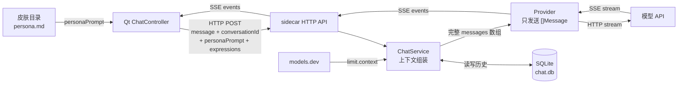
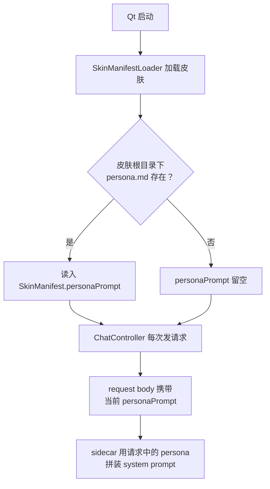
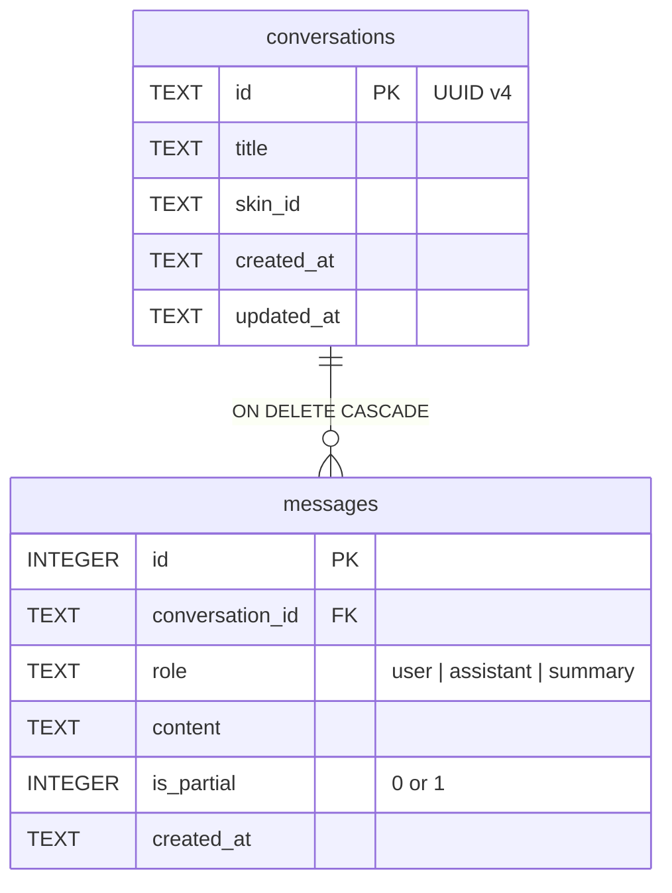
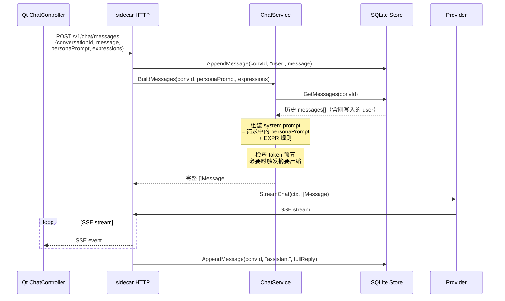
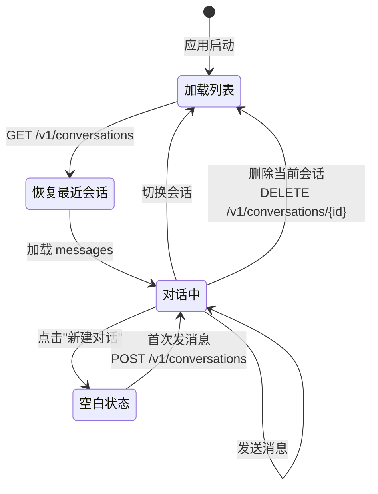
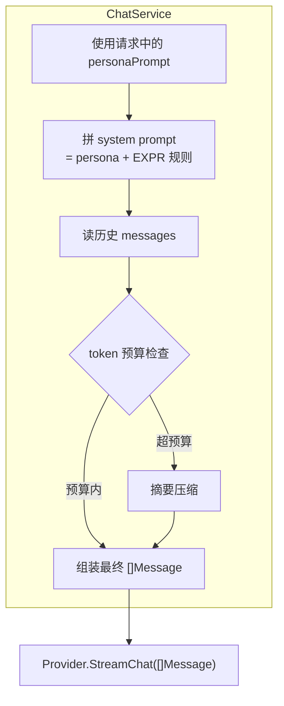
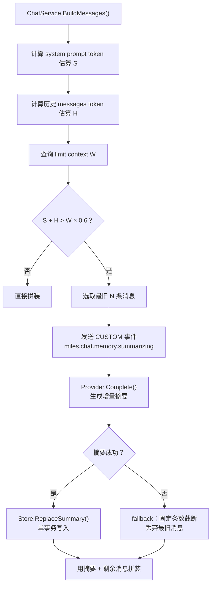

# 会话历史与人设设计

本文档定义 Phase 2.3.2 的技术方案：皮肤人设加载、SQLite 会话持久化、上下文组装与摘要压缩、会话管理 API 和会话列表 UI。

相关文档分工：

- `总体架构设计.md`：模块边界和通信协议总览。
- `AI 聊天动画编排设计.md`：流式事件、ChatController 状态机、动画-文字同步。EXPR 协议的权威定义在此文档。
- `皮肤包分发与加载机制设计.md`：皮肤加载流程和 SkinManifest 结构。

## 1. 背景与目标

**当前状态**：Phase 2.3.1 完成后，聊天功能已有流式对话、动画-文字同步、统一日志。但每次请求只发 `[system, user]` 两条消息——模型没有对话记忆，没有角色人设，重启后消息列表清空。

**Phase 2.3.2 目标**：

1. 皮肤可声明 persona prompt，让角色有稳定人格（Miles 是第一个示范）
2. 会话历史持久化到 SQLite，重启后可恢复
3. 新增 chat service 层，负责上下文组装：从 store 读历史、拼装 messages 数组、管理 token 预算、触发摘要压缩
4. 长对话用摘要压缩自动截断，避免超出 context window
5. ChatWindow 增加会话列表和新建/删除功能

**非目标**：记忆系统（Phase 3）、Langfuse 可观测性（Phase 2.3.3）、多模态（Phase 2.6）、会话列表分页（当前不阻塞，会话数量预计有限）。

**总体数据流**：



## 2. Persona 加载

### 2.1 数据来源

Persona 属于皮肤，不属于应用。每个皮肤目录可放一个 `persona.md` 文件：

```
miles-edgeworth/
  skin.json
  manifest.json
  persona.md          ← 新增，可选
  assets/
    ...
```

`persona.md` 是纯文本 Markdown，内容直接作为 system prompt 的角色部分注入。选择 Markdown 而非 JSON 字段，是因为 persona prompt 通常较长（500-2000 字），放在 JSON 里转义痛苦、编辑不友好。

### 2.2 Persona 与 EXPR 协议的分层

Persona 和 EXPR 是两个独立层，职责不同：

| 层 | 职责 | 内容来源 | 是否动态 |
|---|------|---------|---------|
| **Persona** | 角色风格、性格、语气、禁忌 | 皮肤目录 `persona.md` | 否（随皮肤固定） |
| **EXPR 协议** | 表达标记格式规则、合法 tag 清单 | sidecar 根据当前 `expressions` 动态生成 | 是（依赖 manifest） |

persona.md **不包含** EXPR 标记指令。EXPR 规则仍由 sidecar 的 `buildSystemPrompt` 根据当前皮肤的 expressions 清单动态生成（参见 `AI 聊天动画编排设计.md`）。这样换皮肤时不会出现 persona 里的示例标签与实际 manifest 冲突。

System prompt 最终拼装顺序：

```
[persona.md 内容]

[sidecar 动态生成的 EXPR 规则 + expressions 列表]

[如有摘要：以下是较早对话的摘要：...]
```

### 2.3 加载链路



### 2.4 Persona 始终跟随当前皮肤

Qt 每次聊天请求（`POST /v1/chat/messages`）都携带当前皮肤的 `personaPrompt`。sidecar 直接使用请求中的 persona 拼装 system prompt，不做缓存或快照。

这一设计基于桌宠应用的核心特点：**桌宠是主体，persona 必须和当前皮肤一致**。如果用户换了皮肤或修改了 `persona.md`，桌宠的外表和灵魂都已改变，回复应立刻反映新设定。在旧会话中使用旧 persona 会导致回复与当前桌宠形象不一致。

localhost HTTP 传几 KB 的 persona 文本没有性能问题。

打开旧会话时，如果 `skinId` 与当前皮肤不同，只提示不阻止，后续回复使用当前 persona。不做 persona hash 比较或快照恢复。

### 2.5 SkinManifest 变更

```cpp
struct SkinManifest {
    // ...existing fields...
    QString personaPrompt;  // 新增：从 persona.md 读入
};
```

### 2.6 chat.Request 变更

```go
type Request struct {
    ConversationID string           `json:"conversationId"`
    Message        string           `json:"message"`
    Expressions    []ExpressionInfo `json:"expressions,omitempty"`
    PersonaPrompt  string           `json:"personaPrompt,omitempty"`  // 每次请求携带当前皮肤 persona
}
```

### 2.7 设置页 Persona 编辑

设置页新增一个"角色人格"文本编辑区，内容为当前皮肤的 `persona.md`。用户可以直接修改并保存。

```
设置页:
┌──────────────────────────────────┐
│  ...现有设置项...                 │
│──────────────────────────────────│
│  角色人格 (persona.md)            │
│  ┌──────────────────────────────┐│
│  │你是御剑怜侍（Miles Edgeworth）││
│  │……                            ││
│  │                              ││
│  └──────────────────────────────┘│
│                         [保存]   │
└──────────────────────────────────┘
```

每次打开设置页时，从磁盘重新读取 persona 文件，确保显示最新内容（用户可能在外部编辑器中修改过）。保存时写回磁盘并更新内存中的 `SkinManifest.personaPrompt`。下次发送聊天请求时自动使用新内容，无需重启。

**落盘位置**：应用目录皮肤会被 app 更新覆盖，不能把用户的 persona 修改写进去。因此分两种情况：

| 皮肤位置 | 读取优先级 | 保存位置 |
|---------|-----------|---------|
| 用户目录皮肤 | 皮肤目录 `persona.md` | 直接写回皮肤目录 |
| 应用目录皮肤 | `<AppDataLocation>/skin-overrides/{skinId}/persona.md` > 皮肤自带 `persona.md` | 写到 `<AppDataLocation>/skin-overrides/{skinId}/persona.md` |

判断依据：皮肤的 `rootUrl` 是否在 `appSkinDirectoryPath()` 下。如果是，保存到 `<AppDataLocation>/skin-overrides/{skinId}/persona.md`；否则直接写回皮肤目录。`skin-overrides/` 是独立于皮肤发现目录的用户数据区，不会和皮肤扫描或克隆操作冲突。

如果 persona 文件不存在，编辑区显示为空，保存时按上述规则创建文件。写入失败时（如权限不足），UI 弹出错误提示，不静默失败。

### 2.8 Miles persona.md 内容

为 Miles Edgeworth 写一份详细人设，包含：

- 角色身份（检事、逆转裁判系列）
- 性格特征（严谨、逻辑清晰、有礼但强势、偶尔毒舌）
- 语言风格（简洁、不用网络用语、偏正式）
- 回复规范（中文回复、适度使用游戏梗但不过度）
- 禁忌（不扮演其他角色、不输出有害内容）

注意：persona.md 只定义角色风格，不包含 EXPR 标记指令（EXPR 由 sidecar 动态注入）。

## 3. SQLite 会话存储

### 3.1 职责归属

Go sidecar 全权管理 SQLite。Qt 不接触数据库文件。

### 3.2 数据库路径

Qt 通过环境变量 `MILES_DATA_DIR` 将 `QStandardPaths::AppDataLocation` 传给 sidecar。sidecar 在 `$MILES_DATA_DIR/chat.db` 创建/打开 SQLite。

### 3.3 Schema

```sql
CREATE TABLE IF NOT EXISTS conversations (
    id          TEXT PRIMARY KEY,      -- UUID v4
    title       TEXT NOT NULL DEFAULT '',
    skin_id     TEXT NOT NULL DEFAULT '',
    created_at  TEXT NOT NULL DEFAULT (strftime('%Y-%m-%dT%H:%M:%fZ', 'now')),
    updated_at  TEXT NOT NULL DEFAULT (strftime('%Y-%m-%dT%H:%M:%fZ', 'now'))
);

CREATE TABLE IF NOT EXISTS messages (
    id              INTEGER PRIMARY KEY AUTOINCREMENT,
    conversation_id TEXT NOT NULL REFERENCES conversations(id) ON DELETE CASCADE,
    role            TEXT NOT NULL,  -- 'user', 'assistant', 'summary'
    content         TEXT NOT NULL,
    is_partial      INTEGER NOT NULL DEFAULT 0,  -- 1 = 用户取消或断连导致的截断回复
    created_at      TEXT NOT NULL DEFAULT (strftime('%Y-%m-%dT%H:%M:%fZ', 'now'))
);
CREATE INDEX IF NOT EXISTS idx_messages_conversation ON messages(conversation_id, id);
```

**ER 关系**：



说明：

- `conversations.id`：UUID v4，由 Go `crypto/rand` 生成
- `conversations.title`：自动取第一条 user message 的前 30 字符，UI 显示用
- `conversations.skin_id`：记录创建会话时的皮肤 id，仅用于信息展示
- `messages.role = 'summary'`：摘要压缩后的消息，发送给模型时转换为 system 内容（见 §5.1）
- `messages.is_partial`：只有 `role='assistant'` 的消息可能为 1（用户取消/断连），`user` 和 `summary` 永远为 0
- 时间戳用 ISO 8601 UTC 字符串，SQLite 没有原生时间类型

### 3.4 Go 存储层

新建 `apps/agent-core/internal/store/` 包：

```go
package store

type Store struct { db *sql.DB }

func Open(dataDir string) (*Store, error)
func (s *Store) Close() error

// 会话
func (s *Store) CreateConversation(skinID string) (Conversation, error)
func (s *Store) ListConversations(limit int) ([]Conversation, error)  // 按 updated_at DESC
func (s *Store) GetConversation(id string) (Conversation, error)
func (s *Store) DeleteConversation(id string) error
func (s *Store) UpdateConversationTitle(id, title string) error

// 消息
func (s *Store) AppendMessage(conversationID, role, content string) (Message, error)
func (s *Store) GetMessages(conversationID string) ([]Message, error)
func (s *Store) ReplaceSummary(conversationID string, upToMessageID int64, summary string) error
```

初始化要求：

- `Store.Open` 连接后立即执行 `PRAGMA foreign_keys = ON`，否则 `ON DELETE CASCADE` 不生效

事务要求：

- `AppendMessage` 在单事务中插入消息并更新 `conversations.updated_at`
- `ReplaceSummary` 在单事务中执行删除 `id <= upToMessageID` 的旧消息 + 插入一条 `role='summary'` 的摘要消息，保证原子性
- `ListConversations` 默认按 `updated_at DESC`，接受 `limit` 参数（默认 100）

### 3.5 依赖

引入 `modernc.org/sqlite`（纯 Go SQLite 实现，无 CGO 依赖，交叉编译友好）。这是 sidecar 的第一个外部依赖。

## 4. 会话管理 API

### 4.1 新增 HTTP 端点

sidecar 新增以下端点供 Qt 调用：

| 方法 | 路径 | 用途 |
|------|------|------|
| GET | `/v1/conversations` | 列出所有会话，返回 `[{id, title, skinId, updatedAt}]`，按 `updatedAt DESC`，支持 `?limit=N`（默认 100） |
| POST | `/v1/conversations` | 新建会话，body: `{"skinId":"..."}` |
| DELETE | `/v1/conversations/{id}` | 删除指定会话及其所有消息 |
| GET | `/v1/conversations/{id}/messages` | 获取指定会话的消息列表（UI 恢复用），返回 `[{id, role, content, isPartial, createdAt}]` |

现有 `POST /v1/chat/messages` 保持不变，但 sidecar 内部逻辑变为：

1. 验证 `conversationId` 对应的会话存在
2. 将 user message 存入 SQLite
3. ChatService 组装完整 messages 数组（见 §5）
4. 调 Provider 发送，流式返回 SSE events
5. 流结束后将 assistant 完整回复存入 SQLite

### 4.2 聊天请求时序



注意：当前 user message 先写入 SQLite，`GetMessages` 返回的历史已包含它，因此 ChatService 拼装时**不再额外追加当前 user message**。这避免了消息重复。

### 4.3 取消与异常时的持久化语义

| 场景 | user message | assistant message |
|------|-------------|-------------------|
| 正常完成 | 已入库（发送前写入） | 流结束后写入完整回复 |
| 用户取消 | 已入库 | 如果已收到部分内容，保存截断文本并标记 `is_partial=1`。UI 侧 Qt 已有 drain-after-cancel 语义，sidecar 对齐 |
| Provider error | 已入库 | 不入库。UI 显示错误提示 |
| 网络断开 | 已入库 | 同取消：保存已收到的 partial，标记 `is_partial=1` |

原则：user message 始终保留（用户确实发了），assistant 只在有实际内容时保存。

### 4.4 ChatController 请求变更

Qt `ChatController.sendMessage()` 改为：

- 维护一个 `m_currentConversationId`
- 请求 body 中的 `conversationId` 使用真实 ID（不再硬编码 `"default"`）
- 首次发消息时先调 `POST /v1/conversations` 创建会话，得到 ID 后再发消息
- 每次请求携带当前 `personaPrompt`

### 4.5 会话生命周期



## 5. 上下文组装与摘要压缩

### 5.0 ChatService：上下文组装的唯一责任方

新建 `apps/agent-core/internal/chat/service/` 包，职责：

1. 从 store 读取历史 messages
2. 拼装 system prompt = persona + EXPR 规则
3. 计算 token 预算，决定是否需要摘要压缩
4. 输出完整 `[]Message` 数组交给 Provider

Provider 只负责将 `[]Message` 发给上游模型 API 并解析 stream，**不持有 store 引用，不知道历史**。



### 5.1 拼装规则

ChatService 输出给 Provider 的 messages 数组结构：

```json
[
  {"role": "system", "content": "<persona>\n\n<EXPR rules>\n\n[如有摘要] 以下是较早对话的摘要：\n<summary>"},
  {"role": "user", "content": "旧消息1"},
  {"role": "assistant", "content": "旧回复1"},
  ...
  {"role": "user", "content": "当前消息"}
]
```

**摘要作为 system 内容**：DB 中 `role='summary'` 的记录在发送给模型时，转换为 system prompt 的一部分（追加在 EXPR 规则之后），前缀"以下是较早对话的摘要："。不使用 `role: assistant`，因为摘要不是模型真实说过的话，用 assistant 角色会污染角色输出。这一做法与 LibreChat（summary 转 `role: system`）和 lobe-chat（summary 注入 system 消息体内）的成熟实践一致。

### 5.2 Provider 接口升级

当前 Provider 接口只有流式方法，且只接受 `Request` 结构体：

```go
// 当前
type Provider interface {
    StreamReply(ctx context.Context, req Request) (<-chan StreamEvent, error)
}
```

Phase 2.3.2 升级为：

```go
type Provider interface {
    // 流式聊天：接收预组装的完整 messages 数组
    StreamChat(ctx context.Context, params ChatParams) (<-chan StreamEvent, error)
    // 非流式补全：用于摘要压缩等内部调用
    Complete(ctx context.Context, params ChatParams) (string, error)
}

type ChatParams struct {
    Messages []Message `json:"messages"`
}

type Message struct {
    Role    string `json:"role"`
    Content string `json:"content"`
}
```

Provider 不再自行构建 system prompt 或 messages 数组，只负责序列化 `ChatParams.Messages` 为上游 API 格式并处理响应。`BuildSystemPrompt` 逻辑移入 ChatService。

**配置归属**：model、temperature、maxTokens、apiKey、baseURL 等业务配置仍由 Provider 在构造时持有（与当前 `openai.NewProvider(...)` 模式一致）。`ChatParams` 只携带 messages，不重复传递配置。

`Complete` 用于摘要压缩的同步请求。超时跟随 HTTP client（120s），取消通过 ctx 传播。Phase 2.3.3 后，摘要请求当前走 Langfuse provider wrapper，标记为 `operation=summary`；未配置 Langfuse 时仍无行为变化。

### 5.3 models.dev 数据源

新建 `apps/agent-core/internal/models/` 包，提供模型能力查询：

```go
func ContextWindow(modelID string) int
func SupportsVision(modelID string) bool
```

数据来源：

1. 启动时从 `GET https://models.dev/api.json` 拉取模型列表，缓存到 `$MILES_DATA_DIR/models-cache.json`
2. 响应结构按 provider 分组（顶层 key 是 provider id，每个 provider 下有 `.models` 对象）。查找逻辑遍历所有 provider 的 models，匹配用户配置的 model ID
3. 关键字段映射：
   - context window → `limit.context`
   - 最大输出 → `limit.output`
   - 视觉能力 → `modalities.input` 包含 `"image"`
4. 缓存 TTL 7 天，过期后下次启动静默刷新
5. 网络不可达时使用过期缓存或内置 fallback（常见模型的硬编码值）
6. 用户配置的 model name 在缓存中查找 `limit.context`；找不到则使用保守默认值 8192

### 5.4 Token 估算

不引入完整 tokenizer。使用字符数估算：

```go
func EstimateTokens(text string) int {
    return len([]rune(text)) * 2
}
```

`len([]rune(text)) * 2` 作为保守上限（中文约 1.5 token/字符，英文约 0.25 token/word）。保守估算确保不会溢出 context window，精度足够用于截断决策。

对比：lobe-chat 使用 `tokenx` 启发式估算器（约 96% 准确度）+ 1.25 安全系数。我们的方案更简单但更保守，适合 Phase 2.3.2 的需求。

### 5.5 摘要压缩触发

每次发送新消息前，ChatService 执行检查：



预算计算：`W × 0.6`（60% 给 system + 历史，剩余留给当前回复和模型输出）。

**约束**：当前 user message 和最近一轮对话（最后一条 user + assistant）永远不参与摘要压缩或 fallback 截断。摘要只压缩更早的历史。极端小 context window 下宁可不压缩也不能丢弃用户刚发的问题。

### 5.6 摘要 prompt

采用增量摘要模式（参考 LibreChat 实践），将新的历史片段整合进已有摘要：

首次摘要（无已有摘要时）：
```
system: "请用简洁的中文总结以下对话，保留关键信息、用户偏好和重要结论。总结应是第三人称叙述。"
user: <要压缩的历史消息>
```

增量摘要（已有摘要时）：
```
system: "请将以下新对话内容整合到已有摘要中，保留关键信息、用户偏好和重要结论。输出更新后的完整摘要。"
user: "已有摘要：\n<existing summary>\n\n新对话：\n<new messages to compress>"
```

使用 `Provider.Complete()` 同步请求。失败时 fallback 到固定条数截断（丢弃最旧消息直到预算内）。

### 5.7 用户感知

摘要压缩时，sidecar 先返回 SSE header（200 OK + `Content-Type: text/event-stream`），然后发送一个 `CUSTOM` 事件：

```json
{
  "type": "CUSTOM",
  "name": "miles.chat.memory.summarizing",
  "runId": "...",
  "value": {}
}
```

Qt 收到后在 statusText 显示"整理记忆中…"。摘要完成后正常发送 `RUN_STARTED` 等事件。使用 `CUSTOM` 而非新增裸事件类型，与现有事件体系（`miles.pet.expression.requested`）保持一致。

**runId 归属**：`runId` 由 API/ChatService 层在请求开始时生成（而非 Provider 内部生成），传递给后续所有环节。这保证 `miles.chat.memory.summarizing`、`RUN_STARTED`、`TEXT_MESSAGE_*`、`RUN_FINISHED` 共享同一个 `runId`。

## 6. 会话列表 UI

### 6.1 ChatWindow 布局变更

在现有 ChatWindow 顶部栏增加一个会话面板切换入口：

```
标题栏: [≡ 会话列表]  Miles  已连接  [设置] [重连]

会话面板（默认收起，点击 ≡ 展开）:
┌────────────────────┐
│ [+ 新建对话]        │
│─────────────────────│
│ ● 关于逆转裁判的讨论  │  ← 当前会话高亮
│   异议。你刚才说…     │  ← 预览：最后一条消息截断
│   5分钟前             │
│─────────────────────│
│ ○ 帮我写一封邮件      │
│   好的，以下是…       │
│   昨天               │
│─────────────────────│
│ ○ 测试对话           │  [删除]  ← 滑动或按钮
│   Phase 2.0 mock…   │
│   3天前              │
└────────────────────┘
```

### 6.2 交互

- 点击会话 → 切换到该会话，加载其消息。如果会话的 `skinId` 与当前皮肤不同，在对话区顶部显示提示（如"此会话始于皮肤：Miles Edgeworth"）
- 点击"+ 新建对话" → 清空消息区，下次发送时创建新会话
- 删除会话 → 确认后调 DELETE API，从列表移除
- 应用启动 → 自动加载最近更新的会话

### 6.3 ChatController 新增属性和方法

```cpp
// 新增 Q_PROPERTY
Q_PROPERTY(QVariantList conversations READ conversations NOTIFY conversationsChanged)
Q_PROPERTY(QString currentConversationId READ currentConversationId NOTIFY currentConversationIdChanged)

// 新增 Q_INVOKABLE
Q_INVOKABLE void loadConversations();
Q_INVOKABLE void switchConversation(const QString &id);
Q_INVOKABLE void newConversation();
Q_INVOKABLE void deleteConversation(const QString &id);
```

`conversations` 列表每个 item 的 schema：

```json
{
  "id": "uuid-string",
  "title": "关于逆转裁判的讨论",
  "skinId": "miles-edgeworth",
  "updatedAt": "2026-05-22T12:00:00.000Z",
  "isCurrent": true
}
```

## 7. 环境变量与配置

### 7.1 新增环境变量

| 变量 | 设置方 | 说明 |
|------|--------|------|
| `MILES_DATA_DIR` | Qt → sidecar | 应用数据目录，sidecar 在此创建 `chat.db` 和 `models-cache.json` |

Qt 通过 `QStandardPaths::writableLocation(QStandardPaths::AppDataLocation)` 获取路径，在 `launchSidecarProcess()` 中注入。

### 7.2 launch.json 更新

调试时 `MILES_DATA_DIR` 可手动设置，方便使用独立的测试数据库。

## 8. 安全与隐私

1. **API key 不入 SQLite**：数据库只存对话内容，不存 provider 配置
2. **persona.md 是纯文本**：不执行、不 eval，只作为 prompt 字符串注入
3. **models.dev 请求不携带敏感信息**：只是 GET 公开 API，不发送 API key
4. **数据目录权限**：sidecar 创建 `$MILES_DATA_DIR` 时使用 0700 权限。SQLite 会额外创建 journal/WAL/SHM 附属文件，均位于同一目录内，继承目录权限
5. **聊天内容明文存本地**：用户对话以明文存储在 SQLite 中。删除会话（`DELETE /v1/conversations/{id}`）会物理删除该会话的所有消息（`ON DELETE CASCADE`）。应用卸载时 `$MILES_DATA_DIR` 整个目录可安全删除

## 9. 影响范围

| 模块 | 改动 |
|------|------|
| `SkinManifest.h` | 新增 `personaPrompt` 字段 |
| `SkinManifestLoader.cpp` | 加载皮肤时读取 `persona.md` |
| `ChatController.h/cpp` | 会话管理方法、`conversationId`、每次请求携带 `personaPrompt` |
| `SettingsWindow.qml` | 新增 persona 文本编辑区 |
| `ChatWindow.qml` | 会话列表面板 |
| `chat.Provider` (Go) | 接口升级：`StreamChat([]Message)` + `Complete([]Message)` |
| `openai/provider.go` | 实现新接口，移除 `BuildSystemPrompt`（移入 ChatService） |
| 新建 `internal/chat/service/` | ChatService：上下文组装、token 预算、摘要触发 |
| 新建 `internal/store/` | SQLite 存储层 |
| 新建 `internal/models/` | models.dev 缓存（`GET /api.json`，字段 `limit.context`） |
| `api/server.go` | 新增会话 CRUD 端点，注入 ChatService |
| `main.go` | 初始化 store + ChatService，传入 server |
| 新建 `persona.md` | Miles 皮肤目录下 |
| `go.mod` | 新增 `modernc.org/sqlite` 依赖 |
| `总体架构设计.md` | 同步 API 路径：`/v1/chat/sessions` → `/v1/conversations` |
