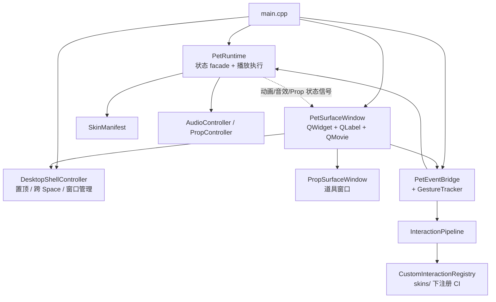
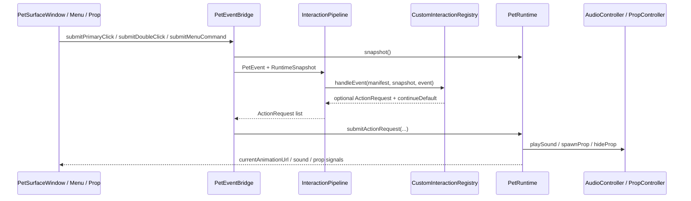

# MilesEdgeworth v2 架构设计

本文档记录 MilesEdgeworth v2 的总体技术路线、模块边界、阶段目标和长期扩展方向。
v2 的第一目标是做出一个有旧版手感、可配置大模型聊天的 AI 桌宠；完整 agent 平台能力按阶段扩展。


## 1. 设计目标

v2 要同时满足两件事：

1. 保留旧版 MilesEdgeworth 的桌宠体验：透明异形窗口、置顶、拖拽、随机动作、走路/跑步、检察官徽章、音效、喝茶、睡觉等。
2. 建立新的 AI 桌宠架构：聊天窗口、设置中心、OpenAI-compatible provider、人设 prompt、流式回复、状态驱动动画，并为后续 tools、skills、MCP、权限确认和插件系统预留边界。

图片置顶查看器不纳入 v2 主线。旧版 `PicViewer` 代码已从 v2 分支移除；如需参考实现，可回看仓库历史或旧分支。

## 2. 技术路线

推荐路线：

```text
Qt 6 + Qt Quick/QML + C++ + Go sidecar Agent Core
```

职责划分：

- Qt C++ 负责桌宠本体（`PetSurfaceWindow`，原生 QWidget）、窗口壳层和操作系统能力（透明窗口、置顶、跨 Space、托盘、拉起 sidecar）。
- Qt Quick/QML 负责未来的 `ChatWindow`、`DashboardWindow` 等聊天与设置界面。
- Go 负责模型 API 调用、流式回复、会话历史存储，以及未来 agent runtime。Qt 负责模型配置文件管理和 API key 存储（详见 `模型配置与密钥存储设计.md`）。

当前桌面端运行态如下：



这样做的原因是：

- 原生 QWidget 对透明异形窗口、alpha mask、GIF 播放的控制更直接，Phase 0.63 验证已无歧义。
- QML 比 Qt Widgets 更适合动画驱动的聊天气泡、状态切换和自定义 UI，用于聊天与设置窗口。
- Go 更适合承接 provider、SQLite、工具系统、MCP、插件和未来 agent harness。
- AI/Agent 业务逻辑主要由 Go Core 承担，Qt 侧保持表现层和系统壳层职责。

## 3. 仓库组织

v2 在当前仓库的新分支中开发。目录组织优先保持增量清晰，避免无关迁移扩大 diff。

目标结构：

```text
MilesEdgeworth/
  apps/
    desktop/
      CMakeLists.txt
      src/
        main.cpp
        app/
        platform/
        pet/
        bridge/
      qml/
        PetWindow.qml        # 已废弃，仅保留作历史参考
        ChatWindow.qml       # Phase 2.0 已落地
        DashboardWindow.qml  # Phase 2+ 待实现
        components/
      resources/

    agent-core/              # Phase 2.0 已落地
      go.mod
      cmd/miles-agent/
      internal/
        api/
        chat/
        provider/
        persona/
        storage/
        config/
        pet/
        runtime/

  assets/                    # 皮肤源码树；打包时拷贝到 applicationDirPath()/skins/
    skins/
      miles-edgeworth/
        skin.json
        manifest.json
        assets/
        interactions/

  schemas/                   # 待实现
    skin-manifest.schema.json
    behavior-profile.schema.json
    pet-event.schema.json

  docs/
    v2/
      文档索引.md
      设计方案/
        总体架构设计.md
        桌宠运行时与动画调度设计.md
        皮肤包播放行为设计.md
      参考资料/
        动画素材盘点.md
      阶段记录/
        第0阶段桌面壳验证.md
```

官方 Miles 皮肤位于 `apps/desktop/resources/skins/miles-edgeworth/`（源码树），打包时拷贝到 `.app` 内 `Contents/MacOS/skins/` 目录。用户自制皮肤放在 `~/Library/Application Support/MilesEdgeworth/skins/`。两个目录物理位置不同（前者随 app 更新被覆盖，后者不受影响），但 loader 用同一套代码扫描和加载，不区分皮肤来自哪个目录。manifest 里的资源使用 `file:assets/...`，由 `SkinManifestLoader` 在加载时解析为 `file:///...` 绝对 URL。皮肤加载设计见 `皮肤包分发与加载机制设计.md`。

## 4. Qt Desktop 职责

`apps/desktop` 是桌面端应用本体。

主要职责：

- 创建透明、无边框、置顶、可拖拽的桌宠窗口。
- 支持 macOS 跨 Space / 全屏层级、Windows topmost、Linux 窗口管理器 best-effort。
- 管理系统托盘、右键菜单、ChatWindow、DashboardWindow。
- 播放桌宠动画、音效、气泡、检察官徽章等表现层效果。
- 实现 Pet Runtime / Animation Orchestrator。
- 通过 Bridge 与 Go sidecar 通信。
- 管理设置文件（`settings.json`），启动 sidecar 时通过环境变量注入 API key 和模型参数。详见 `模型配置与密钥存储设计.md`。

以下职责归 Go Core：

- 具体 provider 是 OpenAI、DeepSeek、Moonshot 还是 OpenRouter。
- API key 如何调用模型。
- Chat Completions、Responses API 或 Eino ADK 的具体差异。
- SQLite 表结构和聊天历史持久化细节。

Qt 只接收统一事件，并把与桌宠相关的语义事件交给 Pet Runtime。

## 5. Go Agent Core 职责

`apps/agent-core` 是本地 sidecar 后端。

主要职责：

- 接收 provider 配置（启动时由 Qt 通过环境变量注入）。
- 管理 Miles 人设 prompt 和会话上下文。
- 调用 OpenAI-compatible `/v1/chat/completions`，并预留 OpenAI `/v1/responses`。
- Eino ADK 作为后续可插拔 Agent Runtime 候选，MVP 主路径保持轻量。
- 保存聊天会话、历史记录和日志。
- 对 Qt 输出统一的事件流，不暴露 provider 差异。
- 后续扩展 tools、skills、MCP、权限确认、插件和脚本执行。

第一版不做完整 agent harness。Go Core 先专注于“可配置模型的人设聊天”。

## 6. 通信协议

Qt 与 Go 之间使用本地通信：

```text
传输层：HTTP + SSE
协议语义：AG-UI-compatible event stream
桌宠扩展：CUSTOM + miles.pet.* namespace
```

普通请求使用 HTTP：

- `GET /v1/conversations`
- `POST /v1/chat/messages`

> 模型配置由 Qt 侧 `settings.json` 管理，通过重启 sidecar 注入。如果未来需要 Dashboard 热更新，可增加 `GET/PUT /v1/config`。

流式输出使用 SSE。标准聊天事件尽量贴近 AG-UI：

- `RUN_STARTED`
- `TEXT_MESSAGE_START`
- `TEXT_MESSAGE_CONTENT`
- `TEXT_MESSAGE_END`
- `RUN_FINISHED`
- `RUN_ERROR`
- `TOOL_CALL_*`，后续阶段使用

桌宠专属事件使用 `CUSTOM`：

```json
{
  "type": "CUSTOM",
  "name": "miles.pet.expression.requested",
  "value": {
    "state": "speaking",
    "expression": "objection",
    "bubble": "异议！这个推论还有漏洞。"
  }
}
```

建议的 Miles 扩展事件：

- `miles.pet.state.changed`
- `miles.pet.expression.requested`
- `miles.pet.bubble.show`
- `miles.pet.bubble.hide`
- `miles.pet.motion.requested`
- `miles.pet.sound.requested`
- `miles.pet.permission.requested`，后续阶段
- `miles.pet.tool.status.changed`，后续阶段

Go 输出语义事件，具体 GIF 选择归 Qt Pet Runtime。

## 7. 模型接口策略

第一版优先支持 OpenAI-compatible Chat Completions：

```text
base_url + api_key + model + /v1/chat/completions
```

这是为了兼容更多中国用户常用 provider，例如 DeepSeek、Moonshot、硅基流动、OpenRouter 和本地兼容服务。

OpenAI 官方 provider 可以预留 Responses API 增强。Responses API 更适合长期的工具调用、多模态和 agentic workflow，但很多 OpenAI-compatible provider 并不支持 `/v1/responses`，所以不应作为 MVP 唯一路径。

Eino ADK 值得在后续 agent 阶段评估。它可以承接工具调用、MCP、多 agent 和 callback/trace，但 MVP 不应被 Eino 深度绑定。

建议 Go Core 内部保留这些抽象：

```text
ChatService
ProviderAdapter
ChatCompletionsAdapter
ResponsesAdapter
Future: EinoAgentRuntime
ConversationStore
PetEventEmitter
```

## 8. 配置与存储

MVP 存储策略：

- SQLite（Go 侧）：聊天历史、会话、日志索引。
- JSON 设置文件（Qt 侧）：`settings.json` 存储 API key、模型配置和应用级设置，文件权限 0600。详见 `模型配置与密钥存储设计.md`。

Dashboard 修改配置时：

```text
Dashboard / 设置窗口
=> Qt 侧写入 settings.json
=> 重启 sidecar（环境变量注入新配置）
=> Qt 刷新 UI
```

日志和配置导出必须脱敏，不允许把 API key 打进普通日志。

## 9. 皮肤与行为配置

皮肤系统拆成两个文件：

- `manifest.json`：描述这个皮肤有哪些素材、动作、表达标签、朝向变体和 fallback。
- `behavior.json`：描述这个角色平时怎么动，例如随机动作概率、点击区域映射、右键菜单动作映射。
- `interactions/`：可选，高级可信交互代码，例如检察官徽章、复杂道具和多对象协作。

这样做可以把“素材能力”和“角色行为”分开。
普通换肤不需要写代码；高级交互可以写代码，并通过受控 Host API 发 ActionRequest、
PropCommand 和 SideEffect。Pet Runtime 内部状态由运行时统一维护。

模型输出当前皮肤 manifest 动态声明的表达标签，动画文件由 Pet Runtime 映射：

```text
固定系统状态：idle / thinking / speaking / moving / error / waiting_permission
动态表达标签：由 skin manifest 定义，例如 objection / polite / tea_break / confident
具体动画：由 Qt Pet Runtime 根据 manifest 映射
```

皮肤必须提供 `neutral` 或等价兜底。模型输出未知标签时，Go Core 或 Qt Runtime 应降级到兜底表达。

### 9.x 设置与定制的归属

桌宠系统的"设置"按数据归属与编辑界面拆成三类：

| 类别 | 例子 | 数据存放 | 编辑入口 | 修改时机 |
| --- | --- | --- | --- | --- |
| **用户偏好** | 总是置顶、静音、屏幕布局、缩放档位、自动移动开关 | 用户配置（`QSettings` / JSON） | 桌宠应用右键菜单 / 设置面板 | 实时生效 |
| **皮肤可选能力** | 语音语言（当皮肤声明 `capabilities.voiceLanguages`）、动作风格（声明 `capabilities.behaviorProfiles`） | 用户配置（按皮肤 id 区分键名） | 桌宠应用菜单（菜单项由 manifest capability 声明**动态生成**） | 实时生效 |
| **皮肤包内容** | HitZone、Action、Recipe、AnimationPool、BehaviorRule、CustomInteraction、Prop 资源、capability 声明本身 | `manifest.json` + 皮肤资源 | 独立开发者工具（编辑 manifest），或纯手写 JSON | 修改后皮肤需重新加载（桌宠应用支持"重载当前皮肤"操作） |

设计原则：

1. **桌宠运行时进程只承载前两类**。manifest.json 的内容由独立工具编辑，运行时不修改 manifest 文件。这让桌宠主进程保持轻量，无需嵌入完整的编辑器 UI。
2. **应用菜单不硬编码皮肤可选能力**。由 manifest 的 `capabilities` 节点声明可选项，菜单按声明动态拼装；旧皮肤未声明该能力时菜单项不出现。
3. **开发者工具与桌宠应用代码隔离**。两者共享 `SkinManifest` 数据模型和 loader，但 UI、依赖、构建产物分开（`apps/desktop/` vs `apps/hit-zone-editor/` 等）。
4. **跨类别变更走"重载皮肤"路径**。开发者修改 manifest 后，可在桌宠应用菜单点击"重载皮肤"触发 manifest 重新解析，无需重启进程。

落地的具体编辑器在后续设计文档逐个铺开，例如 `HitZone 交互区域系统设计.md` 描述了 HitZone 编辑 panel；它属于 **Pet Skin Studio**（`apps/pet-skin-studio/`）这个统一开发者工具的一部分。Pet Skin Studio 的整体框架（皮肤选择、panel 切换、状态栏等）由独立设计文档 `Pet Skin Studio 工具设计.md` 描述（待补）。未来的 Recipe / AnimationPool / Asset 浏览等编辑功能都以 panel 形式进入同一个 Studio 应用，不再分散成多个工具。

### 9.y 皮肤包的分发与加载

为了让最终用户**无需 C++/Qt 编译环境就能换皮肤**，所有皮肤（包括官方 Miles）通过文件系统目录加载：

- 应用扫描两个 `skins/` 目录：用户数据目录（用户自制皮肤，更新 app 不受影响）和可执行文件同级目录（随 app 分发的皮肤）；同 id 时用户目录优先展示，加载失败时继续尝试后续同 id 候选
- manifest 内部使用 `file:assets/...` 前缀，loader 在加载时解析为绝对 URL，让同一份 manifest 在任何位置都能工作
- 桌宠应用菜单提供"皮肤切换"和"重载当前皮肤"

详见 `皮肤包分发与加载机制设计.md`。这是 Pet Skin Studio 落地的前置条件——Studio 编辑的是文件系统上的皮肤目录，桌宠应用负责发现、切换和重载这些目录。

## 10. Pet Runtime 概览

Qt 侧桌宠系统由事件层、请求层和运行时层组成：

- `PetEventBridge` 接收 `PetSurfaceWindow`、右键菜单、idle、Prop、未来 Agent/LLM 状态等事件。
- `InteractionPipeline` / BehaviorRule / Custom Interaction 把事件过滤并转换为 `ActionRequest`。
- `PetRuntime` 执行最终请求，负责主体动画、recipe、当前状态、音效和 Prop 状态暴露。
- `PropController` 管理主体动画之外的临时视觉对象，例如检察官徽章。
- 窗口壳层负责透明、置顶、输入 mask、托盘和多窗口入口。

所有来源最终都发 `ActionRequest`。运行时根据当前状态、切换规则、皮肤能力和朝向选择最终动画。



详细方案见 `docs/v2/设计方案/桌宠运行时与动画调度设计.md`。
皮肤包、Recipe、AnimationPool、BehaviorRule 和 Custom Interaction 的详细层级模型见
`docs/v2/设计方案/皮肤包播放行为设计.md`。

## 11. 路线图

各阶段的详细拆分、验收方式和子阶段顺序，见 `阶段记录/` 目录。总体路线：Phase 0/1 桌宠壳与旧版手感（已完成）→ Phase 2 AI 聊天桌宠完整闭环 → Phase 3 记忆与基础 Agent → Phase 4 完整 Agent Harness。

## 12. 文档维护规则

v2 设计文档是活文档。

- 行为规则变化时，更新对应设计文档。
- manifest 字段变化时，更新 schema 和示例。
- 发现旧版特殊逻辑时，补充到 v1 parity checklist。
- 实现中推翻设计时，必须在 commit 或 PR 描述里说明原因。
- 代码注释中文为主，重点解释模块职责、跨平台注意事项、调度规则和不直观的实现原因。
