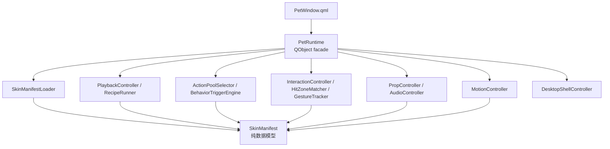
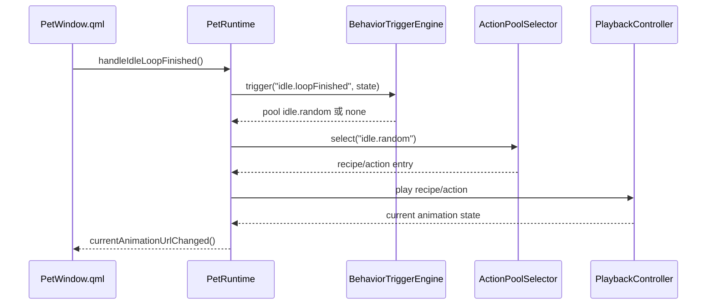
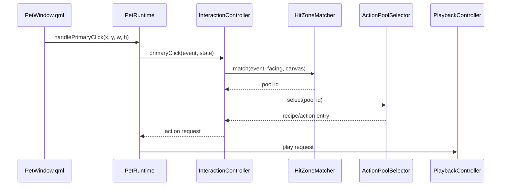
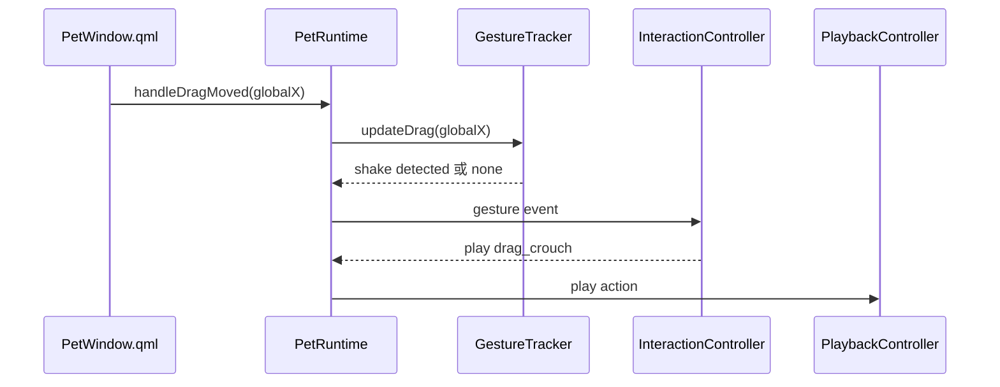
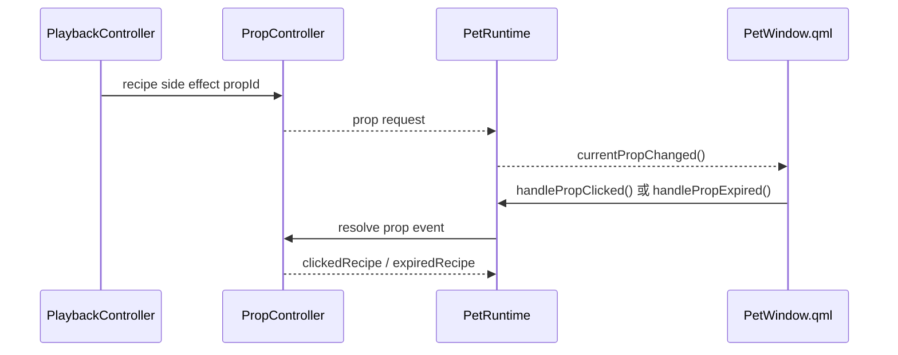

# 桌宠运行时职责拆分设计

本文档定义 v2 桌宠运行时的类边界、依赖方向和迁移顺序。它用于指导后续从当前单体 `PetRuntime` 迁移到可维护的运行时结构。

## 目标

当前 `PetRuntime` 已经承担了 manifest 解析、动作播放、交互判断、随机池、道具、音效、睡眠、喝茶、尺寸、拖拽晃动等多种职责。这个结构便于早期快速还原旧版手感，但不适合继续扩展换肤、AI 状态、工具权限和自定义高级交互。

拆分目标：

1. 保持现有 QML API 和旧版手感不变。
2. 把 manifest 数据、播放调度、交互识别、行为规则、道具副作用拆到独立类。
3. 每次迁移都能通过现有自动测试和运行时 smoke test。
4. 让普通换肤配置、Miles 官方皮肤维护和未来高级交互代码都有清晰落点。

## 非目标

本阶段不同时推进以下工作：

- 不重新设计旧版所有交互语义。
- 不迁移素材目录到 `assets/`。
- 不接入聊天窗口或 Go sidecar。
- 不引入 JS/TS 高级交互执行环境。
- 不实现目标点路线规划。

这些内容会在 `PetRuntime` 职责边界稳定后分阶段推进。

## 当前问题

`apps/desktop/src/pet/PetRuntime.cpp` 当前混合了以下职责：

| 职责 | 当前表现 | 问题 |
| --- | --- | --- |
| QML facade | 暴露 `Q_PROPERTY`、`Q_INVOKABLE`、signals | 这部分必须保留在 QObject 层 |
| manifest 解析 | 直接读取 JSON 并填充内部 struct | 解析逻辑和运行逻辑耦合 |
| action / phase 播放 | `playActionInternal`、`playPhase` | 播放状态和业务入口混在一起 |
| recipe 执行 | `playRecipe`、`playNextRecipeStep` | 后续等待、条件、动态参数会继续膨胀 |
| action pool | 权重随机、语言覆盖 | 可独立测试，不需要依赖 QObject |
| behavior trigger | idle loop 触发 | 将来会覆盖更多运行时事件 |
| hit zone | rect / polygon 命中 | 属于交互匹配，不应留在播放运行时 |
| pointer interaction | 单击、双击、睡眠边界 | 应进入 InteractionController |
| gesture | 拖拽晃动计数 | 应进入 GestureTracker |
| prop | 检察官徽章生成、点击、消失 | 应进入 PropController |
| audio | 音效选择、静音 | 应进入 AudioController 或播放请求层 |
| movement | walk/run delta、scale | 后续应进入 MotionController |

拆分时要避免一次性大改。当前代码虽然集中，但测试覆盖已经形成保护网。迁移应采用“小步抽取、行为等价”的方式。

## 目标结构

建议目录：

```text
apps/desktop/src/pet/
  PetRuntime.h
  PetRuntime.cpp

  manifest/
    SkinManifest.h
    SkinManifestLoader.h
    SkinManifestLoader.cpp

  playback/
    PlaybackController.h
    PlaybackController.cpp
    RecipeRunner.h
    RecipeRunner.cpp

  behavior/
    ActionPoolSelector.h
    ActionPoolSelector.cpp
    BehaviorTriggerEngine.h
    BehaviorTriggerEngine.cpp

  interaction/
    InteractionController.h
    InteractionController.cpp
    HitZoneMatcher.h
    HitZoneMatcher.cpp
    GestureTracker.h
    GestureTracker.cpp

  effects/
    PropController.h
    PropController.cpp
    AudioController.h
    AudioController.cpp

  motion/
    MotionController.h
    MotionController.cpp
```

短期不要求一次创建全部目录。实际迁移按依赖最少、风险最低的顺序推进。

## 依赖方向



约束：

- `PetRuntime` 可以依赖各 controller。
- controller 可以依赖 `SkinManifest` 和运行时状态快照。
- controller 不直接依赖 QML。
- controller 不直接调用 `DesktopShellController`，窗口移动仍通过 `PetRuntime` 或后续明确的 shell bridge。
- `SkinManifest` 是纯数据模型，不依赖 QObject。
- `SkinManifestLoader` 只负责解析和默认值填充，不执行业务逻辑。

## 类职责

### PetRuntime

`PetRuntime` 继续作为 QML 单例入口。

保留职责：

- 暴露 QML 需要的 `Q_PROPERTY`。
- 暴露 QML 调用入口，例如 `handlePrimaryClick()`、`handleDoubleClick()`、`handleAnimationFinished()`。
- 聚合 controller，负责把 controller 的结果转换为 Qt signals。
- 维护少量当前状态，例如当前 action、phase、facing、recipe、sound、prop request serial。

移出职责：

- JSON 解析。
- 权重随机细节。
- hit zone 算法。
- 拖拽晃动计数。
- prop 轨迹计算。
- behavior trigger 条件匹配。
- recipe step 执行细节。

目标状态下，`PetRuntime.cpp` 应主要由 getter、QML invokable 转发、状态更新和 signal emission 组成。

### SkinManifest

`SkinManifest` 保存皮肤 manifest 的内存模型。

包含：

- `PhaseDefinition`
- `ActionDefinition`
- `RecipeDefinition`
- `ActionPoolDefinition`
- `BehaviorTriggerDefinition`
- `HitZoneDefinition`
- `PropDefinition`
- `SkinMetadata`

它只表达数据，不执行播放、不读取文件、不发信号。

### SkinManifestLoader

`SkinManifestLoader` 负责从 qrc 或文件系统读取 manifest。

职责：

- 打开 manifest JSON。
- 解析 schema version、metadata、facings、movementDirections。
- 解析 actions、phases、recipes、actionPools、behaviorTriggers、hitZones、props。
- 处理旧字段兼容，例如 action 顶层 `animation`。
- 填充默认值。
- 解析失败时返回明确错误。

短期可以先保持宽松解析，避免影响当前 Miles manifest。后续再引入 schema 校验。

### PlaybackController

`PlaybackController` 负责当前主体动画播放。

职责：

- 播放 action。
- 播放 phase。
- 应用 action 播放后的 facing 变化。
- 处理一次性动作播完回 idle。
- 把当前 action / phase / animation url / loopMode / autoReturnToIdle 结果返回给 `PetRuntime`。

不负责：

- 点击事件。
- 随机选择哪个 action。
- 道具显示。
- 真实窗口移动。

### RecipeRunner

`RecipeRunner` 负责 recipe 时间线。

职责：

- 执行 recipe steps。
- 支持 action step、phase step、nested recipe step。
- 解析 step 里的 `$current`、`$opposite`。
- 发出 recipe 开始、下一步、完成结果。

后续可扩展：

- `durationMs`
- wait step
- condition step
- recipe params
- sideEffects

当前迁移时只抽出现有能力。

### ActionPoolSelector

`ActionPoolSelector` 负责 action pool 选择。

职责：

- 根据 pool id 和语言上下文选择具体 pool。
- 按 weight 抽取条目。
- 提供确定性测试入口。

输入：

```text
SkinManifest
poolId
voiceLanguage
randomSource
```

输出：

```text
ActionPoolEntry
```

它不播放 action，也不关心当前 QML 状态。

### BehaviorTriggerEngine

`BehaviorTriggerEngine` 负责运行时事件到 action request 的映射。

短期覆盖：

- `idle.loopFinished`

长期覆盖：

- `action.finished`
- `prop.clicked`
- `prop.expired`
- `menu.itemTriggered`
- `agent.stateChanged`

职责：

- 根据 trigger id 查找规则。
- 检查 `when` 条件。
- 从 trigger entries 中按权重选择结果。
- 输出标准结果：none、pool、recipe、action。

它不直接调用 `playActionFromPool()`。调用由 `PetRuntime` 或未来 `InteractionController` 执行。

### HitZoneMatcher

`HitZoneMatcher` 负责点击坐标匹配。

职责：

- 把 QML 传入的窗口坐标归一化到皮肤 canvas 坐标。
- 根据当前 facing 选择 hit zone variant。
- 支持 rect。
- 支持 polygon。
- 后续支持 alpha mask。
- 按 manifest 声明的单击优先级返回命中的 pool 或 zone。

当前代码里的 `hitZoneIdForClickPool()` 是需要迁走的硬编码。长期模型应由 manifest 显式声明 click behavior：

```json
{
  "clickBehaviors": {
    "singleClick": [
      { "zone": "face", "pool": "click.face" },
      { "zone": "head", "pool": "click.head" }
    ]
  }
}
```

这样换肤作者可以自由定义区域和动作池，不需要遵循 Miles 的命名规则。

### InteractionController

`InteractionController` 负责把输入事件转换为行为请求。

输入来源：

- primary click
- double click
- menu action
- prop event
- agent event，后续阶段

职责：

- 检查 pointer interaction 是否允许。
- 处理睡眠态单击忽略、双击唤醒。
- 调用 `HitZoneMatcher` 匹配单击区域。
- 调用 `ActionPoolSelector` 或 `BehaviorTriggerEngine` 获取候选动作。
- 输出标准请求给 `PetRuntime`。

它不直接修改 QML 属性。

### GestureTracker

`GestureTracker` 负责手势识别。

短期覆盖：

- 拖拽晃动：1 秒内横向方向变化达到阈值。
- 拖拽释放时根据 hold 动画完成状态选择完整站起或快速站起。

长期扩展：

- 长按
- 甩动
- 快速点击
- 鼠标悬停

GestureTracker 输出“识别到什么手势”，具体播放哪个 recipe 由 InteractionController 或 behavior rule 决定。

### PropController

`PropController` 负责道具生命周期。

短期覆盖：

- 检察官徽章 delay。
- 起点和终点偏移。
- scale 后的视觉尺寸。
- clicked / expired 分支。

职责：

- 从 manifest 读取 prop 定义。
- 根据 facing 和 scale 生成 prop request。
- 管理当前 prop 状态。
- 输出 prop 显示请求给 `PetRuntime`。

不负责：

- QML 动画绘制。
- 主体 action 播放。

### AudioController

`AudioController` 负责声音请求。

职责：

- 根据 recipe 和 voiceLanguage 选择声音。
- 处理静音状态。
- 生成 sound request serial。

短期可以暂不单独抽取。它依赖的状态较少，适合在 `RecipeRunner` 和 `PetRuntime` 稳定后再迁移。

### MotionController

`MotionController` 负责移动策略。

短期覆盖：

- 根据当前 action / movementDirection 返回每帧 dx / dy。
- scale 后的移动速度。

长期覆盖：

- 自由游走。
- 目标点移动。
- 路线规划。
- 多屏边界策略。
- 移动方向到动画方向的映射。

当前 `DesktopShellController` 已负责窗口边界夹取。MotionController 不直接操作窗口，只输出运动意图。

## 关键流程

### 站立循环完成



### 单击分区



### 拖拽晃动



### 检察官徽章



## 迁移顺序

迁移遵循“先纯函数，后状态机；先低风险，后高耦合”的顺序。

### Phase 0.53：职责拆分设计

产物：

- 本文档。
- 后续实施计划。

验收：

- 文档明确类边界、依赖方向、迁移顺序和测试门槛。

### Phase 0.54：抽出 SkinManifest 和 SkinManifestLoader

目标：

- 把 manifest struct 从 `PetRuntime.h` 移到 `manifest/SkinManifest.h`。
- 把 `loadManifest()` 和 `loadFallbackManifest()` 移到 `SkinManifestLoader`。
- `PetRuntime` 改为持有一个 `SkinManifest`。

约束：

- 不改 manifest JSON 结构。
- 不改 QML API。
- 不改当前行为。

测试：

- 新增 loader 静态检查或小型 C++ 测试。
- 全量 `PetRuntimeSmoke` 通过。

### Phase 0.55：抽出 ActionPoolSelector 和 BehaviorTriggerEngine

目标：

- 把 pool 权重选择、语言覆盖、behavior trigger 条件匹配从 `PetRuntime` 移出。
- 保留现有 `playActionFromPool()` 和 `handleIdleLoopFinished()` QML 入口。

约束：

- `idle.loopFinished` 的 70/30 行为保持不变。
- 中文双击池覆盖保持不变。

测试：

- 保留 Phase 0.24、0.36、0.37、0.52 检查。
- 新增 selector 的确定性测试。

### Phase 0.56：抽出 HitZoneMatcher

目标：

- 把 rect / polygon 命中、坐标归一化和单击优先级移出 `PetRuntime`。
- 把 `hitZoneIdForClickPool()` 替换为 manifest 显式 `{ zone, pool }`。

约束：

- 现有所有单击分区行为保持。
- 左右朝向和 polygon 脸部区域保持。

测试：

- 保留 Phase 0.21、0.22、0.32、0.41。
- 新增 manifest click behavior 格式检查。

### Phase 0.57：抽出 PlaybackController 和 RecipeRunner

目标：

- 把 action / phase / recipe 播放状态迁出。
- `PetRuntime` 只应用 controller 返回的播放结果并发信号。

约束：

- 启动入场、睡眠 enter/loop/exit、一次性动作回 idle、移动 follow-up 保持。
- `playbackSerial` 语义保持。

测试：

- 保留 Phase 0.7、0.8、0.9、0.20、0.31、0.35、0.38。
- `PetRuntimeSmoke` 覆盖 startup、sleep、follow-up。

### Phase 0.58：抽出 GestureTracker

目标：

- 把拖拽晃动计数和释放分支迁出。

约束：

- 1 秒内横向方向变化阈值保持。
- 快速站起和完整站起分支保持。

测试：

- 保留 Phase 0.13、0.29。

### Phase 0.59：抽出 PropController

目标：

- 把检察官徽章的 delay、scale、travel、clicked/expired 分支迁出。

约束：

- `Take that` 延迟飞出徽章。
- 点击徽章触发鞠躬。
- 自然消失触发捡徽章。
- 尺寸缩放保持。

测试：

- 保留 Phase 0.14、0.30、0.43。

### Phase 0.60：评估 AudioController 和 MotionController

AudioController 适合在 recipe side effects 稳定后迁移。

MotionController 应在路线规划和目标点移动前迁移。否则目标点移动会继续把移动策略塞进 `PetRuntime`。

## 测试门槛

每个拆分类 PR 或 commit 必须满足：

```bash
cmake -S . -B build -G Ninja -DCMAKE_PREFIX_PATH=/opt/homebrew
cmake --build build
ctest --test-dir build --output-on-failure
/opt/homebrew/bin/qmllint -I build/apps/desktop -I /opt/homebrew/share/qt/qml apps/desktop/qml/PetWindow.qml
git diff --check
```

涉及 QML 或窗口行为时，还要执行本地启动冒烟：

```bash
pkill -f MilesEdgeworthDesktop || true
open build/apps/desktop/MilesEdgeworthDesktop.app
sleep 2
pgrep -fl MilesEdgeworthDesktop
pkill -f MilesEdgeworthDesktop || true
```

## 判断拆分是否成功

可接受状态：

- `PetRuntime` 仍是 QML 入口。
- `PetRuntime` 内保留状态同步和 signal emission。
- controller 以小类形式存在，可以单独读懂。
- 当前旧版核心手感测试继续通过。

不可接受状态：

- 拆分后 controller 之间互相循环依赖。
- controller 直接依赖 QML。
- 为了拆分删除旧版手感。
- 为了抽象提前实现未验证的大型事件总线。
- 把所有 controller 都做成 QObject，并通过信号互相调用，导致调试链路更复杂。

## 文档维护规则

- 本文维护运行时类边界和拆分顺序。
- `桌宠运行时与动画调度设计.md` 维护状态、调度和 AI/Agent 接入的概念模型。
- `皮肤包播放行为设计.md` 维护皮肤包、素材、Action、Recipe、BehaviorRule、Custom Interaction 的 schema 设计。
- 阶段性实现细节和验证记录放入 `阶段记录/第0阶段桌面壳验证.md`。
- 文档出现冲突时，以更贴近代码职责的文档为准；之后同步修正其它文档。
