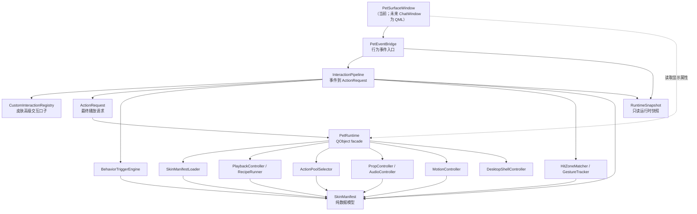
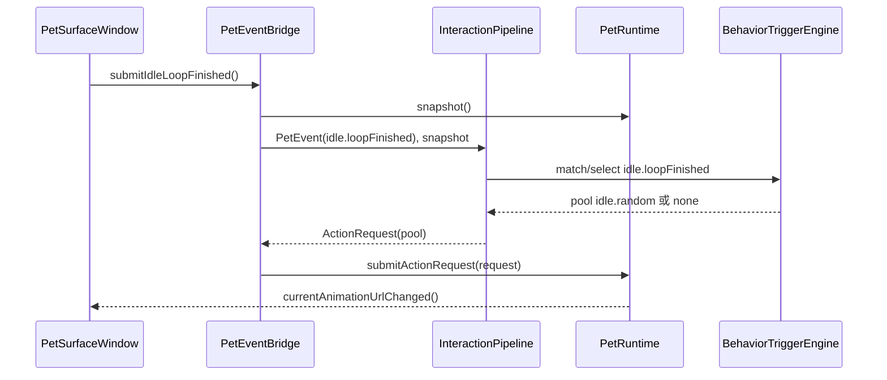
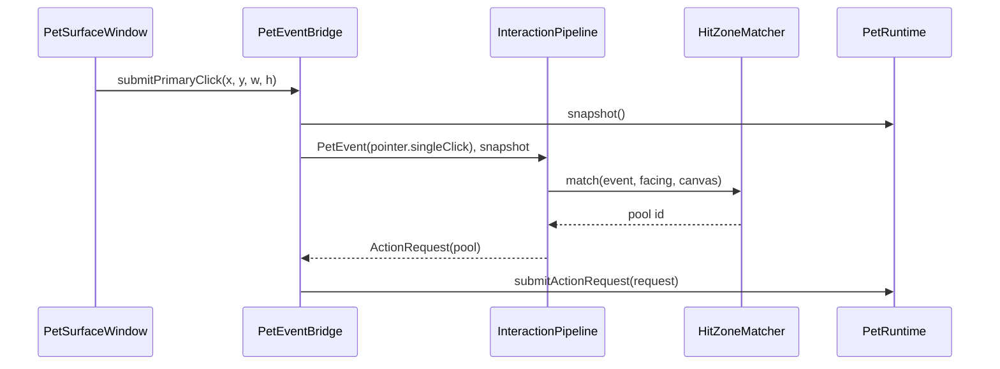
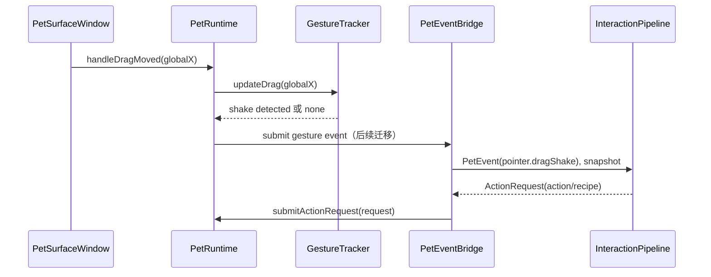

# 桌宠运行时职责拆分设计

本文档定义 v2 桌宠运行时的类边界、依赖方向和迁移顺序。它用于指导后续从当前单体 `PetRuntime` 迁移到可维护的运行时结构。

## 目标

当前 `PetRuntime` 已经承担了 manifest 解析、动作播放、交互判断、随机池、道具、音效、睡眠、喝茶、尺寸、拖拽晃动等多种职责。这个结构便于早期快速还原旧版手感，但不适合继续扩展换肤、AI 状态、工具权限和自定义高级交互。

拆分目标：

1. 保持现有 QML API 和旧版手感不变。
2. 把 manifest 数据、播放调度、交互识别、行为规则、道具副作用拆到独立类。
3. 每次迁移都能通过现有自动测试和运行时 smoke test。
4. 让普通换肤配置、Miles 官方皮肤维护和未来高级交互代码都有清晰落点。

## 非目标

本阶段不同时推进以下工作：

- 不重新设计旧版所有交互语义。
- 不接入聊天窗口或 Go sidecar。
- 不引入 JS/TS 高级交互执行环境。
- 不实现目标点路线规划。

这些内容会在 `PetRuntime` 职责边界稳定后分阶段推进。

## 当前问题

`apps/desktop/src/pet/PetRuntime.cpp` 当前混合了以下职责：

| 职责 | 当前表现 | 问题 |
| --- | --- | --- |
| QML facade | 暴露 `Q_PROPERTY`、`Q_INVOKABLE`、signals | 这部分必须保留在 QObject 层 |
| manifest 解析 | 直接读取 JSON 并填充内部 struct | 解析逻辑和运行逻辑耦合 |
| action / phase 播放 | `playActionInternal`、`playPhase` | 播放状态和业务入口混在一起 |
| recipe 执行 | `playRecipe`、`playNextRecipeStep` | 后续等待、条件、动态参数会继续膨胀 |
| action pool | 权重随机、语言覆盖 | 可独立测试，不需要依赖 QObject |
| behavior trigger | idle loop 触发 | 将来会覆盖更多运行时事件 |
| hit zone | rect / polygon 命中 | 属于交互匹配，不应留在播放运行时 |
| pointer interaction | 单击、双击、睡眠边界 | 应进入 InteractionPipeline |
| gesture | 拖拽晃动计数 | 应进入 GestureTracker |
| prop | 检察官徽章生成、点击、消失 | 应进入 PropController |
| audio | 音效选择、静音 | 应进入 AudioController 或播放请求层 |
| movement | walk/run delta、scale | 后续应进入 MotionController |

拆分时要避免一次性大改。当前代码虽然集中，但测试覆盖已经形成保护网。迁移应采用“小步抽取、行为等价”的方式。

## 目标结构

建议目录：

```text
apps/desktop/src/pet/
  PetRuntime.h
  PetRuntime.cpp

  manifest/
    SkinManifest.h
    SkinManifestLoader.h
    SkinManifestLoader.cpp

  playback/
    PlaybackController.h
    PlaybackController.cpp
    RecipeRunner.h
    RecipeRunner.cpp

  selection/
    ActionPoolSelector.h
    ActionPoolSelector.cpp

  events/
    PetEvent.h
    PetEventBridge.h
    PetEventBridge.cpp

  requests/
    ActionRequest.h

  runtime/
    RuntimeSnapshot.h

  behavior/
    BehaviorTriggerEngine.h
    BehaviorTriggerEngine.cpp

  interaction/
    InteractionPipeline.h
    InteractionPipeline.cpp
    CustomInteractionRegistry.h
    CustomInteractionRegistry.cpp
    HitZoneMatcher.h
    HitZoneMatcher.cpp
    GestureTracker.h
    GestureTracker.cpp

  effects/
    PropController.h
    PropController.cpp
    AudioController.h
    AudioController.cpp

  motion/
    MotionController.h
    MotionController.cpp
```

短期不要求一次创建全部目录。实际迁移按依赖最少、风险最低的顺序推进。

## 依赖方向



约束：

- 事件入口（`PetSurfaceWindow` / 未来 QML 窗口）必须先进入 `PetEventBridge`，再由 `InteractionPipeline` 转成 `ActionRequest`。
- `PetRuntime` 可以依赖播放、资源、音效、运动等 controller，但不直接承接鼠标、菜单、prop、idle 的业务判断。
- controller 可以依赖 `SkinManifest` 和运行时状态快照。
- controller 不直接依赖具体表现层（QWidget 或 QML）。
- controller 不直接调用 `DesktopShellController`，窗口移动仍通过 `PetRuntime` 或后续明确的 shell bridge。
- `SkinManifest` 是纯数据模型，不依赖 QObject。
- `SkinManifestLoader` 只负责解析和默认值填充，不执行业务逻辑。

## 类职责

### PetRuntime

`PetRuntime` 是运行时状态 facade 和播放执行入口。表现层（当前为 `PetSurfaceWindow`，未来聊天窗口可能为 QML）通过 `Q_PROPERTY` / Qt signals 读取显示属性，也可调用底层设置类接口；鼠标、菜单、prop、idle 等行为事件不直接进入 `PetRuntime`。

保留职责：

- 暴露 `Q_PROPERTY`，供表现层读取显示属性。
- 暴露动画播放完成、拖拽移动、尺寸、音频等暂未迁出的底层入口。
- 暴露 `snapshot()`，供交互层读取当前状态。
- 暴露 `submitActionRequest()`，执行交互层生成的最终播放请求。
- 聚合 controller，负责把 controller 的结果转换为 Qt signals。
- 维护少量当前状态，例如当前 action、phase、facing、recipe、sound、prop request serial。

移出职责：

- JSON 解析。
- 权重随机细节。
- hit zone 算法。
- 拖拽晃动计数。
- prop 轨迹计算。
- behavior trigger 条件匹配。
- recipe step 执行细节。
- 鼠标、菜单、prop、idle 等行为事件的业务判断。
- 皮肤定制命令，例如 Miles 的红茶。

目标状态下，`PetRuntime.cpp` 应主要由 getter、播放执行、状态更新和 signal emission 组成。

### PetEvent / PetEventBridge

`PetEvent` 描述“发生了什么”，不描述最终播什么。

第一批事件：

- `pointer.singleClick`
- `pointer.doubleClick`
- `menu.command`
- `idle.loopFinished`
- `prop.clicked`
- `prop.expired`

`PetEventBridge` 是行为事件入口。它负责把来自表现层的参数包装成 `PetEvent`，读取 `RuntimeSnapshot`，调用 `InteractionPipeline`，再把生成的 `ActionRequest` 提交给 `PetRuntime`。

> **当前实现**：`PetSurfaceWindow` 直接调用 `PetEventBridge` 的 C++ 方法。未来 QML 窗口通过 `App.PetEventBridge.*` singleton 调用，约束相同。

表现层约束：

- 行为入口只调用 `PetEventBridge`，不直接调用 `PetRuntime` 业务方法。
- 显示属性读取 `PetRuntime` 暴露的 `Q_PROPERTY`。
- 设置项可以暂时直连 `PetRuntime`，后续统一迁到 `SettingsController`。

### RuntimeSnapshot

`RuntimeSnapshot` 是交互层读取运行时状态的只读结构。

用途：

- 判断当前是否 sleeping。
- 判断当前 action / recipe / phase。
- 判断当前 facing 和 voiceLanguage。
- 读取当前 prop 的 clicked / expired recipe。

交互层不直接读取或修改 `PetRuntime` 私有成员，避免重新形成隐式大类耦合。

### ActionRequest

`ActionRequest` 描述“运行时最终要执行什么”。

当前种类：

- `ActionPool`
- `Recipe`
- `Action`
- `ReturnToIdle`
- `ToggleFacing`

`interruptHint` 只保留：

- `immediate`
- `afterCurrent`

复杂的拒绝、丢弃、权限判断、皮肤高级交互判断发生在 `InteractionPipeline` 或更上层，不能塞进 `PetRuntime` 播放执行逻辑。

### InteractionPipeline

`InteractionPipeline` 负责把 `PetEvent` 转成 `ActionRequest`。

当前职责：

- 单击：检查 pointer/sleep 状态，调用 `HitZoneMatcher`，输出 action pool 请求。
- 双击：根据 sleep/loop 状态决定唤醒或输出双击随机池请求。
- 菜单：先处理通用 sleep / return / facing 命令，再通过 `SkinCommandResolver` 解析皮肤命令。
- idle loop：调用 `BehaviorTriggerEngine` 读取 manifest trigger，再输出 action / recipe / pool 请求。
- prop：把 clicked / expired 事件转成 manifest 中的后续 recipe。

它不播放动画、不发 Qt signal、不直接操作 QML。

### CustomInteractionRegistry

`CustomInteractionRegistry` 是皮肤高级交互的过渡入口。

当前状态：

- 仅保留 `handleEvent()` 框架口子。
- 简单皮肤菜单命令不进入 Custom Interaction，而是由 manifest `skinCommands` 和 `SkinCommandResolver` 处理。

后续覆盖：

- 检察官徽章高级交互。
- 皮肤脚本或原生插件。
- 更复杂的 pre/post/default-flow 组合。

Custom Interaction 可以拦截事件，也可以选择继续默认逻辑。这个选择属于交互层，不属于 `PetRuntime`。

### SkinCommandResolver

`SkinCommandResolver` 负责把 manifest 中的简单皮肤命令转换为 `ActionRequest`。

当前覆盖：

- 读取 `manifest.skinCommands`。
- 根据 `enabledWhen.notAction` 判断菜单命令是否可用。
- 把 `pool` / `recipe` / `action` / `returnToIdle` / `toggleFacing` 请求转换为 `ActionRequest`。

约束：

- 不写死具体皮肤命令 id。
- 不执行脚本。
- 不管理 Prop、音频或副作用。
- 复杂交互留给后续 Custom Interaction。

### SkinManifest

`SkinManifest` 保存皮肤 manifest 的内存模型。

包含：

- `PhaseDefinition`
- `ActionDefinition`
- `RecipeDefinition`
- `ActionPoolDefinition`
- `BehaviorTriggerDefinition`
- `HitZoneDefinition`
- `PropDefinition`
- `SkinCommandDefinition`

它只表达数据，不执行播放、不读取文件、不发信号。

### SkinManifestLoader

`SkinManifestLoader` 负责从 qrc 或文件系统读取 manifest。

职责：

- 打开 manifest JSON。
- 解析 schema version、metadata、facings、movementDirections。
- 解析 actions、phases、recipes、actionPools、behaviorTriggers、hitZones、props、skinCommands。
- 处理旧字段兼容，例如 action 顶层 `animation`。
- 填充默认值。
- 解析失败时返回明确错误。

短期可以先保持宽松解析，避免影响当前 Miles manifest。后续再引入 schema 校验。

### PlaybackController

`PlaybackController` 负责当前主体动画播放。

职责：

- 播放 action。
- 播放 phase。
- 应用 action 播放后的 facing 变化。
- 处理一次性动作播完回 idle。
- 把当前 action / phase / animation url / loopMode / autoReturnToIdle 结果返回给 `PetRuntime`。

不负责：

- 点击事件。
- 随机选择哪个 action。
- 道具显示。
- 真实窗口移动。

### RecipeRunner

`RecipeRunner` 负责 recipe 时间线。

职责：

- 执行 recipe steps。
- 支持 action step、phase step、nested recipe step。
- 解析 step 里的 `$current`、`$opposite`。
- 发出 recipe 开始、下一步、完成结果。

后续可扩展：

- `durationMs`
- wait step
- condition step
- recipe params
- sideEffects

当前迁移时只抽出现有能力。

### ActionPoolSelector

`ActionPoolSelector` 负责 action pool 选择。

职责：

- 根据 pool id 和语言上下文选择具体 pool。
- 按 weight 抽取条目。
- 提供确定性测试入口。

输入：

```text
SkinManifest
poolId
voiceLanguage
randomSource
```

输出：

```text
ActionPoolEntry
```

它不播放 action，也不关心当前 QML 状态。

当前落地位置为 `apps/desktop/src/pet/selection/ActionPoolSelector.*`。它已经从 `PetRuntime` 中接管语言覆盖池解析和权重抽取逻辑。

### BehaviorTriggerEngine

`BehaviorTriggerEngine` 负责 behavior trigger 的条件匹配和结果抽取。

职责：

- 使用 `BehaviorTriggerContext` 表达当前运行时状态。
- 判断 trigger 的 `state`、`action`、`requiresNoActiveRecipe` 是否匹配。
- 按 weight 从 trigger entries 中抽取结果。

输入：

```text
BehaviorTriggerDefinition
BehaviorTriggerContext
randomValue
```

输出：

```text
BehaviorTriggerEntry
```

它不直接调用 `playAction()`、`playRecipe()` 或 `playActionFromPool()`。`PetRuntime` 收到 entry 后再把它转换成实际播放请求。

当前落地位置为 `apps/desktop/src/pet/behavior/BehaviorTriggerEngine.*`。`idle.loopFinished` 已经通过它执行 manifest 配置的 70/30 随机规则。

## 已落地迁移

### Phase 0.54 资源目录迁移

Miles 皮肤资源已经从仓库根目录迁入皮肤包：

```text
apps/desktop/resources/skins/miles-edgeworth/assets/
  body/
    idle/
    locomotion/
    gestures/
    interaction/
    menu/
    rest/
    startup/
  props/prosecutor_badge/
  audio/voice/
  audio/voice/legacy/
  source/
```

`pet_assets.qrc` 继续暴露稳定 alias，例如 `qrc:/pet/stand-right.gif`、`qrc:/pet/walk-east.gif`、`qrc:/audio/holdit0.wav`。运行时和 manifest 暂时不需要感知物理文件重命名。

### Phase 0.55 SkinManifest

`PhaseDefinition`、`ActionDefinition`、`RecipeDefinition`、`ActionPoolDefinition`、`BehaviorTriggerDefinition`、`HitZoneDefinition` 和 `PropDefinition` 已经移入 `SkinManifest.h`。

`PetRuntime` 当前持有：

```cpp
SkinManifest m_manifest;
```

后续 controller 读取皮肤配置时，应优先依赖 `SkinManifest`，避免把 schema 字段重新塞回 `PetRuntime`。

### Phase 0.56 Loader / Selector / Trigger Engine

已从 `PetRuntime` 中移出三类低耦合逻辑：

- `SkinManifestLoader`：读取 qrc manifest、解析 JSON、生成 fallback manifest。
- `ActionPoolSelector`：处理语言覆盖池和 action pool 权重抽取。
- `BehaviorTriggerEngine`：处理 behavior trigger 匹配和权重抽取。

`PetRuntime` 仍负责把 selector / engine 返回的纯数据结果转换为播放动作。播放状态机、拖拽晃动、Prop、Motion 和 Audio 尚未拆出。

职责：

- 根据 trigger id 查找规则。
- 检查 `when` 条件。
- 从 trigger entries 中按权重选择结果。
- 输出标准结果：none、pool、recipe、action。

它不接收 QML 事件，也不等同于事件层。`InteractionPipeline` 负责接收 `idle.loopFinished` 等事件，再调用 `BehaviorTriggerEngine` 读取 manifest 规则，最后生成 `ActionRequest`。

它不直接调用 `playActionFromPool()`。播放调用由 `PetRuntime::submitActionRequest()` 执行。

### HitZoneMatcher

`HitZoneMatcher` 负责点击坐标匹配。

职责：

- 把 QML 传入的窗口坐标归一化到皮肤 canvas 坐标。
- 根据当前 facing 选择 hit zone variant。
- 支持 rect。
- 支持 polygon。
- 后续支持 alpha mask。
- 按调用方传入的候选 zone 顺序返回第一个命中的 zone。

zone 与动作池的配对由 manifest 显式声明，`InteractionPipeline` 负责读取 `clickBehaviors` 并生成 `ActionRequest`：

```json
{
  "clickBehaviors": {
    "singleClick": [
      { "zone": "face", "pool": "click.face" },
      { "zone": "head", "pool": "click.head" }
    ]
  }
}
```

这样换肤作者可以自由定义区域和动作池，不需要遵循 Miles 的命名规则。

### InteractionPipeline

`InteractionPipeline` 负责把输入事件转换为行为请求。

输入来源：

- primary click
- double click
- menu action
- prop event
- agent event，后续阶段

职责：

- 检查 pointer interaction 是否允许。
- 处理睡眠态单击忽略、双击唤醒。
- 调用 `HitZoneMatcher` 匹配单击区域。
- 调用 `ActionPoolSelector` 或 `BehaviorTriggerEngine` 获取候选动作。
- 输出标准请求给 `PetRuntime`。

它不直接修改 QML 属性。

### GestureTracker

`GestureTracker` 负责手势识别。

短期覆盖：

- 拖拽晃动：1 秒内横向方向变化达到阈值。
- 拖拽释放时根据 hold 动画完成状态选择完整站起或快速站起。

长期扩展：

- 长按
- 甩动
- 快速点击
- 鼠标悬停

GestureTracker 输出“识别到什么手势”，具体播放哪个 recipe 由 InteractionPipeline 或 behavior rule 决定。

### PropController

`PropController` 负责道具生命周期。

短期覆盖：

- 检察官徽章 delay。
- 起点和终点偏移。
- scale 后的视觉尺寸。

职责：

- 从 manifest 读取 prop 定义。
- 根据 facing 和 scale 生成当前 `PropState`。
- 管理当前 prop 状态。
- 在 Prop 状态变化时发出信号，由 `PetRuntime` facade 暴露给 QML。

不负责：

- QML 动画绘制。
- 主体 action 播放。
- prop clicked / expired 后续动作选择；这属于 `InteractionPipeline` 或 Custom Interaction。

### AudioController

`AudioController` 负责声音请求。

职责：

- 根据 recipe 和 voiceLanguage 选择声音。
- 处理静音状态。
- 生成 sound request serial。

短期可以暂不单独抽取。它依赖的状态较少，适合在 `RecipeRunner` 和 `PetRuntime` 稳定后再迁移。

### MotionController

`MotionController` 负责移动策略。

短期覆盖：

- 根据当前 action / movementDirection 返回每帧 dx / dy。
- scale 后的移动速度。

长期覆盖：

- 自由游走。
- 目标点移动。
- 路线规划。
- 多屏边界策略。
- 移动方向到动画方向的映射。

当前 `DesktopShellController` 已负责窗口边界夹取。MotionController 不直接操作窗口，只输出运动意图。

## 关键流程

### 站立循环完成



### 单击分区



### 拖拽晃动



### 检察官徽章


## 迁移顺序

迁移遵循“先纯函数，后状态机；先低风险，后高耦合”的顺序。

### Phase 0.53：职责拆分设计

产物：

- 本文档。
- 后续实施计划。

验收：

- 文档明确类边界、依赖方向、迁移顺序和测试门槛。

### Phase 0.54：整理皮肤资源目录

目标：

- 把 GIF、音频、Prop 图片迁入 Miles 皮肤包 `assets/`。
- 保持 `qrc:/pet/*` 和 `qrc:/audio/*` 运行时 alias 不变。

约束：

- 不改运行时资源 URL。
- 不做 GIF 裁剪或 enter/loop/exit 资源派生。

测试：

- `check_phase_0_54_assets_layout`。

### Phase 0.55：抽出 SkinManifest

目标：

- 把 manifest struct 从 `PetRuntime.h` 移到 `manifest/SkinManifest.h`。
- `PetRuntime` 改为持有一个 `SkinManifest`。

约束：

- 不改 manifest JSON 结构。
- 不改 QML API。

测试：

- `check_phase_0_55_pet_runtime_manifest_split`。

### Phase 0.56：抽出 SkinManifestLoader、ActionPoolSelector 和 BehaviorTriggerEngine

目标：

- 把 manifest JSON 解析和 fallback manifest 移到 `SkinManifestLoader`。
- 把 pool 权重选择、语言覆盖和 behavior trigger 条件匹配从 `PetRuntime` 移出。
- 保留当时的播放行为和 QML 入口，后续由事件/request 主干收敛。

约束：

- `idle.loopFinished` 由 manifest 驱动的行为保持不变。
- 中文双击池覆盖保持不变。

测试：

- `check_phase_0_56_pet_runtime_service_split`。

### Phase 0.57：抽出 HitZoneMatcher

目标：

- 把 rect / polygon 命中、坐标归一化和单击优先级移出 `PetRuntime`。
- 单击命中逻辑由 `HitZoneMatcher` 负责，后续由 `InteractionPipeline` 调用。
- 暂时保留 `clickPool -> hitZone` 的内部映射，后续再迁到 manifest 显式配置。

约束：

- 现有所有单击分区行为保持。
- 左右朝向和 polygon 脸部区域保持。
- 不改 QML API 和 manifest schema。

测试：

- 保留 Phase 0.21、0.22、0.32、0.41。
- 新增 `check_phase_0_57_hit_zone_matcher`。

### Phase 0.58：清理菜单与定制交互边界

目标：

- 移除右键菜单中的开发测试入口。
- 移除 `PetRuntime` 暴露给 QML 的测试方法。
- 将 Miles 的红茶菜单从通用 Runtime API 收敛为皮肤定制命令。
- 保留睡眠作为通用 sleep/rest 能力。

约束：

- 喝茶、睡觉/唤醒和既有核心手感保持。
- 红茶只作为 Miles 皮肤命令存在，不提升为所有皮肤共有能力。
- 检察官徽章继续作为 Custom Interaction 的后续迁移对象。

测试：

- 保留 Phase 0.16、0.17、0.28、0.31。
- 新增 `check_phase_0_58_menu_custom_boundary`。

### Phase 0.59：建立事件到 ActionRequest 主干

目标：

- 新增 `PetEvent`、`ActionRequest` 和 `RuntimeSnapshot`。
- 新增 `PetEventBridge`，让 QML 行为入口只发送事件。
- 新增 `InteractionPipeline`，统一把 pointer、menu、idle、prop 事件转换为 `ActionRequest`。
- 新增 `CustomInteractionRegistry`，给后续检察官徽章高级流程和皮肤脚本留下交互入口。
- `PetRuntime` 通过 `submitActionRequest()` 执行最终播放请求。

约束：

- QML 不直接调用单击、双击、睡眠、idle、prop 的业务入口。
- `PetRuntime` 不承接单击、双击、菜单、prop 的业务判断。
- 启动入场、睡眠 enter/loop/exit、一次性动作回 idle、移动 follow-up 保持。

测试：

- 保留既有 Phase 0 静态检查和 `PetRuntimeSmoke`。
- 新增 `check_phase_0_59_event_action_request_spine`。

### Phase 0.60：清理框架边界

目标：

- 将简单皮肤菜单命令移入 manifest `skinCommands`。
- 新增 `SkinCommandResolver`，把 skin command 转换为 `ActionRequest`。
- 保持 `CustomInteractionRegistry` 为高级交互口子，不写死具体皮肤行为。

约束：

- 事件/request 主干保持不变。
- 皮肤命令 id 只能出现在皮肤 manifest、皮肤验证测试或用户文案里。
- 简单命令不执行脚本，不管理 Prop。

测试：

- 新增 `check_phase_0_60_framework_boundaries`。
- 保留 Phase 0.16、0.40、0.58、0.59。

### Phase 0.61：抽出 PropController

目标：

- 把 Prop 状态、delay、scale、travel 从 `PetRuntime` 迁入 `PropController`。
- `PetRuntime` 只组合 `PropController`，并向 QML 暴露当前 Prop 状态。
- QML 使用通用 prop 命名，避免把检察官徽章当成唯一道具类型。

约束：

- `Take that` 延迟飞出徽章。
- 点击徽章触发鞠躬。
- 自然消失触发捡徽章。
- 尺寸缩放保持。

测试：

- 新增 `check_phase_0_61_prop_controller_split`。
- 保留 Phase 0.14、0.30、0.43。

### Phase 0.62：接入窗口输入 Mask

目标：

- 新增 `WindowInputMaskController`。
- 根据当前主体动画首帧 alpha 生成窗口输入区域。
- 让透明留白点击穿透，保留非透明角色区域可点击。

约束：

- 输入 mask 属于窗口壳层能力，不改变语义 hit zone。
- 当前只使用首帧 alpha，逐帧 mask 留到后续评估。
- 不影响右键菜单、拖拽和 QML 动画显示。

测试：

- 新增 `check_phase_0_62_window_input_mask`。
- 保留 Phase 0.48、0.57。

### Phase 0.63：抽出 PlaybackController 和 RecipeRunner

目标：

- 把 action / phase / recipe 播放状态迁出。
- `PetRuntime` 只应用 controller 返回的播放结果并发信号。

约束：

- 事件/request 主干保持不变。
- 启动入场、睡眠 enter/loop/exit、一次性动作回 idle、移动 follow-up 保持。
- `playbackSerial` 语义保持。

测试：

- 保留 Phase 0.7、0.8、0.9、0.20、0.31、0.35、0.38。
- `PetRuntimeSmoke` 覆盖 startup、sleep、follow-up。

### Phase 0.64：抽出 GestureTracker

目标：

- 把拖拽晃动计数和释放分支迁出。

约束：

- 1 秒内横向方向变化阈值保持。
- 快速站起和完整站起分支保持。

测试：

- 保留 Phase 0.13、0.29。

> AudioController 适合在 recipe side effects 稳定后迁移；MotionController 应在路线规划和目标点移动前迁移，否则目标点移动会继续把移动策略塞进 `PetRuntime`。两者的进一步拆分计划合并进下面"Phase 1 收官路线"末尾的 Phase 0.74+，不再单独列阶段。

## Phase 1 收官路线：架构门禁 → 去定制化 → Custom Interaction → v1 回归 → Expression

Phase 0.65 之后的工作目标不再是把现存类拆得更细，而是把"还框架以通用形态"和"接入 v1 旧版手感"两件事按顺序做完，为 Phase 2 接 AI 聊天打底。整体路线分五段：

1. **架构门禁（0.65）**：在动 schema 与代码之前，先把"v2 框架代码 / 长期设计文档 / 既有静态测试"三者对齐。落地静态门禁脚本，把 `阶段记录/v1 手感回归与定制化接入.md` 第 2 节列出的硬编码点转写成可执行断言；清理 Phase 0.64 之后已经失效的静态断言。门禁脚本以 expected-fail 形态落地，后续每个 Phase 翻转对应断言来证明问题已解决。
2. **框架去定制化（0.66 – 0.69）**：把当前混进通用代码里的 Miles 名字（`sleep` / `briefcase_in` / `drag_crouch` / `walk.finished` / `idle_stand` / `voiceLanguage` / `120×100 canvas` 等）改成由 manifest 声明的字段，或通过通用事件 + behavior 规则表达。这一段保证 `PetRuntime` / `InteractionPipeline` / `HitZoneMatcher` / `PetSurfaceWindow` 不再出现皮肤专属字符串。其中 0.66 处理 ClickBehavior 配置化，0.67 处理 GestureTracker 拆分，0.68 处理 rest / startup / action.completed manifest 化，0.69 处理 canvas / sizes / surface 收尾。
3. **CustomInteraction Host API（0.70）**：把 `CustomInteractionRegistry` 从空壳改成可注册、可分发、可调用受控 Host API 的真实扩展点。Host API 形态以 `皮肤包播放行为设计.md` "Custom Interaction Host API" 一节为准。
4. **v1 旧版手感回归（0.71 – 0.72）**：以 CustomInteraction 形式接回当前临时下掉的 v1 玩法。第一批是"双击概率丢检察官徽章 → bow / pickup"，第二批是语音语言切换；不再把这些逻辑塞进 `InteractionPipeline` 或 `PetRuntime`。
5. **Expression schema 收尾（0.73）**：在接 Go sidecar 前，把 manifest 的 `expressions` / `expressionMappings` 字段补齐，并让 Pet Runtime 能消费 `agent.expressionRequested` 事件。这一步只搭好"模型选择 expression、运行时选择 action"的链路，真正接入由 Phase 2 完成。

PlaybackController / RecipeRunner / GestureTracker（完整版）/ MotionController / AudioController 的进一步拆分（即原 Phase 0.63 – 0.65 的内部 refactor）不阻塞这条主线。它们可以在 0.65 – 0.73 完成后或与 Phase 2 并行推进，按风险逐步推进。

### Phase 0.65：架构对齐与门禁

目标：

- 在 Phase 0.66 动手改 schema 与代码之前，先把"v2 框架代码 / 长期设计文档 / 既有静态测试"三者对齐。
- 给 `阶段记录/v1 手感回归与定制化接入.md` 第 2 节列出的框架内 Miles 硬编码点配上自动门禁脚本，后续每个 Phase 通过翻转对应断言来证明问题已解决。
- 清理 Phase 0.64 之后已经失效的静态断言，避免它们误导后续阶段。

主要工作：

1. **文档收敛**。`桌宠运行时与动画调度设计.md` §13 那份"当前差距清单"收敛成一句指针；详细 13 行表保持只放在 `阶段记录/v1 手感回归与定制化接入.md` 第 2 节。其他长期设计文档保持不动。

2. **架构门禁脚本**。新增 `apps/desktop/tests/check_phase_0_65_architecture_guardrails.cmake`（或在 `apps/desktop/tests/CMakeLists.txt` 中 `add_test`），用 CMake `execute_process` + `grep -F` 实现下列断言。每条断言在脚本里加注释，注明对应阶段记录第 2 节的条目编号（1 – 13）。

   ```text
   PetRuntime.cpp              不含 "sleep" / "briefcase_in" / "walk.finished" /
                                "run.finished" / "idle_stand" / "drag_crouch" /
                                "drag_stand_up_full" / "drag_stand_up_quick"
   HitZoneMatcher.cpp          不含 "click." 任意前缀字面量
   InteractionPipeline.cpp     不含 "doubleClick.random" / "sleep.enterLoopExit";
                                除 "runtime.*" 通用命令外不含皮肤命名
   PetSurfaceWindow.cpp        不含 "idle_stand" 字面量
   PetRuntime.h                不含 120.0 / 100.0 字面量
   ```

3. **断言初始状态**。Phase 0.65 提交时这些断言全部会失败，这是预期。把它们暂时标记为 `WILL_FAIL TRUE`（CMake `set_tests_properties`），让 CTest 不阻塞主线；后续 Phase 0.66 – 0.73 完成对应工作时，把 `WILL_FAIL` 翻转为正常断言。这样 CI 始终绿色，又能通过单条断言的开关状态读出剩余工作量。

4. **清理过时静态断言**。审查 `apps/desktop/tests/check_phase_0_*` 系列里所有引用 `PetWindow.qml` 旧菜单项的断言（"回到待机"、"切到朝左 / 朝右"、"语音语言"等已下掉的入口）。Phase 0.64 已经把这些项从原生菜单移除；现存断言要么删除，要么翻为"断言它们不存在"。`PetWindow.qml` 文件本体保留作为旧 QML 参考，但任何要求 `main.cpp` 加载它的断言要删除。

约束：

- 不改任何运行时代码。
- 不改 manifest schema。
- 不动 design doc 的长期 schema 设计（Click Behaviors 配对、CI Host API、Expression Mapping 仍按当前设计描述）。
- 门禁脚本不引入新依赖：用 CMake 自带的 `execute_process` + 系统 `grep`，不引入 Python、jq、Node 等。
- 阶段记录第 2 节的"收口 Phase"列必须和门禁脚本断言注释同步；以后只允许在两边一起改。

测试：

- 新增 `check_phase_0_65_architecture_guardrails`：装载并被 CTest 执行，13 条断言注释与阶段记录第 2 节一一对应；提交时全部以 `WILL_FAIL TRUE` 形式存在。
- 既有 Phase 0.* 静态检查全部通过（dead test 断言已清理）。
- 不需要新增冒烟测试。

### Phase 0.66：ClickBehavior 配置化

目标：

- 把单击和双击的"事件 → 动作池"映射从 C++ 写死改成 manifest 声明。`HitZoneMatcher` 只负责"点中了哪个 zone"，`InteractionPipeline` 负责"这个 zone 对应哪个 pool / recipe"。

主要工作：

1. manifest schema 升级：
   ```json
   "clickBehaviors": {
     "singleClick": [
       { "zone": "face", "pool": "click.face" },
       { "zone": "head", "pool": "click.head" }
     ],
     "doubleClick": [
       { "when": "default", "pool": "doubleClick.random" }
     ]
   }
   ```
   `singleClick` 是 `[{zone, pool}]` 配对列表；`doubleClick` 是 `[{when, pool|recipe|action|customInteraction}]` 列表。`when` 默认仅支持 `"default"`；`customInteraction` 字段为 Phase 0.71 预留，本阶段 loader 只验证存在不报错。
2. `SkinManifestLoader` 解析升级后的 `clickBehaviors`；每个 `singleClick.zone` 必须在 `hitZones` 中存在。当前 v2 仍处于内部 schema 成型期，不保留旧的字符串列表写法。
3. `HitZoneMatcher::hitZoneIdForPoint()` 只返回命中的 zone；`InteractionPipeline` 再按 manifest `clickBehaviors.singleClick` 把 zone 转成 pool / recipe / action 请求。删除 `hitZoneIdForClickPool()` 这个写死 switch。
4. `InteractionPipeline` 中双击分支用 manifest `clickBehaviors.doubleClick` 选第一条可用入口，不再调用 `actionPool("doubleClick.random")`。

约束：

- 旧版单击 9 区分区命中、左右朝向 polygon、双击随机动作池手感保持。
- `HitZoneMatcher.cpp` 中不出现 `click.` 任意前缀字面量。
- `InteractionPipeline.cpp` 中不出现 `doubleClick.random`。
- 检察官徽章在 Phase 0.71 接回，本阶段不动。

测试：

- 保留 Phase 0.21、0.22、0.32（单击命中、polygon face、双击）。
- 新增 `check_phase_0_66_click_behavior_pairing`：断言 `HitZoneMatcher.cpp` 不含 `click.` 前缀字面量；断言 manifest 中 `clickBehaviors.singleClick` 是配对结构而非 pool id 列表。
- Phase 0.65 门禁脚本中"HitZoneMatcher 不含 click.*"和"InteractionPipeline 不含 doubleClick.random"两条断言翻为正常断言（去掉 `WILL_FAIL`）。

### Phase 0.67：GestureTracker 拆分

目标：

- 把拖拽相关的状态机（方向反转计数、hold 完成度）从 `PetRuntime` 移出，做成独立的 `GestureTracker`。
- `PetRuntime` 不再持有任何 drag 状态字段；Miles 专属的 drag action id 只出现在 manifest。

主要工作：

1. 新增 `apps/desktop/src/pet/interaction/GestureTracker.h / .cpp`。Tracker 持有：
   ```text
   m_dragShakeClock
   m_dragShakeX
   m_dragShakeDirection
   m_dragShakeTurns
   m_dragShakeTracking
   m_dragHoldAnimationCompleted
   ```
2. `PetSurfaceWindow` 把鼠标按下 / 移动 / 松开 / hold 动画完成的原始信号交给 `PetEventBridge`，再由 Bridge 调度到 GestureTracker。Bridge 在 tracker 识别出手势时发出：
   ```text
   pointer.dragShake
   pointer.dragHoldCompleted
   pointer.dragReleased
   ```
3. `InteractionPipeline` 增加 `pointer.dragShake` / `pointer.dragReleased` 分支：查 manifest `behaviorRules` 选择 action。Miles manifest 声明：
   ```json
   "behaviorRules": [
     { "event": "pointer.dragShake", "action": "drag_crouch" },
     {
       "event": "pointer.dragReleased",
       "when": { "action": "drag_crouch", "holdCompleted": true },
       "action": "drag_stand_up_full"
     },
     {
       "event": "pointer.dragReleased",
       "when": { "action": "drag_crouch", "holdCompleted": false },
       "action": "drag_stand_up_quick"
     }
   ]
   ```
4. `PetRuntime::handleDragStarted` / `handleDragMoved` / `handleDragEnded` / `handleHoldAnimationReachedEnd` 删除；QML 不再调用这些入口。`m_dragShake*` 与 `m_dragHoldAnimationCompleted` 字段从 `PetRuntime.h` 删除。

约束：

- 旧版"1 秒内 5 次方向反转触发蹲下，hold 完成与否决定 standup 分支"的手感保持。
- `PetRuntime.h` 不出现 `m_dragShake*` / `m_dragHoldAnimationCompleted` 字段。
- `PetRuntime.cpp` 不出现 `drag_crouch` / `drag_stand_up_full` / `drag_stand_up_quick` 字面量。
- Miles 专属 action id 只出现在 manifest 配置；GestureTracker 不知道任何皮肤命名。

测试：

- 保留 Phase 0.13、0.29。
- 新增 `check_phase_0_67_gesture_tracker_extracted`：断言 `apps/desktop/src/pet/interaction/GestureTracker.*` 文件存在；断言 `PetRuntime.h` 不含上述 drag 字段名。
- Phase 0.65 门禁脚本中关于 `drag_crouch` / `drag_stand_up_*` 的断言翻为正常断言。

### Phase 0.68：通用 rest capability + 启动 / 续接 / 朝向迁入 manifest

目标：

- 新增 `manifest.capabilities.rest = { enterRecipe, exitRecipe, loopAction }`。`PetRuntime::sleeping()` / `sleepTransitioning()` 改为读取该字段，不再用字符串 `"sleep"` 比较。`InteractionPipeline` 处理 `runtime.sleep.toggle` 时也只引用 capability 字段。
- 新增 `manifest.behaviorTriggers.runtime.started`。当前 `PetRuntime::startStartupSequence()` 改为发 `runtime.started` 事件，由 InteractionPipeline 按 trigger 选择 recipe。
- 新增 `manifest.behaviorTriggers.action.completed`。当前 `PetRuntime::followUpPoolForCompletedAction()` 改为发 `action.completed` 事件并由 trigger 选择续接动作；运行时不再写死 `walk → walk.finished` / `run → run.finished` 等映射。
- 新增 `manifest.movementFacingMap`：把 movementDirection 量化成 facing 的关系写到皮肤里，`updateFacingFromMovementDirection()` 改为通用查表。
- action 增加 `blocksPointerInteraction: bool` 字段；`acceptsPointerInteraction()` 改为查 action 而不是匹配 `briefcase_in` 字符串。

约束：

- Miles 启动入场、睡眠 enter/loop/exit、唤醒、走/跑续接、转身朝向的手感保持。
- `PetRuntime.cpp` 中不再出现任何 Miles action id 字面量。
- 不引入新的 capability 时，皮肤可不声明 `restAction` 字段；此时 sleep 通用菜单项不生成。

测试：

- 保留 Phase 0.7、0.9、0.45、0.46。
- 新增 `check_phase_0_68_runtime_decoupling`：扫描 `PetRuntime.cpp` 不出现 `"sleep"` / `"briefcase_in"` / `"walk.finished"` / `"run.finished"` / `"idle_stand"` 字符串。
- Phase 0.65 门禁脚本中关于上述字面量的断言翻为正常断言。

### Phase 0.69：canvas / pet size / surface 收尾

目标：

- 新增 `manifest.canvas = { window, image }`。`PetRuntime::petWindowSize()` / `petImageSize()` 改为读取该字段。Miles 写 `{ window: 240, image: 240 }`。
- 新增 `manifest.sizes = [{id, label, scale}]`。`PetRuntime::setPetSize()` 不再硬编码 mini/small/medium/big，菜单条目也由 manifest 动态生成。
- 把 `voiceLanguage` 状态和 jp/en/zh 校验从 `PetRuntime` 中删除。当前 `recipe.soundUrls` 的语言选择临时回退到 manifest 声明的 `audio.defaultVoiceLanguage` 或第一个可用语言；完整语言菜单留到 Phase 0.72。
- `PetSurfaceWindow::handleMovieFrameChanged()` 中 `currentActionId == "idle_stand"` 的 idleLoop 判定改为基于 `manifest.idleStandAction` 字段（或 action.category == "idle" + manifest 显式 opt-in）。

约束：

- "迷你 / 小 / 中 / 大"四档继续在 Miles manifest 中声明，菜单显示和缩放手感保持。
- 静音菜单不受影响。

测试：

- 保留 Phase 0.46、0.47、0.50。
- 新增 `check_phase_0_69_canvas_and_size_externalised`：扫描 `PetRuntime.h` 不再出现 `120.0` / `100.0` 字面量，`PetSurfaceWindow.cpp` 不出现 `"idle_stand"` 字面量。
- Phase 0.65 门禁脚本中相关断言翻为正常断言。

### Phase 0.70：CustomInteractionRegistry Host API 落地

目标：

- 设计 `CustomInteractionHandler` 接口与 `HostApi`，详细 spec 以 `皮肤包播放行为设计.md` 的 "Custom Interaction Host API" 章节为准。Phase 0.70 仅落实接口和注册表。
- `CustomInteractionRegistry` 从静态空壳改成持有多个 handler 实例，按注册顺序分发事件，并支持 `continueDefault` / `stopPropagation`。
- Host API 第一版至少暴露：`emitAction(actionId)` / `emitRecipe(recipeId)` / `emitPool(poolId)` / `spawnProp(propId, overrides)` / `playSound(url)` / `random()` / `scheduleAfter(delayMs, callback)` / `snapshot()` / `manifestConfig(handlerId)` / 每个 handler 自带的 `setState(key, value)` / `getState(key)` 内存 KV / `skipDefault()` / `stopPropagation()`。
- main.cpp 在初始化时把所有皮肤包内置 CI 注册进 registry；皮肤未声明 CI 时 registry 行为与现状等价。
- 提供一个最简观察型 CI（不影响默认逻辑）作为 API 形态验收用例。

约束：

- Host API 不暴露 `PetRuntime*` 或 manifest 写权限；CI 只能通过 emit/spawn/playSound 等动词改动状态。
- Host API 语义层保持语言无关（值类型 / 不可变快照），为未来 JS adapter 留下空间；约束细节见 `皮肤包播放行为设计.md` "Host API 语言无关设计原则"。
- handler 抛出异常 / panic 不应破坏运行时；registry 必须捕获错误并 fallback 到默认逻辑。
- registry 当前同步执行 handler；异步副作用通过 Host API 的 `scheduleAfter` 注入下一帧或 Timer，不允许 handler 自行启动线程。

测试：

- 新增 `check_phase_0_70_custom_interaction_host_api`：注册"什么都不做"的 CI 后，单击 / 双击 / 菜单 / idle / Prop 五类事件的默认行为完全等价。
- 新增样例 CI 单元测试，验证 `continueDefault=false` 时默认逻辑被跳过。

### Phase 0.71：双击概率 "看招" via CustomInteraction

目标：

- 新增 `ProsecutorBadgeInteraction`（路径 `apps/desktop/src/skins/miles-edgeworth/interactions/`），订阅 `pointer.doubleClick` / `prop.clicked` / `prop.expired` 三类事件。
- handler 内部状态机：双击触发时按概率（来自 manifest 的 `customInteractionConfig.prosecutor_badge.takeThatProbability`）决定是否走"看招"：触发时 `emitAction("objecting")` + `spawnProp("prosecutor_badge", { delayMs })`；不命中则 `continueDefault = true`，把双击交回 manifest 默认 behavior rule。
- `prop.clicked` → handler 内部决定播 `bow` recipe；`prop.expired` → handler 内部决定播 `pickup` recipe。`PropController` 仍负责视觉生命周期，handler 只发出请求。
- `InteractionPipeline` 不直接出现 prosecutor / take-that 相关字符串；只通过 `customInteractions` 列表分发事件。

约束：

- 旧版"看招"手感保持：异议动作开始 → 徽章延迟飞出 → 点击立即接 bow → 自然消失接 pickup。
- handler 不直接访问 `PetRuntime` 或 `PropController` 私有成员，只通过 Host API。
- 概率字段写在 manifest（不是 handler 代码常量），方便后续调整或换皮肤复用同款 CI。

测试：

- 新增 `check_phase_0_71_prosecutor_badge_interaction`：使用确定性随机数源覆盖概率两分支；验证 bow / pickup 路径仍走 manifest recipe。
- 手动检查：连续双击不会让徽章重叠或卡住流程。

### Phase 0.72：语音语言作为可选 Audio Capability

目标：

- 新增 `manifest.audio.voiceLanguages` 和 `manifest.audio.defaultVoiceLanguage` 字段；皮肤可选声明。
- 新增 `AudioController`（位置 `apps/desktop/src/pet/effects/AudioController.*`）：持有当前语言、静音、音量；接收 manifest recipe.soundUrls + 当前语言选择资源；通过 `PetRuntime` signal 暴露给 surface。
- `PetContextMenu` 根据 `manifest.audio.voiceLanguages` 动态生成"语音"子菜单；皮肤未声明时不出现该入口。
- Miles 默认声明 `["jp", "en", "zh"]` 与 `defaultVoiceLanguage = "jp"`，使用既有的 `audio/voice/` 与 `audio/voice/legacy/` 资源。

约束：

- 其他皮肤可以完全不声明 audio capability；运行时不报错，菜单不显示语言入口。
- 静音、音量与 voiceLanguage 解耦：静音不影响当前语言选择。

测试：

- 新增 `check_phase_0_72_audio_capability`：验证 `PetRuntime` 不再含 `voiceLanguage` / `jp/en/zh` 字面量；菜单仅在 manifest 声明语言时出现"语音"子菜单。

### Phase 0.73：Phase 1 收官 — ExpressionMapping schema

目标：

- 在 manifest 引入 `expressions = [{ id, label, description, allowedStates, priority }]` 和 `expressionMappings = { tagId: { selection, fallback, actions: [{action|recipe, weight, allowedStates}] } }`，详细规则按 `桌宠运行时与动画调度设计.md` 第 3 节 / 第 11 节。
- `PetEvent` 新增 `AgentExpressionRequested`（载荷：state, expression, randomValue）。Phase 1 仅用作本地调试入口。
- `InteractionPipeline` 增加分支：按当前 state + expression mapping 选择 ActionRequest；selection 策略 MVP 实现 `first_available` 与 `weighted_random`。
- `PetRuntime` 暴露 `Q_INVOKABLE requestExpression(state, expression)`；QML 右键菜单短期不需要增加入口，主要给 Phase 2 Go sidecar 使用。
- Miles manifest 至少声明 `neutral` 表达和 1 – 2 个真实标签（例如 `objection`、`polite`），完成端到端验收。

约束：

- 未知 expression 一律降级为 `neutral`；不允许抛错或阻塞。
- expression 路径不取代 manifest 的 behavior rule 与 CI；它只是另一种"输入源"。
- Phase 1 不联通 Go sidecar；Phase 2 接入时直接复用 `requestExpression`。

测试：

- 新增 `check_phase_0_73_expression_mapping`：验证 manifest schemaVersion 升级；解析 expressions / expressionMappings；selection 策略行为；fallback 链路。

### Phase 0.74+：剩余 controller 拆分

PlaybackController / RecipeRunner / GestureTracker（完整版，含长按 / 甩动 / 悬停）/ MotionController / AudioController 的进一步内部拆分仍在工作列表内，可与 Phase 2 并行推进。原 Phase 0.63 / 0.64 / 0.65 的目标保持不变，但顺序与时机可依据当前实际复杂度灵活调整。

## 测试门槛

每个拆分类 PR 或 commit 必须满足：

```bash
cmake -S . -B build -G Ninja -DCMAKE_PREFIX_PATH=/opt/homebrew
cmake --build build
ctest --test-dir build --output-on-failure
/opt/homebrew/bin/qmllint -I build/apps/desktop -I /opt/homebrew/share/qt/qml apps/desktop/qml/PetWindow.qml
git diff --check
```

涉及 QML 或窗口行为时，还要执行本地启动冒烟：

```bash
pkill -f MilesEdgeworthDesktop || true
open build/apps/desktop/MilesEdgeworthDesktop.app
sleep 2
pgrep -fl MilesEdgeworthDesktop
pkill -f MilesEdgeworthDesktop || true
```

## 判断拆分是否成功

可接受状态：

- `PetRuntime` 仍是 QML 可读状态和最终播放执行入口。
- QML 行为事件先进入 `PetEventBridge`，再由 `InteractionPipeline` 转成 `ActionRequest`。
- `PetRuntime` 内保留状态同步和 signal emission。
- controller 以小类形式存在，可以单独读懂。
- 当前旧版核心手感测试继续通过。

不可接受状态：

- 拆分后 controller 之间互相循环依赖。
- controller 直接依赖 QML。
- 为了拆分删除旧版手感。
- 为了抽象提前实现未验证的大型事件总线。
- 把所有 controller 都做成 QObject，并通过信号互相调用，导致调试链路更复杂。

## 文档维护规则

- 本文维护运行时类边界和拆分顺序。
- `桌宠运行时与动画调度设计.md` 维护状态、调度和 AI/Agent 接入的概念模型。
- `皮肤包播放行为设计.md` 维护皮肤包、素材、Action、Recipe、BehaviorRule、Custom Interaction 的 schema 设计。
- 阶段性实现细节和验证记录放入 `阶段记录/第0阶段桌面壳验证.md`。
- 文档出现冲突时，以更贴近代码职责的文档为准；之后同步修正其它文档。
