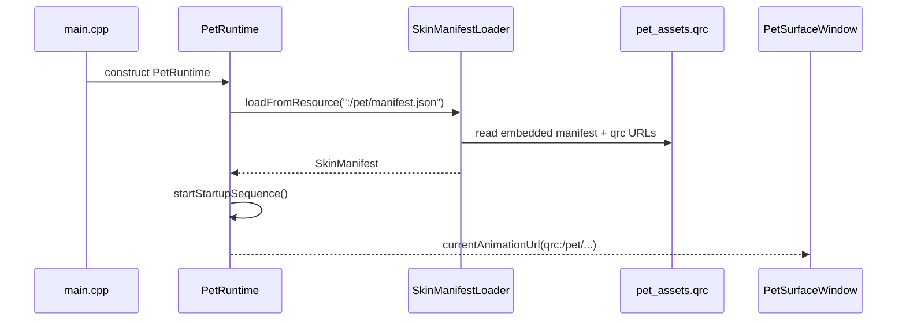
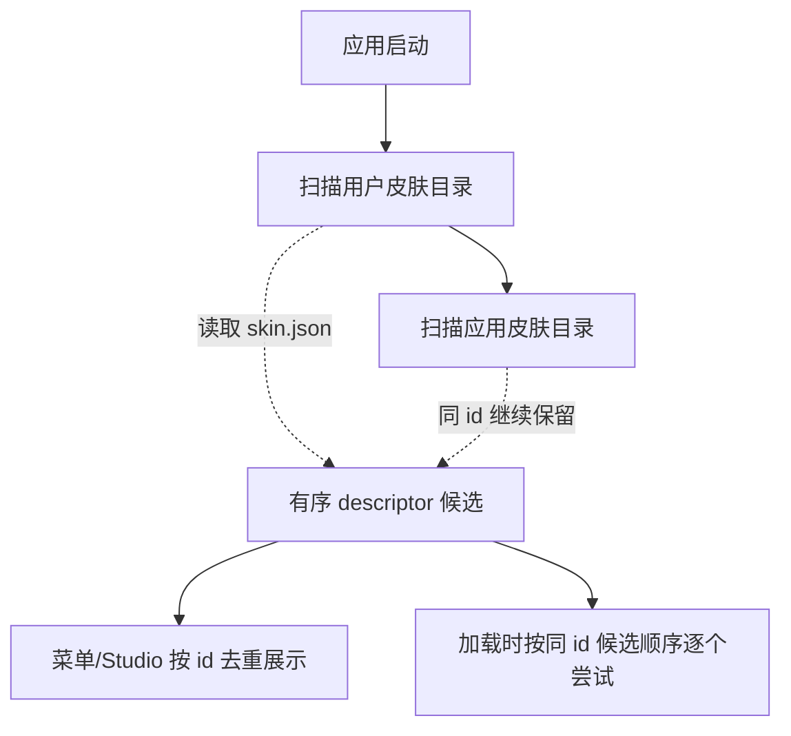
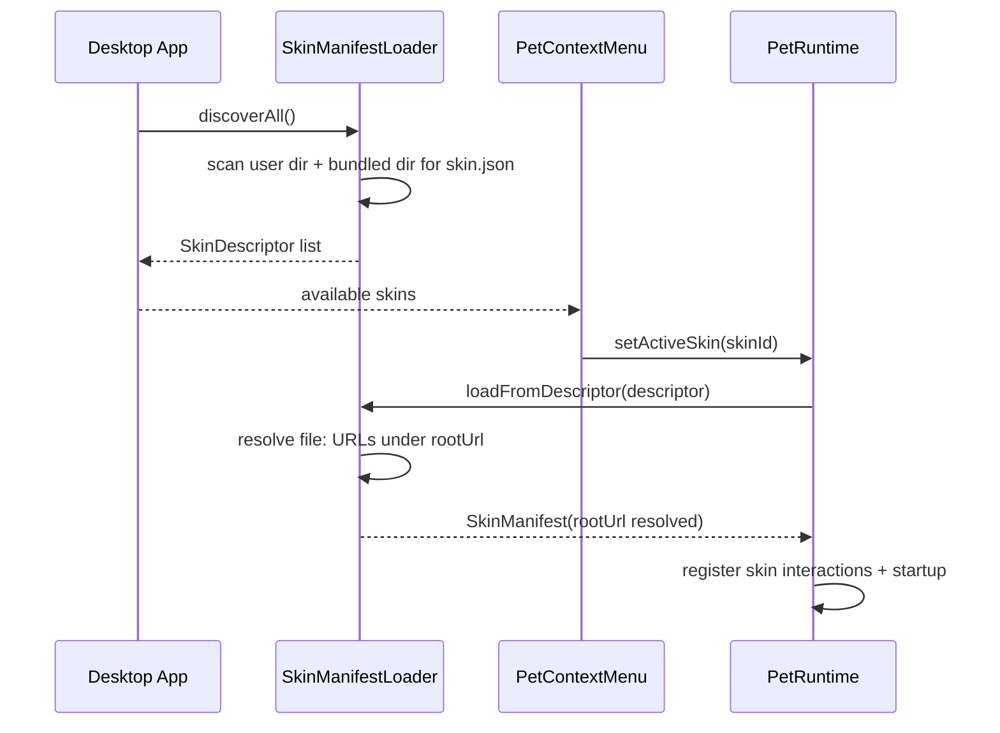
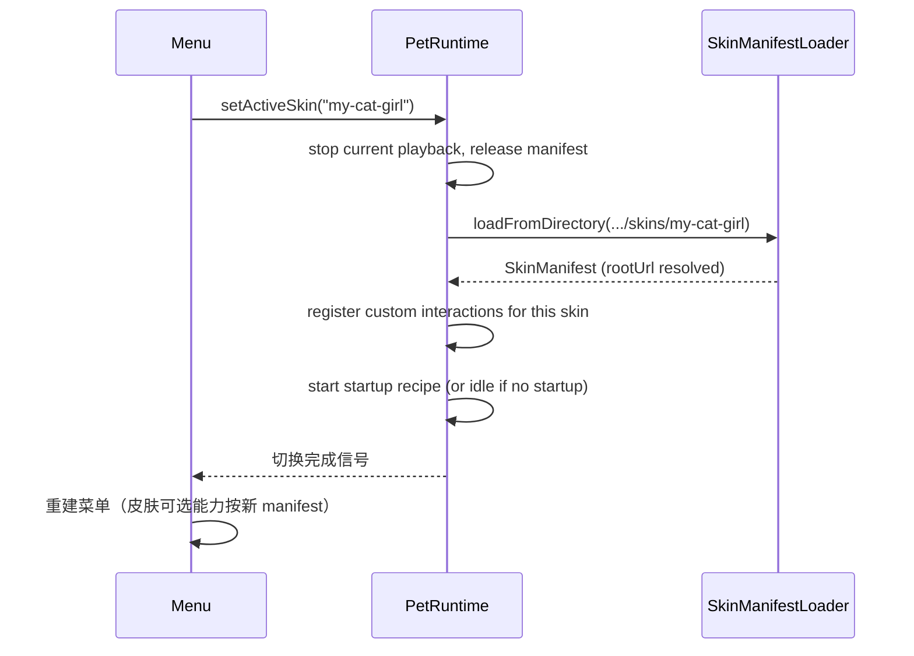

# 皮肤包分发与加载机制设计

本文定义皮肤包在磁盘上的组织格式、应用如何发现并加载它们、以及如何让最终用户在不接触 C++/Qt 编译环境的前提下完成换皮肤。

相关文档：
- 数据模型：[皮肤包播放行为设计](皮肤包播放行为设计.md)
- 编辑工具：[Pet Skin Studio 工具设计](Pet%20Skin%20Studio%20工具设计.md)（待补充）
- 整体架构：[总体架构设计](总体架构设计.md) §9 / §9.x

---

## 1. 背景与目标

### 1.1 改造前状态

改造前，MilesEdgeworth 的所有皮肤资源都通过 Qt Resource System 编进二进制：

```
apps/desktop/resources/skins/miles-edgeworth/
  manifest.json
  body/idle/stand.gif
  ...

→ 编译期通过 qrc 嵌入
→ 运行时 manifest 通过 :/pet/manifest.json 读取
→ 动画 / 音频通过 qrc:/pet/... 和 qrc:/audio/... alias 访问
```

后果：

- 换皮肤需要安装完整的 C++/Qt 开发环境，clone 仓库，加资源，重新编译
- 第三方皮肤无法分发——只能通过 fork 仓库实现
- Studio 编辑后即使写回 manifest.json，运行时也读不到（仍读编译时的快照）

改造前实际加载链路：



### 1.2 目标

1. **非开发者可换皮肤**：把皮肤文件夹丢到一个目录就能用，无需任何编译工具
2. **所有皮肤统一加载逻辑**：官方 Miles 以目录形式随应用分发，物理位置和用户皮肤不同（见 §3.1），但 loader 用同一套代码发现、解析和加载它们，不因皮肤身份走不同分支
3. **不通过 Qt Resource System（qrc）嵌入皮肤资源**：所有皮肤资源均通过文件系统加载
4. **皮肤包的资源 URL 可移植**：同一份 manifest 拷到不同位置都能加载
5. **为后续 zip 打包、签名校验、版本约束等留出 schema 接口**

### 1.3 非目标

- 不实现皮肤的远程市场 / 分发渠道
- 不引入皮肤代码（JS/TS）执行——Custom Interaction 仍只支持内置 C++ handler
- 不做皮肤的资产 DRM / 加密

---

## 2. 皮肤包结构

每个皮肤包是一个目录，内容如下：

```
my-skin/                         ← 目录名仅作 hint；真实 id 来自 skin.json
  skin.json                      ← 皮肤元信息（必须）
  manifest.json                  ← 行为与素材声明（必须，schema 见《皮肤包播放行为设计》）
  assets/
    body/
      idle/
        stand.gif
      gestures/
      ...
    props/
      ...
    audio/
      ...
  generated/
    clips/                       ← 预切 GIF 片段（manifest 中声明的 clip 必须在此存在）
      bow.gif
      ...
  README.md                      ← 可选
  LICENSE                        ← 可选
```

### 2.1 `skin.json`：元信息层

`skin.json` 是从 manifest.json 分出来的薄壳，保存"加载前需要知道的信息"——这样应用可以在扫描阶段只读 skin.json 列出可用皮肤，等用户真的选中才读完整的 manifest.json。

```json
{
  "id": "miles-edgeworth",
  "name": "御剑怜侍",
  "version": "1.0.0",
  "author": "tiantian",
  "license": "CC-BY-NC-4.0",
  "skinSchemaVersion": 1,
  "minAppVersion": "0.7",
  "thumbnail": "file:assets/body/idle/stand.gif"
}
```

| 字段 | 必填 | 说明 |
| --- | --- | --- |
| `id` | ✅ | 全局唯一的皮肤标识，建议 `kebab-case`；用户配置（如"上次选的皮肤"）按此 id 持久化 |
| `name` | ✅ | 显示名，菜单和 Studio 展示 |
| `version` | ✅ | semver 字符串；后续支持升级提示时使用 |
| `skinSchemaVersion` | ✅ | `skin.json` 自身的 schema 版本号；loader 不支持的版本拒绝加载 |
| `minAppVersion` | 推荐 | 该皮肤需要的最低桌宠应用版本 |
| `thumbnail` | 可选 | 菜单缩略图（`file:` URL，见 §3.2） |
| `author` / `license` | 可选 | 显示用 |

### 2.2 为什么不把元信息塞进 manifest.json

两者职责不同：

| | `skin.json` | `manifest.json` |
| --- | --- | --- |
| 何时读 | 应用启动时扫描所有皮肤 | 用户选中某皮肤时加载 |
| 大小 | 极小（< 1KB） | 中等（10KB+） |
| 变化频率 | 低（皮肤元信息基本不动） | 高（编辑动作 / hit zone 时频繁改） |

扫描阶段只读 skin.json，能让"启动菜单列出 100 个皮肤"也是常数级开销。

---

## 3. 发现与加载

### 3.1 皮肤搜索路径

应用启动时扫描两个皮肤目录。扫描阶段只读取 `skin.json`，并保留同 id 的有序候选；菜单/Studio 展示时同 id 只显示先发现的那个；真正加载时如果先发现的候选 manifest 无效或资源不可用，会继续尝试后续同 id 候选。



| 优先级 | 路径 | 放什么 | 更新 app 时 |
| --- | --- | --- | --- |
| 1 | `<AppDataLocation>/skins/` | 用户自制/安装的皮肤 | 不受影响 |
| 2 | `<applicationDirPath()>/skins/` | 随应用分发的皮肤（如 Miles） | 随 app 一起被覆盖 |

拆成两个目录的原因是**生存周期不同**：应用目录里的东西随 app 更新被覆盖，用户目录里的东西不受影响。两个目录里的皮肤格式相同，loader 用同一套代码扫描和加载，不区分皮肤来自哪个目录。同 id 时用户目录优先展示，这样用户可以在不改动官方 Miles 的情况下用自己的版本覆盖它；如果用户目录里的同 id 皮肤加载失败，runtime 会继续尝试应用目录里的候选，避免损坏皮肤把随包皮肤永久遮住。

右键菜单"打开皮肤目录"打开用户皮肤目录——这是用户安装和创建皮肤的地方。

跨平台应用皮肤目录（随 app 分发）：

- macOS：`MyApp.app/Contents/MacOS/skins/`
- Windows：`<exe 所在目录>\skins\`
- Linux：`<binary 所在目录>/skins/`

跨平台用户皮肤目录（用户自制/安装）：

- macOS：`~/Library/Application Support/MilesEdgeworth/skins/`
- Windows：`%APPDATA%\MilesEdgeworth\skins\`
- Linux：`~/.local/share/MilesEdgeworth/skins/`

加载链路：



### 3.2 `file:` URL Scheme

manifest 内引用资源时**只用 `file:` 前缀**，由 loader 在加载阶段统一解析为绝对 URL：

```json
{
  "actions": {
    "idle_stand": {
      "variants": {
        "right": { "clip": "file:assets/body/idle/stand_right.gif" },
        "left":  { "clip": "file:assets/body/idle/stand_left.gif" }
      }
    }
  },
  "props": {
    "prosecutor_badge": {
      "asset": "file:assets/props/prosecutor_badge.png"
    }
  }
}
```

loader 加载 manifest 后立即把所有 `file:` URL 替换为绝对 URL（避免运行时每次播放都重复解析）：

```
file:assets/body/foo.gif  →  file:///.../MacOS/skins/miles-edgeworth/assets/body/foo.gif
file:assets/body/foo.gif  →  file:///.../MacOS/skins/my-custom-skin/assets/body/foo.gif
```

所有皮肤统一使用 `file:` scheme，不再使用 `qrc:` 引用。

### 3.3 `generated/clips/` 生成契约

`clips` section 中定义的帧段必须由构建脚本预切分为独立完整 GIF，输出到皮肤包的 `generated/clips/` 目录。运行时只播放完整 GIF，不在运行时做帧段截取。

| 皮肤类型 | 生成时机 | 说明 |
| --- | --- | --- |
| 随包皮肤（如 Miles） | 构建/打包阶段 | 切分脚本输出到 `skins/.../generated/clips/`，随应用一起分发 |
| 用户皮肤（文件系统） | 皮肤分发前，由皮肤作者执行 | 皮肤目录必须包含完整的 `generated/clips/`，运行时不触发生成 |

Loader 行为约束：

- 若某个 clip 引用的 `generated/clips/{name}.gif` 不存在，loader 必须以明确错误拒绝加载，**不做静默降级**。降级会掩盖缺失产物、导致运行时崩溃或空白动画。
- 构建脚本在每次重新生成前应清空 `generated/clips/` 目录，避免陈旧产物被误用。
- `generated/` 目录不应纳入版本控制（加入 `.gitignore`）；由构建步骤或皮肤作者按需重新生成。

### 3.4 Loader 接口

```cpp
class SkinManifestLoader {
public:
    static SkinManifest loadFromDescriptor(const SkinDescriptor &descriptor);
    static SkinManifest loadFromDirectory(const QString &filesystemPath);
    static SkinManifest fallbackManifest();

    static QList<SkinDescriptor> discoverAll();
    static QString userSkinDirectoryPath();
    static QString appSkinDirectoryPath();

    static QUrl resolveSkinUrl(const QString &rawUrl, const QUrl &rootUrl);
};

struct SkinDescriptor {
    QString id;
    QString name;
    QString version;
    QUrl rootUrl;          // file:///.../skins/miles-edgeworth/
    QString manifestPath;  // /absolute/path/to/manifest.json
    QUrl thumbnailUrl;
};
```

`userSkinDirectoryPath()` 返回用户皮肤目录（`AppDataLocation + "/skins"`），`appSkinDirectoryPath()` 返回应用皮肤目录（`applicationDirPath() + "/skins"`）。`discoverAll()` 先扫用户目录再扫应用目录，返回有序 descriptor 候选；UI 展示层按 id 去重，加载层按同 id 候选顺序逐个尝试。

`SkinManifest` 的 `skinRootUrl` 字段保存皮肤根路径，loader 在加载后把 `file:foo.gif` 等所有资源 URL 一次性替换为 `file:///...` 绝对 URL。

**可写性判断**：`SkinDescriptor` 不存储"是否可写"标记。需要判断时，检查皮肤的 `rootUrl` 是否在 `appSkinDirectoryPath()` 下：是则视为不可直接写入（会被 app 更新覆盖），否则可写。这个判断用于 persona 保存路径选择和 Studio 编辑前的克隆提示。

---

## 4. 应用与皮肤切换

### 4.1 右键菜单 + 设置面板

桌宠应用菜单新增"**皮肤**"子菜单，列出所有已发现皮肤；点击切换。

```
右键菜单
├─ 皮肤
│  ├─ ● 御剑怜侍               ← 当前选中
│  ├─ ○ 我的猫娘
│  ├─ ○ 机器人 v2
│  └─ ─────────────
│     [打开皮肤目录...]          ← 在文件管理器里打开用户皮肤目录
│     [重载当前皮肤]              ← 给开发者用，编辑后立即生效
├─ ...其他菜单...
```

切换流程：



### 4.2 持久化

用户选择的皮肤 id 存到 `QSettings`：
- 启动时若该 id 仍可发现 → 加载
- 否则降级到 Miles（id `miles-edgeworth`），并提示"上次的皮肤已不可用"

### 4.3 错误处理

加载失败分为**加载期硬失败**和**运行时软降级**。区分标准：如果缺失的资源会导致 fallback 本身也无法播放，必须硬失败。

加载期硬失败（loader 拒绝加载，皮肤不可用）：

| 原因 | 行为 |
| --- | --- |
| `manifest.json` 不存在或 JSON 解析失败 | 跳过该皮肤，扫描日志记录 |
| `skinSchemaVersion` 不被支持 | 跳过该皮肤，扫描日志记录 |
| `minAppVersion` 大于当前应用 | 跳过该皮肤，扫描日志记录 |
| `fallbackAction` 指定的 action 不存在或其 variant 资源缺失 | 拒绝加载（fallback 不可播则整个皮肤无法兜底） |
| `clips` 中定义的 clip 对应的 `generated/clips/{name}.gif` 不存在 | 拒绝加载（不做静默降级，见 §3.3） |

运行时软降级（加载成功，单个动作播放时降级）：

| 原因 | 行为 |
| --- | --- |
| 非 fallback action 引用的 asset 文件缺失 | 该动作播放时降级到 fallback action（idle_stand） |

---

## 5. 与 Pet Skin Studio 的关系

Studio 是皮肤的**编辑端**，应用是**运行端**，磁盘上的皮肤目录是双方共享的真源。

约束：

- Studio 只直接编辑**用户目录里的皮肤**
- 应用目录里的皮肤（如随 app 分发的 Miles）会被 app 更新覆盖，不应直接写入用户数据；Studio 对这类皮肤提供"克隆到用户目录"操作，复制一份并生成新 id，之后编辑克隆版本
- Studio 保存皮肤后，桌宠应用菜单点击"重载当前皮肤"即可看到效果

---

## 6. 后续扩展（不在本期实现）

预留 schema 空间，避免将来动 v1 用户的兼容性：

### 6.1 `.petskin` 打包格式

单文件分发格式（本质是 zip）。loader 优先尝试目录加载，发现 `.petskin` 文件时：先解压到临时目录，拒绝包含 `..`、绝对路径或 symlink 的条目，校验 `skin.json` 和 `manifest.json` 存在且可解析后，再原子移动到用户皮肤目录。已存在同 id 皮肤时提示用户确认覆盖。

### 6.2 签名校验

第三方皮肤可选签名：

```json
{
  "signature": {
    "algorithm": "ed25519",
    "publicKey": "...",
    "signature": "..."
  }
}
```

应用启动时校验签名；签名不通过的皮肤标记 "未签名" 但默认仍可加载（除非用户在设置里开启"严格模式"）。

### 6.3 版本约束与依赖

```json
{
  "skinSchemaVersion": 2,
  "minAppVersion": "1.2.0",
  "requiredCapabilities": ["rest", "voiceLanguage"]
}
```

应用检查后决定是否能加载、是否需要降级某些功能。

### 6.4 资源沙箱

文件系统皮肤的 asset URL 解析时强制限制在皮肤根目录下，防止 `file:../../../../etc/passwd` 这类穿越。校验分两种情况：

- **文件存在**：通过 `QFileInfo::canonicalFilePath()` 归一化（消除 `..`、symlink），校验目标路径等于 `canonicalRoot` 或以 `canonicalRoot + "/"` 开头。直接用 `startsWith(root)` 不够——`/skins/a` 会误放行 `/skins/a-evil`。
- **文件不存在**：canonical path 为空，无法用上述方法。此时用 `QDir::cleanPath` 做词法归一化后校验前缀（同样要求 `root + "/"`）。通过校验的 URL 正常保留，`resolveSkinUrl` 仍返回 `QUrl`；运行时播放该资源前，如果文件已出现，必须重新用 canonical path 做完整的 root 校验（防止中间目录是 symlink 指向外部），校验不通过则视为缺失并软降级。硬失败资源（fallback action、generated clips）在加载阶段就要求文件必须存在，走上面的 canonical path 校验。

---

## 7. 实施计划

按"先架构后体验"顺序：

1. **Loader 文件系统支持**：`loadFromDirectory` + `rootUrl` + `file:` 解析
2. **皮肤发现**：`discoverAll()` 扫描用户目录和应用目录
3. **官方 Miles 随包目录化**：从 qrc 嵌入迁移到随包文件系统目录，所有皮肤统一加载流程
4. **应用菜单皮肤切换 + 重载入口**
5. **完整的 "如何制作一个皮肤" 用户教程**（参考资料类文档）
6. **Pet Skin Studio 落地**（独立工具，首发 HitZone 编辑器）
7. **后续按需扩展**：zip 打包、签名、版本约束等

步骤 1–4 完成后，"非开发者换皮肤"的能力就已经具备（准备 `skin.json` + `manifest.json` + assets/generated 后放到用户皮肤目录）；Studio 是把这件事可视化的工具。

---

## 8. 影响范围

| 模块 | 改动 |
| --- | --- |
| `SkinManifest.h` | `skinRootUrl` 字段；去掉 `builtin` |
| `SkinManifestLoader.h/cpp` | `loadFromDescriptor` / `loadFromDirectory` / `discoverAll` / `userSkinDirectoryPath` / `appSkinDirectoryPath` / `resolveSkinUrl`；去掉 hardcoded builtin descriptor |
| `PersonaStore.cpp` | 按 rootUrl 判断可写性：用户目录皮肤写回皮肤目录，应用目录皮肤写到 `<AppDataLocation>/skin-overrides/{skinId}/persona.md` |
| `PetRuntime.cpp` | `setActiveSkin(id)` 入口；切换时清理状态 |
| `PetContextMenu.cpp` / 类似 | 皮肤子菜单 + 重载入口 + "打开皮肤目录" |
| `CMakeLists.txt` / 打包脚本 | 随包皮肤目录拷贝（替代 qrc 嵌入） |
| `pet_assets.qrc` / `clips.qrc` | 移除皮肤资源（仅保留 app icon 等非皮肤资源） |
| Miles manifest | 统一使用 `file:` URL |
| 新增 `apps/pet-skin-studio/` | 见对应设计文档 |
| 新增用户教程 | `docs/v2/参考资料/制作你的第一个皮肤.md` |
