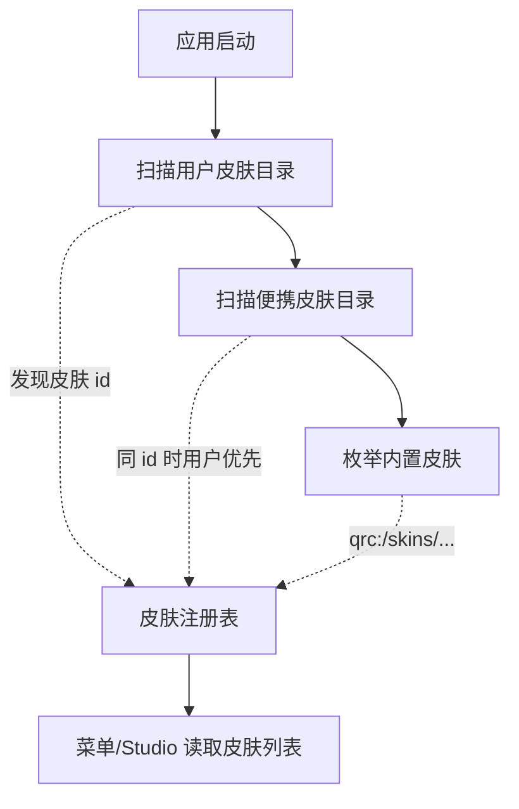
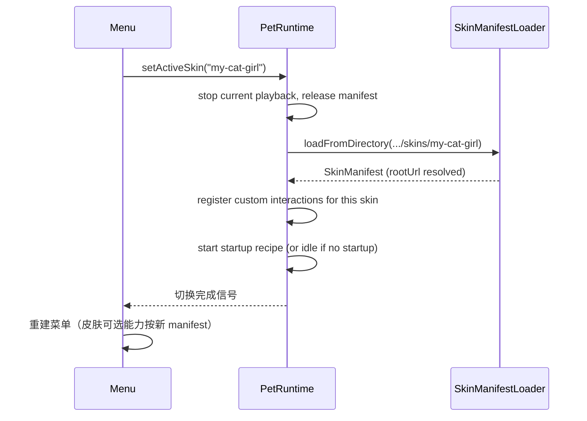

# 皮肤包分发与加载机制设计

本文定义皮肤包在磁盘上的组织格式、应用如何发现并加载它们、以及如何让最终用户在不接触 C++/Qt 编译环境的前提下完成换皮肤。

相关文档：
- 数据模型：[皮肤包播放行为设计](皮肤包播放行为设计.md)
- 编辑工具：[Pet Skin Studio 工具设计](Pet%20Skin%20Studio%20工具设计.md)（待补充）
- 整体架构：[总体架构设计](总体架构设计.md) §9 / §9.x

---

## 1. 背景与目标

### 1.1 当前状态

当前 MilesEdgeworth 的所有皮肤资源都通过 Qt Resource System 编进二进制：

```
apps/desktop/resources/skins/miles-edgeworth/
  manifest.json
  body/idle/stand.gif
  ...

→ 编译期通过 qrc 嵌入 → 运行时通过 qrc:/skins/miles-edgeworth/... 访问
```

后果：

- 换皮肤需要安装完整的 C++/Qt 开发环境，clone 仓库，加资源，重新编译
- 第三方皮肤无法分发——只能通过 fork 仓库实现
- Studio 编辑后即使写回 manifest.json，运行时也读不到（仍读编译时的快照）

### 1.2 目标

1. **非开发者可换皮肤**：把皮肤文件夹丢到一个目录就能用，无需任何编译工具
2. **内置 Miles 仍可正常工作**：不强制把内置皮肤迁出 qrc，保持发布包自包含
3. **同一应用同时识别"内置"和"用户安装"两类皮肤**
4. **皮肤包的资源 URL 可移植**：同一份 manifest 拷到不同位置都能加载
5. **为后续 zip 打包、签名校验、版本约束等留出 schema 接口**

### 1.3 非目标

- 不实现皮肤的远程市场 / 分发渠道
- 不引入皮肤代码（JS/TS）执行——Custom Interaction 仍只支持内置 C++ handler
- 不做皮肤的资产 DRM / 加密

---

## 2. 皮肤包结构

每个皮肤包是一个目录，内容如下：

```
my-skin/                         ← 目录名仅作 hint；真实 id 来自 skin.json
  skin.json                      ← 皮肤元信息（必须）
  manifest.json                  ← 行为与素材声明（必须，schema 见《皮肤包播放行为设计》）
  assets/
    body/
      idle/
        stand.gif
      gestures/
      ...
    props/
      ...
    audio/
      ...
  README.md                      ← 可选
  LICENSE                        ← 可选
```

### 2.1 `skin.json`：元信息层

`skin.json` 是从 manifest.json 分出来的薄壳，保存"加载前需要知道的信息"——这样应用可以在扫描阶段只读 skin.json 列出可用皮肤，等用户真的选中才读完整的 manifest.json。

```json
{
  "id": "miles-edgeworth",
  "name": "御剑怀宇",
  "version": "1.0.0",
  "author": "tiantian",
  "license": "CC-BY-NC-4.0",
  "manifestVersion": 1,
  "minAppVersion": "0.7",
  "thumbnail": "skin:assets/body/idle/stand.gif"
}
```

| 字段 | 必填 | 说明 |
| --- | --- | --- |
| `id` | ✅ | 全局唯一的皮肤标识，建议 `kebab-case`；用户配置（如"上次选的皮肤"）按此 id 持久化 |
| `name` | ✅ | 显示名，菜单和 Studio 展示 |
| `version` | ✅ | semver 字符串；后续支持升级提示时使用 |
| `manifestVersion` | ✅ | manifest schema 大版本号；loader 不支持的版本拒绝加载 |
| `minAppVersion` | 推荐 | 该皮肤需要的最低桌宠应用版本 |
| `thumbnail` | 可选 | 菜单缩略图（`skin:` URL，见 §3.2） |
| `author` / `license` | 可选 | 显示用 |

### 2.2 为什么不把元信息塞进 manifest.json

两者职责不同：

| | `skin.json` | `manifest.json` |
| --- | --- | --- |
| 何时读 | 应用启动时扫描所有皮肤 | 用户选中某皮肤时加载 |
| 大小 | 极小（< 1KB） | 中等（10KB+） |
| 变化频率 | 低（皮肤元信息基本不动） | 高（编辑动作 / hit zone 时频繁改） |

扫描阶段只读 skin.json，能让"启动菜单列出 100 个皮肤"也是常数级开销。

---

## 3. 发现与加载

### 3.1 皮肤搜索路径

应用启动时按以下顺序扫描：



| 优先级 | 路径 | 用途 | 解析方式 |
| --- | --- | --- | --- |
| 1 | `<QStandardPaths::AppDataLocation>/skins/` | 用户安装的皮肤 | 扫描子目录，每个含 `skin.json` 的就是一个皮肤 |
| 2 | `<应用 bundle 同级>/skins/` | 便携部署 | 同上 |
| 3 | `qrc:/skins/` | 内置（如 Miles） | 编译期枚举（loader 维护一个内置皮肤 id 列表） |

同 id 时**用户皮肤覆盖内置**——这样用户可以"克隆 Miles 到本地，定制后用本地版本"。

跨平台路径示例：

- macOS：`~/Library/Application Support/MilesEdgeworth/skins/`
- Windows：`%APPDATA%/MilesEdgeworth/skins/`
- Linux：`~/.local/share/MilesEdgeworth/skins/`

### 3.2 `skin:` URL Scheme

manifest 内引用资源时**只用 `skin:` 前缀**，由 loader 在加载阶段统一解析为绝对 URL：

```json
{
  "actions": {
    "idle_stand": {
      "variants": {
        "right": "skin:assets/body/idle/stand_right.gif",
        "left":  "skin:assets/body/idle/stand_left.gif"
      }
    }
  },
  "props": {
    "prosecutor_badge": {
      "asset": "skin:assets/props/prosecutor_badge.png"
    }
  }
}
```

loader 加载 manifest 后立即把所有 `skin:` URL 替换为绝对 URL（避免运行时每次播放都重复解析）：

```
内置 Miles:    skin:assets/body/foo.gif  →  qrc:/skins/miles-edgeworth/assets/body/foo.gif
用户皮肤:      skin:assets/body/foo.gif  →  file:///.../skins/my-skin/assets/body/foo.gif
```

兼容旧 manifest：
- 已存在的 `qrc:/...` 绝对 URL 仍正常工作（用于 Miles 过渡期）
- 但 Studio 导出的 manifest 始终用 `skin:` scheme
- 长期建议把内置 Miles 也改成 `skin:`，便于将来"从 qrc 迁出到文件系统"

### 3.3 Loader 接口

```cpp
class SkinManifestLoader {
public:
    // 内置（保留）
    static SkinManifest loadFromResource(const QString &qrcRoot);

    // 文件系统（新增）
    static SkinManifest loadFromDirectory(const QString &filesystemPath);

    // 扫描发现（新增）
    static QList<SkinDescriptor> discoverAll();

private:
    static void resolveSkinUrls(SkinManifest &manifest, const QString &rootUrl);
};

struct SkinDescriptor {
    QString id;
    QString name;
    QString version;
    QString rootUrl;       // qrc:/skins/miles 或 file:///.../skins/my-skin
    bool builtin;
    QUrl thumbnailUrl;
};
```

`SkinManifest` 加一个 `rootUrl` 字段保存皮肤根路径，loader 在加载后把 `skin:foo.gif` 等所有资源 URL 一次性替换为绝对 URL（`qrc:/.../foo.gif` 或 `file:///.../foo.gif`）。

---

## 4. 应用与皮肤切换

### 4.1 右键菜单 + 设置面板

桌宠应用菜单新增"**皮肤**"子菜单，列出所有已发现皮肤；点击切换。

```
右键菜单
├─ 皮肤
│  ├─ ● 御剑怀宇（内置）        ← 当前选中
│  ├─ ○ 我的猫娘
│  ├─ ○ 机器人 v2
│  └─ ─────────────
│     [打开皮肤目录...]          ← 在文件管理器里打开用户皮肤目录
│     [重载当前皮肤]              ← 给开发者用，编辑后立即生效
├─ ...其他菜单...
```

切换流程：



### 4.2 持久化

用户选择的皮肤 id 存到 `QSettings`：
- 启动时若该 id 仍可发现 → 加载
- 否则降级到内置 Miles，并提示"上次的皮肤已不可用"

### 4.3 错误处理

加载失败的常见原因和处理：

| 原因 | 行为 |
| --- | --- |
| `manifest.json` 不存在或 JSON 解析失败 | 跳过该皮肤，扫描日志记录 |
| `manifestVersion` 不被支持 | 在菜单显示"⚠️ 版本不兼容"，禁用切换 |
| `minAppVersion` 大于当前应用 | 同上 |
| 引用的 asset 文件缺失 | 加载成功，但运行时该动作播放时降级到 fallback action（idle_stand） |

---

## 5. 与 Pet Skin Studio 的关系

Studio 是皮肤的**编辑端**，应用是**运行端**，磁盘上的皮肤目录是双方共享的真源。

约束：

- Studio 只能编辑**用户目录里的皮肤**（文件系统可写）
- 内置 Miles（qrc）不可直接编辑；Studio 提供"克隆到用户目录"操作，把内置皮肤复制到 `<AppDataLocation>/skins/miles-edgeworth-custom/`（加后缀避免和内置 id 冲突）
- Studio 保存皮肤后，桌宠应用菜单点击"重载当前皮肤"即可看到效果

---

## 6. 后续扩展（不在本期实现）

预留 schema 空间，避免将来动 v1 用户的兼容性：

### 6.1 `.petskin` zip 打包

单文件分发格式。loader 优先尝试目录加载，发现 `.petskin` 文件时：
- 选项 A：解压到临时目录，按目录加载
- 选项 B：使用 Qt 的 `QResource::registerResource` 把 zip 作为虚拟文件系统挂载

### 6.2 签名校验

第三方皮肤可选签名：

```json
{
  "signature": {
    "algorithm": "ed25519",
    "publicKey": "...",
    "signature": "..."
  }
}
```

应用启动时校验签名；签名不通过的皮肤标记 "未签名" 但默认仍可加载（除非用户在设置里开启"严格模式"）。

### 6.3 版本约束与依赖

```json
{
  "manifestVersion": 2,
  "minAppVersion": "1.2.0",
  "requiredCapabilities": ["rest", "voiceLanguage"]
}
```

应用检查后决定是否能加载、是否需要降级某些功能。

### 6.4 资源沙箱

文件系统皮肤的 asset URL 解析时强制限制在皮肤根目录下，防止 `skin:../../../../etc/passwd` 这类穿越。loader 实现时用 `QDir::cleanPath` + `startsWith(rootUrl)` 校验。

---

## 7. 实施计划

按"先架构后体验"顺序：

1. **Loader 文件系统支持**：`loadFromDirectory` + `rootUrl` + `skin:` 解析
2. **皮肤发现**：`discoverAll()` 扫描三个路径
3. **内置 Miles 改用 `skin:` scheme**：保持向后兼容，但新写法统一
4. **应用菜单皮肤切换 + 重载入口**
5. **完整的 "如何制作一个皮肤" 用户教程**（参考资料类文档）
6. **Pet Skin Studio 落地**（独立工具，首发 HitZone 编辑器）
7. **后续按需扩展**：zip 打包、签名、版本约束等

步骤 1–4 完成后，"非开发者换皮肤"的能力就已经具备（手写 manifest.json + 放到目录）；Studio 是把这件事可视化的工具。

---

## 8. 影响范围

| 模块 | 改动 |
| --- | --- |
| `SkinManifest.h` | 新增 `rootUrl` 字段 |
| `SkinManifestLoader.h/cpp` | 新增 `loadFromDirectory` / `discoverAll` / `resolveSkinUrls`；保留 `loadFromResource` |
| `PetRuntime.cpp` | `setActiveSkin(id)` 入口；切换时清理状态 |
| `PetContextMenu.cpp` / 类似 | 皮肤子菜单 + 重载入口 + "打开皮肤目录" |
| Miles 内置 manifest | URL 从 `qrc:/...` 改为 `skin:...`（兼容期内两者并存） |
| 新增 `apps/pet-skin-studio/` | 见对应设计文档 |
| 新增用户教程 | `docs/v2/参考资料/制作你的第一个皮肤.md` |
