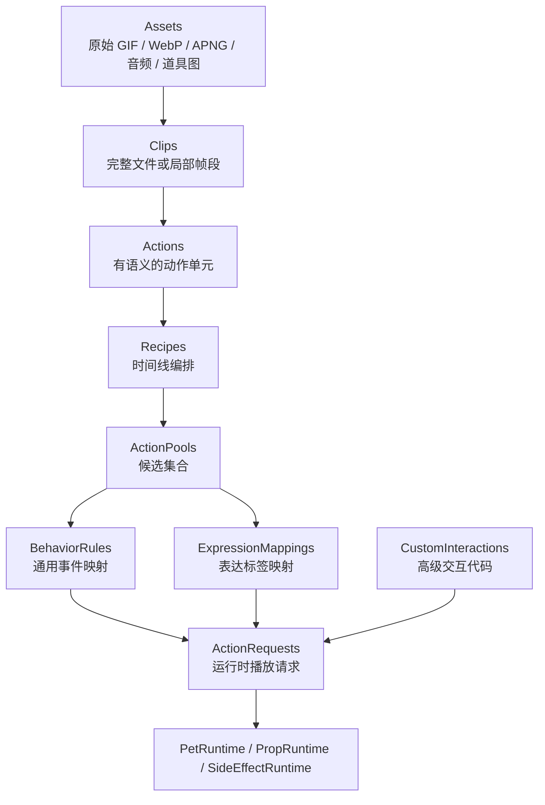
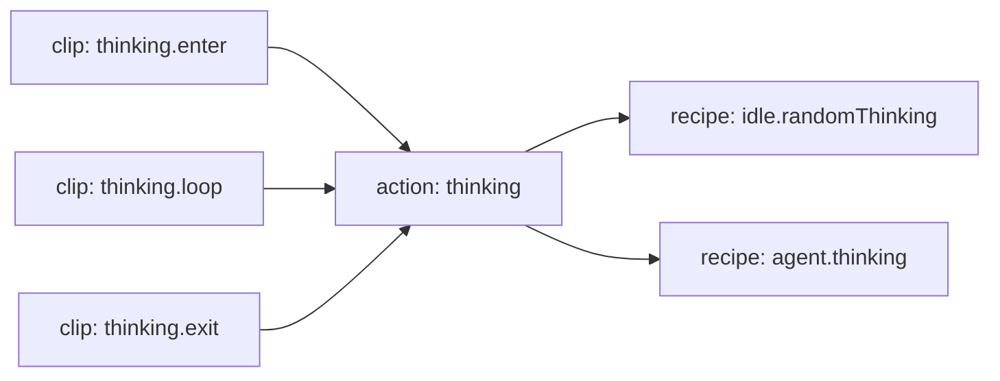
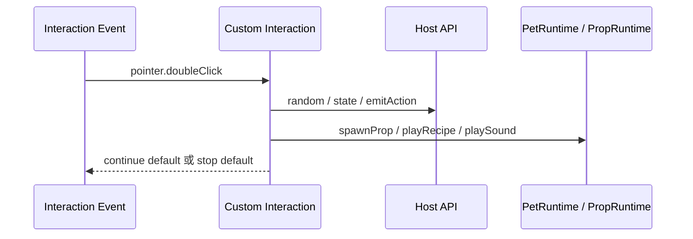

# 皮肤包播放行为设计

本文档定义 MilesEdgeworth v2 的皮肤包、素材播放编排和交互行为模型。它是长期维护文档，用来指导 manifest、行为配置、Custom Interaction 和换肤能力设计。

相关文档分工：

- `桌宠运行时与动画调度设计.md`：说明 Pet Runtime 状态、调度原则和 AI/Agent 接入关系。
- `桌宠运行时职责拆分设计.md`：说明 C++ 运行时类边界和拆分顺序。
- `../参考资料/动画素材盘点.md`：记录旧 GIF 素材事实、语义判断、朝向和拆 phase 线索。
- `apps/desktop/resources/skins/miles-edgeworth/manifest.json`：当前可运行 manifest 示例。

## 目标

这套设计同时服务三类使用者：

| 使用者 | 主要诉求 | 需要维护的内容 |
| --- | --- | --- |
| 普通换肤作者 | 替换角色素材，配置 idle、点击、菜单、agent 状态动作 | assets、actions、recipes、action pools、hit zones |
| Miles 官方皮肤维护者 | 还原旧版手感，整理动作语义，后续拆局部循环 | clips、phases、recipes、behavior triggers |
| 高级交互作者 | 实现检察官徽章、复杂道具、特殊鼠标玩法 | Custom Interaction、prop、side effects |

设计目标：

1. 旧版 Miles 的素材和交互可以逐步迁移进来。
2. 普通换肤只写配置即可完成多数行为。
3. 高级玩法可以写代码，但通过受控 Host API 接入系统。
4. 同一份动作素材可以被随机 idle、鼠标交互、菜单、agent 状态和 LLM 表达标签复用。
5. 运行时通过语义请求播放动作，业务层不直接引用 GIF 文件名。

## 核心原则

- 素材事实和播放语义分开：GIF、音频、道具图放在 assets，Clip / Action / Recipe 描述如何使用。
- 动作语义和触发来源分开：`thinking` 是动作，`agent.thinking.started` 是触发来源。
- 通用能力和皮肤定制分开：睡眠、移动、点击区域属于通用能力；喝红茶、检察官徽章属于 Miles 皮肤定制。
- 主体动画和道具分开：身体由 PetRuntime 管理，飞出的徽章、掉落物、特效由 PropRuntime 管理。
- 配置能力和运行时请求分开：manifest 描述皮肤能做什么，运行时请求描述这一次要做什么。
- 长期 schema 和当前实现分开：本文描述目标模型；当前已落地字段以 manifest 和自动测试为准。

## 总体层级



层级含义：

| 层级 | 作用 |
| --- | --- |
| Assets | 原始素材文件，例如 GIF、WebP、APNG、音频、道具图片 |
| Clips | 最小播放片段，可以是完整文件，也可以是某个文件的帧区间 |
| Actions | 语义动作，例如 `thinking`、`objecting`、`sleep`、`walk` |
| Recipes | 时间线编排，描述一个动作或一个场景如何播放 |
| ActionPools | 候选集合，用于随机 idle、点击、LLM 表达标签等场景 |
| BehaviorRules | 把通用事件映射成播放请求 |
| ExpressionMappings | 把 LLM 输出的表达标签映射到动作候选 |
| CustomInteractions | 需要代码的高级玩法，例如检察官徽章 |
| ActionRequests | 送入运行时的语义请求 |

## 推荐皮肤包结构

```text
skins/miles-edgeworth/
  manifest.json
  behavior.json
  interactions/
    takethat.ts
  assets/
    body/
      idle/
      locomotion/
      gestures/
      rest/
      startup/
      raw/
    props/
      prosecutor_badge/
    audio/
  generated/
    clips/
```

职责划分：

| 路径 | 职责 | 是否人工维护 |
| --- | --- | --- |
| `manifest.json` | 描述 canvas、anchors、clips、actions、recipes、actionPools、props、fallback | 是 |
| `behavior.json` | 描述 idle 随机、点击区域、双击、右键菜单、agent 状态映射 | 是 |
| `interactions/` | 高级可信交互代码，例如检察官徽章、复杂道具、特殊音效流程 | 是 |
| `assets/` | 正本素材，按资源语义组织 | 是 |
| `generated/` | 从 frameRange、压缩、格式转换生成的派生素材 | 否 |

推荐按资源语义组织素材，而不是按触发来源组织素材。比如抱胸思考既可以用于随机 idle，也可以用于 agent thinking，正本素材只保留一份，触发差异通过 Recipe / ActionPool / BehaviorRule 表达。

## Canvas 与 Anchor

每个皮肤需要声明一个逻辑画布。画布决定主体窗口的基础尺寸，也决定不同动画之间如何对齐。

```json
{
  "canvas": {
    "width": 240,
    "height": 240,
    "transparent": true
  }
}
```

Anchor 是角色在画布里的语义坐标。它的实际用途包括：

- 动作切换时保持角色脚底或身体中心位置稳定。
- 移动时用同一个站位点计算窗口位置。
- 气泡、手部道具、头部交互等附着在角色上的 UI 或 Prop 可以按 anchor 定位。

```json
{
  "anchors": {
    "body": { "type": "foot_center", "x": 120, "y": 220 },
    "bubble": { "type": "top_center", "x": 120, "y": 24 },
    "right_hand": { "type": "point", "x": 160, "y": 96 }
  }
}
```

Miles 当前 GIF 基本已经手动对齐，因此短期可以只声明一个默认 `body` anchor。未来支持第三方皮肤时，anchor 会成为校准工具和素材导入器的关键字段。

## 朝向

朝向集合由皮肤自己声明，不由框架写死。

```json
{
  "facings": ["right", "left"],
  "defaultFacing": "right",
  "movementDirections": [
    "east",
    "west",
    "northEast",
    "northWest",
    "southEast",
    "southWest",
    "north",
    "south"
  ]
}
```

普通站立和表情动作通常只需要角色实际具备的朝向。移动动作可以支持 4 方向、8 方向，或只支持左右横向；运行时应根据皮肤声明选择最接近的可用动画。

## Hit Zone

Hit zone 描述鼠标点击区域。普通换肤可以使用矩形，高级皮肤可以使用 polygon。alpha mask 可作为更后期的高级能力。

```json
{
  "hitZones": {
    "head": {
      "type": "rect",
      "x": 88,
      "y": 24,
      "width": 64,
      "height": 48
    },
    "face": {
      "type": "polygon",
      "points": [[132, 30], [160, 44], [148, 72], [120, 64]]
    }
  }
}
```

Miles 当前分区沿用旧版 polygon / rect 思路即可。alpha mask 的价值在于将来做“只有非透明像素可点击”，但它需要处理性能、缩放、帧变化和编辑工具，暂不作为 Phase 0 的基础要求。

## Clip、Action 与 Recipe

Clip 是素材片段，Action 是语义动作，Recipe 是播放编排。三者分开后，同一段素材可以被多个触发来源复用。



示例：

```json
{
  "actions": {
    "thinking": {
      "category": "gesture",
      "initialPhase": "enter",
      "exitPhase": "exit",
      "phases": {
        "enter": { "clip": "thinking.enter", "loopMode": "once", "nextPhase": "loop" },
        "loop": { "clip": "thinking.loop", "loopMode": "loop" },
        "exit": { "clip": "thinking.exit", "loopMode": "onceThenIdle" }
      }
    }
  }
}
```

已有素材如果只有完整 GIF，可以先把它作为单个 phase 使用。后续再用 frameRange 或派生素材拆成 enter / loop / exit。

## Recipe 编排

Recipe 建立在 action 或 clip 之上，用来表达一次播放请求的时间线。短 recipe 可以直接引用 action；复杂 recipe 可以组合多个步骤。

```json
{
  "recipes": {
    "idle.randomThinking": {
      "action": "idle_thinking_once",
      "scope": "idle"
    },
    "agent.thinking": {
      "steps": [
        { "action": "thinking", "phase": "enter" },
        { "action": "thinking", "phase": "loop", "duration": "runtime" },
        { "action": "thinking", "phase": "exit" }
      ],
      "scope": "agent"
    }
  }
}
```

运行时可为 recipe 提供动态参数，例如循环时长、循环次数或提前退出信号。manifest 负责声明 recipe 支持哪些参数，具体值由运行时请求传入。

## ActionPool

ActionPool 用于“从多个候选里选择一个”。它可以被 idle、点击、双击、菜单、LLM 表达标签复用。

```json
{
  "actionPools": {
    "idle.random": {
      "entries": [
        { "recipe": "idle.randomThinking", "weight": 8 },
        { "recipe": "turn.once", "weight": 12 },
        { "recipe": "walk.east", "weight": 4 }
      ]
    },
    "expression.annoyed": {
      "entries": [
        { "recipe": "doubleClick.objection", "weight": 2 },
        { "recipe": "idle.lookDown", "weight": 1 }
      ]
    }
  }
}
```

LLM 不应被要求从项目内置固定词表中选择。可选 expression/action 标签来自当前皮肤配置。模型侧只看到当前皮肤暴露的标签说明和约束。

## BehaviorRule

BehaviorRule 把通用事件映射到 ActionPool 或 Recipe。

```json
{
  "behaviorRules": [
    {
      "event": "idle.loopFinished",
      "when": { "state": "idle", "action": "idle_stand" },
      "pool": "idle.random",
      "probability": 0.7
    },
    {
      "event": "pointer.singleClick",
      "hitZone": "head",
      "pool": "click.head"
    },
    {
      "event": "agent.stateChanged",
      "state": "thinking",
      "recipe": "agent.thinking"
    }
  ]
}
```

这些规则属于普通换肤能力。它们应尽量保持声明式，便于编辑器、预览器和校验工具理解。

## 通用能力、皮肤定制命令与 Custom Interaction

右键菜单和鼠标事件不能全部塞进 `PetRuntime`。需要分三层处理：

| 类型 | 定义 | 例子 | 落点 |
| --- | --- | --- | --- |
| 通用能力 | 多数桌宠都可能具备，由框架提供状态和入口 | sleep/rest、静音、尺寸、移动开关 | Runtime capability |
| 皮肤定制命令 | 某个皮肤提供的简单菜单命令，通常映射到 action pool 或 recipe | Miles 的喝红茶 | Skin command |
| Custom Interaction | 需要代码、道具、条件分支或副作用的高级玩法 | 检察官徽章、眼睛追随鼠标、抛掷物 | Custom Interaction |


当前 Miles 皮肤里：

- `sleep/rest` 是通用能力，保留在 Runtime 能力层。
- `miles.feedTea` 是皮肤定制命令，短期映射到 `menu.tea` action pool。
- 检察官徽章是 Custom Interaction，长期应由交互代码管理 prop、点击和自然消失分支。
- 语音语言属于可选 Audio Capability，不应假设所有皮肤都有语音。

## Custom Interaction

Custom Interaction 是高级扩展点。它监听事件、决定是否追加默认行为、发出播放请求、生成 Prop 或触发 SideEffect。

建议模型：



处理结果不要把“是否处理过”和“是否阻止默认行为”绑定。一个 handler 可以：

- 只记录或播放附加效果，然后继续默认行为。
- 完全接管事件，阻止默认行为。
- 发出延迟动作，在默认行为之后继续编排。

## ActionRequest

ActionRequest 是运行时播放请求的统一形态。

```json
{
  "source": "agent",
  "recipe": "agent.thinking",
  "interruptHint": "immediate",
  "params": {
    "loopDurationMs": 5000
  }
}
```

`interruptHint` 保持简单：

| 值 | 含义 |
| --- | --- |
| `immediate` | 立即切换到新请求 |
| `afterCurrent` | 当前 recipe 播完后再切换 |

更复杂的排队、阶段退出和优先级策略可以在真实需求出现后扩展，避免普通皮肤配置过早变复杂。

## QML 与 C++ 边界

QML 负责显示和输入：

- 显示当前动画、气泡、菜单和 Prop 窗口。
- 把点击、双击、拖拽、菜单命令转给 Runtime。
- 不直接选择 GIF 文件。

C++ Runtime 负责调度：

- 读取 manifest。
- 选择 action pool。
- 执行 recipe。
- 发出当前动画、音效、prop、窗口移动等状态。
- 把皮肤定制命令转成临时 action pool 请求，后续迁入 Custom Interaction。

设计目标是让 QML 越来越薄，皮肤行为越来越依赖 manifest / behavior / interaction 代码表达。
