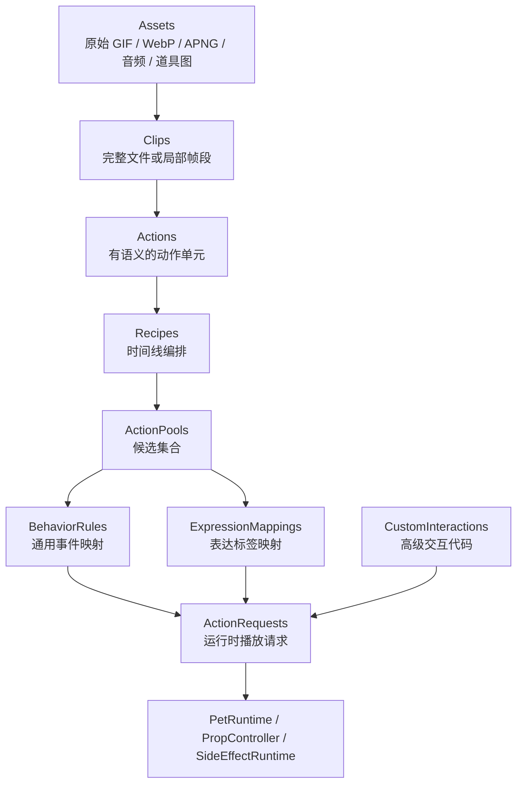
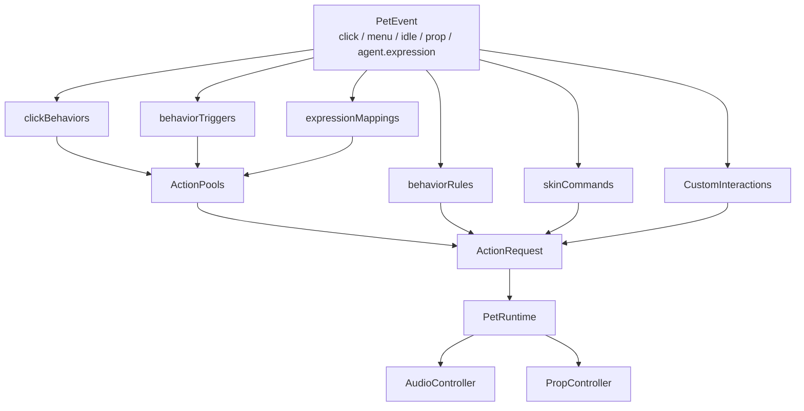
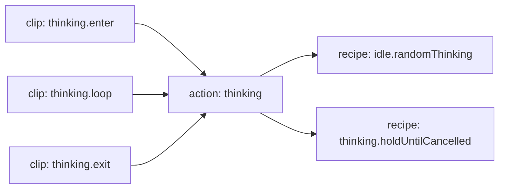
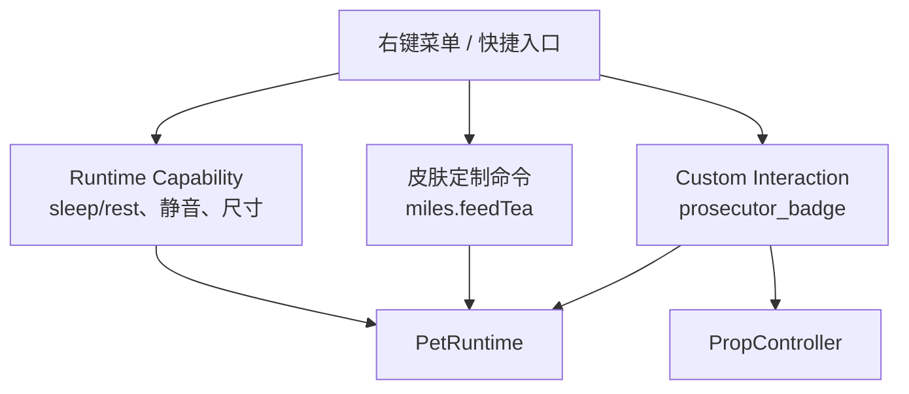
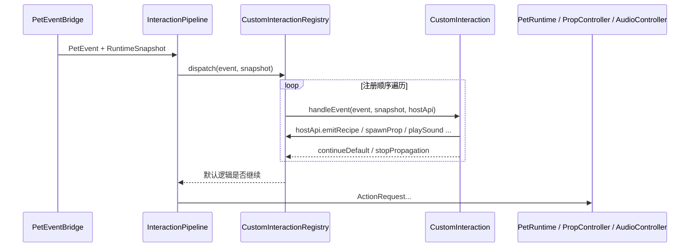

# 皮肤包播放行为设计

本文档定义 MilesEdgeworth v2 的皮肤包、素材播放编排和交互行为模型。它是长期维护文档，用来指导 manifest、行为配置、Custom Interaction 和换肤能力设计。

相关文档分工：

- `桌宠运行时与动画调度设计.md`：说明 Pet Runtime 状态、调度原则和 AI/Agent 接入关系。
- `桌宠运行时职责拆分设计.md`：说明 C++ 运行时类边界和拆分顺序。
- `../参考资料/动画素材盘点.md`：记录旧 GIF 素材事实、语义判断、朝向和拆 phase 线索。
- `apps/desktop/resources/skins/miles-edgeworth/manifest.json`：当前可运行 manifest 示例。

> **当前代码状态（Phase 1 收官后）**：运行时支持内置 qrc 皮肤包、用户皮肤目录和应用同级便携皮肤目录。Miles manifest 已使用 `skin:assets/...`，由 loader 解析为内置 `qrc:/skins/...` 或文件系统 `file://...` URL。所有行为字段暂时集中在 `manifest.json`，包括 `actions`、`recipes`、`actionPools`、`behaviorTriggers`、`behaviorRules`、`clickBehaviors`、`skinCommands`、`customInteractions`、`customInteractionConfig`、`audio`、`expressions` 和 `expressionMappings`。`behavior.json` 和 JS/TS Custom Interaction 仍是后续设计。

## 目标

这套设计同时服务三类使用者：

| 使用者 | 主要诉求 | 需要维护的内容 |
| --- | --- | --- |
| 普通换肤作者 | 替换角色素材，配置 idle、点击、菜单、agent 状态动作 | assets、actions、recipes、action pools、hit zones |
| Miles 官方皮肤维护者 | 还原旧版手感，整理动作语义，后续拆局部循环 | clips、phases、recipes、behavior triggers |
| 高级交互作者 | 实现检察官徽章、复杂道具、特殊鼠标玩法 | Custom Interaction、prop、side effects |

设计目标：

1. 旧版 Miles 的素材和交互可以逐步迁移进来。
2. 普通换肤只写配置即可完成多数行为。
3. 高级玩法可以写代码，但通过受控 Host API 接入系统。
4. 同一份动作素材可以被随机 idle、鼠标交互、菜单、agent 状态和 LLM 表达标签复用。
5. 运行时通过语义请求播放动作，业务层不直接引用 GIF 文件名。

## 核心原则

- 素材事实和播放语义分开：GIF、音频、道具图放在 assets，Clip / Action / Recipe 描述如何使用。
- 动作语义和触发来源分开：`thinking` 是动作，`agent.thinking.started` 是触发来源。
- 通用能力和皮肤定制分开：睡眠、移动、点击区域属于通用能力；喝红茶、检察官徽章属于 Miles 皮肤定制。
- 主体动画和道具分开：身体动画由 PetRuntime 管理，飞出的徽章、掉落物、特效由 PropController 管理。
- 配置能力和运行时请求分开：manifest 描述皮肤能做什么，运行时请求描述这一次要做什么。
- 长期 schema 和当前实现分开：本文描述目标模型；当前已落地字段以 manifest 和自动测试为准。

## 总体层级



层级含义：

| 层级 | 作用 |
| --- | --- |
| Assets | 原始素材文件，例如 GIF、WebP、APNG、音频、道具图片 |
| Clips | 最小播放片段，可以是完整文件，也可以是某个文件的帧区间 |
| Actions | 语义动作，例如 `thinking`、`objecting`、`sleep`、`walk` |
| Recipes | 时间线编排，描述一个动作或一个场景如何播放 |
| ActionPools | 候选集合，用于随机 idle、点击、LLM 表达标签等场景 |
| BehaviorRules | 把通用事件映射成播放请求 |
| ExpressionMappings | 把 LLM 输出的表达标签映射到动作候选 |
| CustomInteractions | 需要代码的高级玩法，例如检察官徽章 |
| ActionRequests | 送入运行时的语义请求 |

当前代码中的请求生成路径：



## 推荐皮肤包结构

```text
skins/miles-edgeworth/
  manifest.json
  behavior.json
  interactions/
    takethat.ts
  assets/
    body/
      idle/
      locomotion/
      gestures/
      rest/
      startup/
      raw/
    props/
      prosecutor_badge/
    audio/
  generated/
    clips/
```

职责划分：

| 路径 | 职责 | 是否人工维护 |
| --- | --- | --- |
| `manifest.json` | 描述 canvas、anchors、clips、actions、recipes、actionPools、props、fallback | 是 |
| `behavior.json` | 描述 idle 随机、点击区域、双击、右键菜单、agent 状态映射 | 是 |
| `interactions/` | 高级可信交互代码，例如检察官徽章、复杂道具、特殊音效流程 | 是 |
| `assets/` | 正本素材，按资源语义组织 | 是 |
| `generated/` | 从 frameRange、压缩、格式转换生成的派生素材 | 否 |

推荐按资源语义组织素材，而不是按触发来源组织素材。比如抱胸思考既可以用于随机 idle，也可以用于 agent thinking，正本素材只保留一份，触发差异通过 Recipe / ActionPool / BehaviorRule 表达。

`behavior.json` 仍作为长期 schema 保留：当出现"多个皮肤共享同一份行为规则"或"同一皮肤多个行为档位（标准 / 安静 / 兴奋）"的真实需求时再拆分。当前所有字段暂时全部写在 `manifest.json` 中，loader 一处解析；拆分发生时该文档需要同步刷新示例与字段归属。

当前 `manifest.json` 的主要字段归属：

| 字段 | 当前用途 | 运行时代码 |
| --- | --- | --- |
| `canvas` / `sizes` | 基础窗口尺寸、动画尺寸、点击逻辑画布、尺寸菜单 | `SkinManifestLoader` / `PetRuntime` / `PetContextMenu` |
| `actions` / `recipes` / `actionPools` | 主体动画、时间线、随机候选池 | `PetRuntime` / `ActionPoolSelector` |
| `behaviorTriggers` | `runtime.started`、`idle.loopFinished`、`action.completed` 等事件后续 | `BehaviorTriggerEngine` |
| `behaviorRules` | 拖拽晃动、拖拽释放等确定性事件映射 | `InteractionPipeline` |
| `hitZones` / `clickBehaviors` | 单击分区、双击入口列表 | `HitZoneMatcher` / `InteractionPipeline` |
| `skinCommands` | 简单皮肤菜单命令，例如 Miles 红茶 | `SkinCommandResolver` |
| `customInteractions` / `customInteractionConfig` | 高级交互注册和参数，例如检察官徽章 | `CustomInteractionRegistry` / 皮肤侧 handler |
| `props` | 主体外临时道具 | `PropController` / `PropSurfaceWindow` |
| `audio` | 语音语言与声音请求 | `AudioController` |
| `expressions` / `expressionMappings` | Agent expression 到动作请求的映射 | `ExpressionMappingResolver` |

## Manifest 字段速查

当前 `schemaVersion: 3` 的可运行 Miles manifest 仍把素材、行为和高级交互配置放在同一个 `manifest.json`。读文档时可以先按下表定位：基础字段负责“这个皮肤是谁和多大”，动画字段负责“能播什么”，行为字段负责“什么事件触发什么”，扩展字段负责“语音、Prop 和高级交互”。

| 字段 | 类型 | 必填 | 说明 |
| --- | --- | --- | --- |
| `schemaVersion` | number | 是 | manifest schema 版本。当前 Miles 使用 `3`。 |
| `id` / `name` | string / string | 推荐 | 皮肤稳定 id 和显示名称。当前运行时不依赖这两个字段，但保留它们有利于调试、编辑器和未来皮肤管理。 |
| `canvas` | object | 是 | 基础窗口、动画显示和 hit zone 逻辑画布尺寸。 |
| `defaultSize` / `sizes` | string / array | 是 | 默认尺寸档位和可选尺寸菜单。 |
| `facings` / `defaultFacing` | array / string | 是 | 普通动作可用朝向和默认朝向。 |
| `movementDirections` | array | 移动皮肤需要 | 移动系统可用方向，例如 8 方向行走/跑步。 |
| `movementFacingMap` | object | 可选 | 移动方向到普通朝向的映射，例如 `east -> right`。 |
| `states` | object | 是 | 稳定 PetState 到默认 action 的映射。 |
| `fallbackAction` | string | 是 | action / expression 无法解析时的最终兜底 action。 |
| `actions` | object | 是 | 语义动作定义，包含 loopMode、variants、movement 等。 |
| `recipes` | object | 有编排时需要 | 一个请求的播放编排；可以引用 action 或声明 steps。 |
| `actionPools` | object | 随机/候选行为需要 | 多个候选 recipe/action 的集合，按权重或顺序选择。 |
| `behaviorTriggers` | object | idle/续接需要 | 运行时内部事件触发后的候选入口，例如启动、idle 循环、动作完成。 |
| `behaviorRules` | array | 输入事件需要 | 外部事件到 action/recipe/pool 的声明式映射，例如拖拽晃动。 |
| `hitZones` | object | 点击行为需要 | 鼠标点击语义区域，支持 rect 和 polygon。 |
| `clickBehaviors` | object | 点击行为需要 | 单击/双击入口列表，把 hit zone 或 CI 映射到 pool/action/recipe。 |
| `skinCommands` | object | 皮肤菜单需要 | 简单皮肤命令，例如 Miles 的“喂食红茶”。 |
| `capabilities` | object | 可选 | 通用能力配置，例如 rest/sleep 入口。 |
| `audio` | object | 有语音时需要 | 默认语音语言和可切换语言列表。 |
| `expressions` | array | Agent/AI 需要 | 当前皮肤暴露给模型的 expression 标签说明。 |
| `expressionMappings` | object | Agent/AI 需要 | expression 到 action/recipe 候选的映射。 |
| `props` | object | 有临时道具时需要 | 主体外 Prop 的视觉、运动和点击/过期 recipe。 |
| `customInteractions` | array | 高级玩法需要 | 启用哪些高级交互 handler。 |
| `customInteractionConfig` | object | 高级玩法需要 | 每个 handler 的皮肤侧参数。 |

最小可运行骨架示例：

```json
{
  "schemaVersion": 3,
  "id": "miles-edgeworth",
  "name": "Miles Edgeworth",
  "canvas": { "windowSize": 120, "imageSize": 100, "hitZoneSize": 240, "idleLoopAction": "idle_stand" },
  "defaultSize": "medium",
  "sizes": [{ "id": "medium", "label": "中", "scale": 2.0 }],
  "facings": ["right", "left"],
  "defaultFacing": "right",
  "states": {
    "idle": { "action": "idle_stand" },
    "thinking": { "action": "thinking" },
    "speaking": { "action": "objecting" },
    "error": { "action": "idle_stand" }
  },
  "fallbackAction": "idle_stand",
  "actions": {
    "idle_stand": {
      "label": "站立待机",
      "category": "idle",
      "loopMode": "loop",
      "variants": {
        "right": { "animation": "skin:assets/body/idle/stand-right.gif" },
        "left": { "animation": "skin:assets/body/idle/stand-left.gif" }
      }
    }
  }
}
```

当前实现里 `actions.*.variants.*.animation` 可以直接引用 `skin:assets/...`，并可通过 `frameRange` 播放 GIF 的局部帧段。长期目标模型仍保留 `clips` / `frameRange`：`clips` 负责描述可复用片段，`actions` 负责语义动作，`recipes` 负责时间线编排。Miles 当前 manifest 仍以内联 `animation + frameRange` 为主，后续可以把稳定帧段迁入 `clips`。

## Canvas 与 Anchor

每个皮肤需要声明一个逻辑画布。画布决定主体窗口的基础尺寸，也决定不同动画之间如何对齐。

```json
{
  "canvas": {
    "windowSize": 120,
    "imageSize": 100,
    "hitZoneSize": 240,
    "idleLoopAction": "idle_stand"
  },
  "defaultSize": "medium",
  "sizes": [
    { "id": "mini", "label": "迷你", "scale": 1.0 },
    { "id": "small", "label": "小", "scale": 1.5 },
    { "id": "medium", "label": "中", "scale": 2.0 },
    { "id": "big", "label": "大", "scale": 3.0 }
  ]
}
```

`windowSize` 和 `imageSize` 是 scale=1 时的基础尺寸。Miles 当前中号为 `scale=2`，因此窗口实际尺寸为 `120 * 2 = 240`，动画显示尺寸为 `100 * 2 = 200`。不同皮肤可以声明自己的尺寸档位，右键菜单按 `sizes` 动态生成。

`hitZoneSize` 是点击命中区域使用的逻辑画布尺寸。它可以和 `windowSize` 不同：Miles 的窗口基础尺寸是 120，但现有点击区域沿用旧版 240 坐标，因此写成 `hitZoneSize: 240`。新皮肤应按自己的 hit zone 标注坐标填写这个值，框架不会假设固定的 240 坐标系。

`idleLoopAction` 用于声明哪个 action 的循环完成后可以触发 idle 随机调度。表现层只调用运行时查询，不直接写死某个动作名。

Anchor 是角色在画布里的语义坐标。它的实际用途包括：

- 动作切换时保持角色脚底或身体中心位置稳定。
- 移动时用同一个站位点计算窗口位置。
- 气泡、手部道具、头部交互等附着在角色上的 UI 或 Prop 可以按 anchor 定位。

```json
{
  "anchors": {
    "body": { "type": "foot_center", "x": 120, "y": 220 },
    "bubble": { "type": "top_center", "x": 120, "y": 24 },
    "right_hand": { "type": "point", "x": 160, "y": 96 }
  }
}
```

Miles 当前 GIF 基本已经手动对齐，因此短期可以只声明一个默认 `body` anchor。未来支持第三方皮肤时，anchor 会成为校准工具和素材导入器的关键字段。

## 朝向

朝向集合由皮肤自己声明，不由框架写死。

```json
{
  "facings": ["right", "left"],
  "defaultFacing": "right",
  "movementDirections": [
    "east",
    "west",
    "northEast",
    "northWest",
    "southEast",
    "southWest",
    "north",
    "south"
  ]
}
```

普通站立和表情动作通常只需要角色实际具备的朝向。移动动作可以支持 4 方向、8 方向，或只支持左右横向；运行时应根据皮肤声明选择最接近的可用动画。

## Hit Zone

Hit zone 描述鼠标点击区域的语义分区。普通换肤可以使用矩形，高级皮肤可以使用 polygon。窗口透明留白点击穿透由窗口输入 mask 处理，语义分区继续由 hit zone 处理。

```json
{
  "hitZones": {
    "head": {
      "type": "rect",
      "x": 88,
      "y": 24,
      "width": 64,
      "height": 48
    },
    "face": {
      "type": "polygon",
      "points": [[132, 30], [160, 44], [148, 72], [120, 64]]
    }
  }
}
```

Miles 当前分区沿用旧版 polygon / rect 思路即可。Phase 0.62 已接入基于当前动画首帧 alpha 的窗口输入 mask，用来避免透明外壳拦截鼠标；逐帧 mask 和可视化编辑工具以后再评估。

## Click Behaviors

`clickBehaviors` 把 hit zone 和动作池配对，让框架代码不需要内置任何皮肤命名。`InteractionPipeline` 按 `singleClick` 声明顺序把候选 zone 交给 `HitZoneMatcher`，命中后再把对应入口转成 `ActionRequest`。`doubleClick` 同样以列表方式声明，支持普通候选池和高级 Custom Interaction 入口（详见后文）。

```json
{
  "clickBehaviors": {
    "singleClick": [
      { "zone": "face",            "pool": "click.face" },
      { "zone": "head",            "pool": "click.head" },
      { "zone": "upper_arm",       "pool": "click.upperArm" },
      { "zone": "forearm",         "pool": "click.forearm" },
      { "zone": "chest",           "pool": "click.chest" },
      { "zone": "belly_bow",       "pool": "click.bellyBow" },
      { "zone": "belly_pointing",  "pool": "click.bellyPointingArea" },
      { "zone": "legs_back",       "pool": "click.legsBackArea" },
      { "zone": "legs_look_down",  "pool": "click.legsLookDownArea" }
    ],
    "doubleClick": [
      { "customInteraction": "prosecutor_badge" },
      { "pool": "doubleClick.random" }
    ]
  }
}
```

约束：

- 单击命中只取第一个匹配的 `zone`；多个区域重叠时，写在前面的优先。
- 双击列表里的每一项都是"如果可用就用它"：`customInteraction` 表示交给某个 CI 决定是否接管（CI 不接管则继续往下找）；`pool` / `recipe` / `action` 表示直接产生 ActionRequest。
- 框架运行时不再写死 `click.upperArm → upper_arm` 这种字符串映射；所有皮肤通过 manifest 描述自己的命名。

## Assets、Clip、Action 与 Recipe

这四层回答不同问题：

| 层级 | 回答的问题 | 当前实现状态 |
| --- | --- | --- |
| Assets | 文件在哪里 | 已使用 `skin:assets/...` URL |
| Clip | 从文件取哪一段 | 目标 schema；当前主要作为拆 GIF 的设计记录 |
| Action | 这个动作是什么意思 | 已由 `actions` 落地 |
| Recipe | 这次请求怎样编排播放 | 已由 `recipes` 和 `steps` 落地 |



### Assets 与 Clip

Assets 是皮肤包中的正本素材。它们只回答“文件在哪里”，不回答“什么时候播放”。推荐路径示例：

```text
assets/body/idle/stand-right.gif
assets/body/gestures/thinking-right.gif
assets/body/locomotion/walk-east.gif
assets/props/prosecutor_badge/prosecutor-badge.png
assets/audio/voice/jp/takethat.wav
```

Clip 是最小可复用播放片段，只描述“从哪个素材取哪一段”。当前运行时已经支持 action variant 直接写 `animation + frameRange`；`clips` 层保留为目标 schema，用于后续把稳定帧段从 action 内联配置迁移成可复用片段。

目标 `clips` 字段建议：

| 字段 | 类型 | 说明 |
| --- | --- | --- |
| `file` | string | 原始素材或派生素材路径，推荐 `skin:assets/...` 或皮肤内相对路径。 |
| `frameRange` | `[start, end]` | 可选，闭区间帧段。素材盘点中使用 1-based 帧号，导出工具需要统一转换规则。 |
| `durationMs` | number | 可选，单帧 hold 或派生素材的目标时长。 |
| `loop` | boolean | 可选，该 clip 是否天然可循环。 |
| `anchorOffset` | object | 可选，修正局部片段的锚点偏移。 |
| `generatedFrom` | object | 可选，记录派生 clip 的来源和导出参数。 |

示例：

```json
{
  "clips": {
    "thinking_enter_right": {
      "file": "skin:assets/body/gestures/thinking-right.gif",
      "frameRange": [1, 4]
    },
    "thinking_loop_right": {
      "file": "skin:assets/body/gestures/thinking-right.gif",
      "frameRange": [5, 8],
      "loop": true
    },
    "thinking_exit_right": {
      "file": "skin:assets/body/gestures/thinking-right.gif",
      "frameRange": [44, 47]
    }
  }
}
```

如果运行时不能直接播放 `frameRange`，asset compiler 可以生成派生素材：

```text
skin:assets/body/gestures/thinking-right.gif + frameRange [5, 8]
=> generated/clips/thinking-loop-right.webp
```

### Action

Action 是有语义的动作单元。外部模块请求 `thinking`、`objecting`、`walk` 这类 action，不直接引用 GIF 文件名。

字段建议：

| 字段 | 类型 | 说明 |
| --- | --- | --- |
| `label` | string | 给人看的名称，用于调试、编辑器和文档。 |
| `category` | string | 动作类别，例如 `idle`、`gesture`、`locomotion`、`cognitive`、`rest`。 |
| `loopMode` | string | 单段动作播放模式：`loop`、`once`、`onceThenIdle`、`hold` 等。 |
| `variants` | object | 朝向或移动方向变体。变体直接写 `animation`，也可以写可选 `frameRange` 或 `clip`。 |
| `movement` | object | 可选，移动动作每帧或每周期的窗口位移参数，写在 variant 内。 |
| `phases` | object | 多阶段动作定义。 |
| `initialPhase` / `exitPhase` | string | 多阶段动作入口和退出阶段。 |
| `fallbackAction` | string | 可选，当前 action 不可用时的兜底 action。 |

当前可运行的单段动作示例：

```json
{
  "actions": {
    "objecting": {
      "label": "异议",
      "category": "gesture",
      "loopMode": "onceThenHold",
      "variants": {
        "right": { "animation": "skin:assets/body/interaction/objecting-right.gif" },
        "left": { "animation": "skin:assets/body/interaction/objecting-left.gif" }
      }
    }
  }
}
```

当前可运行的移动动作示例：

```json
{
  "actions": {
    "walk": {
      "label": "走路",
      "category": "locomotion",
      "loopMode": "onceThenIdle",
      "variants": {
        "east": {
          "animation": "skin:assets/body/locomotion/walk-east.gif",
          "movement": { "dx": 8.4, "dy": 0 }
        },
        "west": {
          "animation": "skin:assets/body/locomotion/walk-west.gif",
          "movement": { "dx": -8.4, "dy": 0 }
        }
      }
    }
  }
}
```

当前可运行的多阶段动作示例：

```json
{
  "actions": {
    "thinking": {
      "label": "抱胸思考",
      "category": "cognitive",
      "initialPhase": "enter",
      "exitPhase": "exit",
      "phases": {
        "enter": {
          "loopMode": "once",
          "variants": {
            "right": { "animation": "skin:assets/body/gestures/thinking-right.gif", "frameRange": [1, 4] },
            "left": { "animation": "skin:assets/body/gestures/thinking-left.gif", "frameRange": [1, 4] }
          }
        },
        "loop": {
          "loopMode": "loop",
          "variants": {
            "right": { "animation": "skin:assets/body/gestures/thinking-right.gif", "frameRange": [5, 8] },
            "left": { "animation": "skin:assets/body/gestures/thinking-left.gif", "frameRange": [5, 8] }
          }
        },
        "exit": {
          "loopMode": "onceThenHold",
          "variants": {
            "right": { "animation": "skin:assets/body/gestures/thinking-right.gif", "frameRange": [44, 47] },
            "left": { "animation": "skin:assets/body/gestures/thinking-left.gif", "frameRange": [44, 47] }
          }
        }
      }
    }
  }
}
```

常见 phase：

| Phase | 用途 |
| --- | --- |
| `main` | 单段动作主体。 |
| `enter` | 进入姿态，例如抬手抱胸。 |
| `loop` | 可循环保持段，例如抱胸思考或说话口型。 |
| `hold` | 保持某一帧或某个姿态。 |
| `exit` | 离开姿态，例如放下双臂。 |
| `recover` | 被打断或特殊状态恢复。 |

## Recipe 编排

Recipe 建立在 action 或嵌套 recipe 之上，用来表达一次播放请求的时间线。短 recipe 可以直接引用 action；复杂 recipe 可以组合多个步骤。

字段建议：

| 字段 | 类型 | 说明 |
| --- | --- | --- |
| `label` | string | 给人看的名称。 |
| `scope` | string | 用途范围，例如 `idle`、`locomotion`、`interaction`、`startup`、`state`。 |
| `action` | string | 直接绑定一个 action。 |
| `movementDirection` | string | 可选，移动 recipe 指定方向；`$current` 表示使用当前方向。 |
| `steps` | array | 时间线步骤，可顺序播放多个 action 或 recipe。 |

step 级字段：

| 字段 | 类型 | 说明 |
| --- | --- | --- |
| `action` | string | 要播放的 action ID。 |
| `recipe` | string | 可选，嵌套播放另一个 recipe。`action` 和 `recipe` 二选一；同时声明时以实现约定为准，不建议混用。 |
| `phase` | string | 可选，只播 action 的指定阶段：`"enter"`、`"loop"`、`"exit"`。需要 action 声明对应 phase；省略时播放 action 的完整流程（按 loopMode 决定行为）。 |
| `movementDirection` | string | 可选，覆盖当前移动方向；`"$current"` 表示使用当前方向。 |
| `facing` | string | 可选，覆盖当前朝向。`"$opposite"` 反向。 |
| `repeat` | number | 可选，数字重复次数。 |
| `durationMs` | number | 可选，当前实现支持的固定毫秒时长。 |
| `duration` | string \| number | 控制该 step 的持续方式。`"runtime"` 表示由运行时通过 `requestCleanFinishAndNotify` 控制何时结束（仅对 loop phase 有意义）；数值表示固定毫秒数。省略时 step 播完自然结束。 |

```json
{
  "recipes": {
    "idle.randomThinking": {
      "action": "idle_thinking_once",
      "scope": "idle"
    },
    "thinking.holdUntilCancelled": {
      "steps": [
        { "action": "thinking", "phase": "enter" },
        { "action": "thinking", "phase": "loop", "duration": "runtime" },
        { "action": "thinking", "phase": "exit" }
      ],
      "scope": "agent"
    }
  }
}
```

当前可运行 recipe 主要有两种形态：

```json
{
  "recipes": {
    "walk.current": {
      "label": "沿当前方向继续走",
      "scope": "locomotion",
      "action": "walk",
      "movementDirection": "$current"
    },
    "startup.briefcase": {
      "label": "公文包启动入场",
      "scope": "startup",
      "steps": [
        { "action": "briefcase_in" },
        { "action": "briefcase_stop" },
        { "action": "idle_stand" }
      ]
    }
  }
}
```

## ActionPool

ActionPool 用于“从多个候选里选择一个”。它可以被 idle、点击、双击、菜单、LLM 表达标签复用。

字段建议：

| 字段 | 类型 | 说明 |
| --- | --- | --- |
| `label` | string | 给人看的名称。 |
| `entries` | array | 候选列表。 |
| `entries[].action` | string | 直接候选 action id。 |
| `entries[].recipe` | string | 候选 recipe id；当前 Miles 主要使用 recipe。 |
| `entries[].pool` | string | 候选可以继续引用另一个 pool；需要避免循环引用。 |
| `entries[].weight` | number | 随机权重，必须为正数。 |

```json
{
  "actionPools": {
    "idle.random": {
      "entries": [
        { "recipe": "idle.randomThinking", "weight": 8 },
        { "recipe": "turn.once", "weight": 12 },
        { "recipe": "walk.east", "weight": 4 }
      ]
    },
    "expression.annoyed": {
      "entries": [
        { "recipe": "doubleClick.objection", "weight": 2 },
        { "recipe": "idle.lookDown", "weight": 1 }
      ]
    }
  }
}
```

选择策略通常由调用方决定：`ActionPoolSelector` 当前按权重选候选；`ExpressionMappingResolver` 支持 `first_available` 和 `weighted_random`。后续如果给 pool 本身增加 `selection`，需要同步更新静态校验。

LLM 不应被要求从项目内置固定词表中选择。可选 expression/action 标签来自当前皮肤配置。模型侧只看到当前皮肤暴露的标签说明和约束。

## Expression 与 ExpressionMapping

`expressions` 是暴露给 Agent/LLM 的标签清单，`expressionMappings` 决定标签如何落到 action 或 recipe。模型只能选择 expression，不选择 GIF、旧版数字文件名或具体 action。

Expression 字段建议：

| 字段 | 类型 | 说明 |
| --- | --- | --- |
| `id` | string | 稳定标签 id，例如 `neutral`、`objection`、`polite`。 |
| `label` | string | 给人看的名称，也可进入调试 UI。 |
| `description` | string | 给模型和皮肤作者看的语义说明。 |
| `allowedStates` | string[] | 该 expression 允许用于哪些 PetState。 |

ExpressionMapping 字段建议：

| 字段 | 类型 | 说明 |
| --- | --- | --- |
| `selection` | string | `first_available` 或 `weighted_random`。 |
| `fallback` | string | 该 expression 无可用候选时回退到哪个 expression。 |
| `actions` | array | 候选列表；名字沿用当前实现，条目可写 `action` 或 `recipe`。 |
| `actions[].action` | string | 候选 action id。 |
| `actions[].recipe` | string | 候选 recipe id。 |
| `actions[].weight` | number | `weighted_random` 时使用。 |
| `actions[].allowedStates` | string[] | 候选级状态过滤。 |

示例：

```json
{
  "expressions": [
    {
      "id": "objection",
      "label": "异议",
      "description": "强烈反驳、指出漏洞、语气锐利时使用",
      "allowedStates": ["speaking"]
    }
  ],
  "expressionMappings": {
    "objection": {
      "selection": "weighted_random",
      "fallback": "neutral",
      "actions": [
        { "action": "objecting", "weight": 3, "allowedStates": ["speaking"] },
        { "recipe": "doubleClick.holdIt", "weight": 1, "allowedStates": ["speaking"] }
      ]
    }
  }
}
```

## BehaviorTrigger 与 BehaviorRule

`behaviorTriggers` 处理运行时内部事件的后续调度，例如启动后入场、idle 循环结束、动作完成后的续接。`behaviorRules` 处理外部输入或确定性事件，例如拖拽晃动和拖拽释放。二者都会生成 ActionRequest，但来源不同。

BehaviorTrigger 字段建议：

| 字段 | 类型 | 说明 |
| --- | --- | --- |
| `label` | string | 给人看的名称。 |
| `when` | object | 可选，触发条件，例如当前 state/action、是否无活跃 recipe。 |
| `entries` | array | 候选入口。 |
| `entries[].type` | string | `pool`、`recipe`、`action` 或 `none`。 |
| `entries[].pool` / `recipe` / `action` | string | 入口 id，随 `type` 选择。 |
| `entries[].weight` | number | 候选权重。 |
| `entries[].when` | object | 候选级触发条件。 |

当前示例：

```json
{
  "behaviorTriggers": {
    "idle.loopFinished": {
      "label": "站立循环完成后的待机调度",
      "when": {
        "state": "idle",
        "action": "idle_stand",
        "requiresNoActiveRecipe": true
      },
      "entries": [
        { "type": "pool", "pool": "idle.random", "weight": 70 },
        { "type": "none", "weight": 30 }
      ]
    }
  }
}
```

BehaviorRule 字段建议：

| 字段 | 类型 | 说明 |
| --- | --- | --- |
| `event` | string | 事件名，例如 `pointer.dragShake`、`pointer.dragReleased`。 |
| `when` | object | 可选，状态、当前 action、hold 是否完成等条件。 |
| `action` | string | 直接请求 action。 |
| `recipe` | string | 直接请求 recipe。 |
| `pool` | string | 从 action pool 中选择。 |

```json
{
  "behaviorRules": [
    {
      "event": "pointer.dragShake",
      "action": "drag_crouch"
    },
    {
      "event": "pointer.dragReleased",
      "when": { "action": "drag_crouch", "holdCompleted": true },
      "action": "drag_stand_up_full"
    }
  ]
}
```

推荐事件命名：

| 事件 | 用途 |
| --- | --- |
| `runtime.started` | 桌宠运行时启动。 |
| `idle.loopFinished` | idle loop action 播完一个循环。 |
| `action.completed` | 某个 action 自然结束。 |
| `pointer.singleClick` | 单击，由 `clickBehaviors` 优先处理。 |
| `pointer.doubleClick` | 双击，可先交给 Custom Interaction。 |
| `pointer.dragShake` / `pointer.dragReleased` | 拖拽晃动和释放。 |
| `menu.command` | 右键菜单命令。 |
| `agent.expressionRequested` | Agent/Chat 请求表达标签。 |
| `prop.clicked` / `prop.expired` | 道具点击或生命周期结束。 |

这些规则属于普通换肤能力。它们应尽量保持声明式，便于编辑器、预览器和校验工具理解。

## State、Capability、Fallback 与移动映射

`states` 描述程序稳定状态默认对应哪个 action。它不是完整状态机，只是运行时缺少更具体请求时的默认动作表。

```json
{
  "states": {
    "idle": { "action": "idle_stand" },
    "thinking": { "action": "thinking" },
    "speaking": { "action": "objecting" },
    "error": { "action": "idle_stand" }
  },
  "fallbackAction": "idle_stand"
}
```

字段说明：

| 字段 | 类型 | 说明 |
| --- | --- | --- |
| `states.<state>.action` | string | 该 PetState 的默认 action。 |
| `fallbackAction` | string | action、recipe、expression 都无法解析时的最终兜底。 |

`capabilities` 用来声明框架通用能力的皮肤侧入口。例子：

```json
{
  "capabilities": {
    "rest": {
      "enterRecipe": "sleep.enterLoopExit",
      "loopAction": "sleep"
    }
  }
}
```

`rest.enterRecipe` 表示从清醒进入休息时播放哪个 recipe；`rest.loopAction` 表示睡眠保持态使用哪个 action。通用能力的菜单、状态切换和权限逻辑由框架提供，皮肤只声明素材入口。

`movementFacingMap` 用来把移动方向折算成普通朝向。移动动画可以有 8 方向，但说话、点击、待机通常只有左右朝向；运行时需要用这张表决定移动结束后角色面朝哪里。

```json
{
  "movementFacingMap": {
    "east": "right",
    "northEast": "right",
    "southEast": "right",
    "west": "left",
    "northWest": "left",
    "southWest": "left"
  }
}
```

## 通用能力、皮肤定制命令与 Custom Interaction

右键菜单和鼠标事件不能全部塞进 `PetRuntime`。需要分三层处理：

| 类型 | 定义 | 例子 | 落点 |
| --- | --- | --- | --- |
| 通用能力 | 多数桌宠都可能具备，由框架提供状态和入口 | sleep/rest、静音、尺寸、移动开关 | Runtime capability |
| 皮肤定制命令 | 某个皮肤提供的简单菜单命令，通常映射到 action pool 或 recipe | Miles 的喝红茶 | Skin command |
| Custom Interaction | 需要代码、道具、条件分支或副作用的高级玩法 | 检察官徽章、眼睛追随鼠标、抛掷物 | Custom Interaction |



当前 Miles 皮肤里：

- `sleep/rest` 是通用能力，保留在 Runtime 能力层。
- `miles.feedTea` 是皮肤定制命令，由 manifest `skinCommands` 声明，经 `SkinCommandResolver` 映射到 `menu.tea` action pool。
- 检察官徽章当前使用 manifest prop 和 `PropController` 管理视觉生命周期；更复杂的触发条件、概率分支和额外副作用可以进入 Custom Interaction。
- 语音语言属于可选 Audio Capability，不应假设所有皮肤都有语音。

### Skin Command

`skinCommands` 是皮肤自己的简单菜单命令。它适合“菜单点一下 -> 发一个 action/recipe/pool 请求”的场景；如果需要概率、跨事件状态、动态 Prop 或计时器，应放进 Custom Interaction。

```json
{
  "skinCommands": {
    "miles.feedTea": {
      "label": "喂食红茶",
      "enabledWhen": {
        "notAction": "sleep"
      },
      "request": {
        "type": "pool",
        "pool": "menu.tea"
      }
    }
  }
}
```

字段说明：

| 字段 | 类型 | 说明 |
| --- | --- | --- |
| `label` | string | 菜单显示文本。 |
| `enabledWhen` | object | 可选，菜单可用条件；当前常用 `notAction`。 |
| `request.type` | string | `pool`、`recipe` 或 `action`。 |
| `request.pool` / `recipe` / `action` | string | 请求目标 id，随 `request.type` 选择。 |

### Audio Capability

语音能力由 `manifest.audio` 声明。未声明 `voiceLanguages` 的皮肤仍可以播放普通 `sound`，但右键菜单不会出现语音切换入口；声明后，菜单按 `id / label` 动态生成语言项。

```json
{
  "audio": {
    "defaultVoiceLanguage": "jp",
    "voiceLanguages": [
      { "id": "jp", "label": "日语" },
      { "id": "en", "label": "英语" },
      { "id": "zh", "label": "中文" }
    ]
  }
}
```

`AudioController` 持有当前语言、静音状态和当前播放请求。`PetRuntime` 只暴露 `currentAudioLanguageId`、`availableAudioLanguages` 和 `setAudioLanguage(...)` 这类通用入口，不写死任何具体语言。双击候选池的语言后缀覆盖继续沿用 `doubleClick.random.<languageId>`，由当前语言决定是否选择覆盖池。

### Prop

`props` 描述主体窗口外的临时道具，例如检察官徽章、掉落物、漂浮表情。Prop 的生命周期由 `PropController` 管理；主体动作只通过 recipe 或 Custom Interaction 请求生成、点击或过期后再回到事件管线。

```json
{
  "props": {
    "prosecutor_badge": {
      "asset": "skin:assets/props/prosecutor_badge/prosecutor-badge.png",
      "width": 94,
      "height": 94,
      "visualWidth": 24,
      "visualHeight": 24,
      "delayMs": 700,
      "durationMs": 1500,
      "clickedRecipe": "bow.once",
      "expiredRecipe": "pickup.once",
      "startOffsets": {
        "right": { "x": 172, "y": 32 },
        "left": { "x": 2, "y": 32 }
      },
      "travelBase": {
        "right": { "x": 600, "y": 0 },
        "left": { "x": -600, "y": 0 }
      },
      "travelPerScale": {
        "right": { "x": 150, "y": 0 },
        "left": { "x": -150, "y": 0 }
      }
    }
  }
}
```

字段说明：

| 字段 | 类型 | 说明 |
| --- | --- | --- |
| `asset` | string | Prop 图片路径。 |
| `width` / `height` | number | 素材原始或逻辑尺寸。 |
| `visualWidth` / `visualHeight` | number | 屏幕显示尺寸，按桌宠 scale 参与换算。 |
| `delayMs` | number | 请求后延迟多久生成。 |
| `durationMs` | number | 未被点击时存活多久。 |
| `clickedRecipe` | string | Prop 被点击后触发的 recipe。 |
| `expiredRecipe` | string | Prop 自然过期后触发的 recipe。 |
| `startOffsets` | object | 不同朝向下相对主体窗口的起点。 |
| `travelBase` / `travelPerScale` | object | 按当前尺寸计算飞行位移，避免大尺寸和小尺寸手感不一致。 |

## Custom Interaction

Custom Interaction（下文简称 CI）是皮肤包的代码扩展点。`SkinCommand` 解决"菜单点一下就播一个池子"这种纯声明式命令，CI 解决"需要概率、状态机、延时、多个事件来回协作"的高级玩法（双击概率丢徽章、奉茶后接 bow、眼睛跟随鼠标、计时性彩蛋等）。

CI 与 manifest 的边界：

| 表达力 | 用什么 |
| --- | --- |
| 点哪里、播什么池子 | manifest `clickBehaviors` |
| 通用事件 → 池子/recipe（idle 循环、agent 状态等） | manifest `behaviorRules` / `behaviorTriggers` |
| 简单菜单命令 | manifest `skinCommands` |
| 概率、计数、跨事件状态 | Custom Interaction |
| 需要计时器、动态 Prop 参数、多步副作用 | Custom Interaction |

CI 在 Phase 0.70 起以 C++ 类形式实现，放在皮肤包目录下（例如 `apps/desktop/src/skins/miles-edgeworth/interactions/`），由 `CustomInteractionRegistry` 在启动时注册。后续如果需要支持第三方皮肤的不可信代码，可以在保留同一套 Host API 的前提下，新增 JS/TS 沙箱执行体。

### 生命周期与事件分发



分发约束：

- Registry 按 handler 注册顺序遍历；前一个 handler 的 `stopPropagation` 会终止剩余 handler 的处理。
- `continueDefault = false` 表示在所有 handler 处理完后跳过 manifest 默认行为（clickBehaviors / behaviorRules）。多个 handler 都未关闭 `continueDefault` 时默认行为照常执行。
- handler 的输出请求会和默认逻辑的请求按产生顺序进入同一批 `ActionRequest`。当前只使用 `interruptHint` 控制“立即切换 / 播完当前再切”，CI 不与 PetRuntime 直接交互。

handler 可以承担三种典型角色：

- 观察型：只调用 `hostApi.playSound` 或 `hostApi.spawnProp` 追加副作用，`continueDefault = true`。
- 接管型：检测到目标条件后 `hostApi.emitRecipe(...)` 并返回 `continueDefault = false`。
- 后续型：第一次事件只更新内部状态，等到后续 `prop.expired` / 定时器触发再 emit；中间不阻塞默认逻辑。

### Handler 接口（C++）

```cpp
class CustomInteraction {
public:
    virtual ~CustomInteraction() = default;

    // 唯一 id；用于日志、状态持久化和 manifest 引用（doubleClick / 菜单可写 "customInteraction": "<id>"）。
    virtual QString id() const = 0;

    // 声明本 handler 感兴趣的事件类型。registry 在分发时按此过滤。
    virtual QSet<PetEventType> supportedEvents() const = 0;

    // 真正的处理入口。
    virtual CustomInteractionOutcome handleEvent(
        const PetEvent &event,
        const RuntimeSnapshot &snapshot,
        CustomInteractionHostApi &host
    ) = 0;
};

struct CustomInteractionOutcome {
    QList<ActionRequest> requests;     // 本次 handler 想发出的请求
    bool continueDefault = true;       // 是否继续 manifest 默认行为
    bool stopPropagation = false;      // 是否阻止后续 handler 处理同一事件
};
```

### Host API 第一版

Host API 是 CI 唯一可调用的能力面。它不暴露 `PetRuntime*` 或 manifest 写权限，避免 CI 直接改运行时状态、绕过事件主干。

```cpp
class CustomInteractionHostApi {
public:
    // ---- 产生 ActionRequest ----
    void emitAction(const QString &actionId);
    void emitRecipe(const QString &recipeId);
    void emitPool(const QString &poolId);
    void emitReturnToIdle();

    // ---- Prop 与副作用 ----
    void spawnProp(const QString &propId, const QVariantMap &overrides = {});
    void hideCurrentProp();
    void playSound(const QUrl &url);

    // ---- 随机与计时 ----
    double random();                                       // [0,1) 默认随机数源
    void scheduleAfter(int delayMs, std::function<void()> callback);

    // ---- 状态读取 ----
    RuntimeSnapshot snapshot() const;
    QVariantMap manifestConfig() const;  // 只读当前 handler 自己的 customInteractionConfig[id]

    // ---- 持久化（per handler in-memory KV，Phase 2 评估文件持久化）----
    void setState(const QString &key, const QVariant &value);
    QVariant getState(const QString &key) const;
    bool hasState(const QString &key) const;

    // ---- 流程控制 ----
    void skipDefault();        // 等价 outcome.continueDefault = false
    void stopPropagation();    // 等价 outcome.stopPropagation = true
};
```

Host API 行为约束：

- emit 系列只生成 ActionRequest，由 registry / pipeline 整理后交给 `PetRuntime::submitActionRequest()`，handler 不能直接调用 `PetRuntime` 的 `playAction()` 等方法。
- `spawnProp` 复用 `PropController` 的生命周期：CI 给定 propId 后，Prop 的 visual 参数仍来自 manifest，`overrides` 只允许覆盖 delayMs、durationMs、startOffset 增量等运行时参数。
- `scheduleAfter` 必须在 GUI 线程上回调；底层使用 `QTimer::singleShot`。
- `setState` / `getState` 当前只活在内存。Phase 2 评估 per-handler 文件持久化前，CI 不应假设状态会跨重启保留。
- 任何 handler 抛出异常或 panic，registry 必须捕获并 fallback 到默认逻辑，避免影响主线交互。
- Registry 不会预先过滤睡眠、过渡、非 idle 等运行时状态。handler 需要读取 `snapshot()` 或 `handleEvent` 入参中的 `RuntimeSnapshot`，自行判断当前事件是否应该参与；不参与时直接返回，让默认行为继续处理。
- `manifestConfig()` 只能读取当前 handler 自己的配置，避免 handler 跨 id 读取其他高级交互的私有参数。

### Host API 语言无关设计原则

Host API 第一版只暴露 C++ 接口，但其语义层应保持语言无关。这样未来在确实需要"第三方皮肤可执行代码"时，可以在不破坏已有 C++ handler 的前提下挂上 JS / TS 沙箱执行体。具体约束：

- 接口签名只使用值类型或不可变快照（`QString` / `QVariant` / `RuntimeSnapshot` 等），不允许返回 `PetRuntime *` 或其他可写指针。Host API 内部需要的可变状态由 registry 拥有，不向外暴露。
- 异步副作用通过 `scheduleAfter(delayMs, callback)` 这类显式入口表达。handler 不允许启动自己的线程、事件循环或全局 `QObject::connect`。
- `setState` / `getState` 的 value 限定为可序列化类型（标量 + 列表 + 表）；未来 JS adapter 只需要把 KV 映射为 JSON，C++ handler 不需要改写。
- 不在 Host API 上暴露 Qt 信号 / 槽机制或复杂指针类型；这些细节属于实现层。
- 任何后续在 Host API 上新增方法时，先在设计文档中描述其行为，再实现，避免引入难以跨语言转译的副作用。

满足这套约束后，加入 JS / TS handler 的主要成本只剩两件事：写一层 adapter 把 Host API 翻译成对应语言的函数；在 registry 中加 JS handler 实例。Host API 形态不需要重做。

### manifest 中的 CI 配置

CI 自身的参数（概率、阈值、动作 id 等）应来自 manifest，方便换皮肤复用同款 CI 时直接改配置。

```json
{
  "customInteractions": [
    { "id": "prosecutor_badge" }
  ],
  "customInteractionConfig": {
    "prosecutor_badge": {
      "takeThatProbability": 0.5,
      "takeThatRecipe": "doubleClick.takeThat",
      "badgePropId": "prosecutor_badge",
      "clickedRecipe": "bow.once",
      "expiredRecipe": "pickup.once"
    }
  }
}
```

`customInteractions` 是声明列表；启动时先调用通用 `CustomInteractionRegistry::registerBuiltins()` 注册内置通用 handler，再由皮肤侧注册函数（当前为 `registerMilesEdgeworthInteractions(manifest)`）按 manifest 声明绑定专属 handler。皮肤不引用某个 CI 类时，registry 不会实例化它，也不会浪费事件分发开销。

### Miles 双击 "看招" 示例

下例展示 Phase 0.71 落地后 `ProsecutorBadgeInteraction` 的核心流程：

```cpp
QSet<PetEventType> ProsecutorBadgeInteraction::supportedEvents() const {
    return {
        PetEventType::PointerDoubleClick,
        PetEventType::PropClicked,
        PetEventType::PropExpired,
    };
}

CustomInteractionOutcome ProsecutorBadgeInteraction::handleEvent(
    const PetEvent &event, const RuntimeSnapshot &snapshot, CustomInteractionHostApi &host)
{
    const auto config = host.manifestConfig();

    switch (event.type) {
    case PetEventType::PointerDoubleClick: {
        if (snapshot.sleeping || !snapshot.pointerInteractionEnabled) {
            return {};  // 让默认 behavior rule 处理唤醒
        }
        if (host.random() >= config.value("takeThatProbability").toDouble()) {
            return {};  // 概率落空，继续 manifest 默认双击池
        }
        // 看招的动作、语音语言选择和徽章 Prop 仍由 manifest recipe 声明；
        // CI 只负责概率分支和是否接管双击事件。
        host.emitRecipe(config.value("takeThatRecipe").toString());
        host.skipDefault();
        return { /* continueDefault=false 由 skipDefault 设置 */ };
    }
    case PetEventType::PropClicked:
        if (event.propId == config.value("badgePropId").toString()) {
            host.hideCurrentProp();
            host.emitRecipe(config.value("clickedRecipe").toString());
            host.skipDefault();
        }
        return {};
    case PetEventType::PropExpired:
        if (event.propId == config.value("badgePropId").toString()) {
            host.hideCurrentProp();
            host.emitRecipe(config.value("expiredRecipe").toString());
            host.skipDefault();
        }
        return {};
    default:
        return {};
    }
}
```

这个 CI 不引用 `PetRuntime` / `PropController`、不读写其它 handler 的状态，也不依赖 Miles 之外的常量；同样的 handler 可以被另一个皮肤通过改 manifest config 复用。

## 从素材盘点到 Manifest 的迁移例子

`动画素材盘点.md` 记录的是旧 GIF 事实；本节说明这些事实未来如何沉淀成 manifest。当前运行时已支持在 action phase 里直接写 `animation + frameRange`；`clips` 是后续要补齐的更清晰分层，届时可以把这些帧段从 action 内联配置迁入 manifest 顶层 `clips`。

### 抱胸思考：thinking

素材盘点记录：

```text
thinking-right/left.gif
1-4 帧：enter
5-8 帧：loop
44-47 帧：exit
```

配置片段：

```json
{
  "actions": {
    "thinking": {
      "label": "抱胸思考",
      "initialPhase": "enter",
      "exitPhase": "exit",
      "phases": {
        "enter": {
          "loopMode": "once",
          "variants": {
            "right": { "animation": "skin:assets/body/gestures/thinking-right.gif", "frameRange": [1, 4] }
          }
        },
        "loop": {
          "loopMode": "loop",
          "variants": {
            "right": { "animation": "skin:assets/body/gestures/thinking-right.gif", "frameRange": [5, 8] }
          }
        },
        "exit": {
          "loopMode": "onceThenHold",
          "variants": {
            "right": { "animation": "skin:assets/body/gestures/thinking-right.gif", "frameRange": [44, 47] }
          }
        }
      }
    }
  },
  "recipes": {
    "thinking.holdUntilCancelled": {
      "scope": "state",
      "action": "thinking",
      "steps": [
        { "phase": "enter" },
        { "phase": "loop", "repeat": "untilCancelled" },
        { "phase": "exit" }
      ]
    }
  }
}
```

这个 recipe 适合 AI `thinking`：开始请求时 enter，等待模型时 loop，取消或进入 speaking 前播放 exit。

### 指点：pointing

素材盘点记录：

```text
pointing-right/left.gif
1-3 帧：enter
4-7 帧：loop
23-24 帧：exit
```

迁移方式和 `thinking` 相同。它可以有两个 recipe：`idle.pointing` 短循环几次后 exit；`speaking.pointing` 在模型连续输出时 loop，输出结束后 exit。不要把它拆成两个 action，否则 idle 和 speaking 会复制同一份素材语义。

### 后撤警惕：back_away

素材盘点记录：

```text
back-right/left.gif
1-7 帧：enter
第 7 帧：hold 点
8-9 帧：exit
```

配置可以增加 `hold` phase：

```json
{
  "actions": {
    "back_away": {
      "label": "后撤警惕",
      "initialPhase": "enter",
      "exitPhase": "exit",
      "phases": {
        "enter": {
          "loopMode": "once",
          "variants": { "right": { "animation": "skin:assets/body/interaction/back-right.gif", "frameRange": [1, 7] } }
        },
        "hold": {
          "loopMode": "hold",
          "variants": { "right": { "animation": "skin:assets/body/interaction/back-right.gif", "frameRange": [7, 7] } }
        },
        "exit": {
          "loopMode": "onceThenHold",
          "variants": { "right": { "animation": "skin:assets/body/interaction/back-right.gif", "frameRange": [8, 9] } }
        }
      }
    }
  }
}
```

这个动作适合 AI 聊天中的防御、惊讶或等待用户继续输入：进入后停在 hold，明确结束时走 exit。

### 抱胸说话：crossed

素材盘点记录：

```text
crossed-left.gif
1-4 帧：enter
5-8 帧：loop / speaking / hold
9-11 帧：exit
```

当前 manifest 已把这段素材沉淀为 `talking` action，并在 `expressionMappings.neutral` 的 `speaking` 状态下使用。它和 `thinking` 的区别是 loop 语义更接近 speaking：聊天流输出期间保持说话循环，流结束后播放 exit。

### 红茶：tea / tea_alt

素材盘点记录：

```text
tea-right/left.gif、tea-alt-right/left.gif
1-13 帧：喝茶循环 phase
后续帧：收尾和 bow-like 致意
```

当前 `tea.once` 已能作为菜单一次性动作使用。目标 schema 可把前 13 帧拆为 `tea.loop`，用于“坐下喝茶直到用户关闭休息状态”；菜单命令仍可以使用 `tea.drinkThenBow` 这类 sequence recipe，先喝茶若干循环，再播放收尾。

## ActionRequest

ActionRequest 是运行时播放请求的统一形态。

```json
{
  "type": "recipe",
  "recipe": "thinking.holdUntilCancelled"
}
```

字段说明：

| 字段 | 类型 | 说明 |
| --- | --- | --- |
| `action` | string | 可选，直接请求某个 action。 |
| `recipe` | string | 可选，直接请求某个 recipe。 |
| `pool` | string | 可选，从某个 action pool 中选择。 |
| `type` | string | 可选，显式请求类型：`action`、`recipe`、`pool`、`returnToIdle`、`toggleFacing`。直接写 `action` / `recipe` / `pool` 时可省略。 |

内部 `ActionRequest` 支持打断提示，但当前 manifest 请求对象不暴露该字段。更复杂的排队、阶段退出和优先级策略可以在真实需求出现后扩展，避免普通皮肤配置过早变复杂。

## 表现层与 C++ 调度边界

**当前实现**：桌宠本体使用原生 `PetSurfaceWindow`（QWidget），不加载 QML。`PetWindow.qml` 保留在 `qml/` 目录仅作历史参考，不参与运行。Phase 2.0 的聊天窗使用 QML `ChatWindow`，但聊天窗仍只通过 `ChatController` 发语义请求，不直接选择皮肤 GIF。

表现层（`PetSurfaceWindow` 和 `ChatWindow`）负责显示和输入：

- 显示当前动画、气泡、菜单和 Prop 窗口。
- 把点击、双击、拖拽、菜单命令转给 `PetEventBridge`。
- 不直接选择 GIF 文件。

C++ 负责调度：

- 读取 manifest。
- `PetEventBridge` 接收来自表现层的事件。
- `InteractionPipeline` 把事件转换为 `ActionRequest`。
- `SkinCommandResolver` 把简单皮肤命令转换为 `ActionRequest`。
- `PetRuntime` 执行最终播放请求，并发出当前动画、音效、prop、窗口移动等状态。

设计目标是让表现层越来越薄，皮肤行为越来越依赖 manifest / behavior / interaction 代码表达。
