# 皮肤包播放行为设计

本文档定义 MilesEdgeworth v2 的皮肤包、素材播放编排和交互行为模型。它是皮肤系统的长期设计文档，后续 manifest / behavior schema 的设计以本文为主要依据。

相关文档分工：

- `桌宠运行时与动画调度设计.md`：解释 Pet Runtime 的职责、状态、调度原则和 AI/Agent 接入关系。
- `皮肤包播放行为设计.md`：定义皮肤包、Clip、Action、Recipe、ActionPool、BehaviorRule 和 Custom Interaction 的层级模型。
- `../参考资料/动画素材盘点.md`：记录旧 GIF 素材事实、语义判断、朝向和拆 phase 线索。
- `apps/desktop/resources/skins/miles-edgeworth/manifest.json`：记录当前运行时已经接入的字段和最小可运行示例。

## 读者和目标

这套设计同时服务三类人：

| 读者 | 关心内容 | 需要掌握的层级 |
| --- | --- | --- |
| 普通换肤作者 | 提供角色素材、配置 idle / 点击 / 菜单 / agent 状态动作 | Assets、Actions、ActionPools、BehaviorRules |
| Miles 官方皮肤维护者 | 还原旧版手感，拆分局部循环，维护动作语义 | Clips、Actions、Recipes、ExpressionMappings |
| 高级交互作者 | 实现检察官徽章、道具、音效、眼睛追随鼠标等玩法 | CustomInteractions、Host API、PropRuntime |

设计目标：

1. 旧版 Miles 的素材和交互可以逐步迁移进来。
2. 普通换肤只写配置，不需要写 C++ / QML。
3. 高级玩法可以写代码，但通过受控 Host API 接入系统。
4. 同一份动作素材可以被随机 idle、鼠标交互、菜单、agent 状态和 LLM 表达标签复用。
5. 运行时通过语义请求播放动作，避免业务层直接引用 GIF 文件名。

## 核心原则

- **素材事实和播放语义分开**：GIF 文件放在 assets，Clip / Action / Recipe 描述如何使用它。
- **动作语义和触发来源分开**：`thinking` 是动作，`agent.thinking.started` 是触发来源。
- **通用交互和高级交互分开**：点击区域、随机 idle、菜单动作走配置；检察官徽章这类玩法走 Custom Interaction。
- **主体和道具分开**：桌宠身体动画由 PetRuntime 管理，飞出的徽章、掉落物、特效由 PropRuntime 管理。
- **配置能力和运行时请求分开**：manifest 描述皮肤能做什么，ActionRequest 描述这次想做什么。
- **长期 schema 和当前最小实现分开**：本文定义目标模型，当前可运行字段以 `manifest.json` 和测试为准。

## 旧版播放模式归纳

旧版 `main` 分支的动画系统包含多种播放模式。v2 需要把这些模式抽象成可配置、可复用、可扩展的模型。

| 旧版模式 | 旧版例子 | v2 抽象 |
| --- | --- | --- |
| 启动序列 | `briefcaseIn0.gif -> briefcaseStop0.gif -> stand/0.gif` | scenario recipe / scripted sequence |
| 循环待机 | `stand/0.gif`、`stand/1.gif` | loop action |
| 随机 idle | stand 播完后随机 once、walk、run、turn | idle scheduler + action pool |
| 一次性动作 | `once/*`、`bow`、`object` | onceThenIdle / onceThenNext recipe |
| 阶段动作 | `sleep -> sleeping -> wake` | enter / loop / exit phases |
| 停在稳定姿态 | `crouch` 播到最后停住，松手后站起 | holdUntilReleased recipe |
| 移动驱动 | walk/run 每帧移动窗口 | route controller + movementDriven action |
| 菜单触发 | 喂茶、睡觉、唤醒 | menu behavior rule |
| 单击分区 | 点脸、头、手臂、胸、腿触发不同动作 | hit zone behavior |
| 双击随机 | holdit / takethat / objection / eureka | weighted action pool |
| 复合副作用 | 异议音效、徽章飞出、徽章点击后鞠躬 | side effect / prop / custom interaction |
| 晃动触发 | 方向快速反复变化后触发 crouch，释放后分支 standup | gesture recognizer + hold/recover action |

这些模式的共同点是：事件不直接请求 GIF 文件，而是请求语义动作或 recipe。素材、播放编排、触发来源和副作用各自有明确边界。

## 总体层级

```text
Assets
  -> Clips
  -> Actions
  -> Recipes
  -> ActionPools
  -> BehaviorRules / ExpressionMappings / CustomInteractions
  -> ActionRequests
  -> PetRuntime / PropRuntime / SideEffectRuntime
```

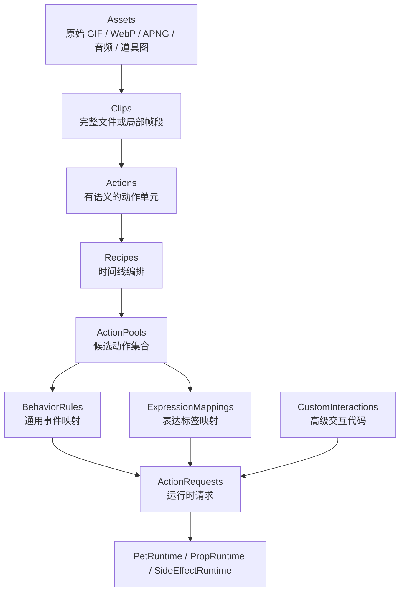

层级含义：

- `Assets` 是原始素材文件，例如 GIF、WebP、APNG、音频、道具图片。
- `Clip` 是最小播放片段，可以是完整文件，也可以是某个文件的帧区间。
- `Action` 是语义动作，例如 `thinking`、`objecting`、`sleep`、`walk`。
- `Recipe` 是时间线编排层，描述一个动作或一个场景如何播放。
- `ActionPool` 是动作候选集合，用于随机 idle、点击、LLM 表达标签等场景。
- `BehaviorRule` 把通用事件映射成 ActionRequest。
- `ExpressionMapping` 把 LLM 输出的表达标签映射到动作候选。
- `CustomInteraction` 是需要代码的高级玩法，例如检察官徽章。
- `ActionRequest` 是最终送入运行时的语义请求。

## 推荐皮肤包结构

```text
skins/miles-edgeworth/
  manifest.json
  behavior.json
  interactions/
    takethat.ts
  assets/
    body/
      idle/
      locomotion/
      gestures/
      rest/
      startup/
      raw/
    props/
      prosecutor_badge/
    audio/
  generated/
    clips/
```

职责划分：

| 路径 | 职责 | 是否人工维护 |
| --- | --- | --- |
| `manifest.json` | 描述皮肤能力：canvas、anchors、clips、actions、recipes、actionPools、expressionMappings、fallback | 是 |
| `behavior.json` | 描述默认行为：idle 随机、点击区域、双击、右键菜单、agent 状态映射 | 是 |
| `interactions/` | 高级可信交互代码，例如检察官徽章、复杂道具、特殊音效流程 | 是 |
| `assets/` | 正本素材，按资源语义组织 | 是 |
| `generated/` | 从 frameRange、压缩、格式转换生成的派生素材 | 否 |

推荐按资源语义组织素材，而不是按触发来源组织素材。比如抱胸思考既可以用于随机 idle，也可以用于 agent thinking，正本素材只保留一份，触发差异通过 Recipe / ActionPool / BehaviorRule 表达。

可选支持快捷导入目录，用来降低普通换肤门槛：

```text
quick/
  idle-random/
  click/
  double-click/
  shake/
  thinking/
  speaking/
```

`quick/` 是导入便利，不是核心架构。导入器可以根据目录生成 manifest / behavior 草稿；高级皮肤仍应使用 `assets/`、Clip、Action、Recipe 和 BehaviorRule 明确表达素材语义。快捷导入阶段允许出现重复素材，生成正式配置后应尽量归并到同一 Action / Recipe。

## 素材要求

### Canvas

每个皮肤需要声明一个逻辑画布。画布决定桌宠主体窗口的基础尺寸，也决定不同动画之间如何对齐。

```json
{
  "canvas": {
    "width": 240,
    "height": 240,
    "scale": 1,
    "transparent": true
  }
}
```

建议约定：

- 同一皮肤的主体动画尽量使用相同 canvas 尺寸。
- 素材背景应透明，避免出现白底或黑边。
- 动画主体应围绕同一个 anchor 对齐，尤其是脚底中心点。
- 道具和飞出物优先走 PropRuntime，不为了容纳飞行道具扩大主体窗口。

### Anchor

Anchor 用来对齐不同动作，也用于移动系统计算“角色站在哪里”。

```json
{
  "anchors": {
    "body": {
      "type": "foot_center",
      "x": 120,
      "y": 220
    },
    "bubble": {
      "type": "top_center",
      "x": 120,
      "y": 24
    }
  }
}
```

常用 anchor：

| Anchor | 用途 |
| --- | --- |
| `body` | 身体主锚点，移动和动作切换以它对齐 |
| `bubble` | 气泡位置 |
| `hand_left` / `hand_right` | 道具、特效、抛出物起点 |
| `head` | 点击区域和视线追随等高级交互 |

### Hit Zone

Hit zone 描述鼠标点击区域。普通换肤可以只提供粗略矩形，高级皮肤可以提供 polygon 或 alpha mask。

```json
{
  "hitZones": {
    "head": {
      "type": "rect",
      "x": 88,
      "y": 24,
      "width": 56,
      "height": 48
    },
    "body": {
      "type": "alphaMask",
      "asset": "assets/body/idle/stand-right.gif",
      "alphaThreshold": 16
    }
  }
}
```

MVP 可以先实现主体窗口层面的命中和少量矩形区域；真正“只点到不透明像素才算点击”的能力后续通过 alpha mask 或平台层 hit test 扩展。

## Assets

Assets 是皮肤包中的正本素材。它们只回答“文件在哪里”，不回答“什么时候播放”。

推荐命名：

```text
assets/body/idle/stand-right.gif
assets/body/idle/stand-left.gif
assets/body/gestures/thinking-right.gif
assets/body/gestures/thinking-left.gif
assets/body/locomotion/walk-east.gif
assets/props/prosecutor_badge/badge.png
assets/audio/takethat.wav
```

旧版素材可以先放在 `assets/body/raw/`，等语义确认后再逐步整理到对应目录。迁移期间也可以保留 qrc alias，例如当前运行时里的 `qrc:/pet/thinking-right.gif`。

## Clip

Clip 是最小播放片段，只描述“从哪个素材取哪一段”。完整 GIF、局部帧段、派生文件都可以表示成 Clip。

字段建议：

| 字段 | 类型 | 说明 |
| --- | --- | --- |
| `file` | string | 原始素材或派生素材路径 |
| `frameRange` | `[start, end]` | 可选，闭区间帧段 |
| `durationMs` | number | 可选，用于单帧 hold 或派生素材时长 |
| `loop` | boolean | 可选，提示该 clip 是否天然可循环 |
| `anchorOffset` | object | 可选，修正该 clip 的锚点偏移 |
| `generatedFrom` | object | 可选，记录派生 clip 的来源 |

示例：

```json
{
  "clips": {
    "thinking_full_right": {
      "file": "assets/body/raw/once/4.gif"
    },
    "thinking_enter_right": {
      "file": "assets/body/raw/once/4.gif",
      "frameRange": [1, 4]
    },
    "thinking_loop_right": {
      "file": "assets/body/raw/once/4.gif",
      "frameRange": [5, 8],
      "loop": true
    },
    "thinking_exit_right": {
      "file": "assets/body/raw/once/4.gif",
      "frameRange": [44, 47]
    }
  }
}
```

在 Qt/QML 暂未支持 GIF 局部帧播放时，`frameRange` 仍然作为源数据记录。asset compiler 可以把这些 clip 导出成派生 GIF/WebP/APNG：

```text
assets/body/raw/once/4.gif + frameRange [5, 8]
=> generated/clips/thinking-loop-right.webp
```

## Action

Action 是语义动作。外部模块请求 Action，Clip 保持为内部播放片段。

字段建议：

| 字段 | 类型 | 说明 |
| --- | --- | --- |
| `label` | string | 给人看的名称 |
| `category` | string | `idle`、`gesture`、`locomotion`、`agent`、`prop` 等 |
| `tags` | string[] | 检索和表达映射用标签 |
| `priority` | number | 默认优先级，可被请求覆盖 |
| `loopMode` | string | 单段动作的播放模式 |
| `variants` | object | 单段动作的朝向变体 |
| `phases` | object | 多阶段动作定义 |
| `initialPhase` | string | 多阶段动作入口 |
| `exitPhase` | string | 需要退出时播放的阶段 |
| `fallbackAction` | string | 可选，动作不可用时的兜底 |

单段动作：

```json
{
  "actions": {
    "objecting": {
      "label": "异议",
      "category": "gesture",
      "loopMode": "onceThenIdle",
      "priority": 40,
      "tags": ["objecting", "speaking", "emphasis"],
      "variants": {
        "right": { "clip": "objecting_right" },
        "left": { "clip": "objecting_left" }
      }
    }
  }
}
```

多阶段动作：

```json
{
  "actions": {
    "thinking": {
      "label": "抱胸思考",
      "category": "cognitive",
      "tags": ["thinking", "cognitive"],
      "initialPhase": "enter",
      "exitPhase": "exit",
      "phases": {
        "enter": {
          "loopMode": "once",
          "variants": {
            "right": { "clip": "thinking_enter_right" },
            "left": { "clip": "thinking_enter_left" }
          }
        },
        "loop": {
          "loopMode": "loop",
          "variants": {
            "right": { "clip": "thinking_loop_right" },
            "left": { "clip": "thinking_loop_left" }
          }
        },
        "exit": {
          "loopMode": "onceThenIdle",
          "variants": {
            "right": { "clip": "thinking_exit_right" },
            "left": { "clip": "thinking_exit_left" }
          }
        }
      }
    }
  }
}
```

常见 phase：

| Phase | 用途 |
| --- | --- |
| `main` | 单段动作主体 |
| `enter` | 进入姿态 |
| `loop` | 可循环保持段 |
| `hold` | 保持某一帧或某个姿态 |
| `exit` | 离开姿态 |
| `recover` | 被打断或特殊状态恢复 |

## 朝向和移动方向

不同皮肤可以声明不同的朝向模型。Miles 皮肤当前采用静止动作 `right` / `left`、移动动作 8 方向；其他皮肤可以只提供正面、提供 4 方向、提供等距视角方向，或通过镜像生成缺失方向。

运行时只依赖 manifest 里声明的 `facings`、`movementDirections`、`variants` 和 `directionFallbacks`，不把 `right/left` 或 8 方向写死成全局规则。

Miles 皮肤可以这样声明：

```json
{
  "facings": ["right", "left"],
  "defaultFacing": "right",
  "movementDirections": ["east", "west", "north", "south", "northEast", "northWest", "southEast", "southWest"],
  "directionFallbacks": {
    "northEast": ["east", "north", "right", "default"],
    "northWest": ["west", "north", "left", "default"],
    "southEast": ["east", "south", "right", "default"],
    "southWest": ["west", "south", "left", "default"],
    "east": ["right", "default"],
    "west": ["left", "default"]
  }
}
```

简单正面皮肤可以这样声明：

```json
{
  "facings": ["front"],
  "defaultFacing": "front",
  "movementDirections": [],
  "directionFallbacks": {
    "default": ["front"]
  }
}
```

4 方向皮肤可以这样声明：

```json
{
  "facings": ["front", "back", "left", "right"],
  "defaultFacing": "front",
  "movementDirections": ["east", "west", "north", "south"],
  "directionFallbacks": {
    "northEast": ["east", "north", "right", "front"],
    "northWest": ["west", "north", "left", "front"],
    "southEast": ["east", "south", "right", "front"],
    "southWest": ["west", "south", "left", "front"]
  }
}
```

Action 的 `variants` 使用皮肤声明过的 key。站立动作可以只提供左右：

```json
{
  "actions": {
    "idle_stand": {
      "label": "站立",
      "category": "idle",
      "loopMode": "loop",
      "variants": {
        "right": { "clip": "stand_right" },
        "left": { "clip": "stand_left" }
      }
    }
  }
}
```

正面皮肤也可以只提供一个 `front`：

```json
{
  "actions": {
    "idle_stand": {
      "label": "站立",
      "category": "idle",
      "loopMode": "loop",
      "variants": {
        "front": { "clip": "stand_front" }
      }
    }
  }
}
```

移动动作可以按皮肤能力提供方向变体：

```json
{
  "actions": {
    "walk": {
      "label": "行走",
      "category": "locomotion",
      "loopMode": "loop",
      "variants": {
        "east": { "clip": "walk_east" },
        "west": { "clip": "walk_west" },
        "north": { "clip": "walk_north" },
        "south": { "clip": "walk_south" },
        "northEast": { "clip": "walk_north_east" },
        "northWest": { "clip": "walk_north_west" },
        "southEast": { "clip": "walk_south_east" },
        "southWest": { "clip": "walk_south_west" }
      }
    }
  }
}
```

运行时选择 variant 的顺序：

1. 如果请求来自移动系统，优先使用量化后的 `movementDirection`。
2. 如果请求来自普通动作，优先使用当前 `facing`。
3. 当前 key 不存在时，按 `directionFallbacks` 查找候选。
4. 仍然找不到时，使用 action 自己的 `defaultVariant` 或皮肤的 `defaultFacing`。

镜像生成可以作为后续 asset compiler 能力，例如皮肤只提供 `right`，manifest 标记 `left` 可由 `right` 镜像生成。MVP 阶段先使用显式素材和 fallback。

## Recipe

Recipe 是动画系统里的时间线编排层。它既可以编排一个 Action 内部的 phase，也可以编排多个 Action、等待、条件和副作用。

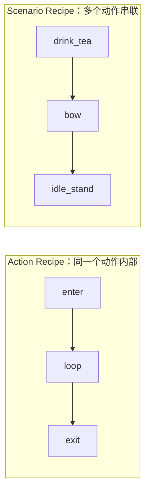

Recipe 字段建议：

| 字段 | 类型 | 说明 |
| --- | --- | --- |
| `scope` | string | `action` 或 `scenario` |
| `action` | string | action recipe 绑定的动作 |
| `pattern` | string | `once`、`loop`、`enterLoopExit`、`sequence` 等 |
| `steps` | array | 时间线步骤 |
| `facing` | string | 可选，播放前切换朝向；当前实现支持具体朝向、`$current`、`$opposite` |
| `params` | object | 可选，声明运行时参数 |
| `autoReturn` | string | 可选，结束后返回的 action 或 state |

示例：

```json
{
  "recipes": {
    "thinking.idleOnce": {
      "scope": "action",
      "action": "thinking",
      "pattern": "enterLoopExit",
      "steps": [
        { "phase": "enter", "repeat": 1 },
        { "phase": "loop", "repeat": 10 },
        { "phase": "exit", "repeat": 1 }
      ],
      "autoReturn": "idle"
    },
    "thinking.holdUntilCancelled": {
      "scope": "action",
      "action": "thinking",
      "pattern": "enterLoopExit",
      "steps": [
        { "phase": "enter", "repeat": 1 },
        { "phase": "loop", "repeat": "untilCancelled" },
        { "phase": "exit", "repeat": 1 }
      ]
    },
    "tea.drinkThenBow": {
      "scope": "scenario",
      "pattern": "sequence",
      "steps": [
        { "action": "drink_tea", "recipe": "tea.loopForDuration" },
        { "action": "bow", "recipe": "once" },
        { "action": "idle_stand", "recipe": "loop" }
      ]
    }
  }
}
```

Step 类型：

| Step | 说明 |
| --- | --- |
| `{ "phase": "loop", "repeat": 10 }` | 播放当前 action 的某个 phase |
| `{ "action": "bow", "recipe": "once" }` | 播放另一个 action recipe |
| `{ "waitMs": 300 }` | 等待一段时间 |
| `{ "sideEffect": { ... } }` | 触发气泡、音效等副作用 |
| `{ "condition": { ... }, "then": [...] }` | 后续扩展，用上下文决定分支 |

运行时参数：

```json
{
  "recipes": {
    "tea.loopForDuration": {
      "scope": "action",
      "action": "drink_tea",
      "params": {
        "durationMs": { "type": "number", "default": 5000, "min": 1000, "max": 30000 }
      },
      "steps": [
        { "phase": "loop", "durationMs": { "param": "durationMs" } }
      ]
    }
  }
}
```

运行时请求：

```json
{
  "action": "drink_tea",
  "recipe": "tea.loopForDuration",
  "recipeParams": {
    "durationMs": 12000
  }
}
```

MVP 可以先实现固定 `repeat` / `durationMs`、`repeat: "untilCancelled"`、`once`、`loop`、`enterLoopExit` 和最小 `sequence`。

### Recipe Pattern 分类

Recipe Pattern 是 Recipe 的常见模板和执行语义。运行时最终执行的是 `steps`；`pattern` 帮助人、导入器、校验器理解这个 Recipe 属于哪类播放计划。

| Pattern | 说明 | 典型用途 |
| --- | --- | --- |
| `once` | 播放一次，不自动决定后续去向 | scenario recipe 里的短动作步骤 |
| `loop` | 持续循环，直到被调度器或外部事件切走 | 站立、睡眠循环、agent thinking loop |
| `onceThenIdle` | 播放一次，然后回到当前朝向的 idle | 鞠躬、看表、抬头看、异议 |
| `onceThenNext` | 播放一次，然后接指定 action 或 recipe | 启动序列、入睡后接睡眠循环 |
| `enterLoopExit` | 进入段一次，中间段循环或保持，退出段一次 | thinking、speaking、sleep、tea |
| `holdUntilReleased` | 进入稳定姿态并停住，释放事件到来后恢复 | 旧版拖拽晃动后的 crouch |
| `movementDriven` | 移动路线控制窗口位置，动画根据移动方向切换 | walk / run |
| `scriptedSequence` | 多个 action、side effect、等待和条件分支组合 | 启动公文包、丢检察官徽章 |

`pattern` 不是新的架构层，不应该绕开 `steps` 单独驱动播放。实现上可以先支持少量 pattern，再逐步扩展。

### Recipe 与事件边界

强顺序关系用 Recipe 表达；松散关系用事件表达。

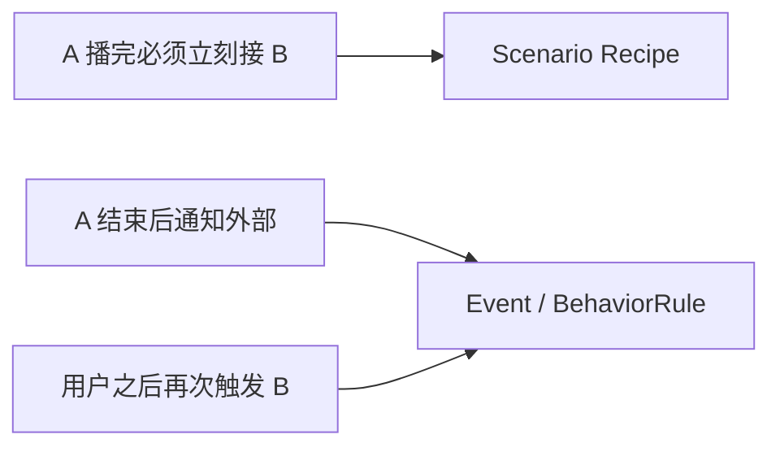

例如“喝红茶循环一段时间后必须鞠躬”应写成 `tea.drinkThenBow` 这类 scenario recipe。用户点击徽章、agent 状态变化、动作结束后记录日志这类弱关系，应通过事件重新进入 BehaviorRule 或 Custom Interaction。

## ActionPool

ActionPool 是动作候选集合，用于多个触发来源复用同一组动作。

```json
{
  "actionPools": {
    "idle.random": [
      { "action": "check_watch", "recipe": "once", "weight": 20 },
      { "action": "shrug", "recipe": "once", "weight": 20 },
      { "action": "thinking", "recipe": "thinking.idleOnce", "weight": 10 }
    ],
    "click.head": [
      { "action": "tap_head", "recipe": "once", "weight": 80 },
      { "action": "annoyed", "recipe": "once", "weight": 20 }
    ],
    "ai.thinking": [
      { "action": "thinking", "recipe": "thinking.holdUntilCancelled", "weight": 100 }
    ]
  }
}
```

字段建议：

| 字段 | 说明 |
| --- | --- |
| `action` | 候选 action id |
| `recipe` | 候选 recipe id，缺省时使用 action 默认 recipe |
| `weight` | 随机权重 |
| `when` | 可选，候选级过滤条件 |
| `cooldownMs` | 可选，避免短时间重复 |

选择策略：

| 策略 | 说明 |
| --- | --- |
| `weighted_random` | 按权重随机 |
| `first_available` | 选第一个可用动作 |
| `round_robin` | 轮流播放，减少重复感 |
| `contextual` | 后续扩展，根据状态、最近动作、屏幕位置选择 |

## ExpressionMapping

ExpressionMapping 把 LLM 输出的表达标签映射到 ActionPool 或具体 action。表达标签由当前皮肤声明。

```json
{
  "expressionMappings": {
    "annoyed": {
      "strategy": "weighted_random",
      "pool": [
        { "action": "crossed_thinking", "recipe": "crossed.sayThenExit", "weight": 50 },
        { "action": "objecting", "recipe": "once", "weight": 30 },
        { "action": "check_watch", "recipe": "once", "weight": 20 }
      ],
      "fallback": "neutral"
    },
    "polite": {
      "action": "bow",
      "recipe": "once"
    }
  }
}
```

模型只需要知道当前皮肤暴露的标签，例如 `neutral`、`annoyed`、`polite`、`confident`。具体动作由皮肤配置决定。

## BehaviorRule

BehaviorRule 把通用事件映射成 ActionRequest。

```json
{
  "behaviors": {
    "pointer.singleClick": [
      {
        "when": { "hitZone": "head", "state": "idle" },
        "pool": "click.head",
        "priority": 50
      }
    ],
    "agent.thinking.started": [
      {
        "pool": "ai.thinking",
        "priority": 70,
        "interruptHint": "afterCurrent"
      }
    ],
    "menu.drinkTea": [
      {
        "recipe": "tea.once",
        "priority": 60
      }
    ]
  }
}
```

Rule 字段建议：

| 字段 | 说明 |
| --- | --- |
| `when` | 匹配条件，例如状态、朝向、hitZone、是否拖拽中 |
| `action` | 直接请求某个 action |
| `recipe` | 请求某个 recipe |
| `pool` | 从 action pool 中选择候选 |
| `expression` | 请求某个 expression mapping |
| `priority` | 请求优先级 |
| `interruptHint` | `replace` 或 `afterCurrent` |
| `sideEffects` | 气泡、音效等副作用 |

推荐事件命名：

| 事件 | 用途 |
| --- | --- |
| `lifecycle.started` | 桌宠启动 |
| `idle.timer` | idle 随机触发 |
| `movement.started` / `movement.ended` | 移动开始和结束 |
| `pointer.singleClick` | 单击 |
| `pointer.doubleClick` | 双击 |
| `pointer.drag.started` / `pointer.drag.ended` | 拖拽 |
| `pointer.shake.started` / `pointer.shake.ended` | 晃动 |
| `menu.<id>` | 右键菜单项 |
| `agent.thinking.started` / `agent.thinking.ended` | agent 思考 |
| `agent.speaking.started` / `agent.speaking.ended` | agent 输出 |
| `llm.expression.requested` | LLM 请求表达标签 |
| `prop.<id>.clicked` / `prop.<id>.expired` | 道具事件 |

## Custom Interaction

复杂玩法使用 Custom Interaction，BehaviorRule 保持为通用事件映射层。

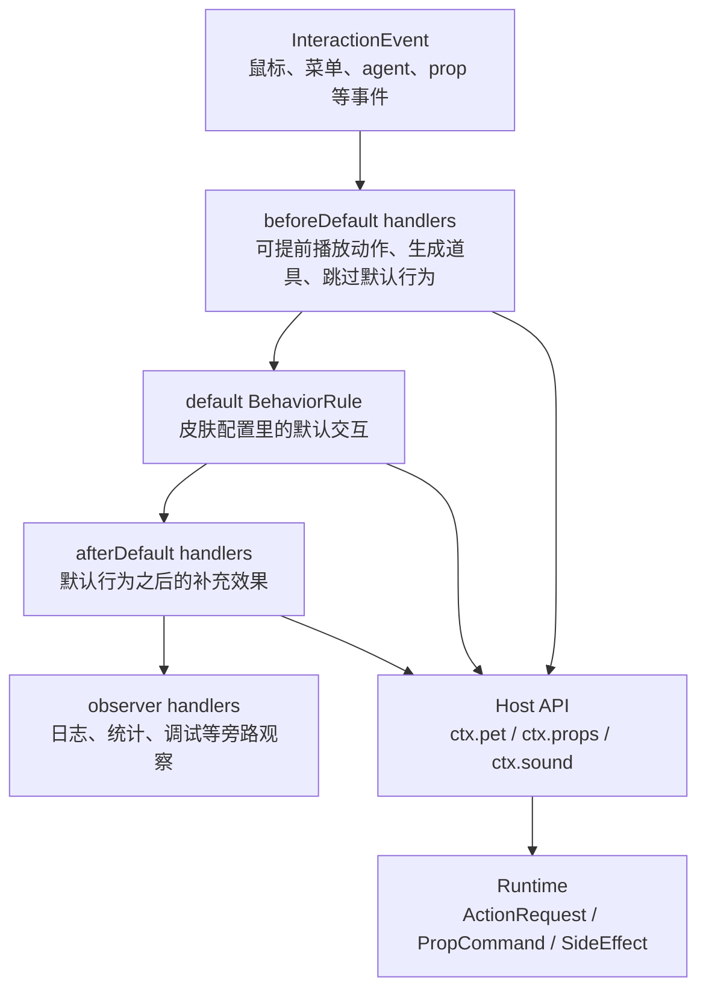

Hook point：

| Hook | 说明 |
| --- | --- |
| `beforeDefault` | 默认 BehaviorRule 之前执行，可以调用 `ctx.skipDefault()` |
| `afterDefault` | 默认 BehaviorRule 之后执行，适合补音效、补道具 |
| `observer` | 旁路观察，适合日志、统计、调试 |

`handled` 和 `skipDefault` 分开表达。一个 handler 可以做了事情但继续执行默认逻辑，也可以明确跳过默认逻辑。

Host API：

| API | 产物 |
| --- | --- |
| `ctx.pet.playAction()` | ActionRequest |
| `ctx.pet.showBubble()` | SideEffect |
| `ctx.props.spawn()` | PropCommand |
| `ctx.props.remove()` | PropCommand |
| `ctx.sound.play()` | SideEffect |
| `ctx.menu.setEnabled()` | SideEffect |
| `ctx.skipDefault()` | 控制 Interaction Pipeline |

对脚本作者来说，Custom Interaction 应该是“写一段处理逻辑”，不是填写一组固定命令。脚本调用 Host API 后，系统内部再把调用结果转换为标准产物：

```text
ctx.pet.playAction() => ActionRequest
ctx.props.spawn()    => PropCommand
ctx.sound.play()     => SideEffect
ctx.skipDefault()    => InteractionFlow
```

核心框架仍由 C++ / QML 实现，包括窗口能力、PetRuntime、PropRuntime、动画播放器和跨平台输入事件。未来开放第三方高级交互时，更适合让可信皮肤包使用 JS/TS 脚本编写概率逻辑、事件监听、道具生命周期和简单状态机。C++ 插件需要用户处理编译器、Qt、CMake 和多平台动态库兼容，普通换肤用户很难承受。

脚本安全边界：

- 普通皮肤只允许 manifest / behavior 配置。
- 高级脚本必须标记为 trusted interaction，用户明确启用。
- 脚本不能直接访问 PetRuntime 内部对象，只能通过 `ctx` Host API。
- 脚本需要音频、文件、网络或外部命令等能力时，应单独声明和确认权限。

检察官徽章示例：

```text
pointer.doubleClick.beforeDefault
  30% 概率触发
  播 takethat 音效
  播 takethat 动作
  spawn prosecutor_badge prop
  skip default double click

prop.prosecutor_badge.clicked
  remove badge
  request bow

prop.prosecutor_badge.expired
  request pick_badge
```

第一版可以先把 Miles 专属玩法作为内置 C++ / QML interaction 实现。未来如果开放第三方 JS/TS 脚本，需要标记为 trusted interaction，并提供权限确认和可关闭入口。

## Prop

Prop 是桌宠主体以外的临时对象，例如检察官徽章、掉落物、漂浮表情、鼠标跟随眼睛光标。

```json
{
  "props": {
    "prosecutor_badge": {
      "asset": "assets/props/prosecutor_badge/badge.png",
      "anchor": "hand_right",
      "lifetimeMs": 3000,
      "hitTest": "alpha",
      "events": {
        "clicked": "prop.prosecutor_badge.clicked",
        "expired": "prop.prosecutor_badge.expired"
      }
    }
  }
}
```

PropRuntime 负责：

- 生成、移动、命中测试、销毁 prop。
- 把 clicked / expired / collided 等事件重新送回 Interaction Pipeline。
- 让主体动画和道具生命周期解耦。

## ActionRequest

ActionRequest 是最终送入 PetRuntime 的请求。

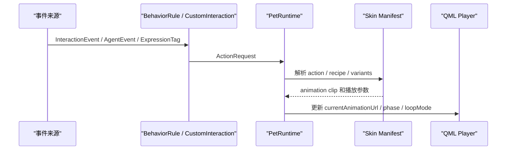

字段建议：

| 字段 | 说明 |
| --- | --- |
| `source` | `behavior`、`chat`、`agent`、`menu`、`customInteraction` |
| `action` | 目标 action |
| `expression` | 目标 expression |
| `recipe` | 目标 recipe |
| `recipeParams` | recipe 运行时参数 |
| `priority` | 优先级 |
| `interruptHint` | `replace` 或 `afterCurrent` |
| `expiresInMs` | 请求过期时间 |
| `sideEffects` | 气泡、音效等副作用 |

示例：

```json
{
  "source": "behavior",
  "action": "thinking",
  "recipe": "thinking.holdUntilCancelled",
  "recipeParams": {},
  "interruptHint": "afterCurrent",
  "priority": 70,
  "sideEffects": [
    { "type": "bubble", "text": "让我想想。" }
  ]
}
```

`interruptHint` 是请求级策略：

```text
replace       立即切换，默认值
afterCurrent  等当前 recipe 到达自然边界后切换
```

运行时只维护一个 `pendingRequest` 槽位。新的 `afterCurrent` 请求会覆盖旧的 pending 请求；`replace` 请求会立即尝试替换当前动作。

## 典型场景走读

### 随机 idle

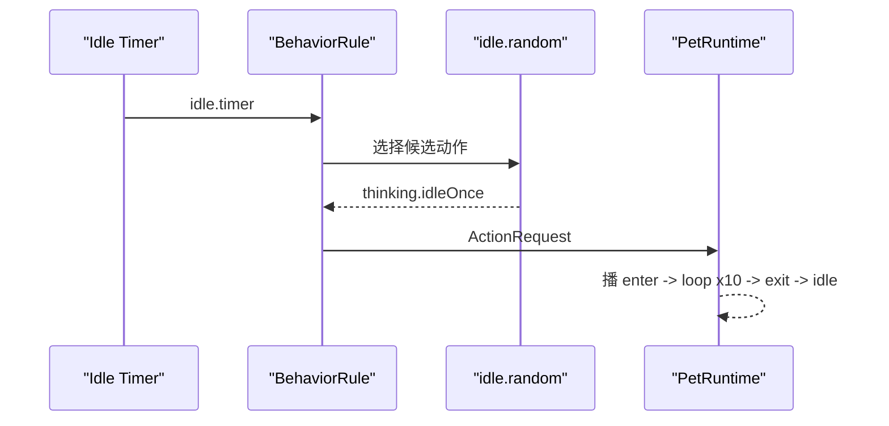

### Agent thinking

```text
agent.thinking.started
=> pool ai.thinking
=> action thinking + recipe thinking.holdUntilCancelled
=> enter once
=> loop untilCancelled
=> agent.thinking.ended
=> exit once
=> speaking 或 idle
```

### LLM 表达标签

```text
LLM 输出 expression = annoyed
=> expressionMappings.annoyed
=> weighted_random 选择 objecting / crossed_thinking / check_watch
=> PetRuntime 根据当前朝向选择 variant
```

### 双击和检察官徽章

```text
pointer.doubleClick
=> beforeDefault: takethat interaction 30% 触发
=> 触发时 spawn badge 并 skipDefault
=> 未触发时进入默认双击 pool
```

## 从旧 GIF 到正式配置的迁移例子

以 `gifs/once/4.gif` 抱胸思考为例，素材盘点记录：

```text
1-4 帧：enter
5-8 帧：loop
44-47 帧：exit
```

迁移链路：

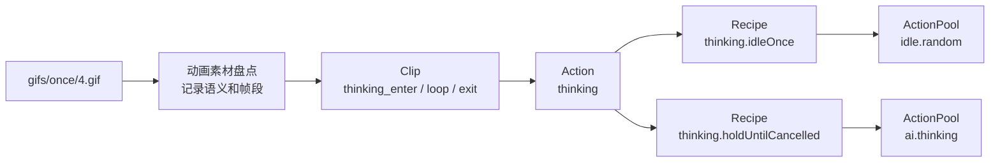

配置片段：

```json
{
  "clips": {
    "thinking_enter_right": { "file": "assets/body/raw/once/4.gif", "frameRange": [1, 4] },
    "thinking_loop_right": { "file": "assets/body/raw/once/4.gif", "frameRange": [5, 8], "loop": true },
    "thinking_exit_right": { "file": "assets/body/raw/once/4.gif", "frameRange": [44, 47] }
  },
  "actions": {
    "thinking": {
      "label": "抱胸思考",
      "phases": {
        "enter": { "variants": { "right": { "clip": "thinking_enter_right" } } },
        "loop": { "variants": { "right": { "clip": "thinking_loop_right" } } },
        "exit": { "variants": { "right": { "clip": "thinking_exit_right" } } }
      }
    }
  }
}
```

同一个 `thinking` action 可以在 idle 中短循环，也可以在 agent thinking 中持续循环。差异放在 Recipe，不需要复制素材。

## 校验规则

静态检查应覆盖：

| 检查项 | 说明 |
| --- | --- |
| action 引用 | states、recipes、pools、behavior 里的 action 必须存在 |
| clip 引用 | variants 里的 clip 必须存在 |
| recipe 引用 | pool、behavior、scenario step 里的 recipe 必须存在 |
| phase 引用 | recipe step 里的 phase 必须存在于 action |
| facing fallback | 每个动作至少有默认朝向或 fallback |
| action pool 权重 | 权重应为正数，总权重大于 0 |
| recipeParams | 参数类型、默认值、范围合法 |
| behavior event | event 名称应符合命名规范 |
| prop event | prop 的 clicked / expired 事件应能被处理 |
| qrc / file | 运行时需要的素材路径应可解析 |

运行时校验应覆盖：

- 未知 expression 降级到 `neutral` 或 fallback action。
- 缺少当前朝向时选择可用 fallback。
- `afterCurrent` 遇到无限 loop 时以 loop cycle 作为自然边界。
- 请求过期后丢弃。
- Custom Interaction 只能通过 Host API 修改系统状态。

## 当前实现和 Phase 0.8

当前 `apps/desktop/resources/skins/miles-edgeworth/manifest.json` 已接入：

- `schemaVersion: 2`
- `facings`
- `states`
- `actions`
- `variants`
- `loopMode`
- `phases`
- `recipes`
- `actionPools`
- `fallbackAction`

Phase 0.8 当前落地范围：

1. manifest 已增加 `recipes` 和 `actionPools`。
2. `idle_stand`、`thinking`、`objecting`、`bow`、`tea`、`sleep` 已有最小 recipe 入口。
3. `tea.once` 已作为菜单 recipe 接入，用于验证菜单事件进入 PetRuntime 后播放指定 action。
4. `idle.random` 已作为随机待机候选池接入，当前放入思考、鞠躬、异议三个候选。
5. `menu.tea` 和 `ai.thinking` 已作为后续菜单事件、Agent 状态事件的候选池雏形。
6. PetRuntime 已提供 `playRecipe`、`playActionFromPool`、`triggerIdle` 三个入口。
7. `tests/check_phase_0_8_recipe_runtime.py` 负责检查最小 manifest 结构、运行时入口和 QML idle timer。

当前执行模型保持轻量：

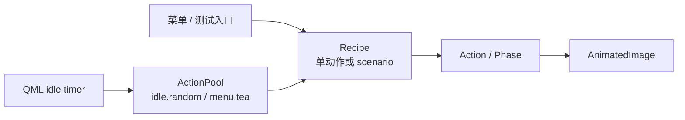

`recipe.steps` 目前支持按顺序播放 action。当前实现已经能覆盖：

```text
tea.once -> tea -> idle_stand
objecting -> idle_stand
bow -> idle_stand
sleep.enter -> sleep.loop，returnToIdle 时 sleep.exit -> idle_stand
```

`repeat`、`durationMs`、动态 recipe 参数、等待 step、条件 step、sideEffects 和 prop 事件仍属于后续扩展字段。

## 当前实现和 Phase 0.9

Phase 0.9 开始还原旧版的基础生命感，重点是“启动后不是静止站着”和“待机时偶尔自己动一动”。

当前已接入：

- `startup.briefcase`：启动时按 `briefcase_in -> briefcase_stop -> idle_stand` 播放。
- `turn_around`：转身动作带 `facingAfter`，动画播完后更新当前朝向，再回到对应朝向的站立。
- `idle_thinking_once`：随机 idle 使用一次性思考动作，Agent thinking 继续使用可持续循环的 `thinking`。
- `idle.random`：候选池包含思考、转身、轻敲脑袋、耸肩、看表、指点、鞠躬和异议。
- `startStartupSequence`：运行时启动入口，当前在 `PetRuntime` 初始化后自动触发。
- `testTurn`：临时菜单测试入口，方便手动验证转身和朝向切换。

这一阶段的重点是先恢复“看起来活着”的待机层。移动驱动动画、点击区域、双击音效、拖拽晃动和检察官徽章会继续沿着同一套 `Action -> Recipe -> ActionPool -> BehaviorRule / CustomInteraction` 模型接入。

## 当前实现和 Phase 0.10

Phase 0.10 接入旧版 8 方向 walk / run 的最小移动驱动骨架。它先采用旧版的“动画帧驱动窗口移动”方式，后续再升级为 `moveTo(x, y)` 和路线控制器。

当前已接入：

- `movementDirections`：按旧版方向顺序声明 `east / west / northEast / northWest / southEast / southWest / north / south`。
- `walk` / `run`：各自提供 8 个方向 variant。
- `movement.dx / movement.dy`：每个 variant 声明当前动画每一帧推动窗口移动的增量。
- `briefcase_in`：启动入场动画也声明移动增量，用来还原旧版打开应用时边走边入场的感觉。
- `walk.*` / `run.*` recipe：每个方向都有一个 recipe，用于 actionPool 或后续移动规划调用。
- `consumeFrameMovementDelta`：QML 在动画帧变化时从 PetRuntime 取出移动增量，并移动桌宠窗口。
- `testWalk` / `testRun`：临时菜单测试入口。

当前实现仍然是兼容旧版手感的过渡层：

```text
AnimatedImage.currentFrameChanged
  -> PetRuntime.consumeFrameMovementDelta()
  -> petWindow.x/y += dx/dy
```

后续移动系统会把职责前移到路线控制器：

```text
moveTo(target)
  -> route planner
  -> movement direction per tick
  -> walk/run action
  -> window movement
```

多显示器跨屏和完整路线规划，仍属于后续移动控制器的职责。

## 当前实现和 Phase 0.11

Phase 0.11 接入旧版单击分区反应的最小骨架。旧版是直接在 C++ 里按坐标和朝向写判断；v2 改成由皮肤 manifest 声明 hit zone 和 click action pool。

当前已接入：

- `hitZones`：声明 `face / head / upper_arm / forearm / chest / belly / legs` 七个矩形区域。
- `clickBehaviors.singleClick`：按旧版优先级声明单击时依次检测哪些 click pool。
- `click.face / click.head / click.upperArm / click.forearm / click.chest / click.belly / click.legs`：每个区域对应一个候选动作池。
- `handlePrimaryClick(x, y, width, height)`：QML 把点击坐标交给 PetRuntime，由运行时归一化到 240x240 逻辑画布并选择动作池。
- 新增 `scared`、`back_away`、`idle_look_up`、`idle_look_down` 等单击反应动作。

当前实现先使用矩形区域，目标是恢复“点不同地方有不同反应”的手感和换肤配置入口。Phase 0.21 已支持在同一个 hit zone 下声明不同朝向的矩形区域。后续可以把 `hitZones` 扩展为：

```text
rect      普通换肤最容易写
polygon   更贴近角色轮廓
alphaMask 像素级命中，只点击不透明区域
```

双击、拖拽晃动、检察官徽章、音效和自定义高级交互会继续复用 Interaction Pipeline，而不是把特殊逻辑写死在 QML 里。

## 当前实现和 Phase 0.12

Phase 0.12 接入旧版双击语音动作的最小骨架。旧版双击会随机触发 `Hold it`、`Take that`、`Objection`、`Eureka`，并播放对应语音；其中 `Take that` 会继续触发检察官徽章。

当前已接入：

- `crossed`：双击 `Hold it` 使用的抱臂动作。
- `doubleClick.holdIt / takeThat / objection / eureka`：四个双击 recipe，分别声明动作和默认语音。
- `doubleClick.random`：双击随机动作池。
- `currentSoundUrl` / `soundPlaybackSerial`：PetRuntime 暴露声音播放请求。
- `SoundEffect`：QML 监听 `soundPlaybackSerial` 并播放当前语音。
- `singleClickTimer`：单击延迟确认，避免双击时先触发一次单击分区反应。

当前语音先使用默认语言资源：

```text
holdit0.wav
takethat0.wav
objection0.wav
eureka0.wav
```

后续需要继续接入：

- 更完整的 SideEffectRuntime，让声音、气泡、Prop、动画请求都走统一通道。

## 当前实现和 Phase 0.13

Phase 0.13 接入旧版拖拽晃动的最小骨架。旧版在左键拖拽时统计横向来回改变方向的次数：1 秒内达到 5 次后播放蹲下受惊动画；松手时根据蹲下动画是否已经播到末帧，选择完整站起或快速恢复站起。

当前已接入：

- `drag_crouch`：晃动触发后的蹲下动作，`loopMode` 为 `hold`，QML 在播到最后一帧时暂停画面。
- `drag_stand_up_full`：蹲下动画已经播完后松手，播放完整站起动作。
- `drag_stand_up_quick`：蹲下动画尚未播完时松手，播放快速恢复动作。
- `handleDragStarted(globalX)`：按下左键时初始化晃动识别窗口。
- `handleDragMoved(globalX)`：拖拽过程中统计横向换向次数，超过阈值后触发 `drag_crouch`。
- `handleDragEnded()`：松手后结束晃动识别，并按当前蹲下状态选择恢复动作。
- `handleHoldAnimationReachedEnd()`：QML 在 `hold` 动作到达最后一帧时通知 PetRuntime，供松手分支使用。

运行时流程：

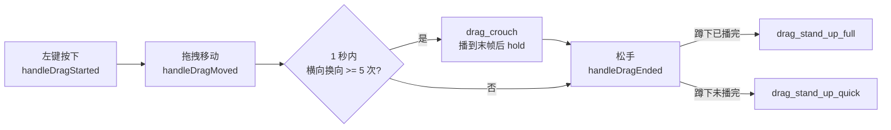

当前阶段仍由 QML 负责拖动窗口，PetRuntime 只负责判断“这个拖拽是否构成晃动交互”。后续进入完整 Interaction Pipeline 时，可以把拖拽、晃动、长按、甩动等识别抽成独立 Gesture Recognizer，并由 BehaviorRule 或 Custom Interaction 决定触发哪个 recipe。

## 当前实现和 Phase 0.14

Phase 0.14 接入旧版检察官徽章的最小 Prop Runtime。旧版双击随机到 `Take that` 后，会先播放语音和异议动作，约 700ms 后飞出检察官徽章；徽章被点击时消失并触发鞠躬，自然飞完时消失并触发捡徽章动作。

当前已接入：

- `props.prosecutor_badge`：声明徽章图片、窗口尺寸、延迟、飞行时长、起点偏移、飞行偏移和后续 recipe。
- `doubleClick.takeThat.prop`：`Take that` recipe 触发 `prosecutor_badge`。
- `pickup_badge` / `pickup.once`：徽章自然消失后播放捡徽章动画。
- `currentPropVisible`、`currentPropImageUrl`、`currentPropStartOffset*`、`currentPropEndOffset*`、`currentPropDurationMs`：PetRuntime 暴露当前 Prop 播放请求。
- `currentPropPlaybackSerial`：同一个 Prop 连续触发时，QML 能重新启动飞行动画。
- `handlePropClicked()`：点击徽章后隐藏 Prop，并播放 `bow.once`。
- `handlePropExpired()`：飞行时间结束后隐藏 Prop，并播放 `pickup.once`。
- `prosecutorBadgeWindow`：QML 独立透明窗口，让徽章能飞出桌宠本体窗口范围。

运行时流程：

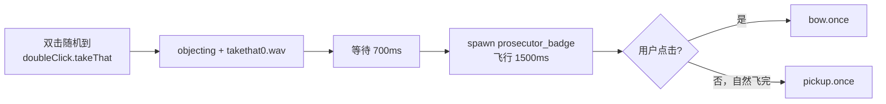

当前实现仍是最小纵切：Prop 数据放在 skin manifest，PetRuntime 负责调度，QML 负责显示独立窗口和飞行动画。后续正式化时，应把 Prop 调度从 `RecipeDefinition.propId` 升级到统一 `sideEffects` / `PropCommand`，支持多个道具、碰撞、轨迹曲线、动画素材和权限边界。

## 当前实现和 Phase 0.15

Phase 0.15 接入旧版右键菜单里的三项核心设置：静音、语音语言和禁止走动。这些设置直接影响桌宠的日常手感，因此先放在 PetRuntime 内部，后续进入 Dashboard 后再迁移到持久化配置。

当前已接入：

- `audioMuted` / `toggleAudioMuted()`：静音后 `playSoundForRecipe()` 不再发出新的声音播放请求。
- `voiceLanguage` / `setVoiceLanguage()`：支持 `jp`、`en`、`zh` 三种语音语言。
- `autoMovementEnabled` / `toggleAutoMovementEnabled()`：关闭后 `consumeFrameMovementDelta()` 始终返回 0，walk / run 动画仍可播放，但窗口不再被推动。
- `sounds`：双击语音 recipe 支持按语言选择 wav。
- 右键菜单增加 `静音`、`禁止走动`、`语音语言 -> 日语 / 英语 / 汉语`。

语音资源映射：

```text
holdit:    holdit0 / holdit1 / holdit2
takethat:  takethat0 / takethat1 / takethat2
objection: objection0 / objection1 / objection2
eureka:    eureka0 / eureka1 / zh fallback to objection2
```

旧版没有 `eureka2.wav`，中文语音时旧逻辑不会进入 Eureka 分支。当前 v2 的 action pool 仍可能随机到 `doubleClick.eureka`，因此中文下先使用 `objection2.wav` 作为 fallback，避免中文语音设置下突然播放日语资源。

后续阶段再扩展：

- `behavior.json`
- `expressionMappings`
- `hitZones`
- `interactions/`
- asset compiler

## 当前实现和 Phase 0.16

Phase 0.16 把旧版菜单里的“喂食红茶”和“睡觉 / 唤醒”接回正式右键菜单。菜单仍由 QML 显示，具体状态规则放在 `PetRuntime`，这样后续托盘菜单、Dashboard 或快捷键复用同一套入口时不会绕开桌宠状态机。

当前落地范围：

- `requestTea()`：菜单请求喝茶时调用 `menu.tea` action pool。睡眠相关状态中会直接忽略，保持旧版“睡觉时不能喂茶”的边界。
- `toggleSleep()`：非睡眠时播放 `sleep.enterLoopExit`；睡眠循环中再次触发则进入 wake / exit phase；入睡或醒来的过渡动画期间不重复触发。
- `sleeping`：当前处在 `sleep.loop` 时为 true，菜单文案显示“唤醒”。
- `sleepTransitioning`：当前处在 `sleep.enter` 或 `sleep.exit` 时为 true，菜单暂时禁用睡眠切换。
- `teaEnabled`：当前不在 `sleep` action 时为 true，用于控制“喂食红茶”菜单项。

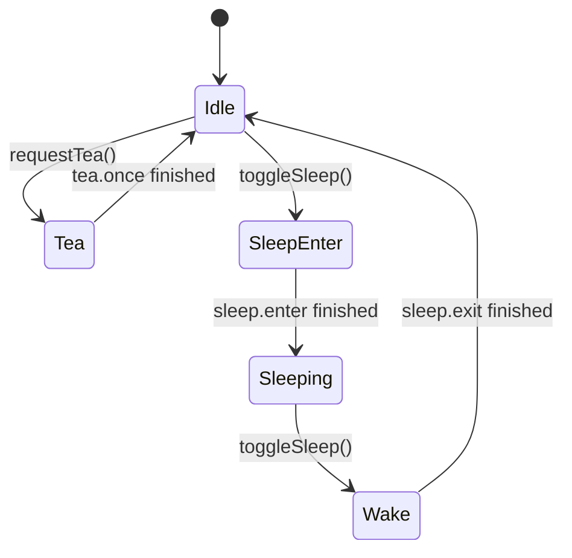

这一步使用 manifest 里的 `tea.once` / `teaAlt.once` 和 `sleep.enterLoopExit`。`tea*.gif` 本体已经包含喝茶后的致意动作，所以菜单喝茶不再额外串联 `bow.gif`。

## 当前实现和 Phase 0.17

Phase 0.17 补齐旧版“喂食红茶”的第二组 GIF，并新增核心手感覆盖检查。旧版菜单触发喝茶时，会按当前朝向在两组茶杯动作中随机选择：右朝向使用 `tea0` 或 `tea2`，左朝向使用 `tea1` 或 `tea3`。v2 现在用两个 action 和两个菜单 recipe 表达这个差异：

```text
tea.once:
  tea -> idle_stand

teaAlt.once:
  tea_alt -> idle_stand

menu.tea:
  weighted random [tea.once, teaAlt.once]
```

新增资源映射：

```text
tea-right.gif      -> gifs/special/tea0.gif
tea-left.gif       -> gifs/special/tea1.gif
tea-alt-right.gif  -> gifs/special/tea2.gif
tea-alt-left.gif   -> gifs/special/tea3.gif
```

`tests/check_phase_0_17_core_handfeel_coverage.py` 用一张清单集中检查 active goal 中已经明确列出的核心体验：

- 随机 idle、站立和转身。
- 8 方向 walk / run 和每帧移动增量。
- 单击分区、双击语音动作。
- 喝茶、睡觉 / 唤醒。
- 拖拽晃动、检察官徽章和音效入口。

这个检查不替代人工试玩，但能在后续重构时快速发现核心能力是否从 manifest、PetRuntime 或 QML 入口中被误删。

## 当前实现和 Phase 0.18

Phase 0.18 增加 `PetRuntimeSmoke` C++ 运行时测试。此前 Phase 0.5 到 Phase 0.17 的检查大多是静态检查，重点是确认 manifest、QML 和 C++ 入口没有丢。`PetRuntimeSmoke` 会直接实例化 `PetRuntime`，在不启动完整 QML 窗口的情况下执行一组核心状态流。

当前 smoke 覆盖：

- 启动后进入 `startup.briefcase`，并按 `briefcase_in -> briefcase_stop -> idle_stand` 推进。
- `turn.once` 播完后更新朝向，并回到站立。
- `walk.east` 能产生向右移动增量；开启“禁止走动”后移动增量归零。
- `requestTea()` 会从两组喝茶 recipe 中选择。
- `toggleSleep()` 会进入 `sleep.enter -> sleep.loop -> sleep.exit -> idle_stand`。
- 睡眠相关状态会禁用喝茶。
- 中文语音会选择 `objection2.wav`。
- 静音时不会发出新的声音播放请求。
- `doubleClick.takeThat` 会进入 `objecting` 动作。

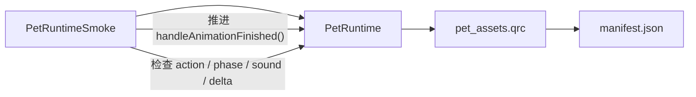

这个测试仍然不能替代人工确认 GIF 画面手感、菜单质感和鼠标拖拽细节，但能证明核心运行时状态机不是“只在文件里存在”。

## 当前实现和 Phase 0.19

Phase 0.19 把旧版移动边界保护迁入桌面壳层。旧版 `moveEvent` 会限制窗口位置，避免随机走路、跑步或拖拽把桌宠移出屏幕。v2 现在由 `DesktopShellController` 提供统一移动入口：

- `movePetWindowBy(dx, dy)`：按增量移动桌宠窗口。
- `movePetWindowTo(x, y)`：移动到指定位置。
- `clampedPetWindowPosition(position)`：根据当前屏幕可用区域夹住窗口坐标。

QML 不再直接修改 `petWindow.x` / `petWindow.y`。自动移动和拖拽都通过 `App.DesktopShell.movePetWindowBy(...)` 进入 C++ 壳层：

```text
AnimatedImage.currentFrameChanged
  -> PetRuntime.consumeFrameMovementDelta()
  -> DesktopShell.movePetWindowBy(dx, dy)
  -> clamp to screen.availableGeometry()

MouseArea.drag
  -> PetRuntime.handleDragMoved(globalX)
  -> DesktopShell.movePetWindowBy(mouse.x - pressX, mouse.y - pressY)
  -> clamp to screen.availableGeometry()
```

当前夹取策略使用窗口外壳尺寸做保守边界。旧版使用角色身体附近的几个点做边界判断，允许透明边缘略微越界。后续如果 skin manifest 声明 body bounds、anchor 或 alpha mask，可以把夹取范围从完整窗口升级成角色主体边界。

## 当前实现和 Phase 0.20

Phase 0.20 开始还原旧版 walk / run 播完后的续行手感。旧版逻辑里，走路或跑步播放到最后一帧后，不会固定回到站立，而是按概率继续移动、换方向或停下。v2 现在把这个决策拆成两层：

- PetRuntime 判断“当前完成的 action 是否需要 follow-up pool”。
- skin manifest 用 `walk.finished` / `run.finished` action pool 描述候选动作和权重。

当前流程：

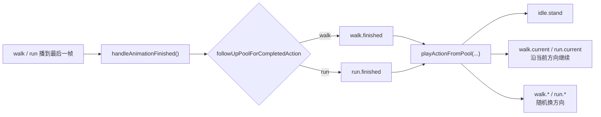

`walk.current` 和 `run.current` 是两个小 recipe：

```json
{
  "action": "walk",
  "movementDirection": "$current"
}
```

`$current` 表示复用 PetRuntime 当前记录的移动方向。这样 `walk.finished` 可以表达“沿当前方向切到跑步”，`run.finished` 可以表达“沿当前方向切到走路”，也可以继续随机抽取 `walk.east`、`run.northWest` 等固定方向 recipe。

这一步仍保留旧版“动画驱动移动”的方式，只让动作之间衔接更自然。未来的路线控制器会把“我要走到哪里”提升为更高层意图，再由路线规划器逐帧选择方向和速度；`walk.finished` / `run.finished` 仍可作为没有明确目标时的自由游走策略。

## 当前实现和 Phase 0.21

Phase 0.21 把单击分区升级为朝向感知。旧版 C++ 里，左右朝向会分别判断脸部、手臂、腿等区域。例如朝右时脸在画布右侧，朝左时脸在画布左侧。v2 允许 `hitZones` 在保留默认区域的同时声明 `variants`：

```json
{
  "face": {
    "type": "rect",
    "x": 122,
    "y": 24,
    "width": 42,
    "height": 44,
    "variants": {
      "right": { "x": 122, "y": 24, "width": 42, "height": 44 },
      "left": { "x": 76, "y": 24, "width": 42, "height": 44 }
    }
  }
}
```

运行时选择点击区域时，会先取当前朝向对应的区域，再回退到默认区域：

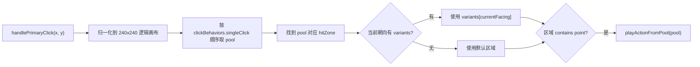

当前 Miles 皮肤已为 `face / head / upper_arm / forearm / chest / belly / legs` 声明左右朝向区域。这样左朝向时点击左侧脸部会触发 `scared`，不会被通用头部区域提前吞掉。

## 当前实现和 Phase 0.22

Phase 0.22 为 hit zone 增加 `polygon` 支持。旧版脸部点击不是矩形，而是类似“头部区域内、再按一条斜线切出脸部”的判断。v2 现在可以用多边形表达这类边界：

```json
{
  "face": {
    "type": "polygon",
    "variants": {
      "right": {
        "polygon": [
          { "x": 148, "y": 0 },
          { "x": 240, "y": 0 },
          { "x": 240, "y": 56 },
          { "x": 102, "y": 56 }
        ]
      },
      "left": {
        "polygon": [
          { "x": 0, "y": 0 },
          { "x": 87, "y": 0 },
          { "x": 133, "y": 56 },
          { "x": 0, "y": 56 }
        ]
      }
    }
  }
}
```

运行时会优先使用当前朝向的 polygon；如果没有 polygon，再回退到 rect：

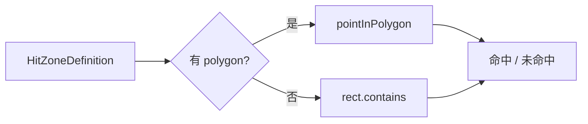

当前只把 `face` 改成 polygon。其它区域仍使用朝向感知 rect，便于后续人工试玩时逐步校准。这个设计也适合换肤作者：简单皮肤继续写 rect，精细皮肤可以为头发、脸、手、尾巴等区域写 polygon。

## 当前实现和 Phase 0.23

Phase 0.23 补上启动入场阶段的鼠标交互保护。旧版在 `BRIEFCASEIN` 阶段会直接忽略鼠标事件，避免用户一打开应用就用点击、双击或拖拽打断公文包入场动画。v2 现在由 PetRuntime 暴露 `pointerInteractionEnabled`：

```text
pointerInteractionEnabled = currentActionId != "briefcase_in"
```

运行时和 QML 都会检查这条边界：

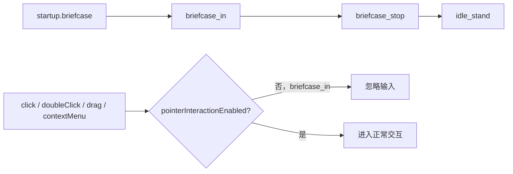

QML 在 `onPressed`、`onPositionChanged`、`onReleased` 和 `onDoubleClicked` 开头检查 `App.PetRuntime.pointerInteractionEnabled`。PetRuntime 的 `handlePrimaryClick`、`handleDoubleClick`、`handleDragStarted`、`handleDragMoved`、`handleDragEnded` 也会检查 `acceptsPointerInteraction()`，用于防止未来其它入口绕过 QML。

## 当前实现和 Phase 0.24

Phase 0.24 为 ActionPool 增加语言上下文覆盖。旧版中文语音模式下不会随机进入 `Eureka` 分支，因为旧资源里没有 `eureka2.wav`；中文双击会落到“异议”语音。v2 用 `poolId.language` 约定表达这个差异：

```json
{
  "doubleClick.random": {
    "entries": [
      { "recipe": "doubleClick.holdIt" },
      { "recipe": "doubleClick.takeThat" },
      { "recipe": "doubleClick.objection" },
      { "recipe": "doubleClick.eureka" }
    ]
  },
  "doubleClick.random.zh": {
    "entries": [
      { "recipe": "doubleClick.holdIt" },
      { "recipe": "doubleClick.takeThat" },
      { "recipe": "doubleClick.objection", "weight": 2 }
    ]
  }
}
```

`playActionFromPool("doubleClick.random")` 会先查找 `doubleClick.random.<voiceLanguage>`，存在时使用语言专用池；不存在时回退到默认池：

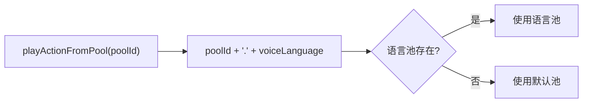

这个规则当前用于双击语音动作，也适合未来皮肤按语言、角色状态或用户偏好覆盖其它候选池。

## 当前实现和 Phase 0.25

Phase 0.25 补齐旧版随机待机池里已经确认语义的 `once/` 动作对。旧版站立循环结束后会从 `once/0..19` 中抽取一次性动作；v2 使用稳定 action id 和 qrc alias 表达这些素材：

```text
once/0,1   -> idle_shrug
once/2,3   -> idle_tapping_head
once/4,5   -> idle_thinking_once
once/6,7   -> idle_sitting_tea
once/8,9   -> idle_check_watch
once/10,11 -> idle_pointing
once/12,13 -> idle_phone_call
once/14,15 -> idle_look_back
once/16,17 -> idle_look_down
once/18,19 -> idle_look_up
```

随机待机不直接引用 GIF 数字文件，而是通过 `Recipe -> Action -> Variant -> qrc alias` 播放：

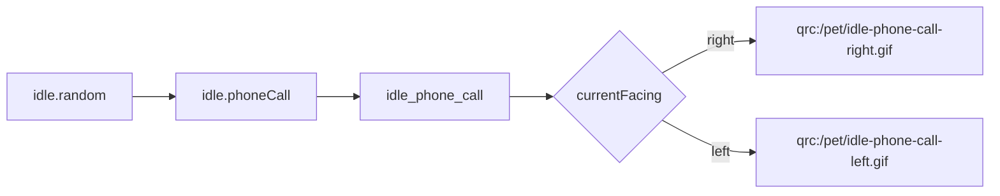

这条链路让旧版数字素材可以逐步迁移成可读的皮肤配置，同时保留按朝向切换资源的能力。

## 当前实现和 Phase 0.26

Phase 0.26 明确了同一动作可以被多个触发场景复用。`idle_look_down` 和 `idle_look_up` 既可以由单击分区触发，也可以作为随机待机动作出现：

```text
click.legsLookDown -> idle_look_down
idle.lookDown      -> idle_look_down

click.headLookUp   -> idle_look_up
idle.lookUp        -> idle_look_up
```

这种写法避免重复声明 action，同时让不同触发来源保留各自的 recipe id、scope 和权重。后续做换肤编辑器时，用户可以按“触发场景”调整候选池，不需要复制动画主体。

## 当前实现和 Phase 0.27

Phase 0.27 补上旧版随机待机里的“直接反向站立”分支。旧版 `STAND` 结束后有一小概率直接切到反向站立，不播放 `turn` 动画；另一条概率分支才播放转身动画。

v2 用 recipe 级 `facing` 字段表达这个行为：

```json
{
  "idle.flipStand": {
    "scope": "idle",
    "action": "idle_stand",
    "facing": "$opposite"
  }
}
```

运行时在执行 recipe step 前解析朝向：

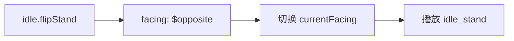

`$opposite` 当前用于 Miles 的左右朝向；如果皮肤只声明两个 `facings`，运行时会选择另一个朝向。这样“直接反向站立”和“播放转身动画”可以同时存在于 `idle.random`，保留旧版站立状态的小概率变化。

## 当前实现和 Phase 0.28

Phase 0.28 修正菜单喝茶编排，让它贴近旧版行为。旧版 `actionTea` 只播放 `special/tea*.gif`，这些 GIF 本身已经包含喝茶后的致意动作；播放结束后按一次性动作规则回到待机，不再额外播放 `bow.gif`。

v2 的菜单喝茶链路改为：

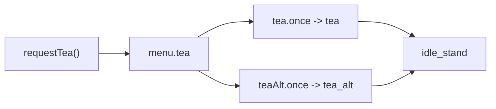

对应 manifest：

```json
{
  "tea.once": {
    "scope": "menu",
    "action": "tea"
  },
  "teaAlt.once": {
    "scope": "menu",
    "action": "tea_alt"
  }
}
```

如果未来某个皮肤的茶杯素材不包含致意动作，可以重新定义自己的 scenario recipe，把喝茶和鞠躬显式串联起来；Miles 官方皮肤保持旧版 GIF 的完整播放。

## 当前实现和 Phase 0.29

Phase 0.29 把拖拽晃动纳入 `PetRuntimeSmoke` 的真实行为验证。Phase 0.13 已经接入了资源、manifest、QML 事件和运行时入口；这一阶段补上运行时级别的分支证明，确保旧版“晃到蹲下、松手恢复”的核心手感不是只停留在配置结构里。

当前 smoke 覆盖两条恢复路径：

```mermaid
flowchart LR
    START["returnToIdle"]
    SHAKE["handleDragStarted + handleDragMoved x5"]
    CROUCH["drag_crouch"]
    RELEASE_FAST["handleDragEnded"]
    QUICK["drag_stand_up_quick"]
    HOLD_END["handleHoldAnimationReachedEnd"]
    RELEASE_FULL["handleDragEnded"]
    FULL["drag_stand_up_full"]
    IDLE["idle_stand"]

    START --> SHAKE --> CROUCH
    CROUCH --> RELEASE_FAST --> QUICK --> IDLE
    CROUCH --> HOLD_END --> RELEASE_FULL --> FULL --> IDLE
```

这条验证把 QML 视觉层和 PetRuntime 行为层分开：QML 继续负责拖动窗口和在 `hold` 动画到达末帧时通知运行时；PetRuntime 负责横向换向计数、蹲下触发和松手分支选择。后续如果把拖拽识别抽成通用 Gesture Recognizer，仍然要保留这两条 smoke 路径作为旧版手感的基线。

## 与素材盘点的关系

`../参考资料/动画素材盘点.md` 负责回答：

```text
旧 GIF 是什么动作？
朝向是什么？
能否拆成 enter / loop / exit？
哪些行为属于旧版特殊交互？
```

本文负责回答：

```text
这些事实如何进入 manifest / behavior？
运行时如何播放？
普通换肤和高级交互如何分层？
哪些字段需要静态校验？
```

当两份文档存在差异时：

```text
具体 schema 和层级模型：以本文为准。
某个旧 GIF 的语义和帧段备注：以动画素材盘点为线索。
PetRuntime 整体职责和状态调度：以桌宠运行时与动画调度设计为准。
当前能运行的字段：以 apps/desktop/resources/skins/miles-edgeworth/manifest.json 为准。
```

## 文档维护规则

- 新增 manifest 字段时，同步补充字段表和 JSON 示例。
- 新增 BehaviorRule 事件时，同步补充事件命名表。
- 从素材盘点迁移出明确动作时，同步补充迁移例子或典型场景。
- 运行时暂未实现的字段，应在 “当前实现和 Phase 0.8” 中标明阶段。
- 文档表达优先使用稳定设计口吻，保留必要的边界说明。
