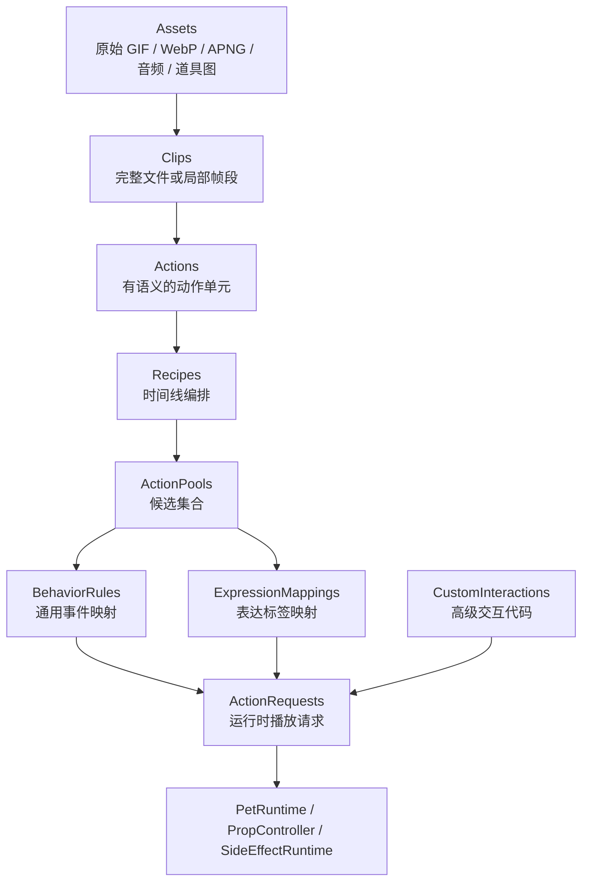
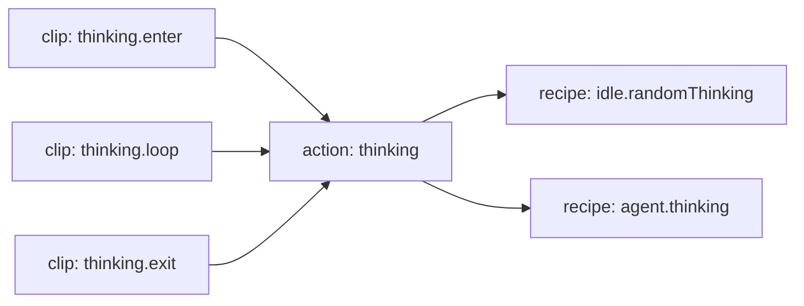
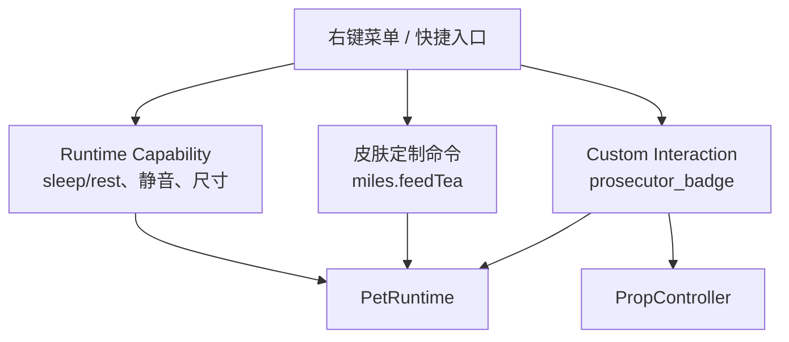
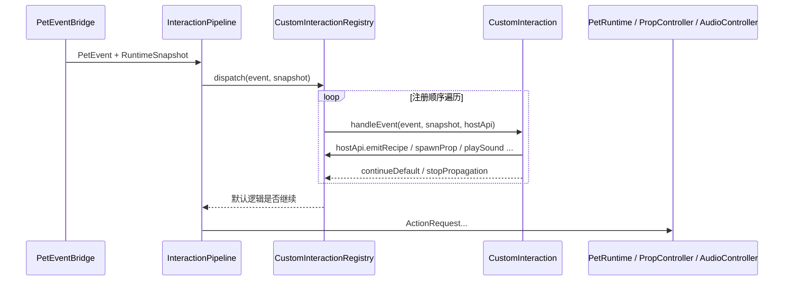

# 皮肤包播放行为设计

本文档定义 MilesEdgeworth v2 的皮肤包、素材播放编排和交互行为模型。它是长期维护文档，用来指导 manifest、行为配置、Custom Interaction 和换肤能力设计。

相关文档分工：

- `桌宠运行时与动画调度设计.md`：说明 Pet Runtime 状态、调度原则和 AI/Agent 接入关系。
- `桌宠运行时职责拆分设计.md`：说明 C++ 运行时类边界和拆分顺序。
- `../参考资料/动画素材盘点.md`：记录旧 GIF 素材事实、语义判断、朝向和拆 phase 线索。
- `apps/desktop/resources/skins/miles-edgeworth/manifest.json`：当前可运行 manifest 示例。

## 目标

这套设计同时服务三类使用者：

| 使用者 | 主要诉求 | 需要维护的内容 |
| --- | --- | --- |
| 普通换肤作者 | 替换角色素材，配置 idle、点击、菜单、agent 状态动作 | assets、actions、recipes、action pools、hit zones |
| Miles 官方皮肤维护者 | 还原旧版手感，整理动作语义，后续拆局部循环 | clips、phases、recipes、behavior triggers |
| 高级交互作者 | 实现检察官徽章、复杂道具、特殊鼠标玩法 | Custom Interaction、prop、side effects |

设计目标：

1. 旧版 Miles 的素材和交互可以逐步迁移进来。
2. 普通换肤只写配置即可完成多数行为。
3. 高级玩法可以写代码，但通过受控 Host API 接入系统。
4. 同一份动作素材可以被随机 idle、鼠标交互、菜单、agent 状态和 LLM 表达标签复用。
5. 运行时通过语义请求播放动作，业务层不直接引用 GIF 文件名。

## 核心原则

- 素材事实和播放语义分开：GIF、音频、道具图放在 assets，Clip / Action / Recipe 描述如何使用。
- 动作语义和触发来源分开：`thinking` 是动作，`agent.thinking.started` 是触发来源。
- 通用能力和皮肤定制分开：睡眠、移动、点击区域属于通用能力；喝红茶、检察官徽章属于 Miles 皮肤定制。
- 主体动画和道具分开：身体动画由 PetRuntime 管理，飞出的徽章、掉落物、特效由 PropController 管理。
- 配置能力和运行时请求分开：manifest 描述皮肤能做什么，运行时请求描述这一次要做什么。
- 长期 schema 和当前实现分开：本文描述目标模型；当前已落地字段以 manifest 和自动测试为准。

## 总体层级



层级含义：

| 层级 | 作用 |
| --- | --- |
| Assets | 原始素材文件，例如 GIF、WebP、APNG、音频、道具图片 |
| Clips | 最小播放片段，可以是完整文件，也可以是某个文件的帧区间 |
| Actions | 语义动作，例如 `thinking`、`objecting`、`sleep`、`walk` |
| Recipes | 时间线编排，描述一个动作或一个场景如何播放 |
| ActionPools | 候选集合，用于随机 idle、点击、LLM 表达标签等场景 |
| BehaviorRules | 把通用事件映射成播放请求 |
| ExpressionMappings | 把 LLM 输出的表达标签映射到动作候选 |
| CustomInteractions | 需要代码的高级玩法，例如检察官徽章 |
| ActionRequests | 送入运行时的语义请求 |

## 推荐皮肤包结构

```text
skins/miles-edgeworth/
  manifest.json
  behavior.json
  interactions/
    takethat.ts
  assets/
    body/
      idle/
      locomotion/
      gestures/
      rest/
      startup/
      raw/
    props/
      prosecutor_badge/
    audio/
  generated/
    clips/
```

职责划分：

| 路径 | 职责 | 是否人工维护 |
| --- | --- | --- |
| `manifest.json` | 描述 canvas、anchors、clips、actions、recipes、actionPools、props、fallback | 是 |
| `behavior.json` | 描述 idle 随机、点击区域、双击、右键菜单、agent 状态映射 | 是 |
| `interactions/` | 高级可信交互代码，例如检察官徽章、复杂道具、特殊音效流程 | 是 |
| `assets/` | 正本素材，按资源语义组织 | 是 |
| `generated/` | 从 frameRange、压缩、格式转换生成的派生素材 | 否 |

推荐按资源语义组织素材，而不是按触发来源组织素材。比如抱胸思考既可以用于随机 idle，也可以用于 agent thinking，正本素材只保留一份，触发差异通过 Recipe / ActionPool / BehaviorRule 表达。

`behavior.json` 仍作为长期 schema 保留：当出现"多个皮肤共享同一份行为规则"或"同一皮肤多个行为档位（标准 / 安静 / 兴奋）"的真实需求时再拆分。Phase 1 阶段所有字段（actions、recipes、actionPools、behaviorTriggers、behaviorRules、clickBehaviors、skinCommands、customInteractions、expressionMappings）暂时全部写在 `manifest.json` 中，loader 一处解析；拆分发生时该文档需要同步刷新示例与字段归属。

## Canvas 与 Anchor

每个皮肤需要声明一个逻辑画布。画布决定主体窗口的基础尺寸，也决定不同动画之间如何对齐。

```json
{
  "canvas": {
    "windowSize": 120,
    "imageSize": 100,
    "idleLoopAction": "idle_stand"
  },
  "defaultSize": "medium",
  "sizes": [
    { "id": "mini", "label": "迷你", "scale": 1.0 },
    { "id": "small", "label": "小", "scale": 1.5 },
    { "id": "medium", "label": "中", "scale": 2.0 },
    { "id": "big", "label": "大", "scale": 3.0 }
  ]
}
```

`windowSize` 和 `imageSize` 是 scale=1 时的基础尺寸。Miles 当前中号为 `scale=2`，因此窗口实际尺寸为 `120 * 2 = 240`，动画显示尺寸为 `100 * 2 = 200`。不同皮肤可以声明自己的尺寸档位，右键菜单按 `sizes` 动态生成。

`idleLoopAction` 用于声明哪个 action 的循环完成后可以触发 idle 随机调度。表现层只调用运行时查询，不直接写死某个动作名。

Anchor 是角色在画布里的语义坐标。它的实际用途包括：

- 动作切换时保持角色脚底或身体中心位置稳定。
- 移动时用同一个站位点计算窗口位置。
- 气泡、手部道具、头部交互等附着在角色上的 UI 或 Prop 可以按 anchor 定位。

```json
{
  "anchors": {
    "body": { "type": "foot_center", "x": 120, "y": 220 },
    "bubble": { "type": "top_center", "x": 120, "y": 24 },
    "right_hand": { "type": "point", "x": 160, "y": 96 }
  }
}
```

Miles 当前 GIF 基本已经手动对齐，因此短期可以只声明一个默认 `body` anchor。未来支持第三方皮肤时，anchor 会成为校准工具和素材导入器的关键字段。

## 朝向

朝向集合由皮肤自己声明，不由框架写死。

```json
{
  "facings": ["right", "left"],
  "defaultFacing": "right",
  "movementDirections": [
    "east",
    "west",
    "northEast",
    "northWest",
    "southEast",
    "southWest",
    "north",
    "south"
  ]
}
```

普通站立和表情动作通常只需要角色实际具备的朝向。移动动作可以支持 4 方向、8 方向，或只支持左右横向；运行时应根据皮肤声明选择最接近的可用动画。

## Hit Zone

Hit zone 描述鼠标点击区域的语义分区。普通换肤可以使用矩形，高级皮肤可以使用 polygon。窗口透明留白点击穿透由窗口输入 mask 处理，语义分区继续由 hit zone 处理。

```json
{
  "hitZones": {
    "head": {
      "type": "rect",
      "x": 88,
      "y": 24,
      "width": 64,
      "height": 48
    },
    "face": {
      "type": "polygon",
      "points": [[132, 30], [160, 44], [148, 72], [120, 64]]
    }
  }
}
```

Miles 当前分区沿用旧版 polygon / rect 思路即可。Phase 0.62 已接入基于当前动画首帧 alpha 的窗口输入 mask，用来避免透明外壳拦截鼠标；逐帧 mask 和可视化编辑工具以后再评估。

## Click Behaviors

`clickBehaviors` 把 hit zone 和动作池配对，让框架代码不需要内置任何皮肤命名。`InteractionPipeline` 按 `singleClick` 声明顺序把候选 zone 交给 `HitZoneMatcher`，命中后再把对应入口转成 `ActionRequest`。`doubleClick` 同样以列表方式声明，支持普通候选池和高级 Custom Interaction 入口（详见后文）。

```json
{
  "clickBehaviors": {
    "singleClick": [
      { "zone": "face",            "pool": "click.face" },
      { "zone": "head",            "pool": "click.head" },
      { "zone": "upper_arm",       "pool": "click.upperArm" },
      { "zone": "forearm",         "pool": "click.forearm" },
      { "zone": "chest",           "pool": "click.chest" },
      { "zone": "belly_bow",       "pool": "click.bellyBow" },
      { "zone": "belly_pointing",  "pool": "click.bellyPointingArea" },
      { "zone": "legs_back",       "pool": "click.legsBackArea" },
      { "zone": "legs_look_down",  "pool": "click.legsLookDownArea" }
    ],
    "doubleClick": [
      { "customInteraction": "prosecutor_badge" },
      { "pool": "doubleClick.random" }
    ]
  }
}
```

约束：

- 单击命中只取第一个匹配的 `zone`；多个区域重叠时，写在前面的优先。
- 双击列表里的每一项都是"如果可用就用它"：`customInteraction` 表示交给某个 CI 决定是否接管（CI 不接管则继续往下找）；`pool` / `recipe` / `action` 表示直接产生 ActionRequest。
- 框架运行时不再写死 `click.upperArm → upper_arm` 这种字符串映射；所有皮肤通过 manifest 描述自己的命名。

## Clip、Action 与 Recipe

Clip 是素材片段，Action 是语义动作，Recipe 是播放编排。三者分开后，同一段素材可以被多个触发来源复用。



示例：

```json
{
  "actions": {
    "thinking": {
      "category": "gesture",
      "initialPhase": "enter",
      "exitPhase": "exit",
      "phases": {
        "enter": { "clip": "thinking.enter", "loopMode": "once", "nextPhase": "loop" },
        "loop": { "clip": "thinking.loop", "loopMode": "loop" },
        "exit": { "clip": "thinking.exit", "loopMode": "onceThenIdle" }
      }
    }
  }
}
```

已有素材如果只有完整 GIF，可以先把它作为单个 phase 使用。后续再用 frameRange 或派生素材拆成 enter / loop / exit。

## Recipe 编排

Recipe 建立在 action 或 clip 之上，用来表达一次播放请求的时间线。短 recipe 可以直接引用 action；复杂 recipe 可以组合多个步骤。

```json
{
  "recipes": {
    "idle.randomThinking": {
      "action": "idle_thinking_once",
      "scope": "idle"
    },
    "agent.thinking": {
      "steps": [
        { "action": "thinking", "phase": "enter" },
        { "action": "thinking", "phase": "loop", "duration": "runtime" },
        { "action": "thinking", "phase": "exit" }
      ],
      "scope": "agent"
    }
  }
}
```

运行时可为 recipe 提供动态参数，例如循环时长、循环次数或提前退出信号。manifest 负责声明 recipe 支持哪些参数，具体值由运行时请求传入。

## ActionPool

ActionPool 用于“从多个候选里选择一个”。它可以被 idle、点击、双击、菜单、LLM 表达标签复用。

```json
{
  "actionPools": {
    "idle.random": {
      "entries": [
        { "recipe": "idle.randomThinking", "weight": 8 },
        { "recipe": "turn.once", "weight": 12 },
        { "recipe": "walk.east", "weight": 4 }
      ]
    },
    "expression.annoyed": {
      "entries": [
        { "recipe": "doubleClick.objection", "weight": 2 },
        { "recipe": "idle.lookDown", "weight": 1 }
      ]
    }
  }
}
```

LLM 不应被要求从项目内置固定词表中选择。可选 expression/action 标签来自当前皮肤配置。模型侧只看到当前皮肤暴露的标签说明和约束。

## BehaviorRule

BehaviorRule 把通用事件映射到 ActionPool 或 Recipe。

```json
{
  "behaviorRules": [
    {
      "event": "idle.loopFinished",
      "when": { "state": "idle", "action": "idle_stand" },
      "pool": "idle.random",
      "probability": 0.7
    },
    {
      "event": "pointer.singleClick",
      "hitZone": "head",
      "pool": "click.head"
    },
    {
      "event": "agent.stateChanged",
      "state": "thinking",
      "recipe": "agent.thinking"
    }
  ]
}
```

这些规则属于普通换肤能力。它们应尽量保持声明式，便于编辑器、预览器和校验工具理解。

## 通用能力、皮肤定制命令与 Custom Interaction

右键菜单和鼠标事件不能全部塞进 `PetRuntime`。需要分三层处理：

| 类型 | 定义 | 例子 | 落点 |
| --- | --- | --- | --- |
| 通用能力 | 多数桌宠都可能具备，由框架提供状态和入口 | sleep/rest、静音、尺寸、移动开关 | Runtime capability |
| 皮肤定制命令 | 某个皮肤提供的简单菜单命令，通常映射到 action pool 或 recipe | Miles 的喝红茶 | Skin command |
| Custom Interaction | 需要代码、道具、条件分支或副作用的高级玩法 | 检察官徽章、眼睛追随鼠标、抛掷物 | Custom Interaction |



当前 Miles 皮肤里：

- `sleep/rest` 是通用能力，保留在 Runtime 能力层。
- `miles.feedTea` 是皮肤定制命令，由 manifest `skinCommands` 声明，经 `SkinCommandResolver` 映射到 `menu.tea` action pool。
- 检察官徽章当前使用 manifest prop 和 `PropController` 管理视觉生命周期；更复杂的触发条件、概率分支和额外副作用可以进入 Custom Interaction。
- 语音语言属于可选 Audio Capability，不应假设所有皮肤都有语音。

## Custom Interaction

Custom Interaction（下文简称 CI）是皮肤包的代码扩展点。`SkinCommand` 解决"菜单点一下就播一个池子"这种纯声明式命令，CI 解决"需要概率、状态机、延时、多个事件来回协作"的高级玩法（双击概率丢徽章、奉茶后接 bow、眼睛跟随鼠标、计时性彩蛋等）。

CI 与 manifest 的边界：

| 表达力 | 用什么 |
| --- | --- |
| 点哪里、播什么池子 | manifest `clickBehaviors` |
| 通用事件 → 池子/recipe（idle 循环、agent 状态等） | manifest `behaviorRules` / `behaviorTriggers` |
| 简单菜单命令 | manifest `skinCommands` |
| 概率、计数、跨事件状态 | Custom Interaction |
| 需要计时器、动态 Prop 参数、多步副作用 | Custom Interaction |

CI 在 Phase 0.70 起以 C++ 类形式实现，放在皮肤包目录下（例如 `apps/desktop/src/skins/miles-edgeworth/interactions/`），由 `CustomInteractionRegistry` 在启动时注册。后续如果需要支持第三方皮肤的不可信代码，可以在保留同一套 Host API 的前提下，新增 JS/TS 沙箱执行体。

### 生命周期与事件分发



分发约束：

- Registry 按 handler 注册顺序遍历；前一个 handler 的 `stopPropagation` 会终止剩余 handler 的处理。
- `continueDefault = false` 表示在所有 handler 处理完后跳过 manifest 默认行为（clickBehaviors / behaviorRules）。多个 handler 都未关闭 `continueDefault` 时默认行为照常执行。
- handler 的输出请求会和默认逻辑的请求按产生顺序进入同一批 `ActionRequest`。当前只使用 `interruptHint` 控制“立即切换 / 播完当前再切”，CI 不与 PetRuntime 直接交互。

handler 可以承担三种典型角色：

- 观察型：只调用 `hostApi.playSound` 或 `hostApi.spawnProp` 追加副作用，`continueDefault = true`。
- 接管型：检测到目标条件后 `hostApi.emitRecipe(...)` 并返回 `continueDefault = false`。
- 后续型：第一次事件只更新内部状态，等到后续 `prop.expired` / 定时器触发再 emit；中间不阻塞默认逻辑。

### Handler 接口（C++）

```cpp
class CustomInteraction {
public:
    virtual ~CustomInteraction() = default;

    // 唯一 id；用于日志、状态持久化和 manifest 引用（doubleClick / 菜单可写 "customInteraction": "<id>"）。
    virtual QString id() const = 0;

    // 声明本 handler 感兴趣的事件类型。registry 在分发时按此过滤。
    virtual QSet<PetEventType> supportedEvents() const = 0;

    // 真正的处理入口。
    virtual CustomInteractionOutcome handleEvent(
        const PetEvent &event,
        const RuntimeSnapshot &snapshot,
        CustomInteractionHostApi &host
    ) = 0;
};

struct CustomInteractionOutcome {
    QList<ActionRequest> requests;     // 本次 handler 想发出的请求
    bool continueDefault = true;       // 是否继续 manifest 默认行为
    bool stopPropagation = false;      // 是否阻止后续 handler 处理同一事件
};
```

### Host API 第一版

Host API 是 CI 唯一可调用的能力面。它不暴露 `PetRuntime*` 或 manifest 写权限，避免 CI 直接改运行时状态、绕过事件主干。

```cpp
class CustomInteractionHostApi {
public:
    // ---- 产生 ActionRequest ----
    void emitAction(const QString &actionId);
    void emitRecipe(const QString &recipeId);
    void emitPool(const QString &poolId);
    void emitReturnToIdle();

    // ---- Prop 与副作用 ----
    void spawnProp(const QString &propId, const PropOverrides &overrides = {});
    void hideCurrentProp();
    void playSound(const QUrl &url);
    void showBubble(const QString &text, int durationMs);  // Phase 2 预留

    // ---- 随机与计时 ----
    double random();                                       // [0,1) 默认随机数源
    void scheduleAfter(int delayMs, std::function<void()> callback);

    // ---- 状态读取 ----
    RuntimeSnapshot snapshot() const;
    QVariantMap manifestConfig() const;  // 只读当前 handler 自己的 customInteractionConfig[id]

    // ---- 持久化（per handler in-memory KV，Phase 2 评估文件持久化）----
    void setState(const QString &key, const QVariant &value);
    QVariant getState(const QString &key) const;
    bool hasState(const QString &key) const;

    // ---- 流程控制 ----
    void skipDefault();        // 等价 outcome.continueDefault = false
    void stopPropagation();    // 等价 outcome.stopPropagation = true
};
```

Host API 行为约束：

- emit 系列只生成 ActionRequest，由 registry / pipeline 整理后交给 `PetRuntime::submitActionRequest()`，handler 不能直接调用 `PetRuntime` 的 `playAction()` 等方法。
- `spawnProp` 复用 `PropController` 的生命周期：CI 给定 propId 后，Prop 的 visual 参数仍来自 manifest，`overrides` 只允许覆盖 delayMs、durationMs、startOffset 增量等运行时参数。
- `scheduleAfter` 必须在 GUI 线程上回调；底层使用 `QTimer::singleShot`。
- `setState` / `getState` 当前只活在内存。Phase 2 评估 per-handler 文件持久化前，CI 不应假设状态会跨重启保留。
- 任何 handler 抛出异常或 panic，registry 必须捕获并 fallback 到默认逻辑，避免影响主线交互。
- Registry 不会预先过滤睡眠、过渡、非 idle 等运行时状态。handler 需要读取 `snapshot()` 或 `handleEvent` 入参中的 `RuntimeSnapshot`，自行判断当前事件是否应该参与；不参与时直接返回，让默认行为继续处理。
- `manifestConfig()` 只能读取当前 handler 自己的配置，避免 handler 跨 id 读取其他高级交互的私有参数。

### Host API 语言无关设计原则

Host API 第一版只暴露 C++ 接口，但其语义层应保持语言无关。这样未来在确实需要"第三方皮肤可执行代码"时，可以在不破坏已有 C++ handler 的前提下挂上 JS / TS 沙箱执行体。具体约束：

- 接口签名只使用值类型或不可变快照（`QString` / `QVariant` / `RuntimeSnapshot` 等），不允许返回 `PetRuntime *` 或其他可写指针。Host API 内部需要的可变状态由 registry 拥有，不向外暴露。
- 异步副作用通过 `scheduleAfter(delayMs, callback)` 这类显式入口表达。handler 不允许启动自己的线程、事件循环或全局 `QObject::connect`。
- `setState` / `getState` 的 value 限定为可序列化类型（标量 + 列表 + 表）；未来 JS adapter 只需要把 KV 映射为 JSON，C++ handler 不需要改写。
- 不在 Host API 上暴露 Qt 信号 / 槽机制或复杂指针类型；这些细节属于实现层。
- 任何后续在 Host API 上新增方法时，先在设计文档中描述其行为，再实现，避免引入难以跨语言转译的副作用。

满足这套约束后，加入 JS / TS handler 的主要成本只剩两件事：写一层 adapter 把 Host API 翻译成对应语言的函数；在 registry 中加 JS handler 实例。Host API 形态不需要重做。

### manifest 中的 CI 配置

CI 自身的参数（概率、阈值、动作 id 等）应来自 manifest，方便换皮肤复用同款 CI 时直接改配置。

```json
{
  "customInteractions": [
    { "id": "prosecutor_badge" }
  ],
  "customInteractionConfig": {
    "prosecutor_badge": {
      "takeThatProbability": 0.5,
      "objectingAction": "objecting",
      "takeThatSound": "qrc:/audio/takethat0.wav",
      "badgePropId": "prosecutor_badge",
      "badgeDelayMs": 700,
      "clickedRecipe": "bow.once",
      "expiredRecipe": "pickup.once"
    }
  }
}
```

`customInteractions` 是声明列表；`CustomInteractionRegistry::registerBuiltins()` 时按这里列出的顺序加载并绑定 handler 实例。皮肤不引用某个 CI 类时，registry 不会实例化它，也不会浪费事件分发开销。

### Miles 双击 "看招" 示例

下例展示 Phase 0.71 落地后 `ProsecutorBadgeInteraction` 的核心流程：

```cpp
QSet<PetEventType> ProsecutorBadgeInteraction::supportedEvents() const {
    return {
        PetEventType::PointerDoubleClick,
        PetEventType::PropClicked,
        PetEventType::PropExpired,
    };
}

CustomInteractionOutcome ProsecutorBadgeInteraction::handleEvent(
    const PetEvent &event, const RuntimeSnapshot &snapshot, CustomInteractionHostApi &host)
{
    const auto config = host.manifestConfig();

    switch (event.type) {
    case PetEventType::PointerDoubleClick: {
        if (snapshot.sleeping || !snapshot.pointerInteractionEnabled) {
            return {};  // 让默认 behavior rule 处理唤醒
        }
        if (host.random() >= config.value("takeThatProbability").toDouble()) {
            return {};  // 概率落空，继续 manifest 默认双击池
        }
        host.emitAction(config.value("objectingAction").toString());
        host.playSound(QUrl(config.value("takeThatSound").toString()));
        host.spawnProp(
            config.value("badgePropId").toString(),
            { { "delayMs", config.value("badgeDelayMs").toInt() } }
        );
        host.skipDefault();
        return { /* continueDefault=false 由 skipDefault 设置 */ };
    }
    case PetEventType::PropClicked:
        if (event.propId == config.value("badgePropId").toString()) {
            host.hideCurrentProp();
            host.emitRecipe(config.value("clickedRecipe").toString());
            host.skipDefault();
        }
        return {};
    case PetEventType::PropExpired:
        if (event.propId == config.value("badgePropId").toString()) {
            host.hideCurrentProp();
            host.emitRecipe(config.value("expiredRecipe").toString());
            host.skipDefault();
        }
        return {};
    default:
        return {};
    }
}
```

这个 CI 不引用 `PetRuntime` / `PropController`、不读写其它 handler 的状态，也不依赖 Miles 之外的常量；同样的 handler 可以被另一个皮肤通过改 manifest config 复用。

## ActionRequest

ActionRequest 是运行时播放请求的统一形态。

```json
{
  "source": "agent",
  "recipe": "agent.thinking",
  "interruptHint": "immediate",
  "params": {
    "loopDurationMs": 5000
  }
}
```

`interruptHint` 保持简单：

| 值 | 含义 |
| --- | --- |
| `immediate` | 立即切换到新请求 |
| `afterCurrent` | 当前 recipe 播完后再切换 |

更复杂的排队、阶段退出和优先级策略可以在真实需求出现后扩展，避免普通皮肤配置过早变复杂。

## 表现层与 C++ 调度边界

**当前实现**：桌宠本体使用原生 `PetSurfaceWindow`（QWidget），不加载 QML。`PetWindow.qml` 保留在 `qml/` 目录仅作历史参考，不参与运行。`ChatWindow` / `DashboardWindow` 将来仍计划使用 QML，届时本节约束同样适用。

表现层（现为 `PetSurfaceWindow`，未来 ChatWindow 为 QML）负责显示和输入：

- 显示当前动画、气泡、菜单和 Prop 窗口。
- 把点击、双击、拖拽、菜单命令转给 `PetEventBridge`。
- 不直接选择 GIF 文件。

C++ 负责调度：

- 读取 manifest。
- `PetEventBridge` 接收来自表现层的事件。
- `InteractionPipeline` 把事件转换为 `ActionRequest`。
- `SkinCommandResolver` 把简单皮肤命令转换为 `ActionRequest`。
- `PetRuntime` 执行最终播放请求，并发出当前动画、音效、prop、窗口移动等状态。

设计目标是让表现层越来越薄，皮肤行为越来越依赖 manifest / behavior / interaction 代码表达。
