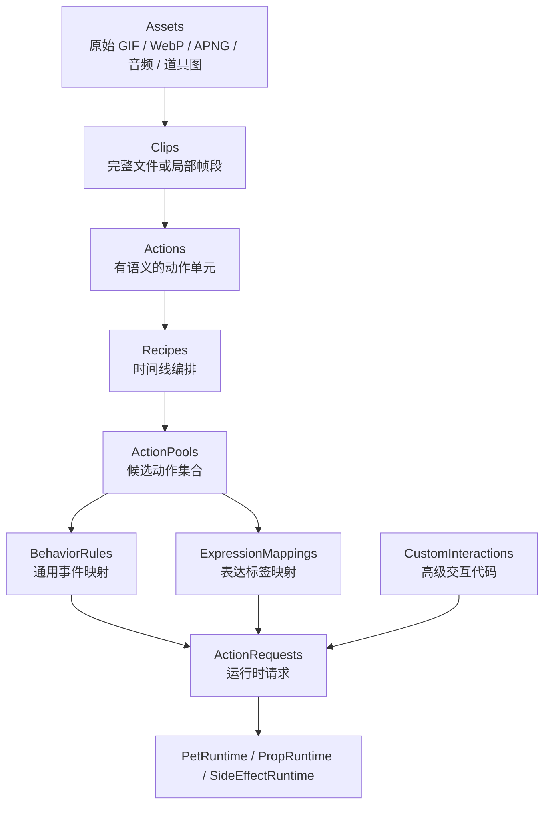
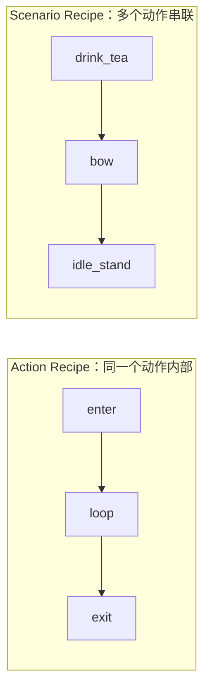
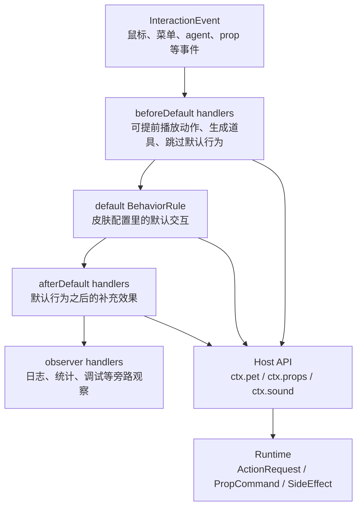
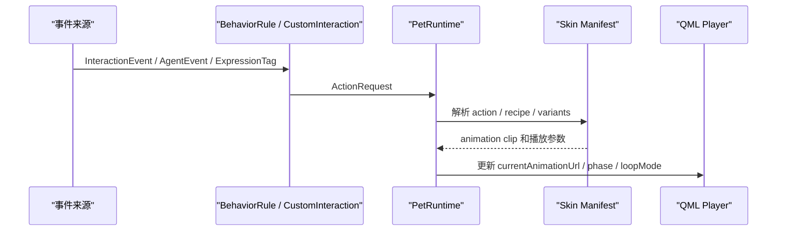
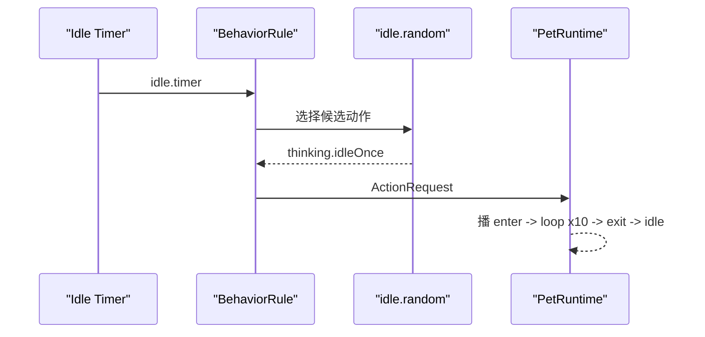
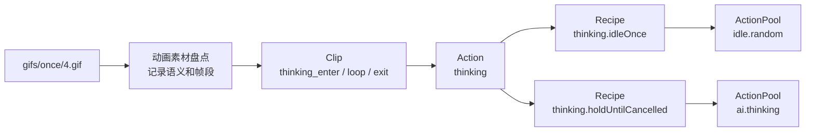

# 皮肤包播放行为设计

本文档定义 MilesEdgeworth v2 的皮肤包、素材播放编排和交互行为模型。它是皮肤系统的长期设计文档，后续 manifest / behavior schema 的设计以本文为主要依据。

相关文档分工：

- `桌宠运行时与动画调度设计.md`：解释 Pet Runtime 的职责、状态、调度原则和 AI/Agent 接入关系。
- `皮肤包播放行为设计.md`：定义皮肤包、Clip、Action、Recipe、ActionPool、BehaviorRule 和 Custom Interaction 的层级模型。
- `../参考资料/动画素材盘点.md`：记录旧 GIF 素材事实、语义判断、朝向和拆 phase 线索。
- `apps/desktop/resources/skins/miles-edgeworth/manifest.json`：记录当前运行时已经接入的字段和最小可运行示例。

## 读者和目标

这套设计同时服务三类人：

| 读者 | 关心内容 | 需要掌握的层级 |
| --- | --- | --- |
| 普通换肤作者 | 提供角色素材、配置 idle / 点击 / 菜单 / agent 状态动作 | Assets、Actions、ActionPools、BehaviorRules |
| Miles 官方皮肤维护者 | 还原旧版手感，拆分局部循环，维护动作语义 | Clips、Actions、Recipes、ExpressionMappings |
| 高级交互作者 | 实现检察官徽章、道具、音效、眼睛追随鼠标等玩法 | CustomInteractions、Host API、PropRuntime |

设计目标：

1. 旧版 Miles 的素材和交互可以逐步迁移进来。
2. 普通换肤只写配置，不需要写 C++ / QML。
3. 高级玩法可以写代码，但通过受控 Host API 接入系统。
4. 同一份动作素材可以被随机 idle、鼠标交互、菜单、agent 状态和 LLM 表达标签复用。
5. 运行时通过语义请求播放动作，避免业务层直接引用 GIF 文件名。

## 核心原则

- **素材事实和播放语义分开**：GIF 文件放在 assets，Clip / Action / Recipe 描述如何使用它。
- **动作语义和触发来源分开**：`thinking` 是动作，`agent.thinking.started` 是触发来源。
- **通用交互和高级交互分开**：点击区域、随机 idle、菜单动作走配置；检察官徽章这类玩法走 Custom Interaction。
- **主体和道具分开**：桌宠身体动画由 PetRuntime 管理，飞出的徽章、掉落物、特效由 PropRuntime 管理。
- **配置能力和运行时请求分开**：manifest 描述皮肤能做什么，ActionRequest 描述这次想做什么。
- **长期 schema 和当前最小实现分开**：本文定义目标模型，当前可运行字段以 `manifest.json` 和测试为准。

## 总体层级

```text
Assets
  -> Clips
  -> Actions
  -> Recipes
  -> ActionPools
  -> BehaviorRules / ExpressionMappings / CustomInteractions
  -> ActionRequests
  -> PetRuntime / PropRuntime / SideEffectRuntime
```



层级含义：

- `Assets` 是原始素材文件，例如 GIF、WebP、APNG、音频、道具图片。
- `Clip` 是最小播放片段，可以是完整文件，也可以是某个文件的帧区间。
- `Action` 是语义动作，例如 `thinking`、`objecting`、`sleep`、`walk`。
- `Recipe` 是时间线编排层，描述一个动作或一个场景如何播放。
- `ActionPool` 是动作候选集合，用于随机 idle、点击、LLM 表达标签等场景。
- `BehaviorRule` 把通用事件映射成 ActionRequest。
- `ExpressionMapping` 把 LLM 输出的表达标签映射到动作候选。
- `CustomInteraction` 是需要代码的高级玩法，例如检察官徽章。
- `ActionRequest` 是最终送入运行时的语义请求。

## 推荐皮肤包结构

```text
skins/miles-edgeworth/
  manifest.json
  behavior.json
  interactions/
    takethat.ts
  assets/
    body/
      idle/
      locomotion/
      gestures/
      rest/
      startup/
      raw/
    props/
      prosecutor_badge/
    audio/
  generated/
    clips/
```

职责划分：

| 路径 | 职责 | 是否人工维护 |
| --- | --- | --- |
| `manifest.json` | 描述皮肤能力：canvas、anchors、clips、actions、recipes、actionPools、expressionMappings、fallback | 是 |
| `behavior.json` | 描述默认行为：idle 随机、点击区域、双击、右键菜单、agent 状态映射 | 是 |
| `interactions/` | 高级可信交互代码，例如检察官徽章、复杂道具、特殊音效流程 | 是 |
| `assets/` | 正本素材，按资源语义组织 | 是 |
| `generated/` | 从 frameRange、压缩、格式转换生成的派生素材 | 否 |

推荐按资源语义组织素材，而不是按触发来源组织素材。比如抱胸思考既可以用于随机 idle，也可以用于 agent thinking，正本素材只保留一份，触发差异通过 Recipe / ActionPool / BehaviorRule 表达。

## 素材要求

### Canvas

每个皮肤需要声明一个逻辑画布。画布决定桌宠主体窗口的基础尺寸，也决定不同动画之间如何对齐。

```json
{
  "canvas": {
    "width": 240,
    "height": 240,
    "scale": 1,
    "transparent": true
  }
}
```

建议约定：

- 同一皮肤的主体动画尽量使用相同 canvas 尺寸。
- 素材背景应透明，避免出现白底或黑边。
- 动画主体应围绕同一个 anchor 对齐，尤其是脚底中心点。
- 道具和飞出物优先走 PropRuntime，不为了容纳飞行道具扩大主体窗口。

### Anchor

Anchor 用来对齐不同动作，也用于移动系统计算“角色站在哪里”。

```json
{
  "anchors": {
    "body": {
      "type": "foot_center",
      "x": 120,
      "y": 220
    },
    "bubble": {
      "type": "top_center",
      "x": 120,
      "y": 24
    }
  }
}
```

常用 anchor：

| Anchor | 用途 |
| --- | --- |
| `body` | 身体主锚点，移动和动作切换以它对齐 |
| `bubble` | 气泡位置 |
| `hand_left` / `hand_right` | 道具、特效、抛出物起点 |
| `head` | 点击区域和视线追随等高级交互 |

### Hit Zone

Hit zone 描述鼠标点击区域。普通换肤可以只提供粗略矩形，高级皮肤可以提供 polygon 或 alpha mask。

```json
{
  "hitZones": {
    "head": {
      "type": "rect",
      "x": 88,
      "y": 24,
      "width": 56,
      "height": 48
    },
    "body": {
      "type": "alphaMask",
      "asset": "assets/body/idle/stand-right.gif",
      "alphaThreshold": 16
    }
  }
}
```

MVP 可以先实现主体窗口层面的命中和少量矩形区域；真正“只点到不透明像素才算点击”的能力后续通过 alpha mask 或平台层 hit test 扩展。

## Assets

Assets 是皮肤包中的正本素材。它们只回答“文件在哪里”，不回答“什么时候播放”。

推荐命名：

```text
assets/body/idle/stand-right.gif
assets/body/idle/stand-left.gif
assets/body/gestures/thinking-right.gif
assets/body/gestures/thinking-left.gif
assets/body/locomotion/walk-east.gif
assets/props/prosecutor_badge/badge.png
assets/audio/takethat.wav
```

旧版素材可以先放在 `assets/body/raw/`，等语义确认后再逐步整理到对应目录。迁移期间也可以保留 qrc alias，例如当前运行时里的 `qrc:/pet/thinking-right.gif`。

## Clip

Clip 是最小播放片段，只描述“从哪个素材取哪一段”。完整 GIF、局部帧段、派生文件都可以表示成 Clip。

字段建议：

| 字段 | 类型 | 说明 |
| --- | --- | --- |
| `file` | string | 原始素材或派生素材路径 |
| `frameRange` | `[start, end]` | 可选，闭区间帧段 |
| `durationMs` | number | 可选，用于单帧 hold 或派生素材时长 |
| `loop` | boolean | 可选，提示该 clip 是否天然可循环 |
| `anchorOffset` | object | 可选，修正该 clip 的锚点偏移 |
| `generatedFrom` | object | 可选，记录派生 clip 的来源 |

示例：

```json
{
  "clips": {
    "thinking_full_right": {
      "file": "assets/body/raw/once/4.gif"
    },
    "thinking_enter_right": {
      "file": "assets/body/raw/once/4.gif",
      "frameRange": [1, 4]
    },
    "thinking_loop_right": {
      "file": "assets/body/raw/once/4.gif",
      "frameRange": [5, 8],
      "loop": true
    },
    "thinking_exit_right": {
      "file": "assets/body/raw/once/4.gif",
      "frameRange": [44, 47]
    }
  }
}
```

在 Qt/QML 暂未支持 GIF 局部帧播放时，`frameRange` 仍然作为源数据记录。asset compiler 可以把这些 clip 导出成派生 GIF/WebP/APNG：

```text
assets/body/raw/once/4.gif + frameRange [5, 8]
=> generated/clips/thinking-loop-right.webp
```

## Action

Action 是语义动作。外部模块请求 Action，Clip 保持为内部播放片段。

字段建议：

| 字段 | 类型 | 说明 |
| --- | --- | --- |
| `label` | string | 给人看的名称 |
| `category` | string | `idle`、`gesture`、`locomotion`、`agent`、`prop` 等 |
| `tags` | string[] | 检索和表达映射用标签 |
| `priority` | number | 默认优先级，可被请求覆盖 |
| `loopMode` | string | 单段动作的播放模式 |
| `variants` | object | 单段动作的朝向变体 |
| `phases` | object | 多阶段动作定义 |
| `initialPhase` | string | 多阶段动作入口 |
| `exitPhase` | string | 需要退出时播放的阶段 |
| `fallbackAction` | string | 可选，动作不可用时的兜底 |

单段动作：

```json
{
  "actions": {
    "objecting": {
      "label": "异议",
      "category": "gesture",
      "loopMode": "onceThenIdle",
      "priority": 40,
      "tags": ["objecting", "speaking", "emphasis"],
      "variants": {
        "right": { "clip": "objecting_right" },
        "left": { "clip": "objecting_left" }
      }
    }
  }
}
```

多阶段动作：

```json
{
  "actions": {
    "thinking": {
      "label": "抱胸思考",
      "category": "cognitive",
      "tags": ["thinking", "cognitive"],
      "initialPhase": "enter",
      "exitPhase": "exit",
      "phases": {
        "enter": {
          "loopMode": "once",
          "variants": {
            "right": { "clip": "thinking_enter_right" },
            "left": { "clip": "thinking_enter_left" }
          }
        },
        "loop": {
          "loopMode": "loop",
          "variants": {
            "right": { "clip": "thinking_loop_right" },
            "left": { "clip": "thinking_loop_left" }
          }
        },
        "exit": {
          "loopMode": "onceThenIdle",
          "variants": {
            "right": { "clip": "thinking_exit_right" },
            "left": { "clip": "thinking_exit_left" }
          }
        }
      }
    }
  }
}
```

常见 phase：

| Phase | 用途 |
| --- | --- |
| `main` | 单段动作主体 |
| `enter` | 进入姿态 |
| `loop` | 可循环保持段 |
| `hold` | 保持某一帧或某个姿态 |
| `exit` | 离开姿态 |
| `recover` | 被打断或特殊状态恢复 |

## 朝向和移动方向

不同皮肤可以声明不同的朝向模型。Miles 皮肤当前采用静止动作 `right` / `left`、移动动作 8 方向；其他皮肤可以只提供正面、提供 4 方向、提供等距视角方向，或通过镜像生成缺失方向。

运行时只依赖 manifest 里声明的 `facings`、`movementDirections`、`variants` 和 `directionFallbacks`，不把 `right/left` 或 8 方向写死成全局规则。

Miles 皮肤可以这样声明：

```json
{
  "facings": ["right", "left"],
  "defaultFacing": "right",
  "movementDirections": ["east", "west", "north", "south", "northEast", "northWest", "southEast", "southWest"],
  "directionFallbacks": {
    "northEast": ["east", "north", "right", "default"],
    "northWest": ["west", "north", "left", "default"],
    "southEast": ["east", "south", "right", "default"],
    "southWest": ["west", "south", "left", "default"],
    "east": ["right", "default"],
    "west": ["left", "default"]
  }
}
```

简单正面皮肤可以这样声明：

```json
{
  "facings": ["front"],
  "defaultFacing": "front",
  "movementDirections": [],
  "directionFallbacks": {
    "default": ["front"]
  }
}
```

4 方向皮肤可以这样声明：

```json
{
  "facings": ["front", "back", "left", "right"],
  "defaultFacing": "front",
  "movementDirections": ["east", "west", "north", "south"],
  "directionFallbacks": {
    "northEast": ["east", "north", "right", "front"],
    "northWest": ["west", "north", "left", "front"],
    "southEast": ["east", "south", "right", "front"],
    "southWest": ["west", "south", "left", "front"]
  }
}
```

Action 的 `variants` 使用皮肤声明过的 key。站立动作可以只提供左右：

```json
{
  "actions": {
    "idle_stand": {
      "label": "站立",
      "category": "idle",
      "loopMode": "loop",
      "variants": {
        "right": { "clip": "stand_right" },
        "left": { "clip": "stand_left" }
      }
    }
  }
}
```

正面皮肤也可以只提供一个 `front`：

```json
{
  "actions": {
    "idle_stand": {
      "label": "站立",
      "category": "idle",
      "loopMode": "loop",
      "variants": {
        "front": { "clip": "stand_front" }
      }
    }
  }
}
```

移动动作可以按皮肤能力提供方向变体：

```json
{
  "actions": {
    "walk": {
      "label": "行走",
      "category": "locomotion",
      "loopMode": "loop",
      "variants": {
        "east": { "clip": "walk_east" },
        "west": { "clip": "walk_west" },
        "north": { "clip": "walk_north" },
        "south": { "clip": "walk_south" },
        "northEast": { "clip": "walk_north_east" },
        "northWest": { "clip": "walk_north_west" },
        "southEast": { "clip": "walk_south_east" },
        "southWest": { "clip": "walk_south_west" }
      }
    }
  }
}
```

运行时选择 variant 的顺序：

1. 如果请求来自移动系统，优先使用量化后的 `movementDirection`。
2. 如果请求来自普通动作，优先使用当前 `facing`。
3. 当前 key 不存在时，按 `directionFallbacks` 查找候选。
4. 仍然找不到时，使用 action 自己的 `defaultVariant` 或皮肤的 `defaultFacing`。

镜像生成可以作为后续 asset compiler 能力，例如皮肤只提供 `right`，manifest 标记 `left` 可由 `right` 镜像生成。MVP 阶段先使用显式素材和 fallback。

## Recipe

Recipe 是动画系统里的时间线编排层。它既可以编排一个 Action 内部的 phase，也可以编排多个 Action、等待、条件和副作用。



Recipe 字段建议：

| 字段 | 类型 | 说明 |
| --- | --- | --- |
| `scope` | string | `action` 或 `scenario` |
| `action` | string | action recipe 绑定的动作 |
| `pattern` | string | `once`、`loop`、`enterLoopExit`、`sequence` 等 |
| `steps` | array | 时间线步骤 |
| `params` | object | 可选，声明运行时参数 |
| `autoReturn` | string | 可选，结束后返回的 action 或 state |

示例：

```json
{
  "recipes": {
    "thinking.idleOnce": {
      "scope": "action",
      "action": "thinking",
      "pattern": "enterLoopExit",
      "steps": [
        { "phase": "enter", "repeat": 1 },
        { "phase": "loop", "repeat": 10 },
        { "phase": "exit", "repeat": 1 }
      ],
      "autoReturn": "idle"
    },
    "thinking.holdUntilCancelled": {
      "scope": "action",
      "action": "thinking",
      "pattern": "enterLoopExit",
      "steps": [
        { "phase": "enter", "repeat": 1 },
        { "phase": "loop", "repeat": "untilCancelled" },
        { "phase": "exit", "repeat": 1 }
      ]
    },
    "tea.drinkThenBow": {
      "scope": "scenario",
      "pattern": "sequence",
      "steps": [
        { "action": "drink_tea", "recipe": "tea.loopForDuration" },
        { "action": "bow", "recipe": "once" },
        { "action": "idle_stand", "recipe": "loop" }
      ]
    }
  }
}
```

Step 类型：

| Step | 说明 |
| --- | --- |
| `{ "phase": "loop", "repeat": 10 }` | 播放当前 action 的某个 phase |
| `{ "action": "bow", "recipe": "once" }` | 播放另一个 action recipe |
| `{ "waitMs": 300 }` | 等待一段时间 |
| `{ "sideEffect": { ... } }` | 触发气泡、音效等副作用 |
| `{ "condition": { ... }, "then": [...] }` | 后续扩展，用上下文决定分支 |

运行时参数：

```json
{
  "recipes": {
    "tea.loopForDuration": {
      "scope": "action",
      "action": "drink_tea",
      "params": {
        "durationMs": { "type": "number", "default": 5000, "min": 1000, "max": 30000 }
      },
      "steps": [
        { "phase": "loop", "durationMs": { "param": "durationMs" } }
      ]
    }
  }
}
```

运行时请求：

```json
{
  "action": "drink_tea",
  "recipe": "tea.loopForDuration",
  "recipeParams": {
    "durationMs": 12000
  }
}
```

MVP 可以先实现固定 `repeat` / `durationMs`、`repeat: "untilCancelled"`、`once`、`loop`、`enterLoopExit` 和最小 `sequence`。

## ActionPool

ActionPool 是动作候选集合，用于多个触发来源复用同一组动作。

```json
{
  "actionPools": {
    "idle.random": [
      { "action": "check_watch", "recipe": "once", "weight": 20 },
      { "action": "shrug", "recipe": "once", "weight": 20 },
      { "action": "thinking", "recipe": "thinking.idleOnce", "weight": 10 }
    ],
    "click.head": [
      { "action": "tap_head", "recipe": "once", "weight": 80 },
      { "action": "annoyed", "recipe": "once", "weight": 20 }
    ],
    "ai.thinking": [
      { "action": "thinking", "recipe": "thinking.holdUntilCancelled", "weight": 100 }
    ]
  }
}
```

字段建议：

| 字段 | 说明 |
| --- | --- |
| `action` | 候选 action id |
| `recipe` | 候选 recipe id，缺省时使用 action 默认 recipe |
| `weight` | 随机权重 |
| `when` | 可选，候选级过滤条件 |
| `cooldownMs` | 可选，避免短时间重复 |

选择策略：

| 策略 | 说明 |
| --- | --- |
| `weighted_random` | 按权重随机 |
| `first_available` | 选第一个可用动作 |
| `round_robin` | 轮流播放，减少重复感 |
| `contextual` | 后续扩展，根据状态、最近动作、屏幕位置选择 |

## ExpressionMapping

ExpressionMapping 把 LLM 输出的表达标签映射到 ActionPool 或具体 action。表达标签由当前皮肤声明。

```json
{
  "expressionMappings": {
    "annoyed": {
      "strategy": "weighted_random",
      "pool": [
        { "action": "crossed_thinking", "recipe": "crossed.sayThenExit", "weight": 50 },
        { "action": "objecting", "recipe": "once", "weight": 30 },
        { "action": "check_watch", "recipe": "once", "weight": 20 }
      ],
      "fallback": "neutral"
    },
    "polite": {
      "action": "bow",
      "recipe": "once"
    }
  }
}
```

模型只需要知道当前皮肤暴露的标签，例如 `neutral`、`annoyed`、`polite`、`confident`。具体动作由皮肤配置决定。

## BehaviorRule

BehaviorRule 把通用事件映射成 ActionRequest。

```json
{
  "behaviors": {
    "pointer.singleClick": [
      {
        "when": { "hitZone": "head", "state": "idle" },
        "pool": "click.head",
        "priority": 50
      }
    ],
    "agent.thinking.started": [
      {
        "pool": "ai.thinking",
        "priority": 70,
        "interruptHint": "afterCurrent"
      }
    ],
    "menu.drinkTea": [
      {
        "recipe": "tea.drinkThenBow",
        "priority": 60
      }
    ]
  }
}
```

Rule 字段建议：

| 字段 | 说明 |
| --- | --- |
| `when` | 匹配条件，例如状态、朝向、hitZone、是否拖拽中 |
| `action` | 直接请求某个 action |
| `recipe` | 请求某个 recipe |
| `pool` | 从 action pool 中选择候选 |
| `expression` | 请求某个 expression mapping |
| `priority` | 请求优先级 |
| `interruptHint` | `replace` 或 `afterCurrent` |
| `sideEffects` | 气泡、音效等副作用 |

推荐事件命名：

| 事件 | 用途 |
| --- | --- |
| `lifecycle.started` | 桌宠启动 |
| `idle.timer` | idle 随机触发 |
| `movement.started` / `movement.ended` | 移动开始和结束 |
| `pointer.singleClick` | 单击 |
| `pointer.doubleClick` | 双击 |
| `pointer.drag.started` / `pointer.drag.ended` | 拖拽 |
| `pointer.shake.started` / `pointer.shake.ended` | 晃动 |
| `menu.<id>` | 右键菜单项 |
| `agent.thinking.started` / `agent.thinking.ended` | agent 思考 |
| `agent.speaking.started` / `agent.speaking.ended` | agent 输出 |
| `llm.expression.requested` | LLM 请求表达标签 |
| `prop.<id>.clicked` / `prop.<id>.expired` | 道具事件 |

## Custom Interaction

复杂玩法使用 Custom Interaction，BehaviorRule 保持为通用事件映射层。



Hook point：

| Hook | 说明 |
| --- | --- |
| `beforeDefault` | 默认 BehaviorRule 之前执行，可以调用 `ctx.skipDefault()` |
| `afterDefault` | 默认 BehaviorRule 之后执行，适合补音效、补道具 |
| `observer` | 旁路观察，适合日志、统计、调试 |

`handled` 和 `skipDefault` 分开表达。一个 handler 可以做了事情但继续执行默认逻辑，也可以明确跳过默认逻辑。

Host API：

| API | 产物 |
| --- | --- |
| `ctx.pet.playAction()` | ActionRequest |
| `ctx.pet.showBubble()` | SideEffect |
| `ctx.props.spawn()` | PropCommand |
| `ctx.props.remove()` | PropCommand |
| `ctx.sound.play()` | SideEffect |
| `ctx.menu.setEnabled()` | SideEffect |
| `ctx.skipDefault()` | 控制 Interaction Pipeline |

检察官徽章示例：

```text
pointer.doubleClick.beforeDefault
  30% 概率触发
  播 takethat 音效
  播 takethat 动作
  spawn prosecutor_badge prop
  skip default double click

prop.prosecutor_badge.clicked
  remove badge
  request bow

prop.prosecutor_badge.expired
  request pick_badge
```

第一版可以先把 Miles 专属玩法作为内置 C++ / QML interaction 实现。未来如果开放第三方 JS/TS 脚本，需要标记为 trusted interaction，并提供权限确认和可关闭入口。

## Prop

Prop 是桌宠主体以外的临时对象，例如检察官徽章、掉落物、漂浮表情、鼠标跟随眼睛光标。

```json
{
  "props": {
    "prosecutor_badge": {
      "asset": "assets/props/prosecutor_badge/badge.png",
      "anchor": "hand_right",
      "lifetimeMs": 3000,
      "hitTest": "alpha",
      "events": {
        "clicked": "prop.prosecutor_badge.clicked",
        "expired": "prop.prosecutor_badge.expired"
      }
    }
  }
}
```

PropRuntime 负责：

- 生成、移动、命中测试、销毁 prop。
- 把 clicked / expired / collided 等事件重新送回 Interaction Pipeline。
- 让主体动画和道具生命周期解耦。

## ActionRequest

ActionRequest 是最终送入 PetRuntime 的请求。



字段建议：

| 字段 | 说明 |
| --- | --- |
| `source` | `behavior`、`chat`、`agent`、`menu`、`customInteraction` |
| `action` | 目标 action |
| `expression` | 目标 expression |
| `recipe` | 目标 recipe |
| `recipeParams` | recipe 运行时参数 |
| `priority` | 优先级 |
| `interruptHint` | `replace` 或 `afterCurrent` |
| `expiresInMs` | 请求过期时间 |
| `sideEffects` | 气泡、音效等副作用 |

示例：

```json
{
  "source": "behavior",
  "action": "thinking",
  "recipe": "thinking.holdUntilCancelled",
  "recipeParams": {},
  "interruptHint": "afterCurrent",
  "priority": 70,
  "sideEffects": [
    { "type": "bubble", "text": "让我想想。" }
  ]
}
```

`interruptHint` 是请求级策略：

```text
replace       立即切换，默认值
afterCurrent  等当前 recipe 到达自然边界后切换
```

运行时只维护一个 `pendingRequest` 槽位。新的 `afterCurrent` 请求会覆盖旧的 pending 请求；`replace` 请求会立即尝试替换当前动作。

## 典型场景走读

### 随机 idle



### Agent thinking

```text
agent.thinking.started
=> pool ai.thinking
=> action thinking + recipe thinking.holdUntilCancelled
=> enter once
=> loop untilCancelled
=> agent.thinking.ended
=> exit once
=> speaking 或 idle
```

### LLM 表达标签

```text
LLM 输出 expression = annoyed
=> expressionMappings.annoyed
=> weighted_random 选择 objecting / crossed_thinking / check_watch
=> PetRuntime 根据当前朝向选择 variant
```

### 双击和检察官徽章

```text
pointer.doubleClick
=> beforeDefault: takethat interaction 30% 触发
=> 触发时 spawn badge 并 skipDefault
=> 未触发时进入默认双击 pool
```

## 从旧 GIF 到正式配置的迁移例子

以 `gifs/once/4.gif` 抱胸思考为例，素材盘点记录：

```text
1-4 帧：enter
5-8 帧：loop
44-47 帧：exit
```

迁移链路：



配置片段：

```json
{
  "clips": {
    "thinking_enter_right": { "file": "assets/body/raw/once/4.gif", "frameRange": [1, 4] },
    "thinking_loop_right": { "file": "assets/body/raw/once/4.gif", "frameRange": [5, 8], "loop": true },
    "thinking_exit_right": { "file": "assets/body/raw/once/4.gif", "frameRange": [44, 47] }
  },
  "actions": {
    "thinking": {
      "label": "抱胸思考",
      "phases": {
        "enter": { "variants": { "right": { "clip": "thinking_enter_right" } } },
        "loop": { "variants": { "right": { "clip": "thinking_loop_right" } } },
        "exit": { "variants": { "right": { "clip": "thinking_exit_right" } } }
      }
    }
  }
}
```

同一个 `thinking` action 可以在 idle 中短循环，也可以在 agent thinking 中持续循环。差异放在 Recipe，不需要复制素材。

## 校验规则

静态检查应覆盖：

| 检查项 | 说明 |
| --- | --- |
| action 引用 | states、recipes、pools、behavior 里的 action 必须存在 |
| clip 引用 | variants 里的 clip 必须存在 |
| recipe 引用 | pool、behavior、scenario step 里的 recipe 必须存在 |
| phase 引用 | recipe step 里的 phase 必须存在于 action |
| facing fallback | 每个动作至少有默认朝向或 fallback |
| action pool 权重 | 权重应为正数，总权重大于 0 |
| recipeParams | 参数类型、默认值、范围合法 |
| behavior event | event 名称应符合命名规范 |
| prop event | prop 的 clicked / expired 事件应能被处理 |
| qrc / file | 运行时需要的素材路径应可解析 |

运行时校验应覆盖：

- 未知 expression 降级到 `neutral` 或 fallback action。
- 缺少当前朝向时选择可用 fallback。
- `afterCurrent` 遇到无限 loop 时以 loop cycle 作为自然边界。
- 请求过期后丢弃。
- Custom Interaction 只能通过 Host API 修改系统状态。

## 当前实现和 Phase 0.8

当前 `apps/desktop/resources/skins/miles-edgeworth/manifest.json` 已接入：

- `schemaVersion: 2`
- `facings`
- `states`
- `actions`
- `variants`
- `loopMode`
- `phases`
- `fallbackAction`

Phase 0.8 建议落地范围：

1. manifest 增加 `recipes` 和 `actionPools`。
2. 将 `idle_stand`、`thinking`、`objecting`、`bow`、`tea`、`sleep` 映射到 action recipe。
3. 添加一个最小 scenario recipe，例如 `tea.drinkThenBow`。
4. 添加 `idle.random` pool，并放入少量可运行动作。
5. 添加静态测试，检查 actions、recipes、pools 的引用关系。
6. 运行时实现 `once`、`loop`、`enterLoopExit` 和最小 `sequence`。

后续阶段再扩展：

- `behavior.json`
- `expressionMappings`
- `hitZones`
- `props`
- `interactions/`
- asset compiler

## 与素材盘点的关系

`../参考资料/动画素材盘点.md` 负责回答：

```text
旧 GIF 是什么动作？
朝向是什么？
能否拆成 enter / loop / exit？
哪些行为属于旧版特殊交互？
```

本文负责回答：

```text
这些事实如何进入 manifest / behavior？
运行时如何播放？
普通换肤和高级交互如何分层？
哪些字段需要静态校验？
```

当两份文档存在差异时：

```text
具体 schema 和层级模型：以本文为准。
某个旧 GIF 的语义和帧段备注：以动画素材盘点为线索。
PetRuntime 整体职责和状态调度：以桌宠运行时与动画调度设计为准。
当前能运行的字段：以 apps/desktop/resources/skins/miles-edgeworth/manifest.json 为准。
```

## 文档维护规则

- 新增 manifest 字段时，同步补充字段表和 JSON 示例。
- 新增 BehaviorRule 事件时，同步补充事件命名表。
- 从素材盘点迁移出明确动作时，同步补充迁移例子或典型场景。
- 运行时暂未实现的字段，应在 “当前实现和 Phase 0.8” 中标明阶段。
- 文档表达优先使用稳定设计口吻，保留必要的边界说明。
