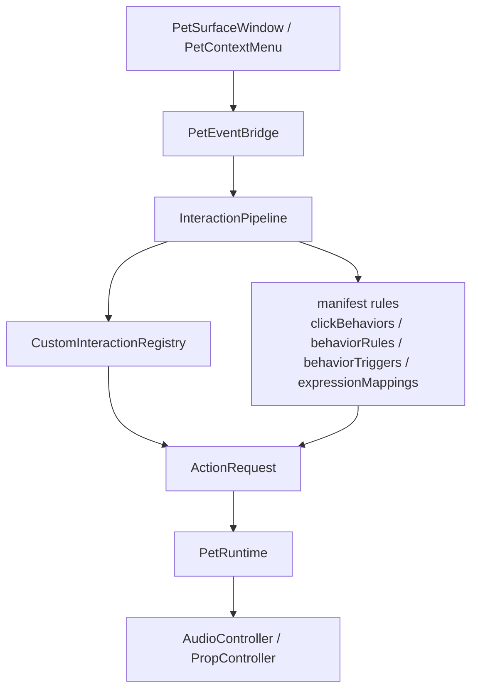

# Phase 0.65-0.73 工作报告

日期：2026-05-20

分支：`v2-ai-pet`

## 1. 阶段目标

Phase 0.65-0.73 的目标是把 v2 桌宠框架从“旧版手感还原代码”收束成“可换肤、可扩展、可接 AI/Agent 的运行时主干”：

- 通用层不再理解 Miles 专属动作名、语音语言、检察官徽章、红茶等定制内容。
- 鼠标、菜单、Prop、idle loop、agent expression 等输入先进入 `PetEvent`，再由交互管线转换为 `ActionRequest`。
- `PetRuntime` 执行最终请求，持有当前播放状态，并把具体选择逻辑下放到 manifest、selector、controller 和 Custom Interaction。
- 尽量还原 v1 手感，包括随机 idle、单击分区、双击语音动作、拖拽晃动、睡觉、红茶、检察官徽章和语音语言切换。

当前阶段没有接入 AI 聊天，也没有实现 JS/TS 皮肤脚本。Phase 0.73 只准备了 expression 请求入口，供 Phase 2 复用。

## 2. 阶段产出

| Phase | 主题 | 主要产出 |
| --- | --- | --- |
| 0.65 | 架构门禁 | 建立静态 guardrail，清理过时测试断言，把文档里的框架边界债务转成可检查项。 |
| 0.66 | ClickBehavior 配置化 | 单击 zone -> pool/action/recipe 和双击默认入口迁入 manifest；`HitZoneMatcher` 只负责命中判断。 |
| 0.67 | GestureTracker 拆分 | 拖拽晃动识别从 `PetRuntime` 移出，变成 `pointer.dragShake` / `pointer.dragReleased` 事件。 |
| 0.68 | rest / startup / follow-up 去硬编码 | 睡眠能力、启动入场、动作完成续接、移动方向到朝向映射迁入 manifest。 |
| 0.69 | canvas / size / surface 收尾 | 基础窗口尺寸、动画尺寸、尺寸菜单、idle loop 来源迁入 manifest；窗口透明点击 mask 由原生 surface 处理。 |
| 0.70 | CustomInteraction Host API | 建立 C++ `CustomInteraction`、`CustomInteractionHostApi`、Registry 分发和异常隔离。 |
| 0.71 | 检察官徽章 CI | 双击概率“看招”作为 Miles 皮肤侧 Custom Interaction 回归；通用层不写徽章逻辑。 |
| 0.72 | Audio Capability | 语音语言变为可选能力，由 `manifest.audio.voiceLanguages` + `AudioController` + 动态菜单驱动。 |
| 0.73 | ExpressionMapping schema | `expressions` / `expressionMappings` 接入，`agent.expressionRequested` 可转为 `ActionRequest`。 |

## 3. 当前主链路



这条链路的关键边界：

- `PetEvent` 描述“发生了什么”，例如单击、双击、菜单命令、Prop 点击、idle loop 结束、agent expression 请求。
- `ActionRequest` 描述“运行时要执行什么”，例如播放 action、recipe、pool、声音、Prop 或回到 idle。
- `CustomInteraction` 只能通过 Host API 产生请求，不能直接访问 `PetRuntime*` 或 `PropController`。
- `PetRuntime` 不再承接单击分区、双击概率、菜单皮肤命令、Prop 后续动作等业务判断。

## 4. 自审修正

本轮自审发现并修正了两个问题。

### 4.1 检察官徽章 CI 绕过语音语言

问题：

`ProsecutorBadgeInteraction` 原先在概率命中后直接调用 `host.playSound(qrc:/audio/takethat0.wav)`，导致用户切换到中文或英语语音后，徽章 CI 仍播放日语 `takethat0.wav`。这绕过了 Phase 0.72 的 `AudioController`。

修正：

- `customInteractionConfig.prosecutor_badge` 改为声明 `takeThatRecipe: "doubleClick.takeThat"`。
- `ProsecutorBadgeInteraction` 概率命中后调用 `host.emitRecipe(takeThatRecipe)`。
- 动作、语音语言选择和 Prop 延迟继续由 `doubleClick.takeThat` recipe 与 `props.prosecutor_badge` 统一描述。
- `PetRuntimeSmoke` 增加“切到中文后，徽章 CI 播放 `takethat2.wav`”的回归断言。

设计影响：

这个修正让 CI 更薄。CI 只负责概率分支和是否接管双击；具体动画、声音、Prop 仍回到 manifest + Runtime 的通用播放链路。

### 4.2 expression 请求的未知 state fallback

问题：

`submitExpressionRequest(state, expression, random)` 在收到未知 `state` 时，会把这个未知 state 继续传给 resolver。resolver 按 `allowedStates` 过滤后可能找不到任何 mapping，导致本应 fallback 到当前 PetState 的 expression 请求没有效果。

修正：

- `PetRuntime::submitExpressionRequest` 只在 `stateToAction` 中存在目标 state 时才使用该 state。
- 未知 state 会回退到当前 `m_currentState`。
- `PetRuntimeSmoke` 增加“未知 expression state 应回退到当前 PetState”的回归断言。

## 5. 边界复核

当前通用层状态：

- `PetRuntime.cpp` 不再写死 `prosecutor_badge`、`doubleClick.takeThat`、`miles.feedTea`、`jp/en/zh` 等皮肤专属语义。
- `InteractionPipeline.cpp` 保留的硬编码主要是通用命令和事件 id，例如 `runtime.sleep.toggle`、`runtime.started`、`action.completed`。
- `HitZoneMatcher` 不理解 click pool 名，只返回命中的 zone。
- `PetContextMenu` 的尺寸、皮肤动作和语音菜单都来自 Runtime/manifest 暴露的数据，不再固定写死 Miles 菜单项。
- Miles 专属 C++ 代码集中在 `apps/desktop/src/skins/miles-edgeworth/`。

Prop 的边界：

- `PropController` 是通用效果控制器，负责“一个由 manifest 声明的附属物如何显示、移动、隐藏”。
- `prosecutor_badge` 是 Miles 皮肤的一个 Prop 配置，不属于框架通用概念。
- 当前实现一次只管理一个 active Prop。多 Prop 并存、Prop 分组、Prop 独立交互区域属于后续扩展。

## 6. 剩余债务

这些问题不阻塞 Phase 2，但进入聊天和 agent 能力前需要持续跟踪。

| 项目 | 现状 | 建议 |
| --- | --- | --- |
| `PetRuntime.cpp` 仍偏长 | 约 700 行，仍混有 recipe runner、phase 切换、action 执行和部分 facade 职责 | Phase 0.74+ 拆 `PlaybackController` / `RecipeRunner`，但不要在接 AI 前做大规模无保护重构。 |
| Registry 是进程级单例 | 当前假设只有一个 PetRuntime / 一个皮肤实例 | 多桌宠或多皮肤并存前，改为 `SkinSession` 或 Runtime 持有。 |
| 底层播放方法仍是 `Q_INVOKABLE` | QML 理论上仍能绕过 `PetEventBridge` 调 `playAction/playRecipe` | 短期保留给 smoke 和调试；后续引入 DebugController 或内部 C++ 测试入口后再收窄。 |
| JS/TS Custom Interaction 未实现 | 目前 CI 是 C++ 接口，Host API 语义已保持语言无关 | 第三方皮肤开放前，再设计 JS sandbox、权限和资源访问边界。 |
| MotionController 未落地 | 现在仍是帧驱动移动，目标点寻路还没实现 | Phase 2 之后如果要让 Agent 控制移动到目标位置，再做 MotionController。 |
| 文档里仍有参考性旧方案 | `docs/superpowers/specs/` 和部分历史段落保留过程上下文 | 正式开发只以 `docs/v2/设计方案/` 为准；发现冲突时更新设计方案。 |

## 7. 验证清单

本阶段应保持以下检查通过：

```bash
python3 tests/check_phase_0_70_custom_interaction_host_api.py
python3 tests/check_phase_0_71_prosecutor_badge_interaction.py
python3 tests/check_phase_0_72_audio_capability.py
python3 tests/check_phase_0_73_expression_mapping.py
cmake -S . -B build -G Ninja -DCMAKE_PREFIX_PATH=/opt/homebrew
cmake --build build
ctest --test-dir build --output-on-failure
/opt/homebrew/bin/qmllint -I build/apps/desktop -I /opt/homebrew/share/qt/qml apps/desktop/qml/PetWindow.qml
git diff --check
```

自审时新增的关键回归点：

- 中文语音下双击命中徽章 CI，应播放 `qrc:/audio/takethat2.wav`。
- 未知 expression state 应回退到当前 PetState，而不是让 resolver 在无效 state 下空转。

## 8. 下一步建议

建议接下来先不要继续扩大 Phase 0 的功能面。当前更合适的顺序是：

1. 由人工复查本报告和 Phase 0.65-0.73 的代码边界。
2. 若边界认可，进入 Phase 2 设计：Go sidecar、OpenAI-compatible provider、ChatWindow、配置保存、流式回复。
3. Phase 2 开始前保留一条技术债任务：把 `PetRuntime` 的播放内部拆分路线写成更小的 0.74+ 计划，但不要和聊天主链路混在一个提交里。

