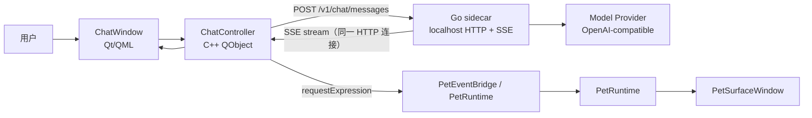

# Phase 2 AI 聊天粗规划

本文记录 Phase 2 的边界、子阶段拆分和第一批交付目标。它是进入详细实现计划前的粗规划，后续每个子阶段仍需要单独写执行计划。

## 1. 当前基线

PR #10 已合入 `main`，旧版 Qt Widgets 主线已保留到远端分支 `legacy/v1-qt-widgets`。当前 `main` 是 v2 主线。

Phase 1 已具备以下前置条件：

- 桌宠本体使用原生 `PetSurfaceWindow`，透明像素可按当前帧 mask 穿透鼠标。
- v1 核心手感已回归：idle、走跑、单击、双击、喝茶、睡觉、拖拽晃动、检察官徽章和音效。
- 行为主链路已收敛为 `PetEventBridge -> InteractionPipeline -> ActionRequest -> PetRuntime`。
- `ExpressionMapping` 已接入，外部可以通过 `requestExpression(state, expression)` 请求皮肤声明的表达。
- 文件系统皮肤包已接入，AI demo 可以直接在磁盘皮肤上快速调整 manifest。

## 2. 阶段编号说明

此前的 `Phase 0.65-0.73` 是历史编号，实际属于 Phase 1 收尾工作。保留这些编号是为了不重命名既有 CTest、文档和提交历史。

后续编号规则：

| 阶段 | 含义 |
| --- | --- |
| Phase 0.x | 已完成历史阶段，不再新增。 |
| Phase 1.x | v1 手感回归、桌宠框架、皮肤系统收尾，可保留少量并行债务。 |
| Phase 2.x | AI 聊天桌宠主线。 |
| Phase 3.x | 轻量 tools / agent runtime。 |
| Phase 4.x | 权限、MCP、插件和更完整的 agent harness。 |

因此接下来直接进入 `Phase 2.0`，不是“朝 Phase 2 前进”。

## 3. Phase 2 目标

Phase 2 的目标是做出“可自行接入大模型 API 聊天的 AI 桌宠”最小闭环。

成功标准：

1. 用户能打开聊天窗口，与 Miles 进行流式对话。
2. 回复期间桌宠能进入 thinking / speaking / idle / error 等状态。
3. 模型输出或本地解析得到的 expression 能驱动当前皮肤动作。
4. 模型 provider、base URL、API key、model name 等配置有明确入口，第一版可以先简化，但不能写死在代码里。
5. Go sidecar 与 Qt 桌面壳层边界清楚，后续 tools、skills、MCP 不需要推翻 Phase 2 架构。

## 4. 非目标

Phase 2 不做以下内容：

- 完整 agent harness。
- tools / skills / MCP / plugins。
- 权限确认系统。
- JS / TS Custom Interaction 沙箱。
- Pet Skin Studio。
- 多角色市场、zip 签名、自动升级。
- 完整多模态和长期记忆。

这些能力放到 Phase 3+，避免第一版 AI 聊天被过度架构拖慢。

## 5. 推荐架构

`Controller → Sidecar` 是 POST 发送一次请求，`Sidecar → Controller` 是同一条 HTTP 连接上的 `text/event-stream`，**不是双工**，也不是两次独立的连接。

职责边界：

| 模块 | 职责 |
| --- | --- |
| Qt 桌面壳层 | 窗口、菜单、托盘、聊天 UI、状态显示、把 sidecar 事件转成 PetRuntime 请求。 |
| C++ ChatController | QML 与 sidecar 的桥，负责启动请求、取消请求、接收 stream event，不直接拼模型 API。 |
| Go sidecar | provider 适配、流式请求、persona prompt、会话上下文、未来工具系统入口。 |
| Skin / Pet Runtime | 只关心 expression/action/state，不知道模型 provider 细节。 |

第一版通信使用 HTTP + SSE。WebSocket / JSON-RPC / AG-UI 可以以后再评估；Phase 2 不直接引入完整 AG-UI 协议，但事件命名应保持可映射。

## 6. 子阶段拆分

### Phase 2.0：AI Chat MVP 骨架

目标：打通 Qt ChatWindow、C++ ChatController、Go sidecar 和 PetRuntime expression 的最小链路。

范围：

- 新增 Go sidecar 工程。
- Qt 启动 sidecar，检测 `/health`。
- 新增最小 ChatWindow。
- 先接 mock provider，验证流式 UI 和桌宠状态联动。
- 定义 sidecar stream event envelope。
- ChatController 能把 `thinking`、`speaking`、`error` 映射到 `requestExpression(...)`。

验收：

- 无需真实 API key，也能跑通 mock 流式回复。
- 发送消息后桌宠进入 thinking，收到 token 后进入 speaking，结束后回 idle。
- CTest / Go test 覆盖 sidecar health、mock stream 和 Qt 侧基础桥接。

### Phase 2.1：OpenAI-compatible Provider

目标：用真实大模型完成一轮流式聊天。

范围：

- Go sidecar 增加 provider interface。
- 第一版接 OpenAI-compatible Chat Completions。
- 配置来源先使用环境变量或本地开发配置文件。
- 不在 CI 中调用真实外部 API。

验收：

- 用户本机配置 base URL / API key / model 后可以真实流式回复。
- 无 API key、网络失败、provider 错误时 ChatWindow 和桌宠都有明确错误状态。

### Phase 2.2：用户配置与安全存储

目标：把临时配置升级为用户可维护配置。

范围：

- 基础设置窗口或设置面板。
- provider、base URL、API key、model、temperature、max tokens。
- API key 存储策略：macOS Keychain / Windows Credential Manager / Linux Secret Service。
  - **TODO（Phase 2.2 详细计划时拍板）**：当 keychain / credential manager / secret service 不可用时的兜底——三选一：
    - A：拒绝启动并提示用户手动配置
    - B：fallback 到加密配置文件 + 显式警告
    - C：fallback 到仅环境变量读取（不在磁盘留任何 key）
  - 粗规划阶段不预先选定；Phase 2.2 plan 写具体方案时一并决定。

验收：

- 普通用户不需要改环境变量即可配置模型。
- API key 不写入仓库、日志或明文调试输出。

### Phase 2.3：会话历史与人设

目标：让 Miles 有稳定人设和基础上下文。

范围：

- 默认 Miles persona prompt。
- 会话历史保存。
- 新建 / 清空会话。
- 历史摘要或截断策略。

验收：

- 重启后能看到历史会话。
- 长对话不会无限增长请求体。

### Phase 2.4：Expression 与回复体验打磨

目标：让模型回复更自然地驱动桌宠动作。

范围：

- 约定模型输出 expression 的方式。
- expression fallback 和异常解析。
- 气泡摘要、错误提示、任务完成提示的第一版。

验收：

- 模型不输出 expression 时仍有稳定默认状态。
- 输出未知 expression 时走 fallback，不打断聊天。

## 7. 技术债并行队列

这些任务重要，但不阻塞 Phase 2.0：

- HitZone schema 迁到 image-space。
- 连续缩放控件。
- Pet Skin Studio HitZone Panel。
- `PetRuntime` 内部继续拆 `PlaybackController` / `RecipeRunner`。
- `CustomInteractionRegistry` 从进程级 static 下沉到 per-runtime / per-skin session。
- MotionController：将来支持 Agent 控制桌宠移动到指定位置。

## 8. 第一份执行计划建议

下一份详细计划应写 `Phase 2.0：AI Chat MVP 骨架`，并严格控制范围：

- 先 mock provider，不依赖真实 API key。
- 先 HTTP + SSE，不引入 WebSocket / JSON-RPC。
- 先做到 ChatWindow + sidecar + expression 联动，不做 Dashboard。
- 先让架构路径正确，再接真实 provider。

如果这个粗规划确认无误，下一步写 Phase 2.0 详细执行计划。

> **子阶段顺序可调整**：上述 2.0 → 2.1 → 2.2 → 2.3 → 2.4 是默认推进顺序，但 Phase 2.0 demo 跑通后如果发现某个子阶段的范围不合适（例如真实 provider 接入难度比想象大、或用户先关心人设而不是历史），允许重新切分。每个子阶段在写详细 plan 时确认前置依赖即可。
