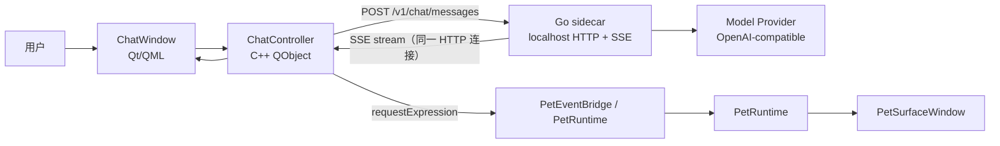

# Phase 2 AI 聊天粗规划

本文记录 Phase 2 的边界、子阶段拆分和第一批交付目标。它是进入详细实现计划前的粗规划，后续每个子阶段仍需要单独写执行计划。

## 1. 当前基线

PR #10 已合入 `main`，旧版 Qt Widgets 主线已保留到远端分支 `legacy/v1-qt-widgets`。当前 `main` 是 v2 主线。

Phase 1 已具备以下前置条件：

- 桌宠本体使用原生 `PetSurfaceWindow`，透明像素可按当前帧 mask 穿透鼠标。
- v1 核心手感已回归：idle、走跑、单击、双击、喝茶、睡觉、拖拽晃动、检察官徽章和音效。
- 行为主链路已收敛为 `PetEventBridge -> InteractionPipeline -> ActionRequest -> PetRuntime`。
- `ExpressionMapping` 已接入，外部可以通过 `requestExpression(state, expression)` 请求皮肤声明的表达。
- 文件系统皮肤包已接入，AI demo 可以直接在磁盘皮肤上快速调整 manifest。

## 2. 阶段编号说明

此前的 `Phase 0.65-0.73` 是历史编号，实际属于 Phase 1 收尾工作。保留这些编号是为了不重命名既有 CTest、文档和提交历史。

后续编号规则：

| 阶段 | 含义 |
| --- | --- |
| Phase 0.x | 已完成历史阶段，不再新增。 |
| Phase 1.x | v1 手感回归、桌宠框架、皮肤系统收尾，可保留少量并行债务。 |
| Phase 2.x | AI 聊天桌宠主线，目标是"活人感"里程碑。 |
| Phase 3.x | 记忆与基础 Agent（长期记忆、本地沙箱、Skills）。 |
| Phase 4.x | 完整 Agent Harness（MCP、权限、插件、Agent 框架）。 |

因此接下来直接进入 `Phase 2.0`，不是“朝 Phase 2 前进”。

## 3. Phase 2 目标

Phase 2 的目标是做出“可自行接入大模型 API 聊天的 AI 桌宠”最小闭环。

成功标准：

1. 用户能打开聊天窗口，与 Miles 进行流式对话。
2. 回复期间桌宠能进入 thinking / speaking / idle / error 等状态。
3. 模型输出或本地解析得到的 expression 能驱动当前皮肤动作。
4. 模型 provider、base URL、API key、model name 等配置有明确入口，不写死在代码里。
5. Go sidecar 与 Qt 桌面壳层边界清楚，后续 tools、skills、MCP 不需要推翻 Phase 2 架构。
6. thinking / speaking 动画支持任意长度（enter / loop / exit phased 动画），并可链式编排。
7. 桌宠可以响应模型请求移动到指定位置或移动一段距离。
8. 用户可以在聊天中发送图片（当 provider 支持视觉时）。

## 4. 非目标

Phase 2 不做以下内容：

- 完整 agent harness。
- tools / skills / MCP / plugins。
- 权限确认系统。
- JS / TS Custom Interaction 沙箱。
- Pet Skin Studio。
- 多角色市场、zip 签名、自动升级。
- 视频、音频、实时视觉等完整多模态（Phase 2.6 只做图片输入）。
- 长期记忆（Phase 3.0）。

这些能力放到 Phase 3+，避免第一版 AI 聊天被过度架构拖慢。

## 5. 推荐架构

`Controller → Sidecar` 是 POST 发送一次请求，`Sidecar → Controller` 是同一条 HTTP 连接上的 `text/event-stream`，**不是双工**，也不是两次独立的连接。

职责边界：

| 模块 | 职责 |
| --- | --- |
| Qt 桌面壳层 | 窗口、菜单、托盘、聊天 UI、状态显示、把 sidecar 事件转成 PetRuntime 请求。 |
| C++ ChatController | QML 与 sidecar 的桥，负责启动请求、取消请求、接收 stream event，不直接拼模型 API。 |
| Go sidecar | provider 适配、流式请求、persona prompt、会话上下文、未来工具系统入口。 |
| Skin / Pet Runtime | 只关心 expression/action/state，不知道模型 provider 细节。 |

第一版通信使用 HTTP + SSE。WebSocket / JSON-RPC / AG-UI 可以以后再评估；Phase 2 不直接引入完整 AG-UI 协议，但事件命名应保持可映射。

## 6. 子阶段拆分

### Phase 2.0：AI Chat MVP 骨架 ✓

> 已完成。详见 `阶段记录/Phase 2.0 AI Chat MVP 骨架.md`。

Go sidecar（`apps/agent-core`）、QML `ChatWindow`、C++ `ChatController`、mock provider 和 expression 联动均已落地，HTTP + SSE 链路验证通过。

### Phase 2.1：OpenAI-compatible Provider

目标：用真实大模型完成一轮流式聊天。

范围：

- Go sidecar 增加 provider interface。
- 第一版接 OpenAI-compatible Chat Completions。
- 配置来源先使用环境变量或本地开发配置文件。
- 不在 CI 中调用真实外部 API。

验收：

- 用户本机配置 base URL / API key / model 后可以真实流式回复。
- 无 API key、网络失败、provider 错误时 ChatWindow 和桌宠都有明确错误状态。

### Phase 2.2：用户配置与安全存储

目标：把临时配置升级为用户可维护配置。

范围：

- 基础设置窗口或设置面板。
- provider、base URL、API key、model、temperature、max tokens。
- API key 存储策略：macOS Keychain / Windows Credential Manager / Linux Secret Service。
  - **TODO（Phase 2.2 详细计划时拍板）**：当 keychain / credential manager / secret service 不可用时的兜底——三选一：
    - A：拒绝启动并提示用户手动配置
    - B：fallback 到加密配置文件 + 显式警告
    - C：fallback 到仅环境变量读取（不在磁盘留任何 key）
  - 粗规划阶段不预先选定；Phase 2.2 plan 写具体方案时一并决定。

验收：

- 普通用户不需要改环境变量即可配置模型。
- API key 不写入仓库、日志或明文调试输出。

### Phase 2.3：会话历史与人设

目标：让 Miles 有稳定人设和基础上下文。

范围：

- 默认 Miles persona prompt。
- 会话历史保存。
- 新建 / 清空会话。
- 历史摘要或截断策略。

验收：

- 重启后能看到历史会话。
- 长对话不会无限增长请求体。

### Phase 2.4：Phased 动画与动画链

目标：让 thinking / speaking 动画可以维持任意长度，并支持链式动画编排。

范围：

- enter / loop / exit 三段动画系统：Qt 运行时支持 GIF 帧段播放或 asset compiler 预切分。
- 动画链（例如异议动作 → speaking enter/loop 直到流结束 → exit）通过 Recipe `steps` 表达。
- manifest schema 校验（JSON Schema）同步实现，防止 manifest 格式错误静默失败。
- expression fallback 和异常解析完善。

验收：

- thinking 状态动画在模型回复期间可以无限循环保持，收到 done 后播放 exit 段自然退出。
- 链式 recipe 可在 manifest 中声明并被 ChatController 触发。
- 输出未知 expression 时走 fallback，不打断聊天。

### Phase 2.5：Movement API

目标：桌宠可以响应模型请求自主移动。

范围：

- `MotionController` 落地：`moveTo(target, mode)`、`moveBy(delta, mode)`、`wander()`、`stop()`。
- 走 / 跑模式，8 方向动画，接近目标后吸附并切回 idle。
- Go sidecar 增加 `miles.pet.motion.requested` 事件；Qt 侧 `ChatController` 接收后转给 `MotionController`。

验收：

- 模型通过工具调用请求桌宠移动到屏幕指定位置，桌宠播放对应方向的走/跑动画并到达目标。
- 移动被用户拖拽打断时正确停止。

### Phase 2.6：多模态

目标：支持图片输入，当 provider 具备视觉能力时可在聊天中发送截图或图片。

范围：

- ChatWindow 支持粘贴、拖拽图片到输入框。
- Go sidecar 引入 [models.dev](https://models.dev/) 数据源（后台静默同步 + 本地磁盘缓存，TTL 7 天）自动检测模型 `supports_vision`；未知模型可手动 override。
- 附图按钮始终可见，unsupported 时置灰并 tooltip 提示前往设置启用。
- 图片发送时按 OpenAI 多模态格式构建 `content` 数组（text + image_url）。

验收：

- 支持视觉的 provider 可以正常接收图片并回复。
- 不支持视觉时按钮置灰，用户点击有明确提示，不静默失败。

> **Phase 2.6 完成 = "活人感"里程碑**：任意长度动画、动画链、桌宠移动、多模态聊天、流畅表达。

## 7. 技术债并行队列

以下工作不阻塞主线子阶段，等有具体需求或维护痛点时再做：

- HitZone schema 迁到 image-space 坐标系。
- Pet Skin Studio HitZone Panel 和 Asset 浏览。
- `PetRuntime` 内部拆 `PlaybackController` / `RecipeRunner`。
- `behavior.json` 从 `manifest.json` 拆分（当出现多皮肤共享行为或多档位行为需求时）。

注：`CustomInteractionRegistry` 进程级 static 问题应在 Phase 3 开始前解决，多 agent 场景会踩。

## 8. 后续入口

Phase 2.0 已完成，下一步写 Phase 2.1 详细执行计划。子阶段顺序为默认推进顺序，如发现范围不合适允许重新切分，每个子阶段在写详细 plan 时确认前置依赖即可。
