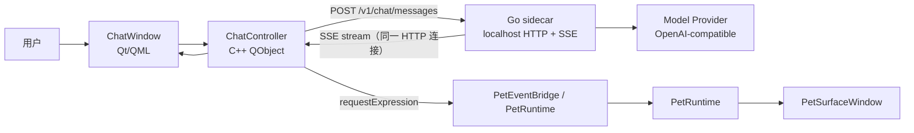

# Phase 2 AI 聊天粗规划

本文记录 Phase 2 的边界、子阶段拆分和第一批交付目标。它是进入详细实现计划前的粗规划，后续每个子阶段仍需要单独写执行计划。

## 1. 当前基线

PR #10 已合入 `main`，旧版 Qt Widgets 主线已保留到远端分支 `legacy/v1-qt-widgets`。当前 `main` 是 v2 主线。

Phase 1 已具备以下前置条件：

- 桌宠本体使用原生 `PetSurfaceWindow`，透明像素可按当前帧 mask 穿透鼠标。
- v1 核心手感已回归：idle、走跑、单击、双击、喝茶、睡觉、拖拽晃动、检察官徽章和音效。
- 行为主链路已收敛为 `PetEventBridge -> InteractionPipeline -> ActionRequest -> PetRuntime`。
- `ExpressionMapping` 已接入，外部可以通过 `requestExpression(state, expression)` 请求皮肤声明的表达。
- 文件系统皮肤包已接入，AI demo 可以直接在磁盘皮肤上快速调整 manifest。

## 2. 阶段编号说明

此前的 `Phase 0.65-0.73` 是历史编号，实际属于 Phase 1 收尾工作。保留这些编号是为了不重命名既有 CTest、文档和提交历史。

后续编号规则：

| 阶段 | 含义 |
| --- | --- |
| Phase 0.x | 已完成历史阶段，不再新增。 |
| Phase 1.x | v1 手感回归、桌宠框架、皮肤系统收尾，可保留少量并行债务。 |
| Phase 2.x | AI 聊天桌宠主线，目标是"活人感"里程碑。 |
| Phase 3.x | 记忆与基础 Agent（长期记忆、本地沙箱、Skills）。 |
| Phase 4.x | 完整 Agent Harness（MCP、权限、插件、Agent 框架）。 |

因此接下来直接进入 `Phase 2.0`，不是“朝 Phase 2 前进”。

## 3. Phase 2 目标

Phase 2 的目标是做出“可自行接入大模型 API 聊天的 AI 桌宠”最小闭环。

成功标准：

1. 用户能打开聊天窗口，与 Miles 进行流式对话。
2. 回复期间桌宠能进入 thinking / speaking / idle / error 等状态。
3. 模型输出或本地解析得到的 expression 能驱动当前皮肤动作。
4. 模型 provider、base URL、API key、model name 等配置有明确入口，不写死在代码里。
5. Go sidecar 与 Qt 桌面壳层边界清楚，后续 tools、skills、MCP 不需要推翻 Phase 2 架构。
6. thinking / speaking 动画支持任意长度（enter / loop / exit phased 动画），并可链式编排。
7. 桌宠可以响应模型请求移动到指定位置或移动一段距离。
8. 用户可以在聊天中发送图片（当 provider 支持视觉时）。

## 4. 非目标

Phase 2 不做以下内容：

- 完整 agent harness。
- tools / skills / MCP / plugins。
- 权限确认系统。
- JS / TS Custom Interaction 沙箱。
- Pet Skin Studio。
- 多角色市场、zip 签名、自动升级。
- 视频、音频、实时视觉等完整多模态（Phase 2.6 只做图片输入）。
- 长期记忆（Phase 3.0）。

这些能力放到 Phase 3+，避免第一版 AI 聊天被过度架构拖慢。

## 5. 推荐架构

`Controller → Sidecar` 是 POST 发送一次请求，`Sidecar → Controller` 是同一条 HTTP 连接上的 `text/event-stream`，**不是双工**，也不是两次独立的连接。

职责边界：

| 模块 | 职责 |
| --- | --- |
| Qt 桌面壳层 | 窗口、菜单、托盘、聊天 UI、状态显示、把 sidecar 事件转成 PetRuntime 请求。 |
| C++ ChatController | QML 与 sidecar 的桥，负责启动请求、取消请求、接收 stream event，不直接拼模型 API。 |
| Go sidecar | provider 适配、流式请求、persona prompt、会话上下文、未来工具系统入口。 |
| Skin / Pet Runtime | 只关心 expression/action/state，不知道模型 provider 细节。 |

第一版通信使用 HTTP + SSE。WebSocket / JSON-RPC / AG-UI 可以以后再评估；Phase 2 不直接引入完整 AG-UI 协议，但事件命名应保持可映射。

模型回复与桌宠动画的**同步编排协议**（`[EXPR:tag]` 标记、ChatController 状态机、PetRuntime `cleanFinish` / `boundary` 接口、字符速率限制器）由独立长期文档 `docs/v2/设计方案/AI 聊天动画编排设计.md` 定义。本粗规划只描述子阶段范围与验收；协议细节以该设计文档为准，§11 列出了子阶段到设计文档章节的分摊。

## 6. 子阶段拆分

### Phase 2.0：AI Chat MVP 骨架 ✓

> 已完成。详见 `阶段记录/Phase 2.0 AI Chat MVP 骨架.md`。

Go sidecar（`apps/agent-core`）、QML `ChatWindow`、C++ `ChatController`、mock provider 和 expression 联动均已落地，HTTP + SSE 链路验证通过。

### Phase 2.1：OpenAI-compatible Provider

目标：用真实大模型完成一轮流式聊天，并落地 `[EXPR:tag]` 协议骨架。

范围：

- Go sidecar 增加 provider interface（`internal/chat/openai/`）。
- 第一版接 OpenAI-compatible Chat Completions。
- `internal/chat/expression/` 实现 `[EXPR:tag]` 标记的流式 token 解析器：跨 chunk 边界、未知 tag 降级到 `neutral`。详见《AI 聊天动画编排设计》§3、§4。
- 基础 persona prompt 注入当前皮肤的 expressions 列表（完整 persona 在 2.3）。
- Qt `ChatController` 在请求体中携带当前 manifest 的 expressions，让 sidecar 组装 system prompt 和合法 tag 集合。
- Qt `ChatController` 拆出 hold buffer 雏形，立即 flush；完整状态机在 2.3 落地。
- 配置先用环境变量（`MILES_PROVIDER_BASE_URL` / `MILES_PROVIDER_API_KEY` / `MILES_PROVIDER_MODEL` 等）；图形配置在 2.2。
- 无 API key 时 fallback 到 mock provider，`/health` 标 `provider: "mock-fallback"`。
- 不在 CI 中调用真实外部 API（`httptest` mock 上游）。
- Go sidecar provider 层预留可观测性 middleware hook 位置（接口定义，不激活），供 Phase 2.3 接入 Langfuse 时无需改调用结构。

验收：

- 用户本机配置 base URL / API key / model 后可以真实流式回复，桌宠按 `[EXPR:x]` 切换动画。
- 无 API key 时 fallback 到 mock，UI 有清楚提示。
- 网络失败、provider 4xx/5xx 都能转化为 `RUN_ERROR` 事件并在 UI 显示。
- 模型不按 `[EXPR:x]` 格式输出时不崩，首段默认 `neutral`。

### Phase 2.2：用户配置与安全存储 ✓

> 已完成。详见 `阶段记录/Phase 2.2 用户配置与安全存储.md`。

目标：把临时配置升级为用户可维护配置。

范围：

- 基础设置窗口或设置面板。
- provider、base URL、API key、model、temperature、max tokens。
- 字符速率限制器参数 `msPerChar` 也在设置中暴露（默认 80ms，范围 40–200ms）。详见《AI 聊天动画编排设计》§7.2。
- API key 存储策略：macOS Keychain 已落地；Windows Credential Manager / Linux Secret Service 留到对应平台支持时实现。
- 当系统密钥存储不可用时，本阶段选择“不落盘”兜底：当前进程内可用，重启后需要重新输入，或继续使用外部环境变量。

验收：

- 普通用户不需要改环境变量即可配置模型。
- API key 不写入仓库、日志或明文调试输出。

### Phase 2.3：会话历史与人设

目标：让 Miles 有稳定人设和基础上下文，并完整落地动画-文字同步状态机。

范围：

- 完整 Miles persona prompt（包含表达约定、风格、禁忌等），替换 2.1 的最小版本。
- 会话历史保存（SQLite）。
- 新建 / 清空会话。
- 历史摘要或截断策略（可参考 Langfuse 实际 token 用量数据）。
- ChatController 完整状态机：`IDLE` / `BUFFERING_FOR_START` / `STREAMING` / `GATED` / `WAITING_FOR_ANIMATION_END`。详见《AI 聊天动画编排设计》§5。
- 字符速率限制器实现：`QTimer` + hold buffer drain + 积压追平。详见《AI 聊天动画编排设计》§7。
- **Langfuse 可观测性接入**：激活 Phase 2.1 预留的 middleware hook，接入 Langfuse SDK（Go）。覆盖：每轮 LLM 调用的 trace（prompt、completion、latency、token 用量、cost）、session 关联、persona prompt 版本管理。Langfuse 地址/API key 作为可选配置项，未配置时静默跳过，不影响主流程。

验收：

- 重启后能看到历史会话。
- 长对话不会无限增长请求体。
- 多 expression 切换时，前一段动画 loop 一轮播完才放行后一段文字。
- 文字流出节奏稳定，模型 dump 整段时不会瞬间全显。

### Phase 2.4：Phased 动画与动画链

目标：让 thinking / speaking 动画可以维持任意长度，支持链式动画编排，并升级 PetRuntime 的"干净收尾"行为。

范围：

- enter / loop / exit 三段动画系统：Qt 运行时支持 GIF 帧段播放或 asset compiler 预切分。
- 动画链（例如异议动作 → speaking enter/loop 直到流结束 → exit）通过 Recipe `steps` 表达。
- PetRuntime `requestCleanFinishAndNotify` / `requestBoundaryAndNotify` 升级为真正播 exit 段，不再"播完一轮 loop 就硬切"。详见《AI 聊天动画编排设计》§6。
- manifest schema 校验（JSON Schema）同步实现，防止 manifest 格式错误静默失败。
- expression fallback 和异常解析完善。

验收：

- thinking 状态动画在模型回复期间可以无限循环保持，收到 done 后播放 exit 段自然退出。
- 链式 recipe 可在 manifest 中声明并被 ChatController 触发。
- expression 切换时观察到 exit 段被播完才进入下一个动画。
- 输出未知 expression 时走 fallback，不打断聊天。

### Phase 2.5：Movement API

目标：桌宠可以响应模型请求自主移动。

范围：

- `MotionController` 落地：`moveTo(target, mode)`、`moveBy(delta, mode)`、`wander()`、`stop()`。
- 走 / 跑模式，8 方向动画，接近目标后吸附并切回 idle。
- Go sidecar 增加 `miles.pet.motion.requested` 事件；Qt 侧 `ChatController` 接收后转给 `MotionController`。

验收：

- 模型通过工具调用请求桌宠移动到屏幕指定位置，桌宠播放对应方向的走/跑动画并到达目标。
- 移动被用户拖拽打断时正确停止。

### Phase 2.6：多模态

目标：支持图片输入，当 provider 具备视觉能力时可在聊天中发送截图或图片。

范围：

- ChatWindow 支持粘贴、拖拽图片到输入框。
- Go sidecar 引入 [models.dev](https://models.dev/) 数据源（后台静默同步 + 本地磁盘缓存，TTL 7 天），作为**通用模型能力数据库**持久使用，不局限于本阶段。可覆盖的字段包括但不限于：`supports_vision`（本阶段主要用途）、`context_window` / `max_output_tokens`（用于 token 预算与截断策略）、`supports_tool_use`（工具调用能力检测）、`supports_streaming`、定价信息等。未知模型或字段可手动 override。后续阶段如需消费新字段，直接读取已缓存数据，无需重复设计同步机制。
- 附图按钮始终可见，unsupported 时置灰并 tooltip 提示前往设置启用。
- 图片发送时按 OpenAI 多模态格式构建 `content` 数组（text + image_url）。

验收：

- 支持视觉的 provider 可以正常接收图片并回复。
- 不支持视觉时按钮置灰，用户点击有明确提示，不静默失败。

> **Phase 2.6 完成 = "活人感"里程碑**：任意长度动画、动画链、桌宠移动、多模态聊天、流畅表达。

## 7. 技术债并行队列

以下工作不阻塞主线子阶段，等有具体需求或维护痛点时再做：

- HitZone schema 迁到 image-space 坐标系。
- Pet Skin Studio HitZone Panel 和 Asset 浏览。
- `PetRuntime` 内部拆 `PlaybackController` / `RecipeRunner`。
- `behavior.json` 从 `manifest.json` 拆分（当出现多皮肤共享行为或多档位行为需求时）。

注：`CustomInteractionRegistry` 进程级 static 问题应在 Phase 3 开始前解决，多 agent 场景会踩。

## 8. 后续入口

Phase 2.0 已完成，Phase 2.1 详细执行计划见 `docs/superpowers/plans/2026-05-22-phase-2-1-openai-provider.md`。

子阶段顺序为默认推进顺序，如发现范围不合适允许重新切分，每个子阶段在写详细 plan 时确认前置依赖即可。涉及动画-文字同步协议的部分必须先读《AI 聊天动画编排设计》，再写执行计划。
